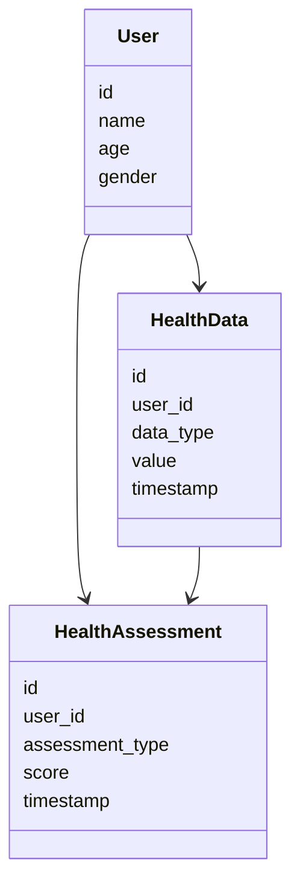

                 


# 目录大纲：企业估值中的AI驱动的个性化健康管理平台评估

## 第一章：背景介绍

### 1.1 问题背景
- 1.1.1 传统企业估值方法的局限性
- 1.1.2 健康管理平台在企业中的重要性
- 1.1.3 AI技术如何改变健康管理平台评估

### 1.2 问题描述
- 1.2.1 个性化健康管理平台的定义
- 1.2.2 企业估值中的关键因素
- 1.2.3 当前健康管理平台评估的主要挑战

### 1.3 问题解决
- 1.3.1 AI驱动的解决方案
- 1.3.2 数据驱动的个性化健康评估
- 1.3.3 提高企业估值的策略

### 1.4 边界与外延
- 1.4.1 个性化健康管理的边界
- 1.4.2 企业估值的范围
- 1.4.3 AI技术的应用范围

### 1.5 概念结构与核心要素
- 1.5.1 核心概念的层次结构
- 1.5.2 核心要素的对比分析

## 第二章：AI驱动的个性化健康管理平台核心概念

### 2.1 核心概念原理
- 2.1.1 数据采集与处理
- 2.1.2 AI算法的核心原理
- 2.1.3 健康评估模型的构建

### 2.2 核心概念对比
- 2.2.1 不同AI模型的特征对比
- 2.2.2 各种健康管理方法的优缺点

### 2.3 ER实体关系图
```mermaid
erDiagram
    user {
        +id: int
        +name: string
        +age: int
        +gender: string
    }
    health_data {
        +id: int
        +user_id: int
        +data_type: string
        +value: float
        +timestamp: datetime
    }
    health_assessment {
        +id: int
        +user_id: int
        +assessment_type: string
        +score: float
        +timestamp: datetime
    }
    user --> health_data
    user --> health_assessment
    health_data --> health_assessment
```

## 第三章：算法原理

### 3.1 机器学习模型
- 3.1.1 线性回归
  ```mermaid
  graph TD
      A[数据] --> B[特征选择]
      B --> C[模型训练]
      C --> D[预测结果]
  ```
  数学公式：
  $$ y = \beta_0 + \beta_1x + \epsilon $$

- 3.1.2 随机森林
  ```mermaid
  graph TD
      A[数据] --> B[特征选择]
      B --> C[决策树构建]
      C --> D[投票预测]
  ```
  数学公式：
  $$ \text{预测值} = \text{多数投票} $$

## 第四章：系统分析与架构设计

### 4.1 问题场景介绍
- 个性化健康管理平台的用户需求
- 企业估值的业务流程

### 4.2 领域模型


### 4.3 系统架构


### 4.4 系统接口设计
- API接口定义
- 接口交互流程图

## 第五章：项目实战

### 5.1 环境安装
- 安装Python、机器学习库

### 5.2 核心代码实现
```python
import pandas as pd
from sklearn.linear_model import LinearRegression

# 加载数据
data = pd.read_csv('health_data.csv')

# 特征选择
X = data[['age', 'gender', 'weight']]
y = data['health_score']

# 模型训练
model = LinearRegression()
model.fit(X, y)

# 预测
new_data = pd.DataFrame({'age': [30], 'gender': ['M'], 'weight': [70]})
prediction = model.predict(new_data)
print(prediction)
```

### 5.3 案例分析
- 实际应用中的案例
- 结果分析

## 第六章：最佳实践

### 6.1 小结
- 本章内容回顾

### 6.2 注意事项
- 数据隐私保护
- 模型可解释性

### 6.3 拓展阅读
- 推荐相关书籍和资源

这个目录大纲涵盖了从背景介绍到实际项目的各个方面，确保读者能够系统地理解AI在个性化健康管理平台评估中的应用。

