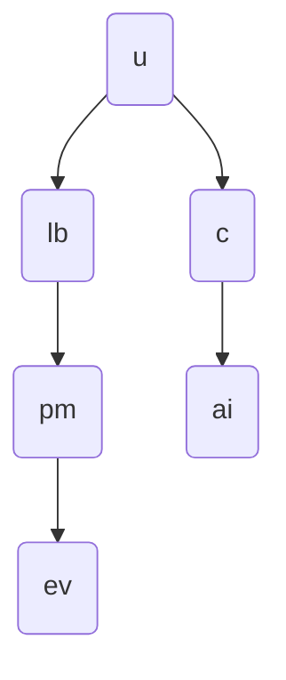
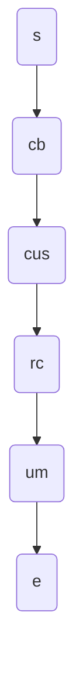

                 


# 《企业估值中的AI驱动的个性化学习平台评估》

---

## 关键词：企业估值、AI、个性化学习平台、机器学习、算法、系统架构

---

## 摘要：  
本文聚焦于AI驱动的个性化学习平台在企业估值中的应用，探讨如何通过AI技术提升学习平台的个性化能力，并将其与企业估值的关键指标相结合。文章从背景、核心概念、算法原理、系统架构到项目实战，全面分析了AI在个性化学习平台评估中的作用，并通过具体案例展示了如何利用AI技术优化企业估值过程。

---

## 第一部分：企业估值与AI驱动个性化学习平台的背景

### 第1章：问题背景与核心概念

#### 1.1 企业估值的挑战与机遇  
现代企业估值面临着数据复杂性高、个性化需求难以满足、传统方法局限性明显等挑战。随着AI技术的快速发展，企业可以通过个性化学习平台优化员工培训、提升效率，从而间接或直接地影响企业估值。AI驱动的个性化学习平台为企业提供了新的工具，能够更精准地评估员工能力、优化资源配置，进而提升企业价值。

#### 1.2 AI驱动的个性化学习平台  
个性化学习平台通过AI技术分析用户的学习行为、偏好和能力，提供定制化的内容推荐和学习路径。这种平台的核心在于利用机器学习算法，动态调整学习计划，最大化学习效果。在企业估值中，个性化学习平台的价值不仅体现在提升员工能力上，还体现在通过数据驱动的方式优化企业运营效率。

#### 1.3 问题描述与目标  
本文旨在探讨如何通过AI驱动的个性化学习平台评估企业价值。具体目标包括：  
1. 理解个性化学习平台的核心要素及其与企业估值的关系。  
2. 探讨AI算法在学习平台评估中的应用。  
3. 提供系统设计和实际案例，展示如何通过AI技术优化企业估值过程。

---

### 第2章：核心概念与联系

#### 2.1 核心概念原理  
个性化学习平台的原理可以归纳为以下几点：  
1. 数据驱动：通过收集用户的学习行为数据，分析用户需求。  
2. AI算法：利用机器学习算法（如协同过滤、聚类分析等）推荐个性化内容。  
3. 用户行为分析：通过实时监测用户行为，动态调整学习计划。  

#### 2.2 核心概念属性对比  
以下表格对比了个性化学习平台与传统学习平台的核心属性：

| 属性 | 个性化学习平台 | 传统学习平台 |
|------|----------------|--------------|
| 内容推荐 | 动态推荐 | 静态推荐 |
| 用户体验 | 个性化 | 通用化 |
| 数据依赖 | 高 | 低 |
| 技术复杂度 | 高 | 低 |

#### 2.3 ER实体关系图  
以下是一个简单的ER实体关系图，展示了个性化学习平台的核心实体及其关系：



---

## 第二部分：AI驱动个性化学习平台的评估算法

### 第3章：算法原理与实现

#### 3.1 协同过滤算法  
协同过滤是一种常用的推荐算法，通过分析用户行为数据，找到相似用户的偏好，从而推荐相关内容。以下是协同过滤的算法流程图：



#### 3.2 协同过滤的数学模型  
协同过滤的核心公式是计算用户之间的相似度。以下是一个简单的余弦相似度公式：

$$ \text{相似度}(u_1, u_2) = \frac{\sum_{i=1}^{n} (u_1(i) \cdot u_2(i))}{\sqrt{\sum_{i=1}^{n} u_1(i)^2} \cdot \sqrt{\sum_{i=1}^{n} u_2(i)^2}} $$

---

### 第4章：系统分析与架构设计

#### 4.1 系统功能设计  
个性化学习平台的功能模块包括：  
1. 用户管理模块：管理用户信息和权限。  
2. 课程推荐模块：基于用户行为推荐课程。  
3. 学习评估模块：评估学习效果并更新推荐策略。  

#### 4.2 系统架构设计  
以下是系统的架构图：

```mermaid
graph TD
    Client --> API Gateway
    API Gateway --> UserService
    UserService --> Database
    UserService --> CourseService
    CourseService --> Database
    Database --> PerformanceMetricService
    PerformanceMetricService --> EnterpriseValueService
```

---

## 第三部分：项目实战

### 第5章：个性化学习平台的实现

#### 5.1 环境安装  
需要安装以下工具：  
1. Python 3.8+  
2. Scikit-learn  
3. Flask  
4. MongoDB  

#### 5.2 代码实现  
以下是协同过滤算法的Python代码示例：

```python
from sklearn.metrics.pairwise import cosine_similarity

# 示例数据：用户-课程评分矩阵
users = ['u1', 'u2', 'u3']
courses = ['c1', 'c2', 'c3']
scores = {
    'u1': {'c1': 5, 'c2': 4, 'c3': 3},
    'u2': {'c1': 3, 'c2': 5, 'c3': 4},
    'u3': {'c1': 4, 'c2': 3, 'c3': 5}
}

# 转换为矩阵形式
score_matrix = [[5, 4, 3],
                [3, 5, 4],
                [4, 3, 5]]

# 计算余弦相似度
similarity = cosine_similarity(score_matrix)

print(similarity)
```

---

### 第6章：最佳实践与总结

#### 6.1 总结  
本文通过理论与实践相结合的方式，探讨了AI驱动的个性化学习平台在企业估值中的应用。通过协同过滤算法和系统架构设计，展示了如何利用AI技术优化企业估值过程。

#### 6.2 注意事项  
1. 数据隐私问题需要高度重视。  
2. 算法选择需根据具体场景调整。  
3. 系统设计需考虑可扩展性和可维护性。  

#### 6.3 扩展阅读  
1. 《机器学习实战》  
2. 《分布式系统设计与实现》  
3. 《企业估值与数据分析》  

---

以上是《企业估值中的AI驱动的个性化学习平台评估》的完整目录和内容框架。

