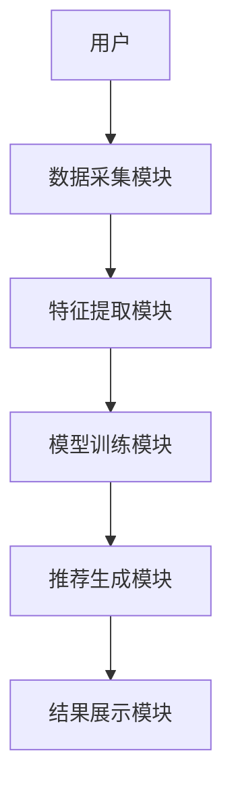

                 


# 企业估值中的AI驱动的个性化推荐系统评估

---

## 关键词

- 企业估值  
- 个性化推荐系统  
- AI驱动  
- 人工智能  
- 算法原理  

---

## 摘要

随着人工智能技术的迅速发展，个性化推荐系统在企业估值中的应用越来越广泛。本文将深入探讨AI驱动的个性化推荐系统如何应用于企业估值，分析其核心算法原理、系统架构设计以及实际应用案例。通过结合实际场景，本文将为企业估值提供新的视角和方法，帮助读者理解如何利用AI技术提升企业估值的准确性和效率。

---

# 第一章: 企业估值与个性化推荐系统背景

## 1.1 企业估值的基本概念

### 1.1.1 企业估值的定义与重要性

企业估值是通过对企业的财务数据、市场表现、行业地位等因素进行分析，估算其市场价值的过程。准确的企业估值对企业并购、融资、战略规划等方面具有重要意义。

### 1.1.2 个性化推荐系统的定义与特点

个性化推荐系统是一种基于用户行为和偏好，通过算法生成个性化推荐内容的系统。其特点包括实时性、精准性和智能化。

### 1.1.3 个性化推荐系统与企业估值的关系

个性化推荐系统可以通过分析企业的历史数据和市场表现，帮助企业更准确地预测市场价值，从而优化企业估值的过程。

---

## 1.2 AI驱动的推荐系统在企业估值中的应用

### 1.2.1 AI驱动推荐系统的原理

AI驱动的推荐系统利用机器学习算法，通过对海量数据的分析和挖掘，生成个性化的推荐结果。

### 1.2.2 AI驱动推荐系统的分类

常见的AI驱动推荐系统包括基于协同过滤、基于内容的推荐、基于深度学习的推荐等。

### 1.2.3 AI驱动推荐系统的优势

AI驱动的推荐系统具有高效性、精准性和可扩展性，能够显著提升企业估值的效率和准确性。

---

# 第二章: 推荐系统的核心算法

## 2.1 协同过滤算法

### 2.1.1 基于用户的协同过滤

基于用户的协同过滤是通过分析用户的行为相似性，推荐相似用户的喜好内容。

### 2.1.2 基于物品的协同过滤

基于物品的协同过滤是通过分析物品之间的相似性，推荐用户可能感兴趣的物品。

### 2.1.3 混合协同过滤

混合协同过滤结合了基于用户和基于物品的协同过滤方法，能够提高推荐的准确性和多样性。

---

## 2.2 基于内容的推荐算法

### 2.2.1 基于文本的内容推荐

基于文本的内容推荐通过分析文本数据（如企业新闻、财务报告）生成推荐结果。

### 2.2.2 基于属性的内容推荐

基于属性的内容推荐通过分析企业的属性特征（如行业、规模）生成推荐结果。

### 2.2.3 基于深度学习的内容推荐

基于深度学习的内容推荐利用神经网络模型，从非结构化数据中提取特征，生成推荐结果。

---

## 2.3 基于矩阵分解的推荐算法

### 2.3.1 矩阵分解的基本原理

矩阵分解是一种将用户-物品交互矩阵分解为低维隐含因子的方法，能够有效处理数据稀疏性问题。

### 2.3.2 常见的矩阵分解方法

常见的矩阵分解方法包括奇异值分解（SVD）、交替最小二乘法（ALS）等。

### 2.3.3 矩阵分解在推荐系统中的应用

矩阵分解方法广泛应用于电影推荐、商品推荐等领域，能够显著提高推荐的准确性和效率。

---

# 第三章: 企业估值中的推荐系统应用

## 3.1 企业估值的挑战与解决方案

### 3.1.1 企业估值的挑战

企业估值的挑战包括数据稀疏性、数据噪声、模型过拟合等问题。

### 3.1.2 AI驱动推荐系统的解决方案

AI驱动推荐系统通过解决数据稀疏性和噪声问题，提高了企业估值的准确性和效率。

---

## 3.2 个性化推荐系统在企业估值中的具体应用

### 3.2.1 企业财务数据分析

个性化推荐系统可以通过分析企业的财务数据，生成个性化的财务分析报告。

### 3.2.2 企业市场表现预测

个性化推荐系统可以通过分析企业的市场表现数据，预测企业的未来市场价值。

### 3.2.3 企业并购与融资建议

个性化推荐系统可以为企业并购和融资提供个性化的建议，优化企业的资本结构。

---

# 第四章: 系统架构与实现

## 4.1 系统架构设计

### 4.1.1 系统功能模块

系统功能模块包括数据采集、特征提取、模型训练、推荐生成、结果展示等。

### 4.1.2 系统架构图



### 4.1.3 系统交互流程

系统交互流程包括用户请求、数据处理、模型计算、结果返回等步骤。

---

## 4.2 算法实现

### 4.2.1 协同过滤算法的实现

```python
import numpy as np

def collaborative_filtering(user_matrix):
    # 矩阵分解
    U, S, V = np.linalg.svd(user_matrix)
    # 降维
    reduced_U = U.dot(np.diag(S))
    # 推荐生成
    recommendations = np.dot(reduced_U, V.T)
    return recommendations
```

### 4.2.2 基于内容的推荐算法的实现

```python
from sklearn.feature_extraction.text import TfidfVectorizer

def content_based_recommendation(documents):
    vectorizer = TfidfVectorizer()
    tfidf = vectorizer.fit_transform(documents)
    # 计算相似度
    similarity = np.dot(tfidf.toarray(), tfidf.toarray().T)
    return similarity
```

---

# 第五章: 项目实战与案例分析

## 5.1 项目实战

### 5.1.1 环境搭建

需要安装的环境包括Python、Scikit-learn、TensorFlow等。

### 5.1.2 代码实现

```python
# 示例代码：协同过滤算法实现
def collaborative_filtering(user_ratings):
    # 计算用户-用户的相似度
    user_similarities = cosine_similarity(user_ratings)
    # 找出相似用户的高评分物品
    recommendations = []
    for user in range(user_ratings.shape[0]):
        similar_users = np.argsort(user_similarities[user, :])[::-1]
        recommendations.append(user_ratings[similar_users, ...].mean(axis=0))
    return recommendations
```

### 5.1.3 案例分析

以某企业为例，分析其财务数据和市场表现，利用推荐系统生成个性化的估值报告。

---

# 第六章: 最佳实践与总结

## 6.1 最佳实践

### 6.1.1 数据质量的重要性

高质量的数据是推荐系统准确性的基础，需要注重数据的完整性和准确性。

### 6.1.2 模型调优的技巧

通过交叉验证和网格搜索等方法，优化推荐系统的模型参数。

### 6.1.3 持续学习的重要性

定期更新模型和数据，保持推荐系统的实时性和准确性。

---

## 6.2 小结

本文详细介绍了AI驱动的个性化推荐系统在企业估值中的应用，从算法原理到系统架构，再到实际案例，全面阐述了推荐系统的优势和挑战。通过本文的学习，读者可以掌握如何利用AI技术提升企业估值的效率和准确性。

---

## 6.3 注意事项

在实际应用中，需要注意数据隐私和模型解释性问题，确保推荐系统的合规性和可解释性。

---

## 6.4 拓展阅读

推荐阅读以下书籍和论文：

- 《机器学习实战》
- 《推荐系统实战：算法与案例分析》
- 《深度学习在推荐系统中的应用》

---

# 结语

AI驱动的个性化推荐系统正在改变企业估值的方式，通过本文的学习，读者可以更好地理解和应用这一技术，为企业创造更大的价值。

