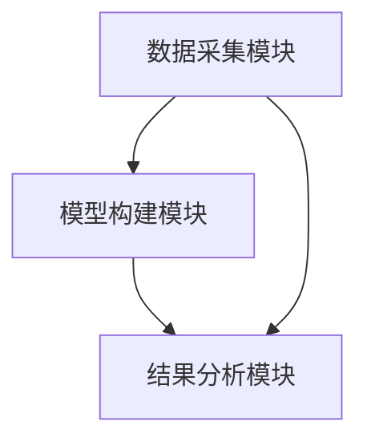
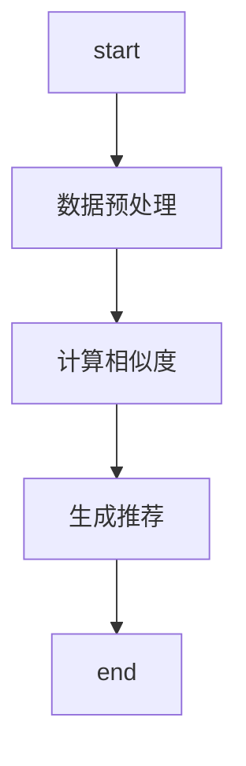
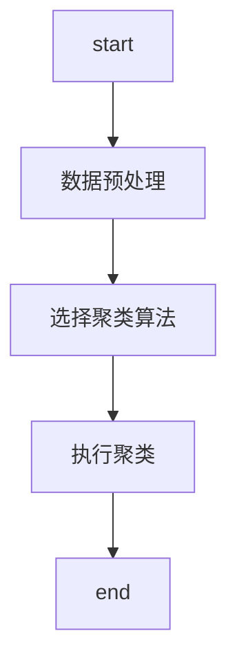
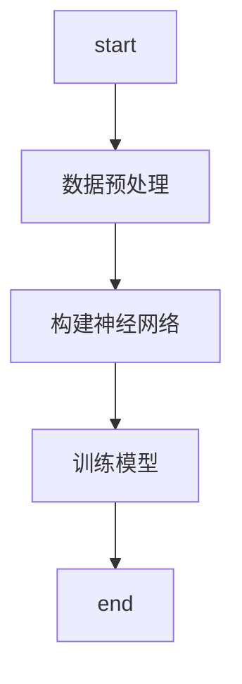
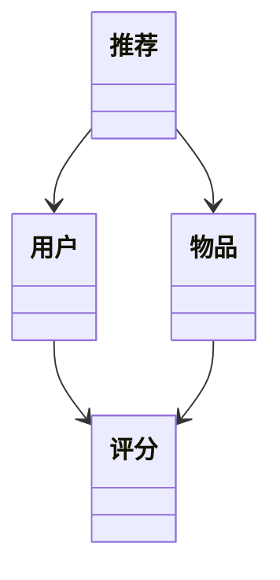
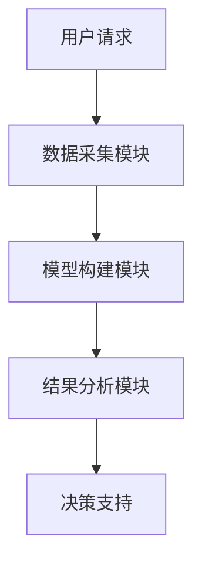
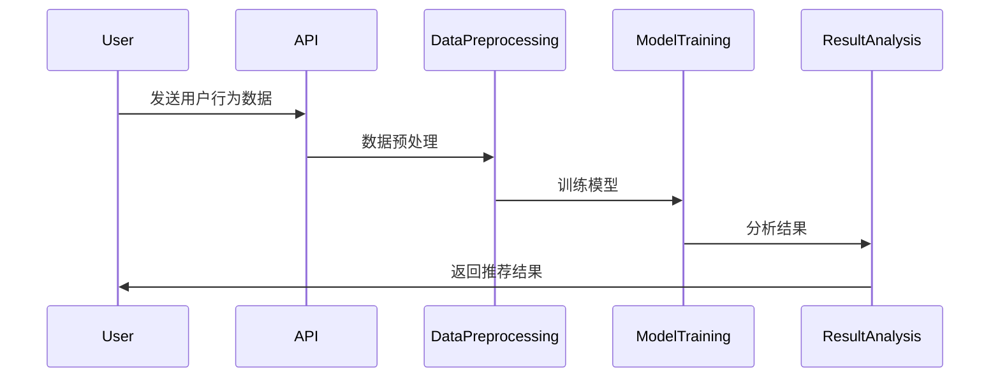

                 


# 企业估值中的AI驱动的个性化营销平台评估

## 关键词：企业估值, AI驱动, 个性化营销, 平台评估, 技术分析

## 摘要：
随着数字化营销的快速发展，企业估值的传统方法逐渐显露出其局限性。本文将探讨如何利用AI技术驱动个性化营销平台的评估，从而为企业提供更精准的估值方法。通过分析核心概念、算法原理、系统架构和实际案例，本文旨在为企业提供一套基于AI的个性化营销平台评估体系，帮助企业在竞争激烈的市场中获得更高的估值。

---

# 第1章: 问题背景与核心概念

## 1.1 问题背景
### 1.1.1 企业估值的传统方法与局限性
传统的企业估值方法通常依赖于财务指标、市场份额和历史表现等数据。然而，这种方法无法充分考虑企业个性化营销能力对估值的影响。个性化营销是企业在数字化时代的核心竞争力之一，其效果直接影响企业的市场价值。

### 1.1.2 数字化营销的兴起与个性化需求
随着互联网和大数据技术的发展，企业营销逐渐从传统的批量营销转向个性化营销。个性化营销能够更精准地满足客户需求，提升客户忠诚度和满意度，从而为企业创造更大的价值。

### 1.1.3 AI技术在企业估值中的潜力
AI技术可以通过分析海量数据，识别潜在的市场机会和风险，从而为企业的估值提供更精准的支持。个性化营销平台的评估需要结合企业的数据资产、客户行为和市场趋势，而这些都离不开AI技术的支持。

## 1.2 核心概念与问题描述
### 1.2.1 个性化营销平台的定义与特征
个性化营销平台是一种基于大数据和AI技术的营销工具，能够根据客户的行为、偏好和特征，提供个性化的推荐、广告和客户服务。其核心特征包括数据驱动、实时响应和动态优化。

### 1.2.2 AI驱动的企业估值方法
AI驱动的企业估值方法通过分析企业的历史数据、市场表现和未来趋势，利用机器学习模型预测企业的市场价值。这种方法能够结合企业的个性化营销能力，提供更全面的估值结果。

### 1.2.3 问题的边界与外延
个性化营销平台评估的核心问题是如何将企业的个性化营销能力转化为可量化的价值。其边界包括企业的数据资产、客户行为和市场趋势，而外延则涉及企业战略、组织结构和外部环境。

## 1.3 核心概念与联系
### 1.3.1 核心概念原理
个性化营销平台的评估需要结合企业的数据资产、客户行为和市场趋势。通过分析这些数据，可以识别企业的核心竞争力和市场潜力，从而为企业的估值提供支持。

### 1.3.2 核心概念属性特征对比表格
| 核心概念 | 数据资产 | 客户行为 | 市场趋势 |
|----------|----------|----------|----------|
| 数据类型 | 结构化数据（如销售数据、客户信息） | 非结构化数据（如社交媒体评论、点击流数据） | 结构化数据（如市场报告、行业趋势） |
| 分析目标 | 识别客户特征 | 理解客户需求 | 评估市场潜力 |
| 分析方法 | 聚类分析 | 关联规则挖掘 | 时间序列分析 |

### 1.3.3 ER实体关系图架构
```mermaid
erd
    顾客
    属性: 顾客ID, 姓名, 邮箱, 电话
    订单
    属性: 订单ID, 时间, 金额, 状态
    产品
    属性: 产品ID, 名称, 价格, 类别
    营销活动
    属性: 活动ID, 名称, 开始时间, 结束时间, 预算
    顾客-订单
    关系: 顾客 -> 订单 (1:N)
    顾客-营销活动
    关系: 顾客 -> 营销活动 (N:M)
```

---

# 第2章: AI驱动的个性化营销平台评估的核心要素

## 2.1 核心要素组成
### 2.1.1 数据采集与处理
个性化营销平台的评估需要收集和处理大量的数据，包括客户行为数据、市场数据和企业内部数据。数据采集可以通过API、数据库和第三方工具实现。

### 2.1.2 模型构建与优化
通过机器学习算法，构建个性化推荐模型、客户分群模型和市场趋势预测模型。模型的优化需要结合企业的实际需求和数据特征，选择合适的算法和参数。

### 2.1.3 结果分析与决策支持
通过分析模型输出的结果，评估企业的个性化营销能力，识别潜在的市场机会和风险。最终为企业的估值提供数据支持。

## 2.2 核心要素的相互关系
### 2.2.1 数据与模型的交互
数据是模型的基础，模型通过数据提取特征和模式，从而为决策提供支持。模型的输出又可以反哺数据，优化数据采集和处理流程。

### 2.2.2 模型与决策的协同
模型通过分析数据，提供决策支持。决策者可以根据模型的输出，制定企业的营销策略和估值方法。模型需要不断更新和优化，以适应市场的变化。

### 2.2.3 决策与结果的反馈
决策的结果可以通过反馈机制，优化模型和数据采集策略。这种反馈机制能够提高模型的准确性和决策的有效性。

## 2.3 核心要素的系统架构
### 2.3.1 系统功能模块划分
- 数据采集模块：负责数据的采集和预处理。
- 模型构建模块：负责模型的训练和优化。
- 结果分析模块：负责模型输出的分析和决策支持。

### 2.3.2 系统输入输出关系
- 输入：客户行为数据、市场数据、企业内部数据。
- 输出：客户分群、个性化推荐、市场趋势预测。

### 2.3.3 系统组件间的依赖关系


---

# 第3章: 算法原理讲解

## 3.1 算法原理概述
### 3.1.1 算法选择依据
根据数据特征和业务需求选择合适的算法。例如，协同过滤适合推荐系统，聚类分析适合客户分群。

### 3.1.2 算法的核心思想
协同过滤通过寻找相似的用户或产品，进行推荐。聚类分析通过划分客户群体，识别不同客户的需求。神经网络通过深度学习，提取数据的特征和模式。

### 3.1.3 算法的优缺点分析
- 协同过滤：优点是简单易实现，缺点是计算复杂度高。
- 聚类分析：优点是能够发现数据的内在结构，缺点是需要大量计算资源。
- 神经网络：优点是能够处理复杂的数据关系，缺点是计算资源消耗大。

## 3.2 算法流程图
### 3.2.1 协同过滤算法流程图


### 3.2.2 聚类分析算法流程图


### 3.2.3 神经网络算法流程图


## 3.3 算法实现代码
### 3.3.1 协同过滤算法实现
```python
import numpy as np

# 示例数据：用户-物品评分矩阵
users = ['A', 'B', 'C', 'D']
items = ['1', '2', '3', '4']
ratings = {'A': {'1': 5, '2': 4}, 
           'B': {'1': 3, '2': 2}, 
           'C': {'3': 4, '4': 5}, 
           'D': {'3': 2, '4': 1}}

# 计算相似度
def compute_similarity(ratings):
    # 计算余弦相似度
    user_vec = {}
    for user in ratings:
        user_vec[user] = [ratings[user][item] for item in items]
    similarity = np.zeros((len(users), len(users)))
    for i in range(len(users)):
        for j in range(len(users)):
            if i != j:
                similarity[i][j] = np.dot(user_vec[users[i]], user_vec[users[j]]) / \
                    (np.linalg.norm(user_vec[users[i]]) * np.linalg.norm(user_vec[users[j]]))
    return similarity

similarity = compute_similarity(ratings)
```

### 3.3.2 聚类分析算法实现
```python
from sklearn.cluster import KMeans

# 示例数据：客户特征
data = [[1, 2], [3, 4], [5, 6], [7, 8]]

# 聚类分析
model = KMeans(n_clusters=2, random_state=0)
model.fit(data)
labels = model.labels_
print(labels)
```

### 3.3.3 神经网络算法实现
```python
import tensorflow as tf

# 示例数据：分类任务
X = np.array([[0, 0], [0, 1], [1, 0], [1, 1]])
y = np.array([0, 1, 1, 0])

# 构建神经网络
model = tf.keras.Sequential([
    tf.keras.layers.Dense(4, activation='relu'),
    tf.keras.layers.Dense(1, activation='sigmoid')
])
model.compile(optimizer='adam', loss='binary_crossentropy', metrics=['accuracy'])
model.fit(X, y, epochs=100, batch_size=4)
```

## 3.4 算法的数学模型与公式
### 3.4.1 协同过滤的矩阵分解模型
$$\text{预测评分} = \text{用户向量} \times \text{物品向量}^T$$

### 3.4.2 聚类分析的距离计算公式
$$\text{欧氏距离} = \sqrt{\sum_{i=1}^{n}(x_i - y_i)^2}$$

### 3.4.3 神经网络的损失函数公式
$$\text{损失函数} = -\frac{1}{m}\sum_{i=1}^{m} y_i \log(a^{(i)}) + (1 - y_i)\log(1 - a^{(i)})$$
其中，$a^{(i)}$ 是模型的输出，$y_i$ 是真实标签。

---

# 第4章: 系统分析与架构设计

## 4.1 系统功能设计
### 4.1.1 领域模型类图


### 4.1.2 系统架构设计


### 4.1.3 系统接口设计
- 输入接口：API接口接收用户行为数据和市场数据。
- 输出接口：API接口返回推荐结果和市场趋势预测。

## 4.2 系统交互序列图


---

# 第5章: 项目实战

## 5.1 环境安装与配置
### 5.1.1 安装Python和相关库
```bash
pip install numpy pandas scikit-learn tensorflow
```

### 5.1.2 安装Jupyter Notebook
```bash
pip install jupyter
```

## 5.2 系统核心实现
### 5.2.1 数据预处理
```python
import pandas as pd

data = pd.read_csv('data.csv')
data.head()
```

### 5.2.2 模型训练与优化
```python
from sklearn.model_selection import train_test_split
from sklearn.metrics import accuracy_score

X_train, X_test, y_train, y_test = train_test_split(X, y, test_size=0.2)
model.fit(X_train, y_train)
print("Accuracy:", accuracy_score(model.predict(X_test), y_test))
```

### 5.2.3 模型部署与测试
```python
# 部署模型
import joblib

joblib.dump(model, 'model.pkl')
# 测试模型
model = joblib.load('model.pkl')
print(model.predict([[5, 6]]))
```

## 5.3 实际案例分析
### 5.3.1 案例背景
某电商平台希望通过个性化推荐提升销售额，利用AI技术进行平台评估。

### 5.3.2 数据分析与模型训练
通过收集用户行为数据，构建推荐系统，提升客户的购买率。

## 5.4 项目小结
通过实际案例，我们可以看到AI技术在个性化营销平台评估中的巨大潜力。模型的准确性和计算效率是影响企业估值的重要因素。

---

# 第6章: 最佳实践、小结、注意事项与拓展阅读

## 6.1 最佳实践 tips
- 数据预处理是关键，确保数据的准确性和完整性。
- 选择合适的算法，结合企业的实际需求。
- 模型的实时更新和优化是保持竞争力的重要手段。

## 6.2 小结
本文详细介绍了AI驱动的个性化营销平台评估的核心要素、算法原理和系统架构。通过实际案例分析，展示了AI技术在企业估值中的应用潜力。

## 6.3 注意事项
- 数据隐私和安全问题需要高度重视。
- 模型的可解释性和透明度是企业决策的重要因素。
- 算法的计算资源消耗需要合理控制。

## 6.4 拓展阅读
- 《机器学习实战》
- 《深度学习入门：基于Python》
- 《数据挖掘导论》

---

通过本文的学习，读者可以掌握AI驱动的个性化营销平台评估的核心方法，并能够在实际工作中应用这些技术，为企业提供更精准的估值支持。

