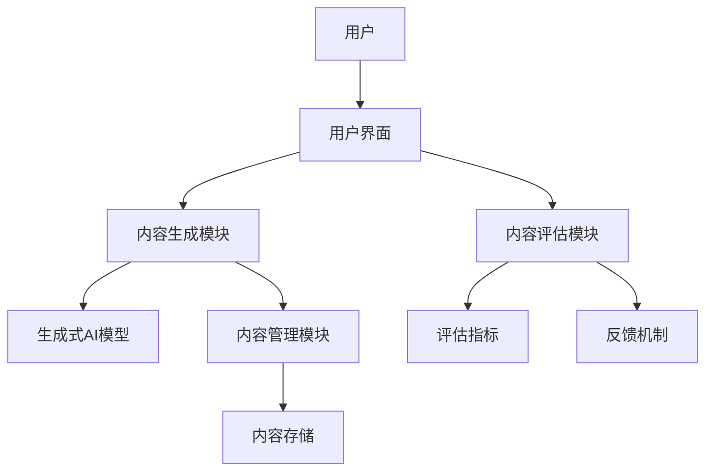
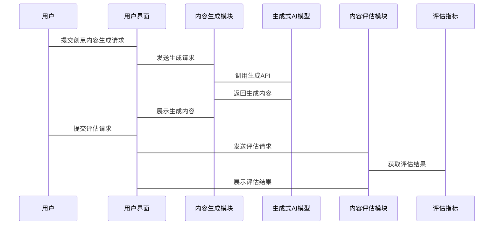
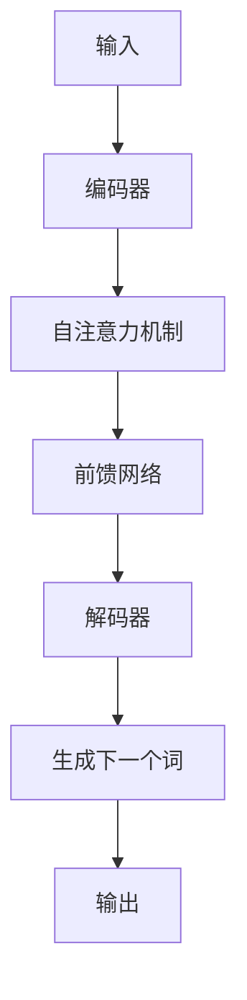

                 


# 《企业估值中的AI驱动的创意内容生成平台评估》

---

## 关键词：
- 企业估值
- AI驱动
- 创意内容生成
- 平台评估
- 生成式AI
- NLP技术

---

## 摘要：
在当今数字时代，创意内容生成正在成为企业估值的重要组成部分。随着人工智能技术的快速发展，AI驱动的创意内容生成平台能够为企业提供高效、个性化的创意内容，从而显著提升企业价值。本文将深入探讨AI在创意内容生成中的应用，分析其对企业估值的影响，并提出一种基于生成式AI和自然语言处理技术的评估方法。通过理论分析、系统设计和实际案例，本文将展示如何利用AI技术提升企业估值中的创意内容生成能力。

---

## 第一部分：创意内容生成与企业估值的背景

### 第1章：引言

#### 1.1 创意内容生成的背景与重要性
创意内容生成是企业数字化转型中的关键环节。随着市场竞争的加剧，企业需要不断推出高质量、多样化的创意内容以吸引用户、提升品牌影响力和市场竞争力。传统的内容生成方式效率低下、成本高昂，而AI驱动的创意内容生成技术为企业提供了一种高效、智能的解决方案。

#### 1.2 企业估值的传统方法与挑战
传统的企业估值方法主要依赖于财务指标、市场表现和管理团队的能力。然而，这些方法难以量化创意内容对企业价值的具体贡献。随着创意内容在企业中的作用日益重要，如何将创意内容生成能力纳入企业估值体系成为一个重要课题。

#### 1.3 AI驱动创意内容生成的潜力与应用
生成式AI和自然语言处理技术的进步使得创意内容生成变得更加智能化和自动化。AI驱动的创意内容生成平台能够根据企业的需求快速生成文本、图像、视频等多种形式的内容，从而显著提升企业的创意能力。本文将探讨如何利用这些技术提升企业估值中的创意内容生成能力。

---

## 第二部分：AI驱动创意内容生成的理论基础

### 第2章：生成式AI与创意内容生成

#### 2.1 生成式AI的定义与特点
生成式AI是一种基于深度学习的自然语言处理技术，能够生成与人类语言类似的文本。与传统的检索式AI不同，生成式AI能够根据输入的上下文生成新的内容，具有创造性、多样性和个性化的特点。

#### 2.2 常见的生成式AI模型
目前，市场上涌现出许多生成式AI模型，如GPT系列、BERT、PaLM等。这些模型通过大量的数据训练，能够生成高质量的文本内容。例如，GPT-3模型可以生成复杂的对话、文章、诗歌等。

#### 2.3 创意内容生成的AI算法原理
生成式AI的核心算法是基于Transformer架构的生成模型。模型通过自注意力机制捕捉文本中的语义关系，并通过解码器生成新的文本内容。生成过程包括编码器输入上下文信息，解码器生成下一个词，直到生成完整的文本。

#### 2.4 生成式AI在创意内容生成中的应用
生成式AI可以应用于多种创意内容生成场景，如文案撰写、新闻报道、诗歌创作、广告创意等。通过训练特定领域的数据，生成式AI可以生成符合企业需求的个性化内容。

---

### 第3章：自然语言处理技术在创意内容生成中的应用

#### 3.1 自然语言处理（NLP）的基本概念
自然语言处理是人工智能的一个分支，旨在使计算机能够理解、生成和处理人类语言。NLP技术包括文本分类、实体识别、情感分析、机器翻译等多种任务。

#### 3.2 NLP在创意内容生成中的具体应用
NLP技术在创意内容生成中发挥着重要作用。例如，情感分析可以帮助生成符合目标受众情感倾向的内容；文本分类可以将内容分为不同的类别，如产品描述、营销文案等。

#### 3.3 基于NLP的创意内容生成流程
创意内容生成的流程通常包括需求分析、数据准备、模型训练、内容生成和内容优化。通过NLP技术，可以实现对生成内容的质量评估和优化，确保内容符合企业的期望。

---

## 第三部分：企业估值中的创意内容生成评估

### 第4章：企业估值的传统方法与挑战

#### 4.1 传统企业估值方法的概述
传统的企业估值方法主要包括财务指标分析、市场比较法、DCF模型等。这些方法主要关注企业的财务表现和市场地位，难以量化创意内容对企业价值的贡献。

#### 4.2 传统方法的局限性
创意内容在企业中的作用越来越重要，但传统估值方法难以量化其价值。例如，一家企业的创意内容生成能力可能影响其品牌价值和市场竞争力，但这些因素难以通过财务指标直接反映。

#### 4.3 创意内容生成对估值的影响
创意内容生成能力是企业核心竞争力的重要组成部分。通过评估企业的创意内容生成能力，可以更全面地评估企业的市场价值。

---

### 第5章：AI驱动的创意内容生成对估值的影响

#### 5.1 AI驱动创意内容生成的潜力
生成式AI和NLP技术的进步使得企业能够以更低的成本、更高的效率生成创意内容。这种能力可以显著提升企业的市场竞争力和品牌价值。

#### 5.2 创意内容生成对企业的具体影响
创意内容生成能力可以通过多种方式影响企业估值。例如，生成高质量的内容可以提高企业的用户吸引力和品牌影响力，从而提升企业的市场价值。

#### 5.3 创意内容生成的评估指标
为了评估创意内容生成能力，需要引入一些新的评估指标，如内容生成效率、内容质量、内容多样性等。这些指标可以帮助企业更好地量化其创意内容生成能力。

---

## 第四部分：AI驱动创意内容生成平台的系统架构

### 第6章：系统架构设计

#### 6.1 系统功能设计
创意内容生成平台的功能模块包括内容生成、内容管理、内容评估和用户界面等。每个模块需要实现特定的功能，如生成文本、评估内容质量等。

#### 6.2 系统架构图
以下是创意内容生成平台的系统架构图：



#### 6.3 系统接口设计
创意内容生成平台需要提供多种接口，如API接口和用户界面。API接口可以与其他系统集成，用户界面供用户直接使用。

#### 6.4 系统交互流程
以下是系统交互流程图：



---

## 第五部分：项目实战与数学模型

### 第7章：项目实战

#### 7.1 环境安装
创意内容生成平台的开发需要安装以下工具和库：
- Python 3.8+
- PyTorch或TensorFlow
- Hugging Face Transformers库
- Jupyter Notebook

#### 7.2 系统核心实现源代码
以下是创意内容生成模块的Python代码示例：

```python
from transformers import GPT2LMHeadModel, GPT2Tokenizer

# 加载预训练模型
model_name = "gpt2-large"
model = GPT2LMHeadModel.from_pretrained(model_name)
tokenizer = GPT2Tokenizer.from_pretrained(model_name)

# 定义生成函数
def generate_text(prompt, max_length=50):
    inputs = tokenizer.encode(prompt, return_tensors="pt")
    outputs = model.generate(inputs, max_length=max_length, do_sample=True)
    text = tokenizer.decode(outputs[0], skip_special_tokens=True)
    return text

# 示例生成
prompt = "Write a marketing campaign for a new product."
print(generate_text(prompt))
```

#### 7.3 代码功能解读
上述代码示例展示了如何使用生成式AI模型生成营销文案。首先，加载预训练的GPT-2模型，然后定义一个生成函数，输入提示词生成目标长度的文本。生成的文本可以用于企业的营销活动。

#### 7.4 案例分析
假设一家企业需要生成一篇产品发布的新闻稿，可以使用上述代码生成多个候选方案，并通过内容评估模块选择最优的内容。生成的内容需要符合企业的品牌形象和目标受众的需求。

#### 7.5 项目小结
通过上述项目实战，我们可以看到AI驱动的创意内容生成平台在企业估值中的巨大潜力。生成式AI和NLP技术可以帮助企业快速生成高质量的内容，提升品牌价值和市场竞争力。

---

## 第六部分：数学模型与算法原理

### 第8章：创意内容生成的数学模型

#### 8.1 生成模型的数学基础
生成式AI模型的数学基础主要包括Transformer架构和自注意力机制。Transformer模型通过多头注意力机制捕捉文本中的语义关系，并通过解码器生成新的文本内容。

#### 8.2 生成模型的算法流程
以下是生成模型的算法流程图：



#### 8.3 生成模型的优化
生成模型的优化主要包括模型训练和超参数调优。通过优化模型参数，可以提高生成内容的质量和相关性。

#### 8.4 评估模型的数学基础
评估模型的数学基础主要包括内容质量评估和内容多样性评估。内容质量评估可以通过BLEU、ROUGE等指标进行，内容多样性评估可以通过生成文本的熵值进行衡量。

---

## 第七部分：总结与展望

### 第9章：总结与展望

#### 9.1 全文总结
本文探讨了AI驱动的创意内容生成平台对企业估值的影响。通过分析生成式AI和NLP技术的原理和应用，本文提出了一种基于AI的创意内容生成评估方法。通过项目实战和数学模型的分析，本文展示了如何利用AI技术提升企业创意内容生成能力。

#### 9.2 未来研究方向
未来的研究方向包括：
- 提高生成模型的内容质量
- 引入多模态生成技术
- 探讨生成内容的版权问题
- 研究生成内容对企业估值的长期影响

---

## 结语

通过本文的分析，我们可以看到AI驱动的创意内容生成平台在企业估值中的巨大潜力。生成式AI和NLP技术的进步为企业的创意内容生成提供了新的可能性。未来，随着技术的不断发展，AI驱动的创意内容生成平台将在企业估值中发挥越来越重要的作用。

