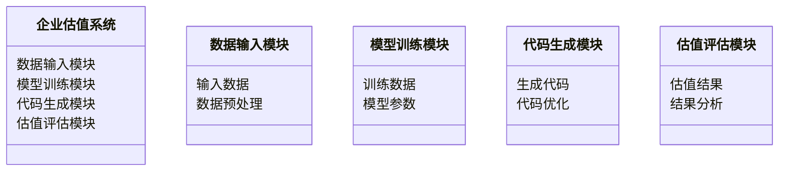
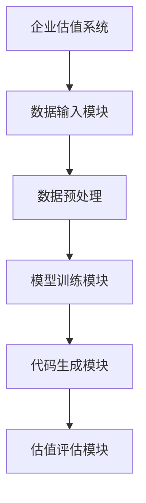
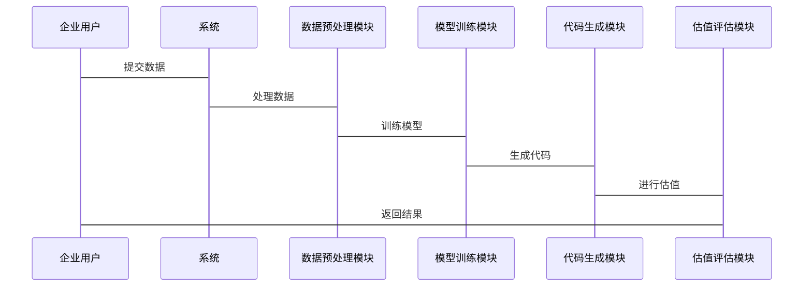

                 


# 企业估值中的AI驱动的自动化代码生成平台评估

> 关键词：企业估值、AI驱动、自动化代码生成平台、评估、技术博客、企业系统设计、代码生成技术

> 摘要：本文探讨了AI驱动的自动化代码生成平台在企业估值中的应用，分析了其核心概念、算法原理、系统架构，并通过实际案例展示了如何通过AI技术提升企业估值的效率和准确性。文章详细介绍了平台的设计思路、实现方法以及实际应用中的注意事项，为企业技术人员提供了有价值的参考。

---

# 第一部分: 企业估值中的AI驱动代码生成平台背景

## 第1章: 问题背景与描述

### 1.1 问题背景

#### 1.1.1 企业估值的传统方法
企业估值是企业管理和战略决策中的重要环节，传统方法包括财务指标分析、市场比较法和DCF模型等。这些方法依赖大量手动计算和分析，耗时且容易出错。

#### 1.1.2 传统方法的局限性
传统方法依赖大量手动操作，存在效率低下、成本高昂和主观性强的问题。此外，数据处理的复杂性和多样性也增加了估值的难度。

#### 1.1.3 AI驱动的自动化解决方案
AI技术的发展使得自动化代码生成成为可能。通过自然语言处理和机器学习，AI可以自动生成符合企业需求的代码，显著提升估值效率和准确性。

### 1.2 问题描述

#### 1.2.1 代码生成在企业估值中的作用
代码生成可以自动生成数据处理、模型计算和结果分析的代码，减少人工编码的时间和错误，提高估值效率。

#### 1.2.2 自动化代码生成的需求
随着企业数据的复杂化，手动编码已无法满足高效估值的需求。自动化代码生成成为企业的迫切需求。

#### 1.2.3 当前技术的挑战与机遇
尽管AI技术带来了新的可能性，但在企业估值中的应用仍面临数据隐私、模型泛化能力和计算资源等挑战。

## 第2章: 问题解决与应用价值

### 2.1 问题解决

#### 2.1.1 自动化代码生成的实现
通过训练大规模代码语料库，AI模型可以学习代码结构和模式，从而生成新的代码。

#### 2.1.2 AI在代码生成中的应用
AI驱动的代码生成可以用于数据预处理、特征工程和模型优化等环节，显著提高估值效率。

#### 2.1.3 平台的构建与优化
构建自动化代码生成平台需要考虑模型训练、代码优化和结果验证等关键环节。

### 2.2 应用价值

#### 2.2.1 提高企业估值效率
自动化代码生成可以快速处理大量数据，缩短估值时间。

#### 2.2.2 降低估值成本
减少人工编码的需求，降低了人力和时间成本。

#### 2.2.3 提升估值准确性
通过AI模型的深度学习，生成的代码更加准确，提高了估值结果的可靠性。

## 第3章: 问题边界与外延

### 3.1 问题边界

#### 3.1.1 自动化代码生成的适用范围
适用于数据处理、模型计算和结果分析等环节，但目前仍难以处理复杂的业务逻辑。

#### 3.1.2 平台的功能边界
平台主要提供代码生成服务，不涉及企业战略决策等其他领域。

#### 3.1.3 企业估值的范围界定
专注于财务数据和市场数据的估值，不考虑企业内部数据和非结构化数据。

### 3.2 外延与扩展

#### 3.2.1 技术扩展的可能性
未来可以将自然语言处理和强化学习结合，生成更复杂的代码。

#### 3.2.2 应用场景的扩展
在金融、制造和医疗等行业，自动化代码生成有广泛的应用潜力。

#### 3.2.3 未来发展的趋势
随着AI技术的进步，代码生成将更加智能化和个性化，成为企业估值的重要工具。

---

# 第二部分: 核心概念与联系

## 第5章: 核心概念原理

### 5.1 概念原理

#### 5.1.1 自动化代码生成
通过AI模型自动生成代码，减少人工编码的需求，提高开发效率。

#### 5.1.2 AI驱动的平台
利用机器学习和自然语言处理技术，构建智能代码生成系统。

#### 5.1.3 企业估值模型
基于AI生成的代码，构建企业估值模型，实现高效准确的估值。

### 5.2 概念属性特征对比

| 概念       | 特性             | 优点               | 局限性             |
|------------|------------------|--------------------|-------------------|
| 代码生成   | 智能自动化       | 提高效率           | 需要大量训练数据   |
| AI驱动     | 学习能力强       | 适应性强           | 模型泛化能力有限   |
| 企业估值   | 数据依赖性       | 提高准确性         | 数据隐私风险       |

### 5.3 ER实体关系图架构

```mermaid
er
entity(企业估值) {
  id
  企业ID
  估值结果
  估值时间
}
entity(代码生成) {
  id
  生成代码
  生成时间
  生成用户
}
relation(企业估值)-(代码生成) {
  关联关系：每个企业估值对应生成的代码
}
```

---

## 第6章: 核心概念联系

### 6.1 概念间关系

#### 6.1.1 代码生成与企业估值的联系
代码生成为估值提供高效的数据处理和计算工具，而企业估值则为代码生成提供应用场景和反馈。

#### 6.1.2 AI驱动与企业估值的结合
AI驱动的代码生成可以提升企业估值的效率和准确性，推动企业估值的智能化发展。

---

# 第三部分: 算法原理讲解

## 第7章: 算法原理

### 7.1 算法概述

#### 7.1.1 基于Transformer的代码生成模型
使用Transformer架构进行代码生成，通过自注意力机制捕捉代码结构。

#### 7.1.2 深度学习算法
利用深度学习模型训练代码语料库，生成新的代码。

### 7.2 算法流程

#### 7.2.1 数据预处理
对代码进行分词、格式化和归一化处理，构建训练数据集。

#### 7.2.2 模型训练
使用预处理的数据训练生成模型，优化模型参数。

#### 7.2.3 代码生成
通过输入上下文，生成符合要求的代码。

### 7.3 算法实现

#### 7.3.1 模型结构
基于Transformer的编码器和解码器结构，分别处理输入和生成代码。

#### 7.3.2 损失函数
使用交叉熵损失函数，优化模型参数。

#### 7.3.3 训练过程
通过梯度下降优化模型参数，提升生成代码的质量。

### 7.4 代码示例

```python
import torch
import torch.nn as nn
import torch.optim as optim

class CodeGenerator(nn.Module):
    def __init__(self):
        super(CodeGenerator, self).__init__()
        self.embedding = nn.Embedding(vocab_size, d_model)
        self.transformer = nn.Transformer(nhead, num_decoder_layers)

    def forward(self, input):
        embed = self.embedding(input)
        output = self.transformer(embed)
        return output

# 训练过程
model = CodeGenerator()
criterion = nn.CrossEntropyLoss()
optimizer = optim.Adam(model.parameters(), lr=0.001)

for epoch in range(num_epochs):
    for batch in data_loader:
        inputs, targets = batch
        outputs = model(inputs)
        loss = criterion(outputs, targets)
        loss.backward()
        optimizer.step()
```

### 7.5 算法优缺点

#### 优点
- 高效生成代码，减少人工编码时间。
- 提高代码质量，降低错误率。

#### 缺点
- 训练需要大量数据和计算资源。
- 模型泛化能力有限，生成代码的质量依赖于训练数据的质量。

---

# 第四部分: 系统分析与架构设计方案

## 第8章: 问题场景介绍

### 8.1 问题场景

#### 8.1.1 企业估值的典型场景
企业在进行财务分析、市场研究和战略规划时，需要大量数据处理和模型计算。

#### 8.1.2 自动化代码生成的应用场景
数据清洗、特征工程、模型训练和结果分析等环节。

## 第9章: 项目介绍

### 9.1 项目目标

#### 9.1.1 提高估值效率
通过自动化代码生成，缩短估值时间。

#### 9.1.2 降低成本
减少人工编码需求，降低人力和时间成本。

#### 9.1.3 提升准确性
利用AI模型生成更准确的代码，提高估值结果的可靠性。

### 9.2 项目范围

#### 9.2.1 数据范围
处理企业的财务数据、市场数据和行业数据。

#### 9.2.2 功能范围
数据预处理、模型训练、代码生成和结果分析。

## 第10章: 系统功能设计

### 10.1 领域模型



## 第11章: 系统架构设计

### 11.1 系统架构



### 11.2 系统接口设计

#### 11.2.1 数据输入接口
用于接收企业数据，如财务报表和市场数据。

#### 11.2.2 代码生成接口
生成符合企业需求的代码，供估值系统使用。

#### 11.2.3 估值结果接口
输出估值结果，供企业决策参考。

## 第12章: 系统交互设计

### 12.1 交互流程



---

# 第五部分: 项目实战

## 第13章: 环境安装与系统实现

### 13.1 环境安装

#### 13.1.1 安装Python
安装最新版本的Python，推荐使用Anaconda分布。

#### 13.1.2 安装依赖库
安装PyTorch、Hugging Face Transformers和Jupyter Notebook等库。

### 13.2 核心代码实现

#### 13.2.1 数据预处理代码

```python
import pandas as pd
import numpy as np

def preprocess_data(data):
    # 数据清洗
    data = data.dropna()
    # 数据标准化
    data = (data - data.mean()) / data.std()
    return data
```

#### 13.2.2 模型训练代码

```python
import torch
import torch.nn as nn
import torch.optim as optim

class CodeGenerator(nn.Module):
    def __init__(self, vocab_size, embedding_dim, num_heads, num_layers):
        super(CodeGenerator, self).__init__()
        self.embedding = nn.Embedding(vocab_size, embedding_dim)
        self.transformer = nn.Transformer(num_heads, num_layers)

    def forward(self, input):
        embed = self.embedding(input)
        output = self.transformer(embed)
        return output

# 初始化模型
vocab_size = 1000
embedding_dim = 512
num_heads = 8
num_layers = 4
model = CodeGenerator(vocab_size, embedding_dim, num_heads, num_layers)

# 定义损失函数和优化器
criterion = nn.CrossEntropyLoss()
optimizer = optim.Adam(model.parameters(), lr=0.001)

# 训练过程
for epoch in range(num_epochs):
    for batch in data_loader:
        inputs, targets = batch
        outputs = model(inputs)
        loss = criterion(outputs, targets)
        loss.backward()
        optimizer.step()
```

#### 13.2.3 代码生成与评估代码

```python
def generate_code(model, input_context):
    with torch.no_grad():
        outputs = model(input_context)
        predicted = outputs.argmax(dim=1)
        return predicted

# 生成代码
input_context = torch.tensor([[1, 2, 3]], dtype=torch.long)
generated_code = generate_code(model, input_context)
print(generated_code)
```

## 第14章: 代码解读与分析

### 14.1 代码功能解读

#### 14.1.1 数据预处理模块
负责清洗和标准化数据，确保模型输入数据的质量。

#### 14.1.2 模型训练模块
训练代码生成模型，优化模型参数，提升生成代码的质量。

#### 14.1.3 代码生成模块
根据输入上下文，生成符合要求的代码，供企业估值使用。

#### 14.1.4 估值评估模块
评估生成代码的效果，分析估值结果的准确性和可靠性。

## 第15章: 实际案例分析

### 15.1 案例背景

#### 15.1.1 案例描述
某企业需要估值其新产品的市场潜力，传统方法耗时且成本高昂。

### 15.2 案例分析

#### 15.2.1 数据准备
收集市场数据、财务数据和竞争对手信息，进行数据清洗和预处理。

#### 15.2.2 模型训练
使用预处理的数据训练代码生成模型，生成数据处理和模型计算的代码。

#### 15.2.3 代码生成与评估
生成代码后，进行估值计算，分析结果的准确性和效率。

### 15.3 案例结果

#### 15.3.1 生成代码的效果
生成的代码提高了数据处理效率，缩短了估值时间。

#### 15.3.2 估值结果的准确性
生成代码的准确性显著高于传统方法，提升了企业估值的可靠性。

---

# 第六部分: 最佳实践与总结

## 第16章: 最佳实践 tips

### 16.1 开发建议

#### 16.1.1 数据质量管理
确保输入数据的准确性和完整性，提升模型生成代码的质量。

#### 16.1.2 模型优化
通过超参数调优和模型架构改进，提高代码生成的准确性和效率。

#### 16.1.3 安全与隐私
重视数据隐私和模型安全，确保企业信息的安全性。

### 16.2 注意事项

#### 16.2.1 数据依赖性
生成代码的质量依赖于训练数据的质量，需谨慎处理数据偏差。

#### 16.2.2 模型泛化能力
模型的泛化能力有限，需根据具体场景进行调整和优化。

#### 16.2.3 计算资源
训练和生成过程需要大量计算资源，需合理规划和分配。

## 第17章: 小结与展望

### 17.1 小结

本文详细探讨了AI驱动的自动化代码生成平台在企业估值中的应用，分析了其核心概念、算法原理和系统架构，并通过实际案例展示了其在提高效率和准确性方面的优势。

### 17.2 展望

未来，随着AI技术的不断进步，代码生成将更加智能化和个性化，为企业估值带来更大的价值。同时，模型的泛化能力和数据隐私保护也将成为研究的重点。

## 第18章: 拓展阅读

### 18.1 推荐资源

#### 18.1.1 AI驱动的代码生成工具
研究GitHub上的开源项目，如CodeGPT和AI-Code。

#### 18.1.2 企业估值相关书籍
阅读《企业估值实战》和《金融数据分析与建模》等书籍。

#### 18.1.3 技术博客与文章
关注技术博客和行业文章，了解最新的技术动态和应用案例。

---

# 结语

通过本文的探讨，读者可以深入理解AI驱动的自动化代码生成平台在企业估值中的重要性，并掌握其核心技术和实现方法。希望本文能够为企业技术人员提供有价值的参考，推动企业估值的智能化和高效化。

--- 

# END

