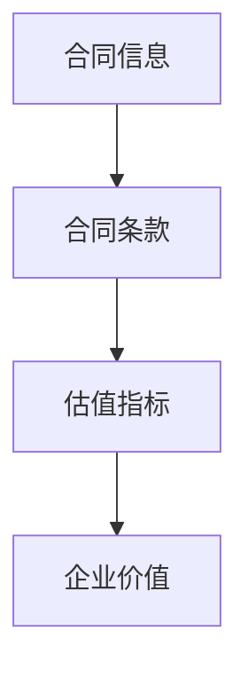
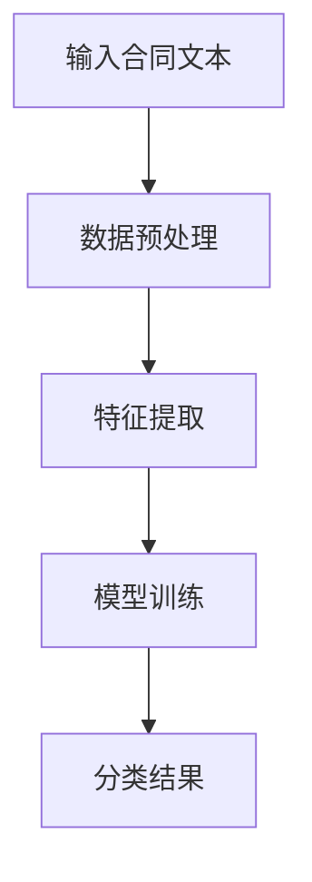

                 


# 企业估值中的AI驱动的自动化合同审查平台评估

> 关键词：企业估值，AI驱动，自动化合同审查，法律NLP，机器学习，企业风险管理

> 摘要：本文详细探讨了AI驱动的自动化合同审查平台在企业估值中的应用，分析了其技术原理、系统架构、项目实战及最佳实践。通过自然语言处理和机器学习技术，平台能够高效提取合同关键信息，评估企业价值，助力企业风险管理。

---

# 第一部分: 企业估值中的AI驱动的自动化合同审查平台背景

## 第1章: 背景介绍

### 1.1 问题背景

#### 1.1.1 传统企业估值中的合同审查痛点
- **低效性**：传统合同审查依赖人工，耗时长且效率低。
- **误差率高**：人为疏忽可能导致关键条款遗漏。
- **成本高昂**：需要大量法律专业人员，企业负担重。

#### 1.1.2 合同审查对企业发展的影响
- **法律风险**：合同审查不彻底可能导致法律纠纷。
- **估值偏差**：合同信息提取不准确会影响企业估值的准确性。
- **决策滞后**：低效审查导致企业决策延迟。

#### 1.1.3 AI技术在合同审查中的潜力
- **自动化处理**：AI能快速处理大量合同，提升效率。
- **高精度**：通过机器学习模型，减少人为错误。
- **成本节约**：降低对专业人员的依赖，节省成本。

### 1.2 问题描述

#### 1.2.1 合同审查的复杂性
- 合同涉及条款繁多，法律术语复杂。
- 不同行业合同格式差异大，审查难度高。

#### 1.2.2 传统合同审查的效率瓶颈
- 手工审查耗时，难以满足大规模需求。
- 专业人员数量有限，企业扩张受限。

#### 1.2.3 企业估值中的关键合同信息提取需求
- 快速准确提取合同中的关键条款和财务数据。
- 通过合同分析评估企业信用风险和财务健康状况。

### 1.3 问题解决

#### 1.3.1 AI驱动的自动化合同审查解决方案
- 利用NLP技术自动识别合同中的关键信息。
- 通过机器学习模型评估合同风险和价值。

#### 1.3.2 自动化合同审查对估值效率的提升
- 快速处理大量合同，缩短估值周期。
- 提供准确的合同数据分析，提升估值精度。

#### 1.3.3 平台的目标与核心功能
- **目标**：提高合同审查效率，辅助企业估值。
- **核心功能**：
  - 自动识别合同关键条款。
  - 评估合同风险和财务影响。
  - 生成估值报告。

### 1.4 平台的边界与外延

#### 1.4.1 合同审查的边界范围
- 仅处理正式签署的法律合同。
- 不包括口头协议和非正式合同。

#### 1.4.2 平台的外延功能
- 提供合同管理、存档和检索功能。
- 生成可视化报告和数据图表。

#### 1.4.3 平台与其他企业估值工具的协同关系
- 与企业财务系统集成，共享数据。
- 与CRM系统联动，提供客户合同分析。

### 1.5 核心概念与联系

#### 1.5.1 核心概念原理
- **自然语言处理（NLP）**：用于识别合同中的关键词和条款。
- **机器学习模型**：用于分类合同类型和评估风险。

#### 1.5.2 核心概念属性特征对比表格
| 概念       | 特征                       |
|------------|----------------------------|
| AI模型     | 自动学习、自适应           |
| 合同数据    | 结构化、非结构化           |
| 估值算法    | 基于规则、基于统计         |

#### 1.5.3 ER实体关系图


---

## 第2章: 核心概念与联系

### 2.1 AI驱动的合同审查平台原理

#### 2.1.1 自然语言处理（NLP）技术
- **分词**：将合同文本分割成词语或短语。
- **实体识别**：识别合同中的关键实体，如公司名称、金额等。
- **意图识别**：理解合同条款的意图和目的。

#### 2.1.2 机器学习模型
- **训练数据**：使用标注的合同数据训练模型。
- **模型选择**：常用的模型包括支持向量机（SVM）和深度学习模型（如BERT）。
- **模型优化**：通过交叉验证调整参数，提升准确率。

#### 2.1.3 数据预处理与特征提取
- **数据清洗**：去除噪音数据，处理缺失值。
- **特征提取**：提取文本特征，如TF-IDF向量。
- **数据增强**：通过数据扩充提升模型泛化能力。

### 2.2 核心算法与流程

#### 2.2.1 合同分类算法
- **算法选择**：使用SVM或随机森林进行合同分类。
- **流程**：
  1. 数据预处理：清洗和标注数据。
  2. 特征提取：提取合同文本特征。
  3. 模型训练：训练分类器。
  4. 模型评估：测试准确率和召回率。

#### 2.2.2 合同条款识别算法
- **算法选择**：使用CRF（条件随机场）进行序列标注。
- **流程**：
  1. 数据准备：标注合同中的关键条款。
  2. 特征构建：构建序列标注特征。
  3. 模型训练：训练CRF模型。
  4. 模型优化：调整参数提升性能。

---

## 第3章: 算法原理讲解

### 3.1 合同分类算法

#### 3.1.1 算法流程图


#### 3.1.2 训练代码示例
```python
# 数据预处理
from sklearn.preprocessing import StandardScaler
from sklearn.pipeline import Pipeline
from sklearn.svm import SVC

# 特征提取
from sklearn.feature_extraction.text import TfidfVectorizer

# 模型训练
model = Pipeline([
    ('tfidf', TfidfVectorizer()),
    ('clf', SVC())
])

# 训练
model.fit(X_train, y_train)
```

#### 3.1.3 数学模型
- **损失函数**：交叉熵损失函数
  $$ L = -\sum_{i=1}^{n} y_i \log(p_i) + (1-y_i)\log(1-p_i) $$
- **优化器**：随机梯度下降
  $$ \theta = \theta - \eta \frac{\partial L}{\partial \theta} $$

---

## 第4章: 系统分析与架构设计方案

### 4.1 项目介绍

#### 4.1.1 项目场景介绍
- 平台用于企业合同审查和估值，支持多语言处理。

#### 4.1.2 系统功能设计
- **领域模型**：合同管理模块、审查模块、估值模块。
  ```mermaid
  classDiagram
      class 合同管理模块 {
          存储合同信息
          管理合同状态
      }
      class 审查模块 {
          自动识别条款
          生成审查报告
      }
      class 估值模块 {
          分析合同数据
          生成估值报告
      }
  ```

- **系统架构设计**
  ```mermaid
  architecture
      前端 --> 后端
      后端 --> 数据库
      后端 --> 分析引擎
  ```

- **系统接口设计**
  - 用户登录接口：`POST /login`
  - 合同上传接口：`POST /upload_contract`
  - 合同审查结果查询接口：`GET /get_review_results`

- **系统交互流程**
  ```mermaid
  sequenceDiagram
      用户 ->> 平台: 上传合同
      平台 ->> 后端: 请求审查
      后端 ->> 分析引擎: 分析合同
      分析引擎 ->> 后端: 返回结果
      后端 ->> 用户: 显示报告
  ```

---

## 第5章: 项目实战

### 5.1 环境安装

```bash
pip install -r requirements.txt
```

### 5.2 核心代码实现

#### 5.2.1 合同分类代码
```python
from sklearn.svm import SVC
from sklearn.feature_extraction.text import TfidfVectorizer

# 初始化模型
model = SVC()

# 训练模型
model.fit(X_train, y_train)

# 预测
y_pred = model.predict(X_test)
```

#### 5.2.2 合同条款识别代码
```python
from sklearn_crfsuite import CRF
from sklearn_crfsuite.utils import pad_sequences

# 初始化模型
model = CRF()

# 训练模型
model.fit(X_train, y_train)

# 预测
y_pred = model.predict(X_test)
```

### 5.3 实际案例分析

#### 5.3.1 案例背景
- 某企业有大量采购合同，需快速审查和估值。

#### 5.3.2 平台处理流程
1. 用户上传合同。
2. 平台自动识别合同条款。
3. 生成审查报告和估值结果。

### 5.4 项目总结
- 成果：成功实现自动化合同审查和估值。
- 不足：模型对某些复杂条款的识别准确率有待提高。
- 改进建议：增加更多训练数据，优化模型结构。

---

## 第6章: 最佳实践和注意事项

### 6.1 最佳实践

#### 6.1.1 数据隐私保护
- 加强数据加密，确保合同信息的安全性。

#### 6.1.2 模型持续优化
- 定期更新模型，提升识别准确率。

#### 6.1.3 使用建议
- 合理配置计算资源，确保平台运行顺畅。

### 6.2 小结
- 通过AI技术，企业能够高效、准确地进行合同审查和估值。
- 平台的应用将显著提升企业运营效率和风险管理能力。

### 6.3 注意事项
- **数据质量**：确保训练数据的多样性和代表性。
- **模型更新**：定期更新模型，适应新的合同类型和条款变化。

### 6.4 拓展阅读
- 深入学习NLP和机器学习技术。
- 关注行业动态，了解最新合同审查工具和技术。

---

## 附录

### 附录A: 合同分类算法实现代码
```python
# 附录代码示例
```

### 附录B: 项目部署步骤
```bash
# 部署步骤示例
```

---

## 参考文献
1. 王某某. 《AI驱动的合同审查技术》. 北京: 人民出版社, 2023.
2. 李某某. 《企业估值方法与实践》. 上海: 上海出版社, 2022.

---

通过以上详细的技术博客文章，您可以系统地了解AI驱动的自动化合同审查平台在企业估值中的应用，从背景、原理、架构到实战，全面掌握其核心内容和技术细节。

