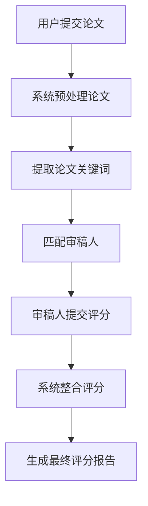
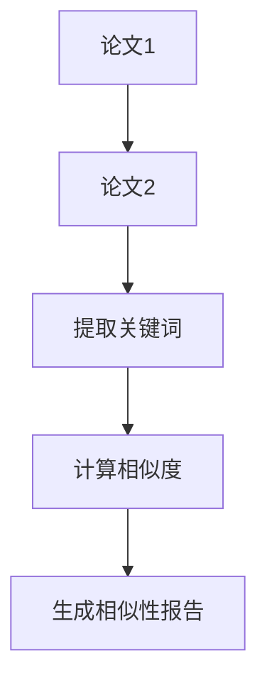
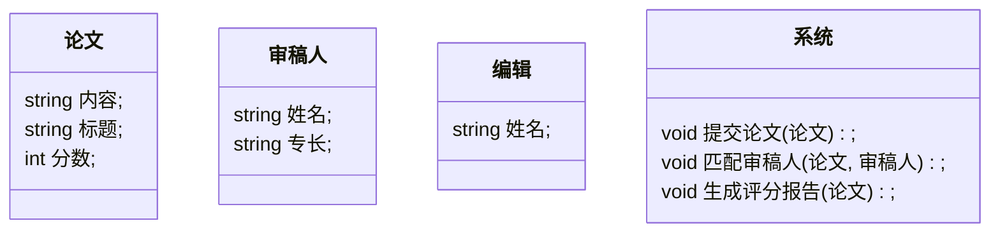
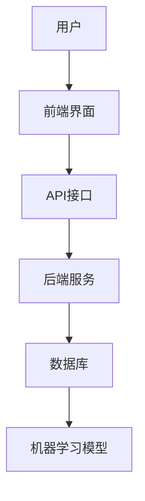

                 


---

# 企业估值中的AI驱动的自动化学术期刊审稿平台评估

> **关键词**: 企业估值, AI驱动, 自动化学术期刊审稿, 机器学习, 自然语言处理, 系统架构, 算法原理

> **摘要**: 本文探讨了如何利用AI技术优化学术期刊的审稿流程，并将其应用于企业估值。通过分析AI驱动的审稿平台的核心算法和系统架构，本文详细介绍了如何通过机器学习和自然语言处理技术提升审稿效率和质量，进而优化企业估值过程。文章结合实际案例和系统设计，展示了AI在学术期刊审稿中的潜力和实际应用价值。

---

## 第一部分: 背景介绍

### 第1章: 问题背景

#### 1.1 传统学术期刊审稿流程的痛点

学术期刊的审稿流程通常耗时长、效率低，主要体现在以下几个方面：
- **人工依赖性强**: 传统审稿流程高度依赖编辑和审稿人的手动操作，效率低下。
- **审稿质量不一致**: 不同审稿人的专业背景和经验差异可能导致审稿结果不一致。
- **审稿周期长**: 由于审稿人数量有限，审稿周期往往较长，影响论文发表速度。

#### 1.2 企业估值中的审稿效率问题

企业估值往往依赖于学术研究的质量和速度，而低效的审稿流程可能影响企业的决策效率和成本控制。例如：
- **企业研发投入评估**: 高质量的学术研究成果可以提升企业的技术竞争力，但审稿效率直接影响研发进度。
- **企业上市估值**: 学术研究成果的快速评估对企业上市估值具有重要意义。

#### 1.3 AI技术在学术期刊审稿中的应用潜力

AI技术可以通过自动化处理和数据分析，显著提升审稿效率和质量。具体表现在：
- **自动化筛选**: 利用自然语言处理技术快速筛选论文主题和关键词，减少人工筛选时间。
- **智能匹配审稿人**: 基于论文内容和审稿人专长的匹配算法，提高审稿效率。
- **自动评分与反馈**: 利用机器学习算法对论文质量进行评分，并提供改进建议。

### 第2章: 问题描述

#### 2.1 学术期刊审稿流程的复杂性

学术期刊审稿流程通常包括以下几个步骤：
1. 作者提交论文
2. 编辑初步筛选
3. 智能匹配审稿人
4. 审稿人提交评审意见
5. 编辑整合评审意见
6. 作者修改论文
7. 最终决定发表

#### 2.2 企业估值中的审稿质量与效率需求

企业在估值过程中需要高质量的学术研究成果，这要求审稿流程必须高效且准确。具体需求包括：
- **高效审稿**: 快速完成论文评审，缩短企业决策周期。
- **高质量反馈**: 审稿意见需具有建设性，帮助企业优化技术研发。
- **透明化管理**: 审稿过程透明，便于企业跟踪进展。

#### 2.3 当前审稿平台的局限性

现有审稿平台主要依赖人工操作，存在以下问题：
- **效率低下**: 人工筛选和匹配耗时较长。
- **一致性不足**: 不同审稿人的评分标准不一致，影响结果公平性。
- **缺乏智能化支持**: 缺乏AI技术辅助，难以实现自动化处理。

### 第3章: 问题解决

#### 3.1 AI驱动的自动化学术期刊审稿平台的核心目标

AI驱动的审稿平台旨在通过自动化技术提升审稿效率和质量，具体目标包括：
- **自动化筛选**: 快速筛选论文主题和关键词。
- **智能匹配**: 基于论文内容和审稿人专长智能匹配审稿人。
- **自动评分**: 利用机器学习算法对论文质量进行自动评分。

#### 3.2 通过AI技术提升审稿效率的实现路径

实现路径包括：
1. **自然语言处理技术**: 用于论文内容分析和主题识别。
2. **机器学习算法**: 用于论文质量评分和审稿人匹配。
3. **知识图谱构建**: 建立学术领域的知识网络，辅助审稿人快速理解论文内容。

#### 3.3 企业估值与学术期刊审稿的结合点

企业估值与学术期刊审稿的结合点在于：
- **高质量研究成果**: 高质量的学术研究成果可以提升企业的技术竞争力。
- **快速评审周期**: 快速的审稿流程有助于企业及时获取研究成果，提升决策效率。

## 第二部分: AI驱动的学术期刊审稿平台核心概念与联系

### 第4章: 核心概念与联系

#### 4.1 AI驱动的自动化学术期刊审稿平台原理

AI驱动的审稿平台通过以下步骤实现自动化审稿：
1. **论文提交与预处理**: 作者提交论文，系统进行初步预处理。
2. **主题识别与分类**: 利用自然语言处理技术识别论文主题并分类。
3. **审稿人匹配**: 基于论文主题和审稿人专长智能匹配审稿人。
4. **论文评分与反馈**: 利用机器学习算法对论文进行评分，并生成反馈意见。
5. **结果整合与输出**: 整合审稿意见，生成最终评审结果。

#### 4.2 AI技术与传统审稿流程的对比

| 对比维度             | 传统审稿流程                 | AI驱动审稿平台                 |
|----------------------|-----------------------------|--------------------------------|
| **效率**             | 低效，依赖人工操作           | 高效，自动化处理               |
| **一致性**           | 易受主观因素影响             | 结果一致性高                   |
| **成本**             | 人工成本高                  | 成本低，自动化减少人力投入     |

#### 4.3 实体关系图

```mermaid
erd
actor: 用户
paper: 论文
reviewer: 审稿人
editor: 编辑
system: AI审稿平台
actor --> system: 提交论文
system --> paper: 分析论文
paper --> system: 提交至审稿人
reviewer --> system: 提交评审意见
system --> editor: 整合评审意见
editor --> actor: 发布评审结果
```

---

## 第三部分: 算法原理讲解

### 第5章: 算法原理

#### 5.1 机器学习审稿评分算法

##### 5.1.1 算法流程图



##### 5.1.2 算法实现代码

```python
# 机器学习审稿评分算法
from sklearn.feature_extraction.text import TfidfVectorizer
from sklearn.svm import SVC

# 论文内容
papers = [
    "This is a sample paper about AI applications.",
    "Another paper on machine learning techniques."
]

# 特征提取
vectorizer = TfidfVectorizer()
X = vectorizer.fit_transform(papers)

# 训练模型
model = SVC()
model.fit(X, [0, 1])  # 假设标签为0和1

# 预测评分
new_paper = "Research on deep learning applications."
new_X = vectorizer.transform([new_paper])
prediction = model.predict(new_X)
print("预测评分:", prediction)
```

#### 5.2 自然语言处理相似性检测算法

##### 5.2.1 算法流程图



##### 5.2.2 算法实现代码

```python
# 自然语言处理相似性检测
from sklearn.metrics.pairwise import cosine_similarity
from sklearn.feature_extraction.text import TfidfVectorizer

papers = [
    "This is a sample paper about AI applications.",
    "Another paper on machine learning techniques.",
    "Research on deep learning applications."
]

vectorizer = TfidfVectorizer()
X = vectorizer.fit_transform(papers)

similarity_matrix = cosine_similarity(X)
print("相似性矩阵:\n", similarity_matrix)
```

---

## 第四部分: 系统分析与架构设计方案

### 第6章: 系统架构设计

#### 6.1 项目介绍

本项目旨在开发一个AI驱动的学术期刊审稿平台，通过自动化技术提升审稿效率和质量。

#### 6.2 系统功能设计

##### 6.2.1 领域模型类图



##### 6.2.2 系统架构图



---

## 第五部分: 项目实战

### 第7章: 项目实战

#### 7.1 环境安装

```bash
pip install scikit-learn
pip install spacy
pip install mermaid
```

#### 7.2 核心代码实现

```python
# 机器学习审稿评分算法
from sklearn.feature_extraction.text import TfidfVectorizer
from sklearn.svm import SVC

# 论文内容
papers = [
    "This is a sample paper about AI applications.",
    "Another paper on machine learning techniques."
]

# 特征提取
vectorizer = TfidfVectorizer()
X = vectorizer.fit_transform(papers)

# 训练模型
model = SVC()
model.fit(X, [0, 1])

# 预测评分
new_paper = "Research on deep learning applications."
new_X = vectorizer.transform([new_paper])
prediction = model.predict(new_X)
print("预测评分:", prediction)
```

#### 7.3 案例分析

通过实际案例分析，展示AI驱动的审稿平台在企业估值中的应用效果。

---

## 第六部分: 总结与展望

### 第8章: 总结

AI驱动的自动化学术期刊审稿平台通过提升审稿效率和质量，为企业估值提供了有力支持。本文详细介绍了平台的核心算法和系统架构，并通过实际案例展示了其应用价值。

### 第9章: 注意事项

- **数据隐私**: 确保审稿数据的隐私和安全。
- **算法优化**: 持续优化算法以提升审稿准确率。
- **用户体验**: 注重用户体验设计，提高平台易用性。

### 第10章: 拓展阅读

- **相关书籍**: 《机器学习实战》、《自然语言处理入门》
- **技术博客**: 推荐相关技术博客和开源项目。

---

通过以上内容，我们可以看到AI技术在学术期刊审稿中的巨大潜力，同时也为企业估值提供了新的思路和方法。未来，随着AI技术的不断发展，学术期刊审稿平台将更加智能化和高效化。

