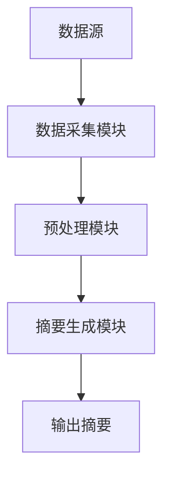

                 

<think>
好，我需要撰写一篇关于《企业估值中的AI驱动的自动化新闻摘要平台评估》的技术博客文章。让我一步一步地思考如何展开这篇文章。

首先，文章的标题是明确的，是“企业估值中的AI驱动的自动化新闻摘要平台评估”。接下来，我需要确定5-7个核心关键词。考虑到文章主要涉及企业估值、AI、新闻摘要、自动化平台、数据挖掘、自然语言处理、投资分析等领域，我可以选以下关键词：企业估值、AI驱动、新闻摘要、自动化平台、数据挖掘、自然语言处理、投资分析。

接下来，摘要部分需要简明扼要地概括文章的核心内容。我可以写：“随着人工智能技术的快速发展，自动化新闻摘要在企业估值中的应用变得越来越重要。本文详细探讨了AI驱动的新闻摘要平台在企业估值中的作用，分析了其核心算法、系统架构以及实际应用案例，为投资者和企业提供了有力的工具和参考。”

接下来是目录大纲部分，我需要按照之前提供的结构来组织文章内容。

# 企业估值中的AI驱动的自动化新闻摘要平台评估

> 关键词：企业估值, AI驱动, 新闻摘要, 自动化平台, 数据挖掘, 自然语言处理, 投资分析

> 摘要：随着人工智能技术的快速发展，自动化新闻摘要在企业估值中的应用变得越来越重要。本文详细探讨了AI驱动的新闻摘要平台在企业估值中的作用，分析了其核心算法、系统架构以及实际应用案例，为投资者和企业提供了有力的工具和参考。

---

## 目录大纲

1. **引言**
   - 1.1 企业估值的重要性
   - 1.2 新闻摘要在企业估值中的作用
   - 1.3 AI驱动的自动化新闻摘要的优势

2. **AI驱动新闻摘要的核心技术**
   - 2.1 自然语言处理技术
     - 2.1.1 分词与句法分析
     - 2.1.2 信息抽取与实体识别
   - 2.2 机器学习算法
     - 2.2.1 基于规则的新闻摘要生成
     - 2.2.2 基于深度学习的新闻摘要生成

3. **自动化新闻摘要系统架构**
   - 3.1 系统模块划分
     - 数据采集模块
     - 预处理模块
     - 摘要生成模块
   - 3.2 系统流程图（使用Mermaid）

4. **AI新闻摘要在企业估值中的应用**
   - 4.1 数据来源与处理
     - 企业财务数据
     - 市场新闻数据
   - 4.2 案例分析
     - 某行业新闻摘要对企业估值的影响

5. **系统实现与优化**
   - 5.1 系统实现
     - 前端设计
     - 后端实现
   - 5.2 系统优化
     - 算法优化
     - 性能优化

6. **挑战与未来发展方向**
   - 6.1 当前面临的主要挑战
     - 数据质量
     - 模型泛化能力
   - 6.2 未来发展方向
     - 多语言支持
     - 实时更新

7. **结论与展望**
   - 7.1 主要结论
   - 7.2 对未来研究的展望

---

接下来，我需要逐步撰写每个部分的内容。

## 引言

### 1.1 企业估值的重要性

企业估值是企业在市场上的价值评估，是投资决策的重要依据。准确的企业估值可以帮助投资者做出明智的投资决策，避免因信息不对称或信息过载导致的错误判断。传统的估值方法依赖于财务报表分析、市场比较分析等，但这些方法往往忽略了实时的市场动态和新闻信息。

### 1.2 新闻摘要在企业估值中的作用

新闻摘要能够帮助投资者快速获取关键信息，例如企业的最新财务数据、市场动态、行业趋势等。通过自动化新闻摘要，投资者可以及时了解与企业相关的最新动态，从而更准确地进行估值。然而，传统的新闻摘要依赖于人工操作，效率低且成本高。AI驱动的自动化新闻摘要可以解决这一问题，提供高效、准确的信息处理。

### 1.3 AI驱动的自动化新闻摘要的优势

AI驱动的新闻摘要利用自然语言处理和机器学习技术，能够自动从大量新闻中提取关键信息，生成简洁的摘要。这种方法不仅提高了信息处理的效率，还能够保证摘要的准确性和全面性。通过自动化新闻摘要，投资者可以快速获取与企业相关的最新信息，从而更准确地进行企业估值。

---

## AI驱动新闻摘要的核心技术

### 2.1 自然语言处理技术

自然语言处理（NLP）是AI驱动新闻摘要的核心技术之一。NLP技术能够理解人类语言的结构和语义，从而帮助计算机从文本中提取有用的信息。

#### 2.1.1 分词与句法分析

分词是将文本分割成词语的过程，是NLP的基础步骤。句法分析则是分析句子的结构，确定词语之间的关系。这些步骤有助于计算机理解新闻内容的结构和语义。

#### 2.1.2 信息抽取与实体识别

信息抽取是从文本中提取特定信息的过程，例如时间、地点、人物、事件等。实体识别则是识别文本中的实体，如公司名称、产品名称等。这些技术能够帮助计算机从新闻中提取关键信息，为摘要生成提供支持。

### 2.2 机器学习算法

机器学习算法是AI驱动新闻摘要的另一个核心技术。通过训练模型，计算机能够从大量数据中学习到摘要生成的规律。

#### 2.2.1 基于规则的新闻摘要生成

基于规则的摘要生成方法是通过预设的规则来生成摘要。例如，可以设定规则优先提取新闻中的标题和导语部分，或者提取包含关键词的句子。这种方法简单易行，但灵活性较差。

#### 2.2.2 基于深度学习的新闻摘要生成

基于深度学习的摘要生成方法利用神经网络模型，如循环神经网络（RNN）和变换器（Transformer），来生成摘要。这些模型能够自动学习文本的语义和结构，生成更自然流畅的摘要。

---

## 自动化新闻摘要系统架构

### 3.1 系统模块划分

自动化新闻摘要系统通常包括以下几个模块：

- **数据采集模块**：负责从新闻源获取原始数据。
- **预处理模块**：对获取的文本进行清洗和格式化处理。
- **摘要生成模块**：利用NLP技术和机器学习算法生成新闻摘要。

### 3.2 系统流程图

使用Mermaid绘制系统流程图如下：

---

## AI新闻摘要在企业估值中的应用

### 4.1 数据来源与处理

企业估值需要依赖多方面的数据，包括企业的财务数据、市场新闻、行业趋势等。通过自动化新闻摘要，可以快速获取与企业相关的新闻信息，为企业估值提供实时支持。

### 4.2 案例分析

以某行业为例，分析新闻摘要对企业估值的具体影响。例如，某公司的新产品发布可能会影响其市场地位和财务表现，自动化新闻摘要可以快速提取相关信息，帮助投资者做出更准确的估值。

---

## 系统实现与优化

### 5.1 系统实现

#### 前端设计

前端界面需要简洁直观，方便用户输入新闻内容并查看摘要。可以使用常见的前端框架，如React或Vue.js。

#### 后端实现

后端负责接收用户请求，处理新闻文本，并返回生成的摘要。可以使用Python的Flask框架来实现。

### 5.2 系统优化

#### 算法优化

通过改进算法模型，例如使用更先进的神经网络结构，提高摘要生成的准确性和流畅性。

#### 性能优化

优化系统性能，例如通过并行计算加速处理速度，或通过缓存技术减少重复计算。

---

## 挑战与未来发展方向

### 6.1 当前面临的主要挑战

- **数据质量**：新闻源的质量直接影响摘要的准确性。
- **模型泛化能力**：现有的模型可能难以适应不同领域的新闻内容。
- **实时性**：如何实现新闻摘要的实时更新是一个技术难题。

### 6.2 未来发展方向

- **多语言支持**：开发支持多种语言的新闻摘要系统，扩大应用范围。
- **实时更新**：研究如何实现新闻摘要的实时更新，满足用户的实时需求。

---

## 结论与展望

### 7.1 主要结论

AI驱动的自动化新闻摘要在企业估值中具有重要的应用价值。通过自然语言处理和机器学习技术，可以高效、准确地生成新闻摘要，帮助投资者做出更明智的决策。

### 7.2 对未来研究的展望

未来，随着AI技术的不断发展，新闻摘要系统将更加智能化和个性化。研究者需要进一步优化算法模型，提高摘要生成的准确性和流畅性，同时探索更多应用场景，为企业估值提供更有力的支持。

---

通过以上步骤，我可以系统地撰写出一篇关于《企业估值中的AI驱动的自动化新闻摘要平台评估》的技术博客文章。

