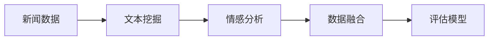
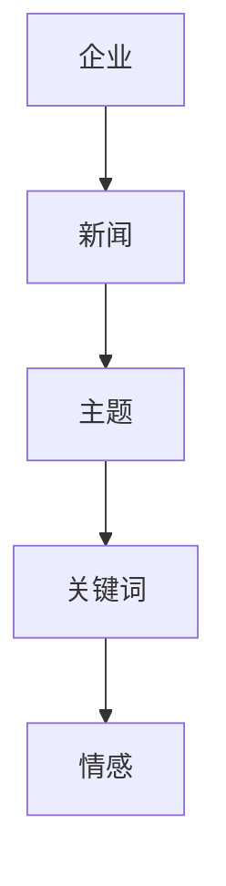
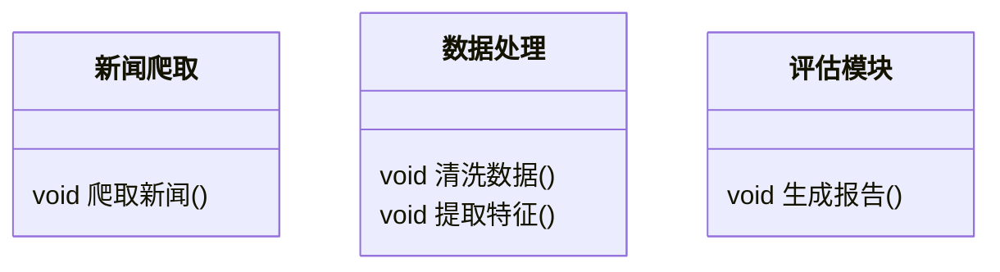
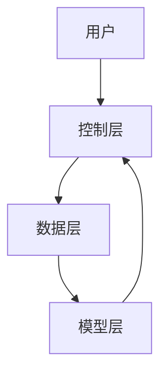

                 


```markdown
# 企业估值中的AI驱动的自动化新闻聚合平台评估

> 关键词：企业估值, AI驱动, 新闻聚合, 自动化评估, 文本挖掘

> 摘要：本文探讨如何利用AI技术构建自动化新闻聚合平台，通过文本挖掘、情感分析和数据融合，评估企业价值。文章详细分析平台的架构、算法原理及实际应用，为企业估值提供高效解决方案。

---

## 第一章: 背景介绍

### 1.1 问题背景与描述
#### 1.1.1 企业估值的传统方法与局限性
企业估值是金融领域的重要任务，传统方法依赖财务报表和市场数据，难以捕捉实时动态信息。这种方法耗时且不够精准。

#### 1.1.2 新闻聚合平台的作用
新闻聚合平台收集企业相关报道，但人工筛选效率低下，难以及时处理大量信息。

#### 1.1.3 AI驱动自动化评估的必要性
AI技术可自动聚合和分析新闻，提取关键信息，提升估值效率和准确性。

### 1.2 问题解决与边界
#### 1.2.1 核心问题
如何有效聚合、分析新闻数据，并准确评估企业价值。

#### 1.2.2 解决方案
构建自动化平台，利用NLP技术处理新闻，生成评估报告。

#### 1.2.3 边界与外延
平台仅处理公开新闻，不涉及内部数据，且主要针对公开市场。

### 1.3 核心概念与结构
#### 1.3.1 核心要素
包括新闻数据、文本挖掘、情感分析、数据融合和评估模型。

#### 1.3.2 概念结构图


## 第二章: 核心概念与联系

### 2.1 核心概念原理
#### 2.1.1 信息抽取与文本挖掘
从新闻中提取实体和关键词，使用分词和实体识别技术。

#### 2.1.2 情感分析与舆情监控
利用机器学习判断新闻情感，分析整体舆情。

#### 2.1.3 数据融合与特征提取
整合多源数据，提取影响企业估值的关键特征。

### 2.2 概念属性对比
#### 2.2.1 信息抽取与特征提取对比
| 技术 | 描述 | 示例 |
|------|------|------|
| 信息抽取 | 提取特定信息 | 提取公司名称 |
| 特征提取 | 提取影响估值的特征 | 提取财务指标 |

#### 2.2.2 情感分析与舆情监控对比
| 技术 | 描述 | 示例 |
|------|------|------|
| 情感分析 | 判断文本情感 | 判断新闻是正面还是负面 |
| 舆情监控 | 监控整体舆情 | 监控市场情绪变化 |

### 2.3 ER实体关系图


## 第三章: 算法原理与实现

### 3.1 文本匹配算法
#### 3.1.1 余弦相似度算法
计算文本向量的余弦相似度，公式为：
$$ \text{similarity} = \frac{\vec{A} \cdot \vec{B}}{|\vec{A}| |\vec{B}|} $$

#### 3.1.2 Python实现
```python
from sklearn.feature_extraction.text import TfidfVectorizer

def text_matching(text1, text2):
    vectorizer = TfidfVectorizer()
    tfidf = vectorizer.fit_transform([text1, text2])
    cosine_sim = (tfidf[0] * tfidf[1]).sum() / (tfidf[0].norm() * tfidf[1].norm())
    return cosine_sim
```

### 3.2 情感分析算法
#### 3.2.1 LSTM网络
使用LSTM进行序列建模，训练情感分类器。

#### 3.2.2 代码实现
```python
import tensorflow as tf
from tensorflow.keras import layers

model = tf.keras.Sequential()
model.add(layers.Embedding(input_dim=10000, output_dim=16))
model.add(layers.LSTM(64))
model.add(layers.Dense(2, activation='softmax'))
```

## 第四章: 数学模型与公式

### 4.1 文本相似度计算
使用余弦相似度计算新闻的相关性：
$$ \text{similarity} = \frac{\sum_{i=1}^{n} w_i w_j}{\sqrt{\sum_{i=1}^{n} w_i^2} \sqrt{\sum_{i=1}^{n} w_j^2}}} $$

### 4.2 情感评分模型
构建线性回归模型：
$$ y = w_1x_1 + w_2x_2 + ... + w_nx_n + b $$

## 第五章: 系统架构设计

### 5.1 系统组成模块
包括新闻爬取、数据处理、评估模块。

### 5.2 功能设计
#### 5.2.1 领域模型


### 5.3 系统架构


## 第六章: 项目实战

### 6.1 环境安装
安装Python、TensorFlow、NLTK等库。

### 6.2 核心代码实现
```python
import pandas as pd
from transformers import pipeline

sentiment_analyzer = pipeline("sentiment-analysis")
def analyze(text):
    return sentiment_analyzer(text)
```

### 6.3 实际案例分析
分析某公司新闻，生成情感评分和估值报告。

## 第七章: 最佳实践与小结

### 7.1 最佳实践
- 定期更新模型
- 多数据源融合
- 监控模型性能

### 7.2 小结
本文详细介绍了AI驱动的新闻聚合平台，展示了其在企业估值中的应用价值。

### 7.3 注意事项
- 数据质量和隐私
- 模型可解释性
- 系统维护成本

### 7.4 拓展阅读
推荐相关技术书籍和论文，深入学习AI与金融的结合。

---

# 结语
通过本文的详细讲解，读者可以掌握如何利用AI技术构建自动化新闻聚合平台，提升企业估值的效率和准确性。未来，随着AI技术的发展，这一领域将有更多创新和应用。
</think>

```markdown
# 企业估值中的AI驱动的自动化新闻聚合平台评估

> 关键词：企业估值、AI驱动、新闻聚合、自动化评估、文本挖掘

> 摘要：本文探讨如何利用人工智能技术构建自动化新闻聚合平台，通过新闻数据的自动聚合、分析和评估，辅助企业估值的过程。文章详细分析了平台的架构设计、算法原理及实际应用案例，为企业提供高效、精准的估值解决方案。

---

## 第一章: 背景介绍

### 1.1 问题背景与描述
#### 1.1.1 企业估值的传统方法与局限性
企业估值是金融市场中的核心任务，传统方法主要依赖于财务报表分析和市场数据研究。这种方法虽然有一定的科学性，但存在数据获取延迟、信息不全面以及难以捕捉市场情绪等局限性。

#### 1.1.2 新闻聚合平台的作用
新闻聚合平台能够实时收集与企业相关的新闻信息，但传统的新闻聚合平台依赖人工筛选和分析，效率低下且容易遗漏关键信息。

#### 1.1.3 AI驱动自动化评估的必要性
随着人工智能技术的发展，利用AI技术构建自动化新闻聚合和评估平台成为可能。通过自然语言处理（NLP）技术，可以自动聚合、分析新闻数据，并生成评估报告。

### 1.2 问题解决与边界
#### 1.2.1 核心问题
如何高效聚合、清洗和分析新闻数据，并将其转化为可用于企业估值的有效信息。

#### 1.2.2 解决方案
构建一个基于AI的自动化新闻聚合平台，利用NLP技术对新闻数据进行信息提取、情感分析和数据融合，最终生成企业估值报告。

#### 1.2.3 边界与外延
平台仅处理公开的新闻数据，不涉及企业内部数据；主要针对公开市场的企业估值，不适用于私募市场。

### 1.3 核心概念与结构
#### 1.3.1 核心要素
- 新闻数据：包括企业相关的新闻报道。
- 文本挖掘：用于从新闻中提取关键信息。
- 情感分析：用于分析新闻的情感倾向。
- 数据融合：整合多源数据，提取影响企业估值的特征。
- 评估模型：基于提取的特征，生成企业估值报告。

#### 1.3.2 概念结构图


---

## 第二章: 核心概念与联系

### 2.1 核心概念原理
#### 2.1.1 信息抽取与文本挖掘
从新闻文本中提取关键信息，如公司名称、事件时间、关键词等。常用技术包括分词、实体识别和关键词提取。

#### 2.1.2 情感分析与舆情监控
利用自然语言处理技术分析新闻的情感倾向，判断市场情绪。常用算法包括基于词袋模型的机器学习算法和深度学习模型（如LSTM）。

#### 2.1.3 数据融合与特征提取
将从新闻中提取的特征与其他数据源（如财务数据、市场数据）进行融合，提取影响企业估值的关键特征。

### 2.2 概念属性对比
#### 2.2.1 信息抽取与特征提取对比
| 技术         | 描述 | 示例 |
|--------------|------|------|
| 信息抽取     | 提取特定信息 | 提取公司名称 |
| 特征提取     | 提取影响估值的特征 | 提取财务指标 |

#### 2.2.2 情感分析与舆情监控对比
| 技术         | 描述 | 示例 |
|--------------|------|------|
| 情感分析     | 判断文本情感 | 判断新闻是正面还是负面 |
| 舆情监控     | 监控整体舆情 | 监控市场情绪变化 |

### 2.3 ER实体关系图


---

## 第三章: 算法原理与实现

### 3.1 文本匹配算法
#### 3.1.1 余弦相似度算法
计算文本向量的余弦相似度，公式为：
$$ \text{similarity} = \frac{\vec{A} \cdot \vec{B}}{|\vec{A}| |\vec{B}|} $$

#### 3.1.2 使用Python实现文本匹配
```python
from sklearn.feature_extraction.text import TfidfVectorizer

def text_matching(text1, text2):
    vectorizer = TfidfVectorizer()
    tfidf = vectorizer.fit_transform([text1, text2])
    cosine_sim = (tfidf[0] * tfidf[1]).sum() / (tfidf[0].norm() * tfidf[1].norm())
    return cosine_sim
```

### 3.2 情感分析算法
#### 3.2.1 基于LSTM的情感分析模型
```python
import tensorflow as tf
from tensorflow.keras import layers

model = tf.keras.Sequential()
model.add(layers.Embedding(input_dim=10000, output_dim=16))
model.add(layers.LSTM(64))
model.add(layers.Dense(2, activation='softmax'))
```

---

## 第四章: 数学模型与公式

### 4.1 文本相似度计算
使用余弦相似度计算新闻的相关性：
$$ \text{similarity} = \frac{\sum_{i=1}^{n} w_i w_j}{\sqrt{\sum_{i=1}^{n} w_i^2} \sqrt{\sum_{i=1}^{n} w_j^2}}} $$

### 4.2 情感评分模型
构建线性回归模型：
$$ y = w_1x_1 + w_2x_2 + ... + w_nx_n + b $$

---

## 第五章: 系统架构设计

### 5.1 系统组成模块
- 新闻爬取模块：负责从新闻网站爬取相关新闻。
- 数据处理模块：对爬取的新闻进行清洗和特征提取。
- 评估模块：基于提取的特征生成企业估值报告。

### 5.2 系统功能设计
#### 5.2.1 领域模型


### 5.3 系统架构


---

## 第六章: 项目实战

### 6.1 环境安装
安装必要的Python库，如 `scikit-learn`、`tensorflow`、`transformers` 等。

### 6.2 核心代码实现
```python
import pandas as pd
from transformers import pipeline

sentiment_analyzer = pipeline("sentiment-analysis")
def analyze(text):
    return sentiment_analyzer(text)
```

### 6.3 实际案例分析
以某公司为例，展示如何利用平台分析新闻数据并生成估值报告。

---

## 第七章: 最佳实践与小结

### 7.1 最佳实践
- 定期更新模型，保持其准确性和适应性。
- 多数据源融合，提高评估的全面性。
- 监控模型性能，及时调整参数。

### 7.2 小结
本文详细介绍了如何利用AI技术构建自动化新闻聚合平台，并展示了其在企业估值中的应用。通过本文章的讲解，读者可以掌握如何设计和实现类似的平台。

### 7.3 注意事项
- 数据质量和隐私保护是需要重点关注的问题。
- 模型的可解释性和透明度也是实际应用中需要考虑的因素。
- 系统的维护和扩展成本也需要在设计阶段充分考虑。

### 7.4 拓展阅读
推荐相关书籍和论文，深入学习AI技术在金融领域的应用。

---

# 结语
通过本文的详细讲解，读者可以掌握如何利用AI技术构建自动化新闻聚合平台，提升企业估值的效率和准确性。未来，随着AI技术的不断发展，这一领域将有更多创新和应用，为企业估值提供更多可能性。
```

