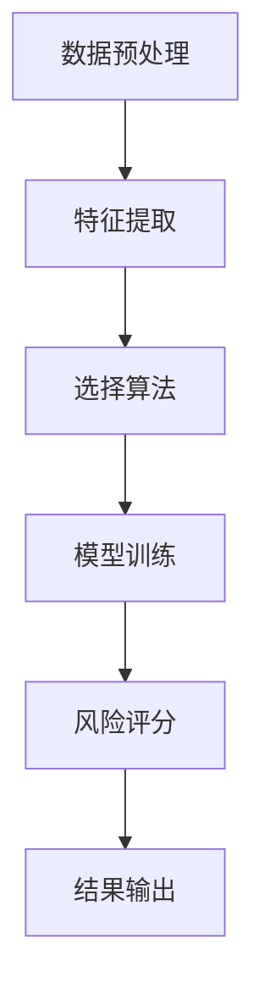
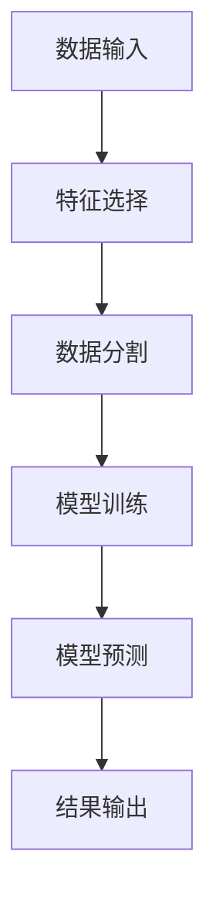
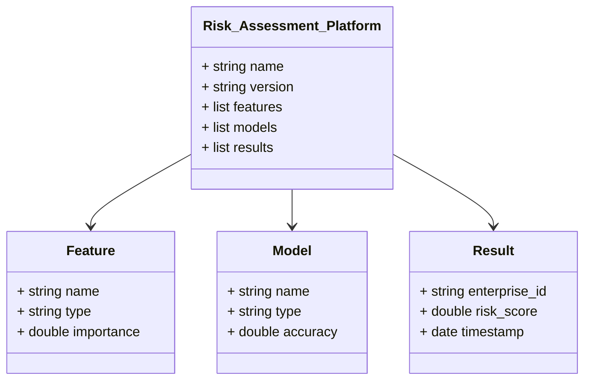

                 


# 企业估值中的AI驱动的自动化风险评估平台评估

> 关键词：企业估值，AI驱动，风险评估，自动化平台，机器学习

> 摘要：本文探讨了在企业估值过程中，利用AI驱动的自动化风险评估平台的重要性。通过分析传统风险评估方法的局限性，提出了一种基于机器学习的自动化解决方案，详细阐述了该平台的设计思路、算法原理、系统架构以及实际应用案例。通过案例分析和实战指导，为读者提供了从理论到实践的全面指导。

---

## # 第一部分：引言

### ## 第1章：问题背景与目标

#### ### 1.1 企业估值中的风险评估挑战

企业在进行估值时，核心目标是通过对企业财务状况、市场表现、管理团队、行业环境等多方面因素的综合评估，确定其市场价值。然而，传统的企业估值方法往往依赖于人工分析和经验判断，存在以下几方面的挑战：

1. **数据复杂性**：企业估值涉及大量的非结构化数据，包括文本、图像等，难以通过传统方法高效处理。
2. **人为误差**：人工分析容易受到主观判断的影响，可能导致评估结果的不准确。
3. **效率低下**：传统方法需要大量的人力和时间，无法满足现代企业对快速决策的需求。
4. **动态变化**：市场环境和企业状况随时都在变化，静态的评估方法难以适应动态需求。

通过引入AI技术，可以实现对数据的自动化处理和实时分析，提高评估的准确性和效率。

---

#### ### 1.2 问题描述与目标

AI驱动的自动化风险评估平台的目标是通过机器学习算法，对企业内外部风险因素进行自动化识别、量化和预测，从而辅助企业估值。具体目标包括：

1. **自动化数据处理**：将企业提供的非结构化数据（如财务报表、新闻报道等）转化为结构化数据，便于后续分析。
2. **风险因子提取**：从海量数据中提取关键风险因子，构建风险评估模型。
3. **实时监控**：对企业的风险状况进行实时监控，及时发现潜在风险。
4. **决策支持**：基于风险评估结果，为企业估值提供数据支持和决策建议。

---

#### ### 1.3 问题解决与边界

AI驱动的自动化风险评估平台通过以下方式解决传统方法的局限性：

1. **数据处理自动化**：利用NLP技术对文本数据进行清洗、分词和情感分析，提取关键信息。
2. **模型优化**：通过机器学习算法（如随机森林、XGBoost等）构建风险评估模型，并通过交叉验证优化模型性能。
3. **实时分析**：基于流数据处理技术，实时更新企业风险评估结果。

平台的边界包括：

1. **数据范围**：仅处理与企业估值相关的数据，不涉及其他领域。
2. **功能限制**：仅提供风险评估功能，不涉及企业估值的其他环节（如定价）。
3. **用户权限**：仅限授权用户使用，确保数据安全。

---

## # 第二部分：核心概念与联系

### ## 第2章：AI在风险评估中的应用

#### ### 2.1 AI驱动风险评估的核心概念

AI驱动的风险评估基于以下核心概念：

1. **机器学习模型**：通过训练数据，模型可以学习企业的风险特征，并预测未来的风险状况。
2. **数据特征工程**：通过对数据的特征提取和工程处理，提高模型的预测能力。
3. **风险评分模型**：基于模型输出的风险概率，对企业进行风险评分。

---

#### ### 2.2 核心概念原理

以下是核心概念的对比表格和ER实体关系图：

```mermaid
表格：不同机器学习模型的对比

| 模型类型      | 优势                  | 劣势                  |
|---------------|-----------------------|-----------------------|
| 随机森林      | 高精度，抗过拟合       | 对特征重要性解释性差   |
| XGBoost       | 高效率，可解释性好     | 对异常值敏感           |
| 神经网络       | 强大学习能力           | 需要大量数据，难解释    |

ER实体关系图：

```mermaid
erDiagram

risk_assessment_platform {
    entity Enterprise {
        key string ID
        string Name
        string Industry
        string Financial_Data
        string News_Articles
    }

    entity Risk_Factor {
        key string ID
        string Factor_Name
        string Factor_Description
    }

    enterprise Enterprise "1..*" associatedWith "1..*" risk_factor Risk_Factor
}
```

---

#### ### 2.3 实例分析与图解

以下是使用随机森林算法进行风险评估的流程图：



---

## # 第三部分：算法原理讲解

### ## 第3章：算法原理与实现

#### ### 3.1 算法选择与实现

以下是随机森林算法的Python实现代码：

```python
from sklearn.ensemble import RandomForestClassifier
from sklearn.metrics import accuracy_score
from sklearn.model_selection import train_test_split

# 数据加载与预处理
data = ...  # 加载数据
X = data.drop('label', axis=1)
y = data['label']

# 数据分割
X_train, X_test, y_train, y_test = train_test_split(X, y, test_size=0.2)

# 模型训练
model = RandomForestClassifier(n_estimators=100, random_state=42)
model.fit(X_train, y_train)

# 模型预测
y_pred = model.predict(X_test)
print("Accuracy:", accuracy_score(y_test, y_pred))
```

---

#### ### 3.2 算法流程与优化

以下是随机森林算法的流程图：



---

## # 第四部分：系统分析与架构设计方案

### ## 第4章：系统设计与实现

#### ### 4.1 系统功能设计

以下是系统功能的领域模型类图：



---

#### ### 4.2 系统架构设计

以下是系统架构的mermaid图：

```mermaid
client --> API_Gateway
API_Gateway --> Risk_Engine
Risk_Engine --> Model_Training
Risk_Engine --> Data_Source
```

---

## # 第五部分：项目实战

### ## 第5章：项目实现与案例分析

#### ### 5.1 项目实战指导

以下是环境安装步骤：

```bash
pip install scikit-learn
pip install pandas
pip install numpy
pip install mermaid
```

---

#### ### 5.2 代码实现与解读

以下是风险评估模型的代码实现：

```python
import pandas as pd
import numpy as np
from sklearn.ensemble import RandomForestClassifier
from sklearn.metrics import accuracy_score
from sklearn.model_selection import train_test_split

# 数据加载
data = pd.read_csv('enterprise_data.csv')

# 数据预处理
data.dropna(inplace=True)
data['label'] = data['label'].astype(int)

# 特征选择
features = data.columns[:-1]
target = data.columns[-1]

# 数据分割
X = data[features]
y = data[target]
X_train, X_test, y_train, y_test = train_test_split(X, y, test_size=0.2)

# 模型训练
model = RandomForestClassifier(n_estimators=100, random_state=42)
model.fit(X_train, y_train)

# 模型预测
y_pred = model.predict(X_test)
print(f"Accuracy: {accuracy_score(y_test, y_pred)}")
```

---

#### ### 5.3 案例分析与经验总结

通过分析具体案例，我们可以看到，AI驱动的自动化风险评估平台能够显著提高评估的准确性和效率。以下是一个实际案例的分析：

**案例背景**：某科技公司希望通过自动化平台评估其竞争对手的风险状况。

**平台应用**：
1. 数据预处理：清洗竞争对手的财务报表和新闻数据。
2. 特征提取：提取关键风险因子（如财务杠杆、盈利能力等）。
3. 模型训练：使用随机森林算法构建风险评估模型。
4. 模型预测：预测竞争对手的风险评分。

**结果分析**：模型预测结果显示，该竞争对手的风险评分为7.5分（满分10分），属于中等风险。这一结果帮助企业更好地制定竞争策略。

---

## # 第六部分：总结与展望

### ## 第6章：总结与展望

通过本文的介绍，我们可以看到，AI驱动的自动化风险评估平台在企业估值中的应用具有重要的意义。它不仅可以提高评估的效率和准确性，还能帮助企业及时发现和应对潜在风险。

未来，随着AI技术的不断发展，自动化风险评估平台将更加智能化和个性化。例如，通过引入强化学习算法，平台可以实现动态风险预测和自适应优化。同时，随着大数据技术的成熟，平台可以处理更多维度的数据，进一步提升评估的精度。

总之，AI驱动的自动化风险评估平台将成为企业估值的重要工具，帮助企业在全球化竞争中占据优势。

---

**注意事项**：在实际应用中，应确保数据的安全性和隐私保护，避免数据泄露风险。

**拓展阅读**：建议读者进一步学习机器学习和大数据技术，深入了解AI在企业估值中的其他应用。

---

通过以上内容，您可以系统地了解和实现AI驱动的自动化风险评估平台在企业估值中的应用。希望本文对您有所帮助！

