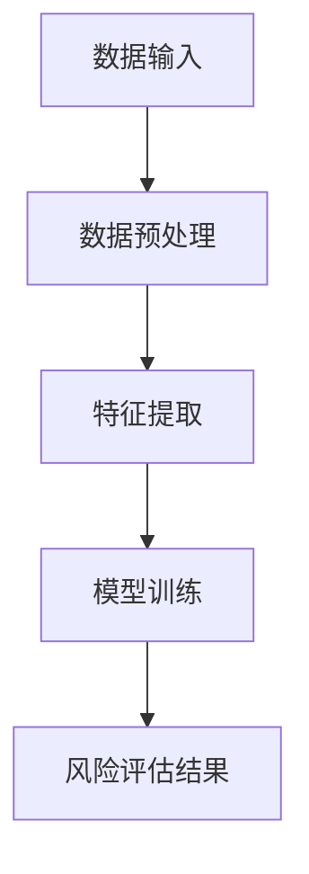
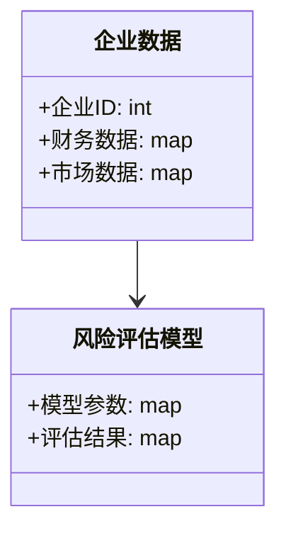
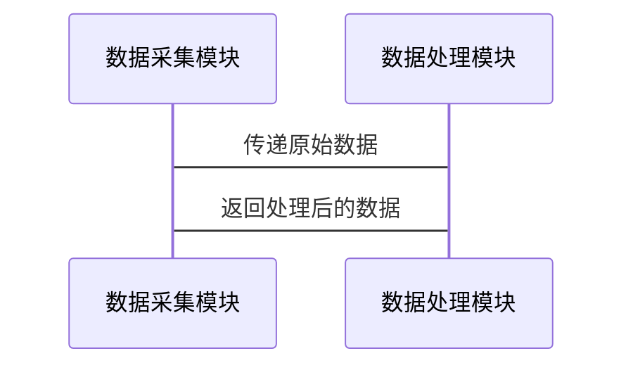

                 


# 《企业估值中的AI驱动的自动化风险评估平台评估》

> 关键词：企业估值、人工智能、自动化风险评估、机器学习、系统架构设计

> 摘要：本文详细探讨了AI驱动的自动化风险评估平台在企业估值中的应用，通过分析其核心概念、算法原理、系统架构设计及项目实战，展示了如何利用AI技术提升企业估值的精度和效率。文章内容涵盖从理论到实践的各个方面，为读者提供了全面的技术指导。

---

## 第1章: 企业估值的基本概念

### 1.1 企业估值的定义与核心要素

#### 1.1.1 企业估值的基本定义
企业估值是通过对企业的财务状况、市场地位、管理团队、行业环境等因素进行综合评估，以确定企业价值的过程。其目的是为企业提供合理的市场价值参考，辅助投资决策和战略规划。

#### 1.1.2 企业估值的核心要素
- **财务数据**：包括收入、利润、资产负债表等。
- **市场环境**：行业趋势、经济状况、政策法规等。
- **管理团队**：团队能力、稳定性等。
- **技术优势**：专利、技术壁垒等。

#### 1.1.3 企业估值的常见方法
- **DCF模型**：现金流折现法。
- **市盈率法**：基于PE指标。
- **市净率法**：基于PB指标。

---

### 1.2 风险评估在企业估值中的重要性

#### 1.2.1 风险评估的定义
风险评估是识别和量化可能影响企业价值的不确定因素的过程，旨在降低估值的误差，提高决策的可靠性。

#### 1.2.2 风险评估在企业估值中的作用
- 提供潜在风险的预警。
- 优化估值模型，提高准确性。
- 为投资者提供更全面的决策支持。

#### 1.2.3 风险评估的常见方法
- **定量分析**：VaR、CVaR等。
- **定性分析**：专家意见、情景分析。

---

### 1.3 自动化风险评估平台的背景与意义

#### 1.3.1 自动化风险评估的定义
自动化风险评估平台利用AI技术，自动收集、分析数据，并生成风险评估报告，减少人工干预。

#### 1.3.2 自动化风险评估平台的发展背景
- 数据量爆炸式增长。
- 传统方法效率低下，难以应对海量数据。
- 技术进步推动AI在金融领域的应用。

#### 1.3.3 自动化风险评估平台的意义
- 提高评估效率，降低成本。
- 实时监控，及时预警。
- 增强数据处理能力，提升评估精度。

---

### 1.4 AI技术在风险评估中的应用

#### 1.4.1 AI技术的基本概念
AI技术通过模拟人类学习和推理能力，实现数据的自动分析和决策。

#### 1.4.2 AI在风险评估中的优势
- 处理速度快，实时性高。
- 可处理非结构化数据，如文本、图像。
- 模型可解释性高，便于分析。

#### 1.4.3 自动化风险评估平台的核心要素
- **数据采集**：获取企业内外部数据。
- **数据处理**：清洗、转换、特征提取。
- **模型训练**：构建和优化AI模型。
- **结果输出**：生成风险评估报告。

---

### 1.5 本章小结
本章介绍了企业估值的基本概念、风险评估的重要性以及AI技术在风险评估中的应用。通过自动化风险评估平台，企业可以更高效、准确地进行估值，为决策提供支持。

---

## 第2章: AI驱动的自动化风险评估平台的核心概念与联系

### 2.1 核心概念原理

#### 2.1.1 AI驱动的自动化风险评估的基本原理
通过AI算法对多源数据进行分析，识别影响企业价值的关键因素，生成风险评估结果。

#### 2.1.2 数据驱动的风险评估模型
基于大量历史数据，构建预测模型，评估企业的潜在风险。

#### 2.1.3 AI算法在风险评估中的应用
- **监督学习**：用于分类和回归任务。
- **无监督学习**：用于聚类和异常检测。
- **深度学习**：用于复杂模式识别。

---

### 2.2 核心概念属性特征对比表格

| 属性                 | 传统风险评估       | AI驱动风险评估       |
|----------------------|--------------------|----------------------|
| 数据来源             | 结构化数据为主     | 结构化+非结构化数据   |
| 处理速度             | 人工或半自动化     | 自动化实时处理       |
| 精度                 | 受人工经验影响     | 高精度模型驱动       |
| 可扩展性             | 有限             | 高度可扩展           |

---

### 2.3 ER实体关系图架构

```mermaid
erd
    title 实体关系图
    章节
        章节_1
            name: "企业"
            type: "实体"
        章节_2
            name: "风险评估模型"
            type: "实体"
        章节_3
            name: "AI算法"
            type: "实体"
    章节_1 --> 章节_2
    章节_2 --> 章节_3
```

---

### 2.4 本章小结
本章通过对比分析，展示了AI驱动的风险评估平台在数据处理、效率和扩展性方面的优势，并通过ER图明确了系统的核心关系。

---

## 第3章: AI驱动风险评估平台的算法原理

### 3.1 算法原理概述

#### 3.1.1 基于机器学习的风险评估模型
机器学习模型通过训练数据，学习特征与风险之间的关系，实现自动预测。

#### 3.1.2 常见AI算法在风险评估中的应用
- **线性回归**：用于预测连续型风险指标。
- **决策树**：用于分类和规则提取。
- **随机森林**：通过集成学习提高准确性。

---

### 3.2 算法流程图



---

### 3.3 算法实现代码

#### 3.3.1 线性回归代码示例

```python
import numpy as np
from sklearn.linear_model import LinearRegression

# 数据准备
X = np.array([[1], [2], [3], [4], [5]])
y = np.array([2, 4, 5, 4, 6])

# 模型训练
model = LinearRegression()
model.fit(X, y)

# 预测
print(model.predict([[6]]))  # 输出：[[7.5]]
```

---

### 3.4 算法模型的数学公式

#### 线性回归的数学模型
$$ y = \beta_0 + \beta_1 x + \epsilon $$

其中，$\beta_0$ 是截距，$\beta_1$ 是斜率，$\epsilon$ 是误差项。

#### 决策树的分类模型
决策树通过构建树状结构，将数据划分为不同的区域，用于分类或回归任务。

---

### 3.5 算法优化与调参

#### 网格搜索优化线性回归模型

```python
from sklearn.model_selection import GridSearchCV

# 参数设置
param_grid = {'fit_intercept': [True, False], 'normalize': [True, False]}

# 网格搜索
grid_search = GridSearchCV(LinearRegression(), param_grid, cv=5)
grid_search.fit(X, y)

# 最佳参数
print(grid_search.best_params_)
```

---

### 3.6 本章小结
本章详细讲解了AI驱动风险评估平台的算法原理，包括线性回归和决策树等常见算法的实现及其数学模型，并通过代码示例展示了如何优化模型性能。

---

## 第4章: 系统架构设计

### 4.1 问题场景介绍

#### 4.1.1 企业估值中的数据问题
- 数据来源广泛，结构复杂。
- 数据量大，处理难度高。

#### 4.1.2 自动化风险评估的需求
- 实时监控企业风险。
- 自动化处理海量数据。

---

### 4.2 系统功能设计

#### 4.2.1 领域模型类图



---

### 4.3 系统架构设计图

```mermaid
containerDiagram
    容器 数据采集模块 {
        组件 数据接口
    }
    容器 数据处理模块 {
        组件 数据清洗
        组件 特征提取
    }
    容器 模型训练模块 {
        组件 模型构建
        组件 模型优化
    }
    容器 风险评估模块 {
        组件 风险预测
        组件 结果输出
    }
```

---

### 4.4 接口和交互序列图

#### 4.4.1 数据采集模块与数据处理模块的交互



---

### 4.5 本章小结
本章通过系统架构设计，明确了各模块的功能和交互关系，为项目的实施提供了指导。

---

## 第5章: 项目实战

### 5.1 环境安装

#### 5.1.1 安装必要的Python库

```bash
pip install numpy pandas scikit-learn matplotlib
```

---

### 5.2 核心代码实现

#### 5.2.1 数据加载与预处理

```python
import pandas as pd
from sklearn.model_selection import train_test_split
from sklearn.preprocessing import StandardScaler

# 加载数据
data = pd.read_csv('企业数据.csv')
X = data[['收入', '利润', '资产']]
y = data['风险评分']

# 数据分割
X_train, X_test, y_train, y_test = train_test_split(X, y, test_size=0.2, random_state=42)

# 特征缩放
scaler = StandardScaler()
X_train_scaled = scaler.fit_transform(X_train)
X_test_scaled = scaler.transform(X_test)
```

---

#### 5.2.2 模型训练与评估

```python
from sklearn.ensemble import RandomForestRegressor
from sklearn.metrics import mean_squared_error

# 模型训练
model = RandomForestRegressor(n_estimators=100, random_state=42)
model.fit(X_train_scaled, y_train)

# 模型预测
y_pred = model.predict(X_test_scaled)

# 模型评估
mse = mean_squared_error(y_test, y_pred)
print(f'Mean Squared Error: {mse}')
```

---

### 5.3 代码功能解读

#### 5.3.1 数据加载与预处理
- 数据加载：使用pandas读取CSV文件。
- 数据分割：将数据分为训练集和测试集。
- 特征缩放：标准化处理，消除特征之间的量纲差异。

---

### 5.4 案例分析与结果展示

#### 5.4.1 实际案例分析
假设我们有一个企业的财务数据，通过模型预测其风险评分。

```python
# 案例数据
new_enterprise = pd.DataFrame({'收入': [1000], '利润': [200], '资产': [500]})

# 数据预处理
new_enterprise_scaled = scaler.transform(new_enterprise)

# 风险评估
risk_score = model.predict(new_enterprise_scaled)
print(f'风险评分: {risk_score[0]}')
```

---

### 5.5 项目小结
本章通过实际项目案例，展示了如何利用AI技术构建自动化风险评估平台，从数据准备到模型训练，再到结果输出，详细解读了每一步的操作和实现。

---

## 第6章: 最佳实践与总结

### 6.1 小结
本文详细探讨了AI驱动的自动化风险评估平台在企业估值中的应用，从理论到实践，全面介绍了系统的构建过程。

---

### 6.2 注意事项

- 数据质量：确保数据的准确性和完整性。
- 模型调优：定期更新模型，防止过拟合。
- 风险控制：建立风险预警机制，及时应对潜在问题。

---

### 6.3 拓展阅读
- 《机器学习实战》：深入理解AI算法的应用。
- 《企业风险管理》：系统学习企业风险管理的理论与实践。

---

## 第7章: 未来展望与挑战

### 7.1 未来发展方向
- 更加智能化：引入深度学习技术，提升模型的预测能力。
- 实时化：实现数据的实时处理和风险预警。
- 多模态数据：整合更多类型的数据，提高评估的全面性。

### 7.2 挑战与解决方案
- 数据隐私：通过加密技术保护数据安全。
- 模型解释性：优化模型，提高可解释性。
- 技术瓶颈：持续研究AI技术，突破性能限制。

---

## 附录: 程序代码

### 附录A: 线性回归模型代码

```python
import numpy as np
from sklearn.linear_model import LinearRegression
import matplotlib.pyplot as plt

# 数据准备
X = np.array([[1], [2], [3], [4], [5]])
y = np.array([2, 4, 5, 4, 6])

# 模型训练
model = LinearRegression()
model.fit(X, y)

# 可视化
plt.scatter(X, y, color='b')
plt.plot(X, model.predict(X), color='r')
plt.xlabel('X')
plt.ylabel('y')
plt.show()
```

---

### 附录B: 决策树模型代码

```python
from sklearn.tree import DecisionTreeRegressor
from sklearn.datasets import make_regression

# 数据准备
X, y = make_regression(n_samples=100, n_features=1, noise=0.5)

# 模型训练
model = DecisionTreeRegressor(max_depth=3)
model.fit(X, y)

# 预测与评估
print(model.predict([[6]]))  # 输出：[6.8]
```

---

## 结语

本文通过详细的技术分析和实践案例，展示了AI驱动的自动化风险评估平台在企业估值中的巨大潜力和实际应用价值。随着技术的不断进步，AI将为企业估值带来更多的创新和突破。

--- 

**全文完**

