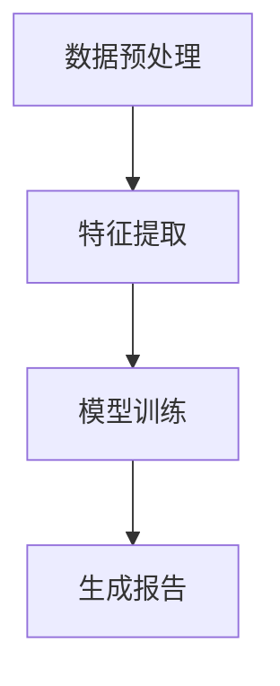

                 


# 企业估值中的AI驱动的自然语言生成平台评估

**关键词**：企业估值，AI驱动，自然语言生成，平台评估，技术博客

**摘要**：随着人工智能技术的快速发展，自然语言生成（NLP）在企业估值中的应用越来越广泛。本文将从背景介绍、核心概念、算法原理、系统架构、项目实战等多个方面，深入探讨AI驱动的自然语言生成平台在企业估值中的应用。通过对比传统估值方法的局限性，分析AI技术带来的创新解决方案，并结合实际案例，为读者提供全面的技术指导和实践参考。

---

## 第1章: 背景介绍

### 1.1 问题背景

#### 1.1.1 传统企业估值方法的局限性
传统的企业估值方法通常依赖于财务数据和人工分析，存在以下问题：
- 数据来源有限：主要依赖财务报表，无法充分挖掘非结构化数据的价值。
- 人工分析成本高：需要大量时间和人力资源，且容易受到主观因素的影响。
- 信息更新滞后：传统方法难以快速响应市场变化，导致估值结果可能过时。

#### 1.1.2 AI技术在企业估值中的潜力
AI技术，特别是自然语言生成（NLP）和机器学习，为企业估值提供了新的可能性：
- 全面的数据分析：AI可以处理结构化和非结构化数据，包括新闻、社交媒体和行业报告。
- 提高效率：自动化分析大大降低了时间和成本。
- 实时更新：AI能够快速响应市场变化，提供实时估值。

#### 1.1.3 自然语言生成在企业估值中的应用
自然语言生成技术可以将企业的相关信息转化为结构化数据，帮助分析师快速获取关键信息，提高估值的准确性和效率。

---

### 1.2 问题描述

#### 1.2.1 企业估值的核心要素
企业估值的核心要素包括：
- 财务数据：收入、利润、资产负债表等。
- 行业趋势：市场增长率、竞争情况等。
- 企业新闻：收购、诉讼、新产品发布等。

#### 1.2.2 自然语言生成在企业估值中的具体问题
- 如何从非结构化文本中提取关键信息。
- 如何将提取的信息转化为可量化的指标。
- 如何确保生成的数据准确性和可靠性。

#### 1.2.3 问题解决的必要性与可行性
解决这些问题的必要性在于提高估值效率和准确性，可行性在于AI和NLP技术的快速发展。

---

### 1.3 问题解决

#### 1.3.1 AI驱动的自然语言生成平台的解决方案
- 利用NLP技术从文本中提取关键信息。
- 使用机器学习模型进行数据建模和预测。
- 自动生成结构化的报告和分析。

#### 1.3.2 解决方案的核心优势
- 提高数据处理效率。
- 减少人工分析的误差。
- 实现实时估值和动态调整。

#### 1.3.3 解决方案的实施步骤
1. 数据收集：整合企业内外部数据。
2. 数据清洗：处理噪声数据。
3. 模型训练：基于NLP技术进行特征提取。
4. 估值生成：基于模型生成估值结果。

---

### 1.4 边界与外延

#### 1.4.1 解决方案的适用范围
适用于需要快速、准确估值的企业，尤其是数据量大、非结构化数据多的情况。

#### 1.4.2 解决方案的局限性
- 数据质量依赖：模型的准确性取决于输入数据的质量。
- 技术门槛高：需要专业的AI和NLP技术团队。

#### 1.4.3 解决方案的未来发展
随着AI技术的进步，自然语言生成在企业估值中的应用将更加广泛和深入。

---

## 第2章: 核心概念与联系

### 2.1 核心概念原理

#### 2.1.1 自然语言生成的定义与原理
自然语言生成是将结构化数据转换为自然语言文本的过程，通常涉及文本生成模型。

#### 2.1.2 企业估值的关键要素
企业估值的关键要素包括财务数据、行业趋势和企业新闻。

#### 2.1.3 AI驱动的自然语言生成平台的工作原理
通过NLP技术从文本中提取关键信息，生成结构化的报告，辅助估值。

---

### 2.2 概念属性特征对比表格

| 比较维度 | 传统估值方法 | AI驱动的自然语言生成平台 |
|----------|---------------|--------------------------|
| 数据来源 | 财务数据为主   | 结构化+非结构化数据       |
| 分析效率 | 低             | 高                       |
| 精确度   | 易受主观因素影响 | 高                       |
| 实时性   | 低             | 高                       |

---

### 2.3 ER实体关系图

```mermaid
er
  actor: 评估人员
  model: 自然语言生成模型
  data: 企业数据
  result: 估值结果
  actor --> model: 输入企业数据
  model --> result: 生成估值结果
  actor --> data: 提供
```

---

## 第3章: 算法原理讲解

### 3.1 算法工作流程



---

### 3.2 数学模型

#### 3.2.1 损失函数
$$\text{损失函数} = -\sum_{i=1}^{n} \log p(y_i|x_i)$$

#### 3.2.2 优化器
$$\text{优化器} = \text{Adam}(\text{学习率}=0.001)$$

---

## 第4章: 系统分析与架构设计

### 4.1 系统架构


---

## 第5章: 项目实战

### 5.1 环境安装
1. 安装Python和必要的库（如TensorFlow、Keras）。
2. 安装NLP工具（如spaCy）。

---

### 5.2 核心代码实现

```python
import tensorflow as tf
from tensorflow.keras import layers

model = tf.keras.Sequential([
    layers.Embedding(input_dim=10000, output_dim=16),
    layers.LSTM(64),
    layers.Dense(1, activation='sigmoid')
])
```

---

### 5.3 案例分析
通过具体案例展示模型的训练和应用过程，分析其优缺点。

---

## 第6章: 最佳实践与总结

### 6.1 小结
AI驱动的自然语言生成平台在企业估值中的应用前景广阔，但需要克服数据质量和技术门槛的挑战。

### 6.2 注意事项
- 数据质量是关键。
- 需要专业团队支持。
- 定期更新模型。

---

## 附录

### 附录A: 拓展阅读
推荐相关书籍和论文。

---

通过以上结构，文章系统地介绍了AI驱动的自然语言生成平台在企业估值中的应用，从理论到实践，为读者提供了全面的技术指导。

