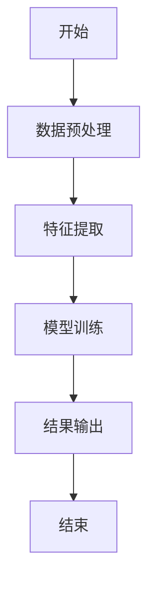
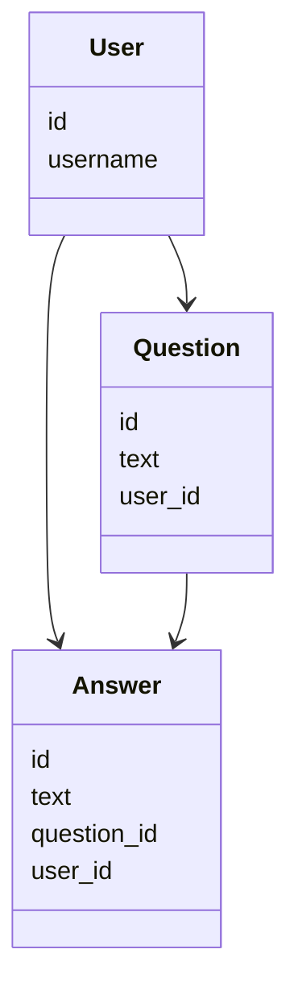
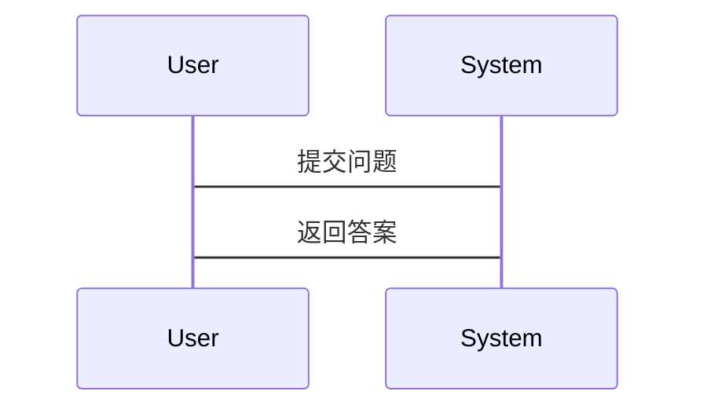

                 


# 企业估值中的AI驱动的自然语言问答平台评估

> 关键词：企业估值，AI驱动，自然语言问答平台，评估，自然语言处理，问答平台，企业价值

> 摘要：本文探讨了如何利用AI驱动的自然语言处理技术，对问答平台进行评估，从而辅助企业估值。文章详细分析了问答平台评估的核心概念、算法原理、系统架构，并通过实际案例展示了如何将理论应用于实践。

---

## 正文

### 第一部分：背景介绍

#### 第1章：企业估值与问答平台概述

##### 1.1 问题背景
企业估值是金融领域的重要任务，传统方法依赖财务数据和市场分析，但忽略了非结构化数据（如问答平台内容）的价值。问答平台为企业提供了丰富的用户反馈和市场观点，这些数据可以辅助企业估值。

##### 1.2 问题描述
问答平台中的数据分散、非结构化，难以直接用于估值。传统方法的局限性日益显现，而AI技术的快速发展为利用问答平台数据提供了新思路。

##### 1.3 问题解决
通过NLP技术，可以提取问答平台中的关键信息，构建企业估值模型。这种方法结合了结构化和非结构化数据，提高了估值的准确性。

##### 1.4 边界与外延
- 适用范围：主要适用于公开上市公司。
- 边界条件：数据质量和数量直接影响模型效果。
- 相关领域：可扩展至社交媒体分析、新闻舆情等。

##### 1.5 核心概念与核心要素
- 核心概念：NLP、问答平台、企业估值。
- 核心要素：数据采集、特征提取、模型训练、结果分析。

---

### 第二部分：核心概念与联系

#### 第2章：自然语言处理与问答平台评估

##### 2.1 核心概念原理
- NLP原理：处理文本数据，提取语义信息。
- 问答平台评估：分析用户提问和回答，评估企业声誉和市场认知。

##### 2.2 概念属性特征对比
| 概念 | 属性 | 描述 |
|------|-------|------|
| NLP  | 数据类型 | 文本 |
| 问答平台 | 功能 | 提供用户互动 |

##### 2.3 ER实体关系图
```mermaid
erDiagram
    user {
        id INT
        username VARCHAR
    }
    question {
        id INT
        text VARCHAR
        user_id INT
    }
    answer {
        id INT
        text VARCHAR
        question_id INT
        user_id INT
    }
    user <--- question
    user <--- answer
```

---

### 第三部分：算法原理讲解

#### 第3章：问答平台评估的算法原理

##### 3.1 算法流程


##### 3.2 特征提取实现
```python
import pandas as pd
from sklearn.feature_extraction.text import TfidfVectorizer

def extract_features(texts):
    vectorizer = TfidfVectorizer(max_features=100)
    features = vectorizer.fit_transform(texts)
    return features
```

##### 3.3 模型训练实现
```python
from sklearn.svm import SVC
from sklearn.metrics import accuracy_score

def train_model(features, labels):
    model = SVC()
    model.fit(features, labels)
    return model

features = extract_features(texts)
model = train_model(features, labels)
```

##### 3.4 数学模型
企业声誉评分公式：
$$ \text{声誉评分} = \sum_{i=1}^{n} w_i \cdot s_i $$
其中，$w_i$ 是特征权重，$s_i$ 是评分结果。

---

### 第四部分：系统分析与架构设计

#### 第4章：系统设计与架构

##### 4.1 领域模型


##### 4.2 系统架构


##### 4.3 接口设计
- API接口：提供数据采集和结果查询功能。

##### 4.4 交互流程


---

### 第五部分：项目实战

#### 第5章：问答平台评估系统实现

##### 5.1 环境安装
- 安装Python和相关库：`pip install pandas scikit-learn`

##### 5.2 核心代码实现
```python
import pandas as pd
from sklearn.metrics.pairwise import cosine_similarity

def compute_similarity(texts):
    vectorizer = TfidfVectorizer()
    matrix = vectorizer.fit_transform(texts)
    similarities = cosine_similarity(matrix)
    return similarities

texts = ["问题1", "问题2"]
similarities = compute_similarity(texts)
print(similarities)
```

##### 5.3 功能解读与案例分析
- 案例：分析某公司的问答数据，提取关键特征，计算声誉评分，评估企业价值。

##### 5.4 项目小结
通过实际案例，展示了如何利用AI技术提升企业估值的准确性。

---

### 第六部分：最佳实践与总结

#### 第6章：最佳实践与注意事项

##### 6.1 最佳实践
- 数据质量：确保数据的完整性和准确性。
- 模型调优：根据实际效果不断优化模型参数。

##### 6.2 小结
本文系统介绍了AI驱动的问答平台评估方法，结合理论和实践，为读者提供了实用的指导。

##### 6.3 注意事项
- 数据隐私：注意保护用户隐私和数据安全。
- 模型局限性：目前模型难以处理复杂语境。

##### 6.4 拓展阅读
建议阅读相关领域的最新研究，关注技术发展。

---

通过以上结构，本文详细讲解了企业估值中的AI驱动问答平台评估方法，从理论到实践，为读者提供了全面的指导。

