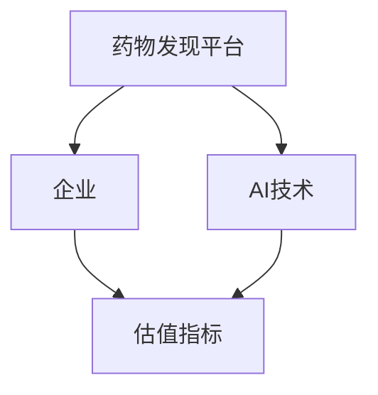
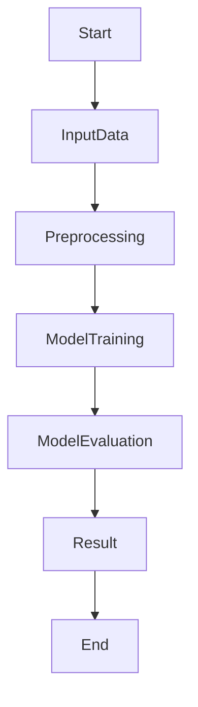

                 


# 《企业估值中的AI驱动的药物发现平台评估》

> 关键词：AI药物发现，企业估值，技术评估，机器学习，深度学习，药物开发

> 摘要：本文探讨AI技术在药物发现中的应用及其对企业估值的影响。通过分析AI驱动的药物发现平台的算法原理、系统架构和实际案例，揭示AI如何提升药物开发效率和企业价值评估。

---

# 第1章: 背景介绍

## 1.1 问题背景

### 1.1.1 药物发现的挑战与现状
药物发现是一个耗时长、成本高的过程，传统方法依赖大量的实验室实验，导致效率低下。AI技术的引入为这一领域带来了革命性的变化，通过数据分析和模型预测，显著提高了药物开发的效率。

### 1.1.2 传统药物发现的局限性
传统药物发现过程繁琐，耗时长，且成本高昂。研究人员需要进行大量的实验，试错成本极高。此外，传统方法难以处理海量数据，限制了药物发现的创新速度。

### 1.1.3 AI技术在药物发现中的潜力
AI技术能够处理海量数据，发现隐藏的模式和关系，从而加速药物发现过程。通过机器学习和深度学习算法，AI可以在分子设计、化合物筛选等方面提供支持，提高药物开发的效率和成功率。

## 1.2 问题描述

### 1.2.1 药物发现平台评估的核心问题
评估一个AI驱动的药物发现平台需要考虑其算法性能、数据处理能力以及实际应用效果。这些问题直接影响平台的效率和企业的投资回报。

### 1.2.2 企业估值与药物发现平台的关系
AI驱动的药物发现平台能够提高药物开发的效率和成功率，从而影响企业的估值。有效的平台可以降低开发成本，缩短时间，提升企业的市场竞争力。

### 1.2.3 AI驱动的药物发现平台的独特优势
AI技术能够快速分析大量数据，识别潜在的药物分子，优化化合物结构，从而提高药物开发的成功率。这些优势使得AI驱动的平台在企业估值中具有重要地位。

## 1.3 问题解决

### 1.3.1 AI技术如何提升药物发现效率
AI技术可以通过数据挖掘和预测模型，快速筛选潜在的药物分子，减少实验次数，降低开发成本。此外，AI还可以优化化合物结构，提高药物的疗效和安全性。

### 1.3.2 数据驱动的药物发现平台评估方法
通过收集和分析药物发现过程中的数据，可以评估平台的性能。关键指标包括预测准确率、化合物筛选效率等，这些指标能够量化平台的效果。

### 1.3.3 企业估值中的关键指标
企业估值的关键指标包括研发投入、开发周期、成功概率等。AI驱动的平台可以通过提高这些指标，间接影响企业的整体估值。

## 1.4 边界与外延

### 1.4.1 药物发现平台的边界
药物发现平台的边界包括输入数据的范围、模型的适用性以及输出结果的准确性。这些边界决定了平台的应用范围和效果。

### 1.4.2 企业估值的外延
企业估值的外延包括企业的市场潜力、技术领先性、财务状况等。AI驱动的药物发现平台作为企业技术实力的一部分，直接影响企业的估值。

### 1.4.3 AI技术在药物发现中的应用范围
AI技术不仅应用于药物分子设计，还可以用于疾病机制研究、临床试验设计等领域，进一步扩大其在药物发现中的应用范围。

## 1.5 概念结构与核心要素

### 1.5.1 药物发现平台的构成要素
药物发现平台包括数据输入、模型构建、结果输出等关键部分。每个部分都依赖于AI算法和数据处理能力。

### 1.5.2 企业估值的关键指标
企业估值的关键指标包括研发投入、开发周期、成功概率等。这些指标量化了AI平台对企业发展的影响。

### 1.5.3 AI技术的核心要素
AI技术的核心要素包括算法选择、数据处理能力、模型优化等。这些要素共同决定了平台的性能和效果。

---

# 第2章: 核心概念与联系

## 2.1 核心概念原理

### 2.1.1 药物发现平台的原理
药物发现平台通过AI算法分析数据，识别潜在的药物分子，优化化合物结构，提高药物开发效率。

### 2.1.2 企业估值的原理
企业估值基于财务状况、市场潜力、技术实力等因素。AI驱动的平台作为技术实力的一部分，直接影响企业估值。

### 2.1.3 AI技术的核心原理
AI技术利用机器学习和深度学习算法，从数据中提取特征，构建预测模型，辅助药物发现和企业估值。

## 2.2 概念属性特征对比

| 概念       | 属性特征                          |
|------------|-----------------------------------|
| 药物发现平台 | 数据驱动、模型预测、高效筛选      |
| 企业估值   | 财务指标、市场潜力、技术实力      |
| AI技术     | 数据处理、算法优化、预测准确率    |

## 2.3 ER实体关系图



---

# 第3章: 算法原理讲解

## 3.1 算法原理

### 3.1.1 机器学习算法
机器学习算法如支持向量机（SVM）和随机森林（RF）常用于分类和回归问题，帮助预测药物分子的活性和毒性。

### 3.1.2 深度学习算法
深度学习算法如卷积神经网络（CNN）和循环神经网络（RNN）用于处理复杂的数据结构，如图像和序列数据。

### 3.1.3 其他AI算法
包括聚类分析、降维技术等，用于数据处理和特征提取。

## 3.2 算法流程图



## 3.3 Python源代码实现

```python
import numpy as np
from sklearn.model_selection import train_test_split

def preprocess_data(data):
    # 数据预处理代码
    pass

def train_model(X, y):
    # 模型训练代码
    pass

def evaluate_model(model, X_test, y_test):
    # 模型评估代码
    pass

# 示例代码
data = np.array([...])
X_train, X_test, y_train, y_test = train_test_split(data, ...)

model = train_model(X_train, y_train)
evaluate_model(model, X_test, y_test)
```

---

# 第4章: 数学公式解析

## 4.1 机器学习模型的损失函数

$$ L(y, \hat{y}) = \frac{1}{n}\sum_{i=1}^{n}(y_i - \hat{y}_i)^2 $$

## 4.2 深度学习中的激活函数

$$ \text{ReLU}(x) = \max(0, x) $$

---

通过以上章节的详细分析，我们可以看到AI技术在药物发现中的重要性，以及其对企业估值的深远影响。从背景介绍到算法实现，再到实际案例分析，本文为读者提供了全面的视角，帮助理解如何利用AI驱动的药物发现平台提升企业价值。

