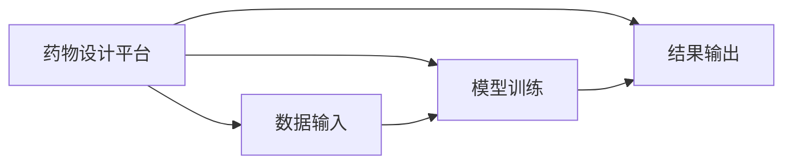

                 


# 《企业估值中的AI驱动的药物设计平台评估》

> 关键词：AI驱动的药物设计平台、企业估值、药物设计、AI技术、平台评估、药物研发、价值评估

> 摘要：本文系统地探讨了AI驱动的药物设计平台在企业估值中的应用，详细分析了AI技术如何改变药物设计的流程，介绍了药物设计平台评估的核心概念和方法，结合实际案例分析了AI在药物设计中的优势与挑战，为企业在估值过程中提供了科学的评估框架和实践指导。

---

## 目录大纲

### 第1章 AI在药物设计中的作用

#### 1.1 AI技术在药物设计中的应用现状
- 1.1.1 药物设计的传统方法与挑战
  - 传统药物设计的流程和局限性
  - 药物研发的高成本与长周期问题
- 1.1.2 AI技术如何改变药物设计
  - AI技术在药物设计中的具体应用场景
  - AI如何提高药物研发的效率和成功率
- 1.1.3 AI驱动药物设计的优势与局限性
  - 优势：数据处理能力、模型优化、加速研发
  - 局限性：数据质量、模型泛化能力、监管要求

#### 1.2 药物设计平台的基本概念
- 1.2.1 药物设计平台的定义
  - 平台的定义和核心功能
- 1.2.2 药物设计平台的核心功能
  - 数据分析、模型构建、药物优化等
- 1.2.3 药物设计平台的分类
  - 按功能分类：数据分析型、模拟优化型、综合型
  - 按应用场景分类：小分子药物、抗体药物等

#### 1.3 企业估值中的药物设计平台评估
- 1.3.1 企业估值的基本概念
  - 企业估值的定义和方法
- 1.3.2 药物设计平台在企业估值中的作用
  - 药物设计平台对企业竞争力的影响
- 1.3.3 评估药物设计平台对企业价值的影响
  - 平台的技术能力、经济价值和市场竞争力对企业估值的影响

#### 1.4 本章小结
- 总结本章内容，强调AI技术在药物设计中的重要性及其对企业估值的影响

### 第2章 药物设计平台评估的背景与目标

#### 2.1 药物设计平台评估的背景
- 2.1.1 药物研发的高成本与长周期
  - 药物研发的高投入和长周期对企业的影响
- 2.1.2 AI技术在药物设计中的潜力
  - AI技术如何降低药物研发的成本和时间
- 2.1.3 企业估值中的药物设计平台评估需求
  - 企业为什么要评估药物设计平台的价值

#### 2.2 药物设计平台评估的目标
- 2.2.1 评估药物设计平台的技术能力
  - 评估平台的准确性、计算效率等技术指标
- 2.2.2 评估药物设计平台的经济价值
  - 平台对企业收益的贡献
- 2.2.3 评估药物设计平台的市场竞争力
  - 平台在市场中的竞争力和潜在价值

#### 2.3 药物设计平台评估的边界与外延
- 2.3.1 评估范围的界定
  - 明确评估的范围和边界
- 2.3.2 评估与相关领域的联系
  - 如何与其他技术领域（如生物技术）结合
- 2.3.3 评估的局限性与挑战
  - 数据不足、模型局限性等

#### 2.4 本章小结
- 回顾本章内容，强调评估背景和目标的重要性

### 第3章 药物设计平台评估的核心概念

#### 3.1 药物设计平台的评估指标
- 3.1.1 技术指标
  - 平台的准确性、计算效率、可扩展性等
- 3.1.2 经济指标
  - 平台对企业收益的贡献
- 3.1.3 市场指标
  - 平台的市场占有率、竞争对手分析等

#### 3.2 药物设计平台评估的核心要素
- 3.2.1 数据质量
  - 数据的完整性、准确性、代表性
- 3.2.2 模型准确性
  - 模型的预测能力、鲁棒性
- 3.2.3 平台可扩展性
  - 平台的扩展能力和灵活性

#### 3.3 药物设计平台评估的实体关系图


#### 3.4 本章小结
- 总结本章内容，强调核心概念的重要性

### 第4章 药物设计平台评估的算法原理

#### 4.1 机器学习在药物设计中的应用
- 4.1.1 机器学习的基本原理
  - 机器学习的定义、分类和基本流程
- 4.1.2 在药物设计中的应用
  - 药物分子生成、活性预测、优化等
- 4.1.3 算法流程图


#### 4.2 深度学习模型在药物设计中的应用
- 4.2.1 深度学习的基本原理
  - 神经网络、卷积神经网络、循环神经网络等
- 4.2.2 在药物设计中的应用
  - 药物分子生成、虚拟筛选、毒性预测等
- 4.2.3 模型实现代码示例
```python
# 示例代码：使用神经网络进行药物分子生成
import numpy as np
import tensorflow as tf

model = tf.keras.Sequential([
    tf.keras.layers.Dense(64, activation='relu', input_shape=(n_features,)),
    tf.keras.layers.Dense(1, activation='sigmoid')
])

model.compile(optimizer='adam', loss='binary_crossentropy', metrics=['accuracy'])
model.fit(X_train, y_train, epochs=10, batch_size=32)
```

#### 4.3 数学模型与公式
- 4.3.1 机器学习模型的数学表达
  - 如线性回归模型：$$y = \beta_0 + \beta_1x + \epsilon$$
- 4.3.2 深度学习模型的数学表达
  - 如卷积神经网络的卷积层：$$f(x) = \max(0, x + b)$$

#### 4.4 本章小结
- 总结本章内容，强调算法原理在药物设计平台评估中的重要性

### 第5章 药物设计平台评估的系统架构设计

#### 5.1 系统功能设计
- 5.1.1 功能模块划分
  - 数据输入、模型训练、结果输出等
- 5.1.2 功能流程图


#### 5.2 系统架构设计
- 5.2.1 分层架构设计
  - 数据层、计算层、应用层
- 5.2.2 系统架构图


#### 5.3 系统接口设计
- 5.3.1 接口定义
  - 数据接口、模型接口、结果接口
- 5.3.2 接口交互流程图


#### 5.4 系统交互设计
- 5.4.1 交互流程
  - 用户输入、系统处理、结果反馈
- 5.4.2 交互序列图


#### 5.5 本章小结
- 总结本章内容，强调系统架构设计的重要性

### 第6章 药物设计平台评估的项目实战

#### 6.1 项目背景
- 6.1.1 项目需求
  - 某公司药物设计平台的评估需求
- 6.1.2 项目目标
  - 评估平台的技术能力和经济价值

#### 6.2 项目实施
- 6.2.1 环境安装
  - 安装必要的软件和库（如Python、TensorFlow、Keras等）
- 6.2.2 核心代码实现
  - 数据预处理、模型训练、结果分析等
```python
# 示例代码：数据预处理
import pandas as pd
data = pd.read_csv('data.csv')
X = data.drop('label', axis=1)
y = data['label']
```

#### 6.3 项目结果分析
- 6.3.1 结果展示
  - 模型的准确率、召回率等指标
- 6.3.2 结果解读
  - 评估平台的技术能力和市场竞争力

#### 6.4 项目小结
- 总结项目实施过程中的经验与教训

### 第7章 总结与展望

#### 7.1 本章总结
- 总结全文内容，强调AI技术在药物设计平台评估中的重要性

#### 7.2 未来展望
- 展望AI技术在药物设计中的未来发展
- 提出未来的研究方向和改进措施

#### 7.3 最佳实践 tips
- 给出在企业估值中使用AI驱动的药物设计平台的实践建议
- 强调数据质量和模型选择的重要性

#### 7.4 注意事项
- 提醒企业在评估过程中需要注意的问题
- 如数据隐私、模型泛化能力等

#### 7.5 拓展阅读
- 推荐相关领域的书籍和论文
- 提供进一步学习的资源

### 参考文献
- 列出书中引用的主要文献和资源

### 附录
- 提供额外的代码示例或数据表格
- 附上相关工具的安装和使用指南

---

以上是《企业估值中的AI驱动的药物设计平台评估》的详细目录大纲，涵盖了从基础概念到实际应用的各个方面，结构清晰，内容详实，适合企业估值人员、药物研发人员以及AI技术从业者阅读。

