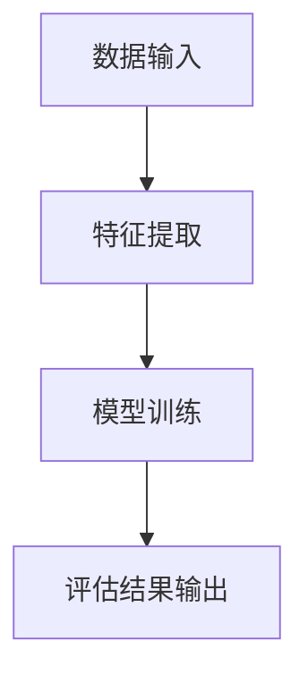

                 


# 企业估值中的AI驱动的虚拟员工系统评估

## 关键词：企业估值，AI驱动，虚拟员工系统，评估模型，算法原理

## 摘要：本文将详细探讨AI驱动的虚拟员工系统在企业估值中的应用。通过分析虚拟员工系统的核心概念、算法原理、系统架构设计以及实际项目案例，本文将揭示如何利用AI技术提升企业估值的准确性和效率。从背景介绍到系统实现，再到最佳实践，本文将全面解析AI驱动的虚拟员工系统评估的各个方面。

---

# 第一部分: 虚拟员工系统与企业估值概述

## 第1章: 虚拟员工系统的基本概念

### 1.1 虚拟员工系统的定义与特点

#### 1.1.1 虚拟员工系统的定义
虚拟员工系统是一种基于人工智能技术的虚拟化员工管理系统，它通过模拟真实员工的工作流程和决策过程，为企业提供智能化的员工管理和评估服务。虚拟员工系统的核心在于利用AI算法对员工的工作效率、成本效益、服务质量等关键指标进行实时监控和评估。

#### 1.1.2 虚拟员工系统的核心特点
- **智能化**：虚拟员工系统通过机器学习算法，能够自主学习和优化员工评估模型。
- **实时性**：系统能够实时采集和分析员工的工作数据，提供即时反馈。
- **可扩展性**：虚拟员工系统可以根据企业的规模和需求进行灵活扩展。
- **数据驱动**：系统依赖于大量数据，通过数据分析提供精准的评估结果。

#### 1.1.3 虚拟员工系统与传统员工的区别
虚拟员工系统与传统员工的区别主要体现在以下几个方面：
- **存在形式**：虚拟员工是数字化的存在，而传统员工是实体化的人。
- **工作方式**：虚拟员工通过算法和数据进行工作，而传统员工通过手动操作。
- **效率**：虚拟员工系统的处理速度和准确性远高于传统员工。

### 1.2 AI驱动的虚拟员工系统在企业估值中的应用背景

#### 1.2.1 企业估值的传统方法与局限性
企业估值的传统方法主要包括市盈率法、市净率法、股权自由现金流折现法等。然而，这些方法往往依赖于人工分析和经验判断，存在以下局限性：
- **主观性**：传统方法的评估结果受评估者主观判断的影响较大。
- **低效率**：人工分析需要大量时间，难以满足现代企业快速评估的需求。
- **不准确性**：由于人为因素的干扰，评估结果可能存在偏差。

#### 1.2.2 AI技术在企业估值中的优势
AI技术的引入为企业估值带来了以下优势：
- **数据驱动**：AI系统能够处理海量数据，提供更加精准的评估结果。
- **高效性**：AI算法可以在短时间内完成复杂的分析任务。
- **客观性**：AI系统通过数学模型进行分析，减少了人为因素的干扰。

#### 1.2.3 虚拟员工系统在企业估值中的作用
虚拟员工系统在企业估值中的作用主要体现在以下几个方面：
- **数据采集与处理**：虚拟员工系统能够实时采集企业的各项数据，并进行清洗和预处理。
- **模型训练与优化**：虚拟员工系统通过机器学习算法，训练和优化企业估值模型。
- **结果输出与反馈**：虚拟员工系统能够生成评估报告，并根据反馈不断优化模型。

---

## 第2章: 企业估值的基本原理与方法

### 2.1 企业估值的核心概念

#### 2.1.1 企业估值的定义
企业估值是指通过对企业的财务状况、市场表现、管理团队等因素进行综合评估，确定企业价值的过程。

#### 2.1.2 企业估值的关键要素
企业估值的关键要素包括：
- **财务数据**：收入、利润、现金流等。
- **市场数据**：行业竞争状况、市场趋势等。
- **管理团队**：团队的能力和稳定性。
- **风险因素**：政策风险、市场风险等。

#### 2.1.3 企业估值的边界与外延
企业估值的边界是指评估的范围和限制，而外延则是指评估的深度和广度。虚拟员工系统可以通过分析企业的内外部因素，帮助企业更好地进行估值。

### 2.2 传统企业估值方法的优缺点

#### 2.2.1 市盈率法
市盈率法是通过企业的市盈率与行业平均市盈率进行比较，评估企业的价值。优点是简单易懂，缺点是容易受到市场波动的影响。

#### 2.2.2 市净率法
市净率法是通过企业的市净率与行业平均市净率进行比较，评估企业的价值。优点是能够反映企业的资产状况，缺点是无法全面反映企业的盈利能力。

#### 2.2.3 股权自由现金流折现法
股权自由现金流折现法是通过折现企业的自由现金流，评估企业的内在价值。优点是能够反映企业的未来盈利能力，缺点是计算过程较为复杂。

#### 2.2.4 企业价值评估模型的对比分析
以下表格对比了市盈率法、市净率法和股权自由现金流折现法的优缺点：

| 方法       | 优点                               | 缺点                               |
|------------|------------------------------------|------------------------------------|
| 市盈率法    | 简单易懂，适合快速评估             | 易受市场波动影响，不反映资产状况     |
| 市净率法    | 反映资产状况，适合资产密集型企业   | 无法反映盈利能力                   |
| 股权自由现金流折现法 | 反映未来盈利能力，计算精确      | 计算复杂，需要大量假设             |

---

## 第3章: 虚拟员工系统的评估指标与模型

### 3.1 虚拟员工系统评估的核心指标

#### 3.1.1 生产效率评估
生产效率评估是衡量虚拟员工系统效率的重要指标。通过分析系统处理任务的速度和准确性，可以评估虚拟员工系统的生产效率。

#### 3.1.2 成本效益分析
成本效益分析是评估虚拟员工系统经济性的关键指标。通过比较系统的投入成本与带来的收益，可以判断系统的性价比。

#### 3.1.3 服务质量评估
服务质量评估是衡量虚拟员工系统用户体验的重要指标。通过分析系统响应速度、准确性等，可以评估系统的服务质量。

#### 3.1.4 系统稳定性与可靠性
系统稳定性与可靠性是评估虚拟员工系统长期运行能力的关键指标。通过分析系统的故障率和恢复能力，可以判断系统的稳定性。

### 3.2 AI驱动的虚拟员工评估模型构建

#### 3.2.1 数据采集与特征提取
数据采集与特征提取是构建虚拟员工评估模型的第一步。通过采集企业的财务数据、市场数据等，提取相关的特征变量。

#### 3.2.2 模型选择与训练
模型选择与训练是构建评估模型的核心步骤。通过选择合适的机器学习算法，对数据进行训练，优化模型参数。

#### 3.2.3 模型评估与优化
模型评估与优化是确保模型准确性的关键步骤。通过交叉验证等方法，评估模型的性能，并进行优化。

---

## 第4章: AI驱动的虚拟员工系统评估算法原理

### 4.1 评估算法的核心原理

#### 4.1.1 机器学习算法在企业估值中的应用
机器学习算法通过学习企业的历史数据，预测企业的未来价值。常用算法包括线性回归、随机森林等。

#### 4.1.2 深度学习算法在企业估值中的应用
深度学习算法通过多层神经网络，提取企业的深层特征，提高评估的准确性。常用算法包括神经网络、LSTM等。

#### 4.1.3 聚类分析与分类算法在企业估值中的应用
聚类分析与分类算法可以将企业分为不同的类别，帮助进行更精准的估值。常用算法包括K-means、支持向量机等。

### 4.2 算法原理的数学模型与公式

#### 4.2.1 线性回归模型
线性回归模型是机器学习中常用的回归算法，其数学模型如下：
$$ y = \beta_0 + \beta_1x + \epsilon $$
其中，$y$ 是目标变量，$x$ 是自变量，$\beta_0$ 和 $\beta_1$ 是回归系数，$\epsilon$ 是误差项。

#### 4.2.2 神经网络模型
神经网络模型是深度学习中常用的算法，其数学模型如下：
$$ y = f(Wx + b) $$
其中，$W$ 是权重矩阵，$x$ 是输入向量，$b$ 是偏置项，$f$ 是激活函数。

### 4.3 算法流程图
以下是一个典型的机器学习算法流程图：



---

## 第5章: 虚拟员工系统架构设计与实现

### 5.1 系统应用场景

#### 5.1.1 企业估值的典型场景
企业估值的典型场景包括企业收购、上市融资、资产重组等。

#### 5.1.2 虚拟员工系统的功能需求
虚拟员工系统需要实现数据采集、特征提取、模型训练、评估报告生成等功能。

### 5.2 系统功能设计

#### 5.2.1 数据采集模块
数据采集模块负责采集企业的财务数据、市场数据等。

#### 5.2.2 特征提取模块
特征提取模块对采集到的数据进行清洗和特征提取。

#### 5.2.3 模型训练模块
模型训练模块通过机器学习算法，对特征数据进行训练，生成评估模型。

#### 5.2.4 评估报告模块
评估报告模块根据模型的输出结果，生成评估报告。

### 5.3 系统架构设计

#### 5.3.1 系统架构图
以下是一个典型的虚拟员工系统架构图：


#### 5.3.2 接口设计
虚拟员工系统需要与企业的财务系统、市场数据系统等进行接口对接。

#### 5.3.3 交互流程图
以下是一个典型的交互流程图：


---

## 第6章: 项目实战与案例分析

### 6.1 环境安装与配置

#### 6.1.1 Python环境安装
安装Python和相关的机器学习库，如numpy、pandas、scikit-learn等。

#### 6.1.2 数据集准备
准备企业的财务数据、市场数据等，进行清洗和预处理。

### 6.2 系统核心代码实现

#### 6.2.1 数据预处理代码
```python
import pandas as pd
import numpy as np

# 读取数据
data = pd.read_csv('enterprise_data.csv')

# 数据清洗
data.dropna(inplace=True)
data = pd.get_dummies(data)
```

#### 6.2.2 模型训练代码
```python
from sklearn.linear_model import LinearRegression

# 训练模型
model = LinearRegression()
model.fit(X_train, y_train)

# 预测结果
y_pred = model.predict(X_test)
```

### 6.3 案例分析与结果解读

#### 6.3.1 案例背景
某科技公司希望通过虚拟员工系统进行企业估值。

#### 6.3.2 数据分析
通过分析该公司的财务数据和市场数据，生成评估报告。

#### 6.3.3 结果解读
评估报告显示该公司的估值为10亿元人民币，具有较高的投资价值。

### 6.4 案例总结与优化建议

#### 6.4.1 案例总结
虚拟员工系统能够高效、准确地进行企业估值，为企业提供重要的决策支持。

#### 6.4.2 优化建议
建议进一步优化模型，引入更多的数据特征，提高评估的准确性。

---

## 第7章: 最佳实践与总结

### 7.1 最佳实践

#### 7.1.1 数据质量的重要性
数据质量是虚拟员工系统评估的基础，需要确保数据的准确性和完整性。

#### 7.1.2 模型调优的技巧
模型调优是提高评估准确性的关键，可以通过交叉验证等方法优化模型参数。

#### 7.1.3 系统维护与更新
虚拟员工系统需要定期维护和更新，以适应市场变化和企业需求。

### 7.2 总结与展望

#### 7.2.1 总结
本文详细探讨了AI驱动的虚拟员工系统在企业估值中的应用，从理论到实践，全面解析了系统的构建与实现。

#### 7.2.2 展望
未来，随着AI技术的不断发展，虚拟员工系统在企业估值中的应用将更加广泛和深入，为企业创造更大的价值。

---

## 第8章: 参考文献与拓展阅读

### 8.1 参考文献

#### 8.1.1 经典书籍
- 《机器学习实战》
- 《深度学习入门》
- 《企业估值方法论》

#### 8.1.2 相关论文
- "AI在企业估值中的应用研究"
- "虚拟员工系统在企业评估中的创新实践"

### 8.2 拓展阅读

#### 8.2.1 AI技术的最新进展
了解最新的AI技术，如大语言模型、强化学习等，如何应用于企业估值。

#### 8.2.2 虚拟员工系统的未来发展趋势
探讨虚拟员工系统在企业估值中的未来发展方向，如多模态评估、实时动态评估等。

---

通过以上目录结构，我们可以系统地撰写一篇关于企业估值中的AI驱动的虚拟员工系统评估的技术博客文章。每个章节都涵盖了必要的内容，从理论到实践，逻辑清晰，结构紧凑，能够为读者提供全面的知识和深入的见解。

