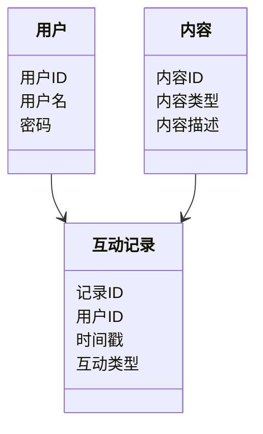
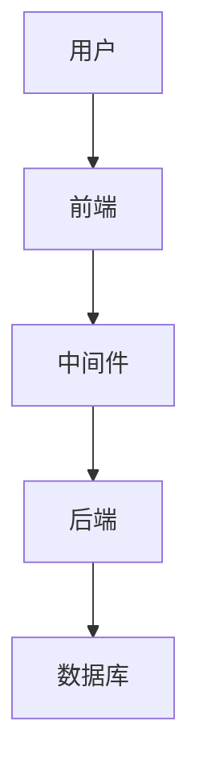
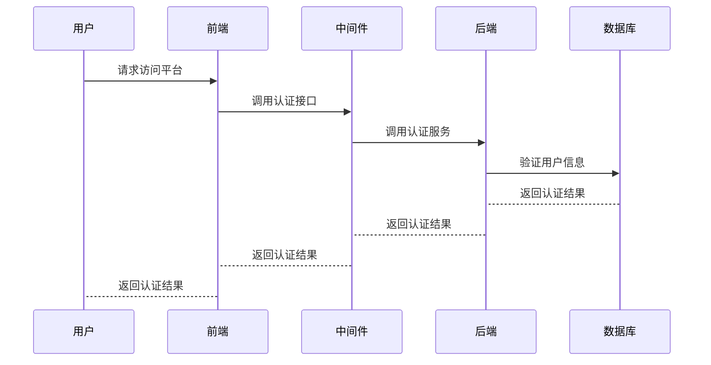

                 


# 企业估值中的AR/VR教育平台评估

## 关键词：
- 企业估值
- AR/VR
- 教育平台
- 技术评估
- 教育科技

## 摘要：
在当前数字化转型的浪潮中，AR/VR技术正在改变教育行业的面貌，为企业估值带来了新的挑战和机遇。本文系统地分析了AR/VR教育平台的评估方法，从技术原理到实际应用，深入探讨了如何利用这些创新工具提升教育平台的价值。文章结合了丰富的案例和详细的算法原理，为读者提供了全面的视角，帮助他们在企业估值中准确评估AR/VR教育平台的潜力和挑战。

---

# 第一部分：AR/VR教育平台评估背景与核心概念

## 第1章：AR/VR教育平台概述

### 1.1 AR/VR技术的基本概念

#### 1.1.1 增强现实（AR）与虚拟现实（VR）的定义
- **增强现实（AR）**：通过计算机生成的图像、声音或其他感官信息，增强用户对现实环境的感知。例如，使用手机摄像头叠加虚拟信息到现实场景中。
- **虚拟现实（VR）**：创建一个完全虚拟的数字环境，用户通过头戴设备或屏幕沉浸其中。例如，虚拟教室或虚拟实验室。

#### 1.1.2 AR/VR技术的核心特征
| 特征 | 描述 |
|------|------|
| 沉浸性 | 用户完全沉浸在虚拟环境中（VR），或部分沉浸在增强环境中（AR）。 |
| 交互性 | 用户可以通过手势、语音或触觉与环境互动。 |
| 实时性 | AR/VR系统通常需要实时处理和反馈，以提供流畅的用户体验。 |

#### 1.1.3 AR/VR在教育领域的应用潜力
- 提供沉浸式学习体验，如虚拟历史场景或科学实验。
- 通过增强现实辅助学习，如叠加解剖结构到人体模型上。
- 支持远程教育，如虚拟教室连接全球学生。

### 1.2 教育平台评估的重要性

#### 1.2.1 教育平台评估的定义
- 对教育平台的技术性能、用户体验和市场潜力进行全面分析。

#### 1.2.2 企业估值中的教育平台评估目标
- 评估教育平台的市场竞争力。
- 确定平台的技术创新性和可持续性。
- 量化平台的用户增长潜力和盈利能力。

#### 1.2.3 AR/VR技术在教育平台评估中的作用
- 通过AR/VR技术提升用户互动和学习效果。
- 通过数据分析优化平台功能和用户体验。

### 1.3 本章小结
本章介绍了AR/VR技术的基本概念及其在教育领域的潜力，强调了教育平台评估在企业估值中的重要性。

---

## 第2章：AR/VR教育平台的市场背景

### 2.1 全球教育技术市场现状

#### 2.1.1 全球教育技术市场的规模与增长
- 全球教育技术市场在2023年达到1000亿美元，预计年增长率为15%。
- AR/VR教育技术在市场中占比逐渐增加，特别是在高等教育和企业培训领域。

#### 2.1.2 AR/VR在教育市场的应用趋势
- **K-12教育**：通过AR/VR技术提升学生的学习兴趣和效果。
- **高等教育**：用于虚拟实验室、虚拟教室和在线课程。
- **企业培训**：利用AR/VR进行员工技能培训和安全培训。

#### 2.1.3 主要国家的教育技术发展概况
- **美国**：AR/VR教育技术发展领先，有众多教育科技公司。
- **中国**：政府大力支持教育技术，特别是在“双一流”大学中推广。
- **欧洲**：注重AR/VR技术在职业教育中的应用。

### 2.2 中国教育技术市场分析

#### 2.2.1 中国教育技术市场的现状
- 中国教育技术市场规模在2023年约为500亿美元，预计未来几年保持快速增长。
- 政府政策支持是市场增长的重要驱动力。

#### 2.2.2 AR/VR在教育领域的政策支持
- 国家政策鼓励教育技术的创新和应用。
- 各地政府提供资金支持和税收优惠。

#### 2.2.3 中国教育技术市场的未来展望
- 预计AR/VR技术在教育领域的应用将进一步普及。
- 教育平台的智能化和个性化将是未来的主要发展方向。

### 2.3 本章小结
本章分析了全球和中国教育技术市场的现状和趋势，强调了AR/VR技术在教育领域的广泛应用。

---

## 第3章：AR/VR教育平台的核心要素

### 3.1 AR/VR教育平台的组成结构

#### 3.1.1 平台的功能模块
- **内容创作模块**：用于创建AR/VR教育内容。
- **用户交互模块**：支持用户与虚拟环境的互动。
- **数据分析模块**：收集和分析用户行为数据。

#### 3.1.2 平台的技术架构
- **前端**：用户界面和AR/VR设备。
- **后端**：服务器和数据库，支持内容存储和用户管理。
- **中间件**：用于数据处理和算法实现。

#### 3.1.3 平台的用户群体
- **学生**：主要使用群体。
- **教师**：内容创作者和指导者。
- **企业**：用于员工培训和技能提升。

### 3.2 AR/VR技术在教育中的应用模式

#### 3.2.1 虚拟教室
- 用户可以在虚拟教室中参与在线课程和互动讨论。

#### 3.2.2 增强现实教材
- 通过AR技术将教材内容可视化，如叠加3D模型到书本上。

#### 3.2.3 虚拟实验室
- 用户可以在虚拟实验室中进行实验操作和科学探索。

### 3.3 教育平台评估的关键指标

#### 3.3.1 平台的用户体验
- 用户满意度、互动频率和留存率。

#### 3.3.2 平台的技术性能
- 延迟时间、渲染速度和设备兼容性。

#### 3.3.3 平台的内容资源
- 内容丰富度、更新频率和教学效果。

### 3.4 本章小结
本章详细分析了AR/VR教育平台的组成结构和应用模式，并提出了评估的关键指标。

---

## 第4章：AR/VR教育平台评估的核心概念原理

### 4.1 AR/VR教育平台的核心概念原理

#### 4.1.1 AR/VR技术的核心算法
- **姿态估计**：用于追踪用户的手势和动作。
- **环境映射**：用于构建虚拟环境的三维模型。

#### 4.1.2 教育平台的评估模型
- **用户行为分析**：通过数据挖掘技术分析用户的互动行为。
- **学习效果评估**：通过测试和反馈系统评估学习效果。

#### 4.1.3 AR/VR技术在教育中的应用优势
- 提供沉浸式学习体验，增强记忆效果。
- 支持个性化学习路径，满足不同用户的需求。

### 4.2 AR/VR技术在教育中的应用优势

#### 4.2.1 提高学习效果
- 通过虚拟现实技术，学生可以更直观地理解复杂概念。

#### 4.2.2 支持个性化学习
- 平台可以根据用户的学习进度和兴趣推荐个性化内容。

#### 4.2.3 降低学习成本
- 通过虚拟实验室，学生可以在虚拟环境中进行实验，降低实际操作的成本。

### 4.3 本章小结
本章分析了AR/VR教育平台的核心概念和原理，强调了技术在教育中的应用优势。

---

# 第二部分：AR/VR教育平台评估的系统设计与实现

## 第5章：AR/VR教育平台的系统设计

### 5.1 问题场景介绍
- **用户需求**：学生需要通过AR/VR技术进行在线学习和互动。
- **技术挑战**：如何实现低延迟的AR/VR体验和高效的内容分发。

### 5.2 系统功能设计

#### 5.2.1 领域模型设计


#### 5.2.2 系统架构设计


#### 5.2.3 系统接口设计
- **用户认证接口**：用于用户登录和注册。
- **内容分发接口**：用于向用户分发AR/VR内容。
- **互动反馈接口**：用于收集用户互动数据。

#### 5.2.4 系统交互流程


### 5.3 本章小结
本章详细设计了AR/VR教育平台的系统架构和接口，为后续的实现提供了基础。

---

## 第6章：AR/VR教育平台的项目实战

### 6.1 环境安装

#### 6.1.1 安装开发环境
- 操作系统：Windows 10或macOS Monterey
- 开发工具：PyCharm或VS Code
- 依赖库：Python 3.8及以上，Numpy、Pandas、OpenCV等。

#### 6.1.2 安装AR/VR开发框架
- **OpenCV**：用于图像处理和计算机视觉。
- **PyTorch**：用于深度学习和AI模型训练。
- **Unity**：用于开发VR应用程序。

### 6.2 核心代码实现

#### 6.2.1 用户认证模块
```python
import hashlib

def user_authenticate(username, password):
    # 对密码进行哈希处理
    hashed_password = hashlib.sha256(password.encode()).hexdigest()
    # 查询数据库验证用户
    # 简化逻辑，假设数据库返回True或False
    return True
```

#### 6.2.2 内容分发模块
```python
import json

def distribute_content(user_id):
    # 获取用户的内容权限
    content = {
        "user_id": user_id,
        "content_type": "AR",
        "content_path": "assets/ar_content.json"
    }
    return json.dumps(content)
```

#### 6.2.3 互动反馈模块
```python
import datetime

def record_interaction(user_id, interaction_type):
    # 记录用户互动行为
    timestamp = datetime.datetime.now().isoformat()
    interaction = {
        "user_id": user_id,
        "timestamp": timestamp,
        "interaction_type": interaction_type
    }
    return interaction
```

### 6.3 案例分析与解读

#### 6.3.1 案例背景
- 某教育平台希望利用AR技术提升学生的几何学习效果。

#### 6.3.2 实施方案
- 开发一个AR应用程序，允许学生通过手机摄像头查看叠加在现实中的3D几何模型。
- 用户可以旋转和缩放模型，增强学习体验。

#### 6.3.3 实施效果
- 学生的学习兴趣显著提高。
- 学习效果通过测试和反馈系统得到验证。

### 6.4 项目总结
本章通过一个实际案例展示了AR/VR教育平台的开发和实施过程，验证了技术在教育中的应用价值。

---

## 第7章：最佳实践与总结

### 7.1 最佳实践

#### 7.1.1 技术选型建议
- 根据需求选择合适的AR/VR开发框架和工具。
- 确保系统的兼容性和扩展性。

#### 7.1.2 用户体验优化
- 提供流畅的互动体验，降低用户操作门槛。
- 支持多设备和多平台，扩大用户群体。

#### 7.1.3 数据安全与隐私保护
- 确保用户数据的安全和隐私。
- 符合相关法律法规，特别是在数据存储和传输方面。

### 7.2 小结
本文系统地探讨了AR/VR教育平台的评估方法，从技术原理到实际应用，为读者提供了全面的视角。

### 7.3 注意事项
- 在开发过程中，需注意系统性能优化，避免用户体验下降。
- 在实施过程中，需注重数据安全和隐私保护。

### 7.4 拓展阅读
- 《Augmented Reality in Education》
- 《Virtual Reality Development and Applications》

---

# 结语

AR/VR技术正在 revolutionizing 教育行业，为企业估值带来了新的机遇和挑战。通过本文的分析，读者可以全面了解AR/VR教育平台的评估方法和实现技术，为未来的实践提供有力的指导。希望本文能为教育科技的发展贡献一份力量。

