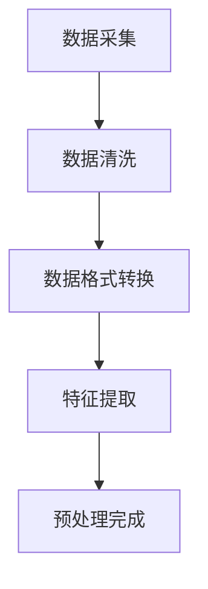
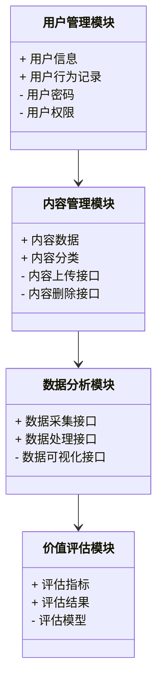
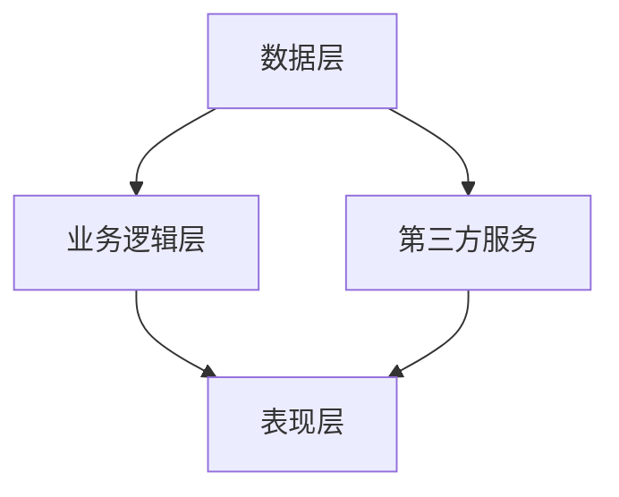
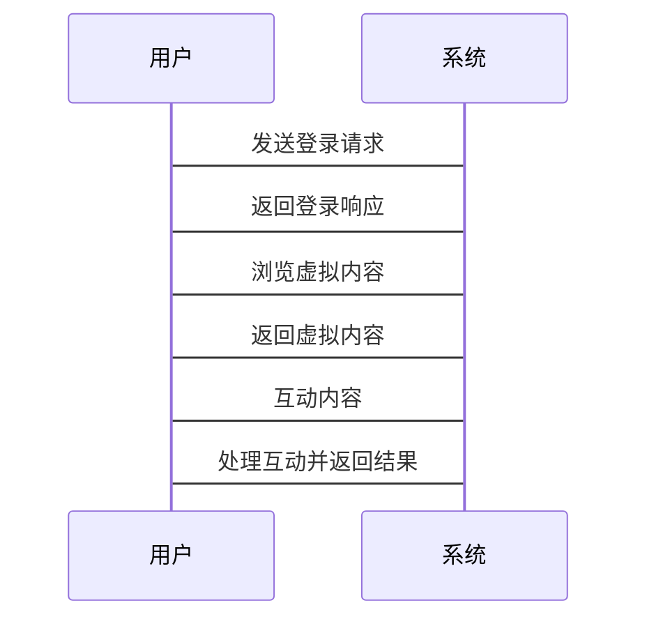

                 


# 企业估值中的AR/VR虚拟旅游平台评估

---

## 关键词：企业估值、AR/VR、虚拟旅游平台、技术评估、用户行为分析

---

## 摘要

随着AR/VR技术的快速发展，虚拟旅游平台在企业估值中的作用日益重要。本文从AR/VR的基本概念出发，分析其在虚拟旅游平台中的应用潜力，探讨用户行为、内容质量、技术实现和市场竞争力等核心要素。通过建立数学模型和算法，评估虚拟旅游平台的市场价值，并结合实际案例进行系统设计与实现。最终总结虚拟旅游平台评估的关键点，为企业估值提供科学依据。

---

## 第1章: AR/VR技术与虚拟旅游平台概述

### 1.1 AR/VR技术的基本概念

#### 1.1.1 增强现实（AR）与虚拟现实（VR）的定义

- **AR（增强现实）**：通过技术手段将数字信息叠加在真实环境中，如导航应用中的路线指引。
- **VR（虚拟现实）**：创造一个完全虚拟的环境，让用户沉浸其中，如VR游戏。

#### 1.1.2 AR/VR技术的核心特点

- **沉浸式体验**：让用户身临其境。
- **交互性**：用户可以与虚拟环境互动。
- **实时性**：快速响应用户的动作和指令。
- **高技术门槛**：需要高性能计算和图形处理技术。

#### 1.1.3 AR/VR在旅游行业的应用潜力

- 提供虚拟导游服务。
- 实现沉浸式体验，增强用户感受。

### 1.2 虚拟旅游平台的定义与分类

#### 1.2.1 虚拟旅游平台的定义

- 利用AR/VR技术提供虚拟旅游体验的平台。

#### 1.2.2 虚拟旅游平台的主要分类

- **基于AR的导航类平台**：如AR导览应用。
- **基于VR的虚拟场景类平台**：如VR虚拟景区游览。
- **混合型平台**：结合AR和VR技术的平台。

#### 1.2.3 虚拟旅游平台的典型应用场景

- 虚拟景区游览。
- 虚拟博物馆参观。
- 虚拟房地产看房。

### 1.3 企业估值中的虚拟旅游平台评估需求

#### 1.3.1 企业估值的基本概念

- 企业估值是对企业价值的评估，包括资产、收入、市场等因素。

#### 1.3.2 虚拟旅游平台在企业估值中的作用

- 提供新的价值评估维度。
- 通过技术手段提高评估效率和准确性。

#### 1.3.3 评估虚拟旅游平台的核心问题与挑战

- 技术实现难度。
- 内容质量。
- 用户粘性。
- 市场竞争力。

---

## 第2章: 虚拟旅游平台评估的核心要素

### 2.1 虚拟旅游平台的用户行为分析

#### 2.1.1 用户行为分析的基本方法

- 数据分析法：通过用户数据挖掘行为模式。
- 用户访谈法：了解用户的使用体验和需求。

#### 2.1.2 AR/VR技术对用户行为的影响

- 提高用户参与度和互动性。
- 改善用户体验，提升用户满意度。

#### 2.1.3 用户行为数据的采集与分析

- 数据采集：通过传感器和用户输入记录行为数据。
- 数据分析：使用数据分析工具挖掘用户行为特征。

### 2.2 虚拟旅游平台的内容质量评估

#### 2.2.1 内容质量的定义与评估指标

- 清晰度：内容的视觉效果。
- 互动性：用户与内容的互动程度。
- 信息量：内容提供的信息丰富程度。

#### 2.2.2 AR/VR内容的制作成本与技术门槛

- 制作成本高：需要专业团队和设备。
- 技术门槛高：需要掌握复杂的编程和图形处理技术。

#### 2.2.3 内容质量对用户粘性的影响

- 高质量内容能提升用户粘性，增强用户忠诚度。

### 2.3 虚拟旅游平台的技术实现与成本分析

#### 2.3.1 AR/VR技术实现的核心要素

- 高性能计算：确保流畅的用户体验。
- 高精度建模：提供逼真的虚拟环境。

#### 2.3.2 技术实现的成本构成与优化策略

- 成本构成：硬件采购、软件开发、研发投入。
- 优化策略：技术创新降低成本，如优化算法、共享渲染资源。

#### 2.3.3 技术创新对平台价值的影响

- 技术创新能提高平台竞争力，增强市场价值。

### 2.4 虚拟旅游平台的市场竞争力分析

#### 2.4.1 市场竞争格局概述

- 当前市场主要参与者及其市场份额。
- 市场竞争的激烈程度。

#### 2.4.2 平台的市场定位与竞争优势

- 市场定位：明确平台的目标用户和市场细分。
- 竞争优势：技术优势、内容优势、用户体验优势。

#### 2.4.3 市场反馈对平台价值的评估

- 用户满意度：用户的反馈是评估平台价值的重要依据。
- 市场表现：平台的市场表现直接影响其价值。

---

## 第3章: 虚拟旅游平台评估的算法

### 3.1 AR/VR数据采集与预处理算法

#### 3.1.1 数据采集过程

- 传感器数据采集：如加速度计、陀螺仪等。
- 用户输入采集：如用户的点击、手势操作。

#### 3.1.2 数据预处理方法

- 数据清洗：去除噪声数据。
- 数据格式转换：将数据转换为统一格式。
- 数据特征提取：提取有用特征，如用户行为特征。

#### 3.1.3 数据预处理算法流程图



#### 3.1.4 代码实现示例

```python
import numpy as np

# 数据清洗
def data_cleaning(data):
    return data.dropna()

# 数据格式转换
def data_conversion(data):
    return data.astype('float32')

# 特征提取
def feature_extraction(data):
    return np.mean(data, axis=0)
```

### 3.2 虚拟旅游体验质量评估算法

#### 3.2.1 评估指标

- 清晰度：画面的清晰程度。
- 互动性：用户与内容的互动程度。
- 响应速度：系统的响应时间。

#### 3.2.2 评估模型的数学公式

$$
\text{质量评分} = \alpha \cdot \text{清晰度} + \beta \cdot \text{互动性} + \gamma \cdot \text{响应速度}
$$

其中，$\alpha + \beta + \gamma = 1$，且 $\alpha, \beta, \gamma > 0$。

#### 3.2.3 评估模型的实现步骤

- 数据预处理：清洗和归一化数据。
- 模型训练：使用机器学习算法训练评估模型。
- 模型预测：对虚拟旅游体验进行质量评分。

#### 3.2.4 代码实现示例

```python
import pandas as pd
from sklearn.linear_model import LinearRegression

# 数据预处理
def preprocess(data):
    data = data.dropna()
    data = (data - data.min()) / (data.max() - data.min())
    return data

# 模型训练
def train_model(X, y):
    model = LinearRegression()
    model.fit(X, y)
    return model

# 模型预测
def predict_quality(model, new_data):
    return model.predict(new_data)
```

### 3.3 虚拟旅游平台的市场价值预测算法

#### 3.3.1 预测指标

- 技术水平：平台的技术创新和实现难度。
- 内容质量：平台提供的内容丰富程度和互动性。
- 市场表现：平台的用户数量和市场占有率。

#### 3.3.2 预测模型的数学公式

$$
\text{市场价值} = \theta_1 \cdot \text{技术水平} + \theta_2 \cdot \text{内容质量} + \theta_3 \cdot \text{市场表现}
$$

其中，$\theta_1 + \theta_2 + \theta_3 = 1$，且 $\theta_1, \theta_2, \theta_3 > 0$。

#### 3.3.3 预测模型的实现步骤

- 数据预处理：清洗和归一化数据。
- 模型训练：使用机器学习算法训练预测模型。
- 模型预测：对虚拟旅游平台进行市场价值预测。

#### 3.3.4 代码实现示例

```python
import pandas as pd
from sklearn.linear_model import LinearRegression

# 数据预处理
def preprocess(data):
    data = data.dropna()
    data = (data - data.min()) / (data.max() - data.min())
    return data

# 模型训练
def train_model(X, y):
    model = LinearRegression()
    model.fit(X, y)
    return model

# 模型预测
def predict_value(model, new_data):
    return model.predict(new_data)
```

---

## 第4章: 虚拟旅游平台评估的系统架构与实现

### 4.1 问题场景介绍

- 虚拟旅游平台需要支持多用户同时在线，提供实时交互体验。
- 系统需要处理大量用户数据，确保数据安全和隐私保护。

### 4.2 系统功能设计

#### 4.2.1 用户管理模块

- 用户注册与登录。
- 用户信息管理。

#### 4.2.2 内容管理模块

- 内容上传与管理。
- 内容分类与标签。

#### 4.2.3 数据分析模块

- 数据采集与处理。
- 数据可视化。

#### 4.2.4 价值评估模块

- 评估指标设置。
- 评估结果展示。

#### 4.2.5 系统功能设计的Mermaid类图



### 4.3 系统架构设计

#### 4.3.1 分层架构设计

- **数据层**：存储用户数据和内容数据。
- **业务逻辑层**：处理业务逻辑，如用户认证、内容管理。
- **表现层**：提供用户交互界面，如网页或移动应用。

#### 4.3.2 系统架构的Mermaid架构图



#### 4.3.3 系统架构设计的注意事项

- 确保系统的可扩展性和可维护性。
- 采用模块化设计，便于功能扩展和维护。

### 4.4 系统接口设计

#### 4.4.1 RESTful API设计

- **用户认证接口**：`POST /auth`
- **内容访问接口**：`GET /content/{id}`
- **数据查询接口**：`GET /data?filter=...`

#### 4.4.2 API接口的文档编写

- 使用OpenAPI规范编写接口文档。
- 提供详细的请求格式和响应格式说明。

### 4.5 系统交互设计

#### 4.5.1 用户与系统交互流程

1. 用户通过网页或移动应用访问平台。
2. 用户进行注册或登录操作。
3. 用户浏览和互动虚拟内容。
4. 系统记录用户行为并进行评估。

#### 4.5.2 用户交互的Mermaid序列图



---

## 第5章: 项目实战与应用案例

### 5.1 虚拟景区评估项目实战

#### 5.1.1 项目目标

- 评估虚拟景区平台的价值，包括技术实现、内容质量和用户体验。

#### 5.1.2 项目环境与工具

- 开发工具：PyCharm、IntelliJ IDEA。
- 依赖库：NumPy、Pandas、Scikit-learn。

#### 5.1.3 核心代码实现

- 用户认证模块：

```python
from flask import Flask, request
from flask_restful import Resource, Api

app = Flask(__name__)
api = Api(app)

class Auth(Resource):
    def post(self):
        data = request.get_json()
        # 模拟用户认证逻辑
        if data['username'] == 'admin' and data['password'] == '12345':
            return {'status': 'success', 'token': 'abc123'}
        else:
            return {'status': 'failed'}, 401

api.add_resource(Auth, '/auth')

if __name__ == '__main__':
    app.run(debug=True)
```

- 数据分析模块：

```python
import pandas as pd
from sklearn.linear_model import LinearRegression

data = pd.read_csv('tourism.csv')
X = data[['user_behavior', 'content_quality']]
y = data['value_assessment']

model = LinearRegression()
model.fit(X, y)

new_data = pd.DataFrame({'user_behavior': [2.5], 'content_quality': [3.0]})
prediction = model.predict(new_data)
print(prediction)
```

#### 5.1.4 项目小结

- 通过实战项目，验证了评估算法的有效性。
- 提高了对系统架构设计的理解和应用能力。

### 5.2 虚拟博物馆评估项目实战

#### 5.2.1 项目目标

- 评估虚拟博物馆平台的市场价值，优化平台功能。

#### 5.2.2 项目环境与工具

- 同样使用Flask框架和相关数据处理库。

#### 5.2.3 核心代码实现

- 内容管理模块：

```python
from flask_restful import Resource, reqparse

class Content(Resource):
    def get(self):
        parser = reqparse.RequestParser()
        parser.add_argument('id', required=True)
        args = parser.parse_args()
        content_id = args['id']
        # 模拟获取内容数据
        return {'content_id': content_id, 'content_type': 'virtual_museum', 'status': 'success'}

api.add_resource(Content, '/content/<id>')
```

- 价值评估模块：

```python
import pandas as pd
from sklearn.linear_model import LinearRegression

data = pd.read_csv('museum.csv')
X = data[['technology_level', 'content_quality', 'market_performance']]
y = data['market_value']

model = LinearRegression()
model.fit(X, y)

new_data = pd.DataFrame({'technology_level': [0.8], 'content_quality': [0.9], 'market_performance': [0.7]})
prediction = model.predict(new_data)
print(prediction)
```

#### 5.2.4 项目小结

- 通过项目实战，掌握了系统架构设计和接口设计的方法。
- 提高了对虚拟旅游平台评估的实际应用能力。

---

## 第6章: 总结与展望

### 6.1 全文总结

- AR/VR技术为虚拟旅游平台评估提供了新的可能性。
- 通过用户行为分析、内容质量评估和市场价值预测，能够全面评估虚拟旅游平台的价值。

### 6.2 未来展望

- 技术创新：AI技术将驱动AR/VR技术的进一步发展。
- 行业应用：AR/VR技术将在更多行业得到广泛应用。
- 挑战与机遇：技术实现难度和市场竞争是挑战，也是创新的机会。

### 6.3 给读者的建议

- 关注AR/VR技术的发展动态。
- 多实践，积累实际项目经验。
- 注重用户体验和数据安全。

---

## 参考文献

（此处列出相关参考文献，如书籍、学术论文、技术文档等。）

