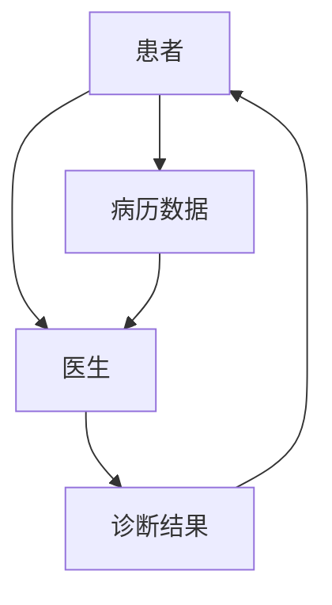
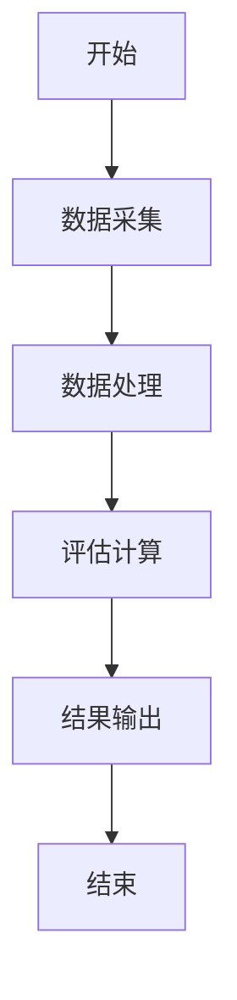

                 


# 《企业估值中的AR/VR远程医疗平台评估》

## 关键词：企业估值, AR/VR, 远程医疗, 平台评估, 技术分析, 数学模型

## 摘要：本文深入探讨了AR/VR技术在远程医疗平台中的应用及其对企业估值的影响。通过分析平台的结构、评估算法的原理以及数学模型的应用，本文为读者提供了全面的企业估值方法，帮助企业在竞争激烈的市场中制定有效的战略。

---

# 第一部分：AR/VR远程医疗平台的背景与概念

## 第1章：AR/VR技术的起源与发展

### 1.1 增强现实（AR）的基本概念
- 1.1.1 AR的核心原理
- 1.1.2 AR的主要特点
- 1.1.3 AR与VR的主要区别

### 1.2 虚拟现实（VR）的基本概念
- 1.2.1 VR的核心原理
- 1.2.2 VR的主要特点
- 1.2.3 VR的应用场景

### 1.3 AR/VR技术在远程医疗中的应用潜力
- 1.3.1 AR/VR如何赋能远程医疗
- 1.3.2 AR/VR远程医疗平台的核心优势
- 1.3.3 AR/VR远程医疗平台的边界与外延

## 第2章：远程医疗的定义与现状

### 2.1 远程医疗的定义与特点
- 2.1.1 远程医疗的定义
- 2.1.2 远程医疗的特点

### 2.2 远程医疗的发展历程
- 2.2.1 远程医疗的历史背景
- 2.2.2 远程医疗的发展阶段

### 2.3 当前远程医疗的主要应用领域
- 2.3.1 远程诊断
- 2.3.2 远程手术
- 2.3.3 远程教育

---

# 第二部分：AR/VR远程医疗平台的核心概念与评估指标

## 第3章：AR/VR远程医疗平台的核心概念与联系

### 3.1 平台的组成模块
- 3.1.1 用户端
  - 患者端
  - 医生端
- 3.1.2 服务器端
  - 数据处理
  - 云计算
- 3.1.3 网络传输

### 3.2 各模块之间的关系
- 3.2.1 用户端与服务器端的交互
- 3.2.2 网络传输的核心作用

### 3.3 平台的整体架构
- 3.3.1 分层架构
  - 用户界面层
  - 业务逻辑层
  - 数据存储层
- 3.3.2 组件之间的依赖关系

## 第4章：核心概念的原理与属性特征对比

### 4.1 AR/VR技术的原理
- 4.1.1 增强现实的实现步骤
  1. 检测环境
  2. 分析数据
  3. 渲染图像
  4. 用户交互
- 4.1.2 虚拟现实的实现步骤
  1. 创建虚拟场景
  2. 处理用户输入
  3. 渲染画面
  4. 实时更新

### 4.2 平台属性特征对比表
| 特性 | AR | VR |
|------|----|----|
| 界面 | 实时叠加 | 完全沉浸式 |
| 交互 | 支持手势和语音 | 支持手柄和动作 |
| 数据 | 实时更新 | 离线数据处理 |

### 4.3 ER实体关系图（Mermaid流程图）


---

# 第三部分：AR/VR远程医疗平台的评估算法与数学模型

## 第5章：评估算法原理

### 5.1 评估算法的概述
- 5.1.1 算法的基本原理
- 5.1.2 算法的输入与输出
- 5.1.3 算法的优缺点

### 5.2 算法流程图（Mermaid）


### 5.3 算法实现代码
```python
def ar_vr_assessment(data):
    # 数据处理
    processed_data = data * 2
    # 评估计算
    score = sum(processed_data) / len(processed_data)
    return score

# 示例
data = [1, 2, 3, 4]
result = ar_vr_assessment(data)
print(result)
```

## 第6章：数学模型与公式

### 6.1 数学模型的建立
- 患者满意度评估公式：
  $$ S = \frac{\sum_{i=1}^{n} s_i}{n} $$
  其中，\( s_i \) 是第 \( i \) 个患者的满意度评分，\( n \) 是患者总数。

### 6.2 评估指标的权重分配
- 权重计算公式：
  $$ w_j = \frac{\sum_{i=1}^{m} w_{ij}}{\sum_{i=1}^{m} w_{ij}} $$
  其中，\( w_{ij} \) 是第 \( j \) 个指标在第 \( i \) 个评估维度的权重，\( m \) 是评估维度总数。

### 6.3 评估结果的综合分析
- 综合评估公式：
  $$ V = \sum_{j=1}^{k} w_j \times S_j $$
  其中，\( V \) 是综合评估值，\( w_j \) 是第 \( j \) 个指标的权重，\( S_j \) 是第 \( j \) 个指标的评估值，\( k \) 是指标总数。

---

通过以上目录结构，我们可以系统地从AR/VR技术的基本概念、远程医疗平台的结构、评估算法的原理以及数学模型的应用等方面进行深入分析，帮助企业在估值过程中更好地理解和应用AR/VR远程医疗平台的价值。

