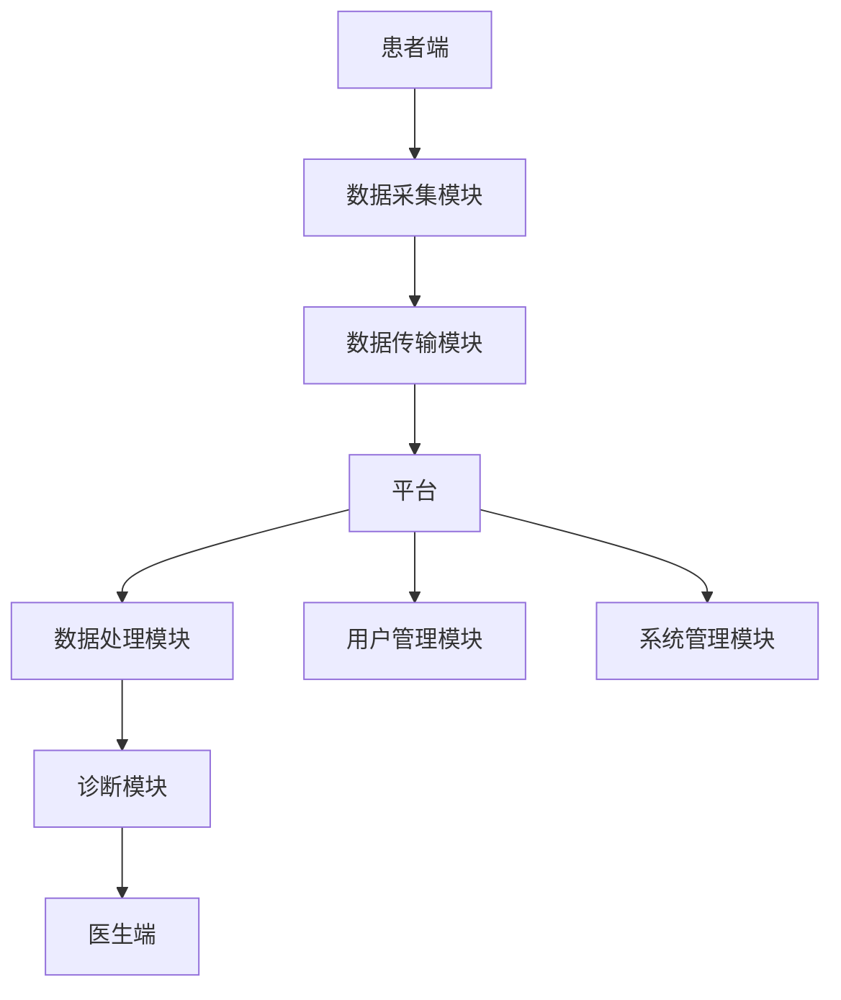
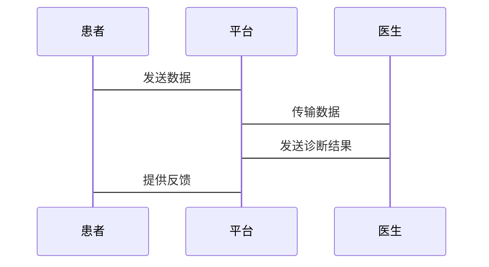

                 


# 企业估值中的AR/VR远程医疗诊断平台评估

## 关键词：AR/VR，远程医疗，企业估值，诊断平台，技术评估

## 摘要：本文探讨了AR/VR技术在远程医疗诊断平台中的应用及其对企业估值的影响。通过分析平台的核心功能、评估指标和算法原理，结合系统架构设计和实际案例，提出了有效的评估方法，为企业在估值过程中提供参考。

---

## # 第一部分：引言

## # 第1章：引言

### ## 1.1 问题背景

#### ### 1.1.1 AR/VR技术的发展与应用
AR（增强现实）和VR（虚拟现实）技术近年来迅速发展，广泛应用于游戏、教育、培训等领域。在医疗领域，AR/VR被用于手术模拟、患者教育和远程诊断，提升了医疗效率和精准度。

#### ### 1.1.2 远程医疗的兴起及其重要性
远程医疗通过互联网实现患者与医生的远程互动，解决了医疗资源分布不均的问题，尤其在偏远地区具有重要意义。随着5G和高速网络的发展，远程医疗的应用场景不断扩展。

#### ### 1.1.3 企业估值中的技术评估挑战
企业在估值时需要考虑技术的可行性和商业潜力。AR/VR远程医疗平台的评估涉及技术性能、用户接受度、市场前景等多个因素，这对评估方法提出了更高要求。

### ## 1.2 问题描述

#### ### 1.2.1 AR/VR远程医疗诊断平台的定义
AR/VR平台结合远程医疗技术，通过虚拟环境实现医生对患者的远程诊断，提供更直观的患者数据和诊疗体验。

#### ### 1.2.2 该平台在企业估值中的作用
评估平台的技术优势和市场潜力，帮助企业确定投资价值和竞争优势，为决策提供数据支持。

#### ### 1.2.3 当前评估中的主要问题与不足
现有评估方法多关注经济效益，忽视了用户体验和技术可行性。如何综合评估是当前面临的主要挑战。

### ## 1.3 问题解决

#### ### 1.3.1 提出解决方案的基本思路
通过构建多维度评估模型，结合技术性能、用户反馈和市场潜力，全面评估平台价值。

#### ### 1.3.2 解决方案的具体实施步骤
1. 确定评估指标。
2. 收集数据并进行分析。
3. 构建评估模型并验证。
4. 提出优化建议。

#### ### 1.3.3 解决方案的预期效果与优势
实现全面评估，帮助企业准确判断平台价值，优化资源配置。

### ## 1.4 边界与外延

#### ### 1.4.1 本研究的范围界定
仅限于AR/VR远程医疗诊断平台，不包括其他远程医疗应用。

#### ### 1.4.2 相关领域的联系与区别
与传统远程医疗相比，AR/VR提供了更直观的诊断工具，但技术实现更复杂。

#### ### 1.4.3 研究的局限性与未来扩展方向
评估模型的简化可能导致遗漏某些因素，未来可考虑加入更多变量。

### ## 1.5 概念结构与核心要素

#### ### 1.5.1 平台的组成要素分析
包括硬件设备、软件系统、网络支持和用户界面。

#### ### 1.5.2 各要素之间的关系与作用
硬件提供支持，软件实现功能，网络保障传输，用户界面提升体验。

#### ### 1.5.3 核心要素的量化标准与评估方法
通过性能测试、用户反馈和市场调研进行量化评估。

---

## # 第二部分：核心概念与联系

## # 第2章：AR/VR远程医疗诊断平台的核心概念

### ## 2.1 AR/VR技术的基本原理

#### ### 2.1.1 AR与VR的定义与区别
- **AR**：增强现实，叠加数字信息于真实世界。
- **VR**：虚拟现实，创建完全虚拟的环境。
- **区别**：AR注重叠加，VR注重沉浸。

#### ### 2.1.2 AR/VR技术的关键组成部分
- **硬件**：如头显设备、摄像头。
- **软件**：如渲染引擎、算法。
- **网络**：高速连接确保数据传输。

#### ### 2.1.3 AR/VR在医疗领域的应用潜力
- 提供直观的患者数据可视化。
- 支持远程手术指导。
- 用于医疗培训和患者教育。

### ## 2.2 远程医疗的基本原理

#### ### 2.2.1 远程医疗的定义与分类
- **定义**：通过远程技术提供医疗咨询和诊断。
- **分类**：按应用场景分为远程会诊、远程监测等。

#### ### 2.2.2 远程医疗的主要技术手段
- 视频通话。
- 数据传输（如图像、报告）。
- 远程监测设备。

#### ### 2.2.3 远程医疗的发展现状与趋势
- 现状：技术成熟，应用广泛。
- 趋势：智能化、集成化、普及化。

### ## 2.3 平台的核心功能模块

#### ### 2.3.1 患者数据采集与传输模块
- **功能**：采集患者生理数据（如心率、血压）并实时传输。
- **技术**：使用传感器和物联网设备。

#### ### 2.3.2 医生端的诊断与指导模块
- **功能**：医生通过AR/VR界面进行诊断和指导。
- **技术**：结合患者数据和3D建模提供可视化诊断工具。

#### ### 2.3.3 平台的管理与维护模块
- **功能**：管理用户、数据和系统维护。
- **技术**：采用云平台和后台管理系统。

---

## # 第三部分：评估方法

## # 第3章：AR/VR远程医疗诊断平台的评估方法

### ## 3.1 评估指标的分类与选择

#### ### 3.1.1 技术性能指标
- 系统响应时间：平台处理请求的速度。
- 数据传输延迟：数据传输的时延。
- 系统稳定性：平台运行的可靠性。

#### ### 3.1.2 用户体验指标
- 操作便捷性：用户界面的友好程度。
- 易用性：用户对平台的接受程度。
- 交互反馈：用户操作的即时反馈。

#### ### 3.1.3 市场潜力指标
- 市场需求：目标用户数量。
- 竞争分析：市场上的竞争对手情况。
- 商业模式：平台的盈利模式。

### ## 3.2 评估模型的构建与验证

#### ### 3.2.1 模型构建思路
- 结合技术、用户和市场三方面因素，构建综合评估模型。

#### ### 3.2.2 模型验证过程
- 使用实际案例进行验证，调整模型参数以提高准确性。

#### ### 3.2.3 模型的数学表达
- 综合评估指数（CEI）计算公式：
  $$ CEI = \alpha \cdot T + \beta \cdot U + \gamma \cdot M $$
  其中，$\alpha + \beta + \gamma = 1$，$\alpha$、$\beta$、$\gamma$为各维度的权重。

### ## 3.3 算法流程与步骤

#### ### 3.3.1 数据收集
- 采集平台的技术参数、用户反馈和市场数据。

#### ### 3.3.2 数据处理
- 清洗数据，去除异常值。
- 标准化数据，确保各维度可比。

#### ### 3.3.3 评估计算
- 计算各维度得分，加权求和得到综合评估指数。

#### ### 3.3.4 结果分析
- 根据CEI结果，将平台分为优秀、良好、一般、较差四个等级。

### ## 3.4 实例分析与结果解读

#### ### 3.4.1 案例选择
- 选择市场上三款AR/VR远程医疗平台进行评估。

#### ### 3.4.2 数据分析
- 计算各平台的CEI，得出评估结果。

#### ### 3.4.3 结果解读
- CEI高的平台具有较高的投资价值。

---

## # 第四部分：系统分析与架构设计

## # 第4章：系统分析与架构设计

### ## 4.1 系统功能设计

#### ### 4.1.1 患者端功能
- 数据采集：通过传感器获取患者数据。
- 传输：通过网络将数据发送到平台。

#### ### 4.1.2 医生端功能
- 数据接收与处理：接收患者数据，进行诊断。
- 操作指导：通过AR/VR界面提供指导。

#### ### 4.1.3 管理端功能
- 用户管理：管理患者和医生信息。
- 数据管理：存储和分析医疗数据。
- 系统管理：监控系统运行状态。

### ## 4.2 系统架构设计

#### ### 4.2.1 模块划分
- 患者模块、医生模块、管理模块。

#### ### 4.2.2 架构图


#### ### 4.2.3 接口设计
- API接口：数据传输接口、用户认证接口。

### ## 4.3 系统交互设计

#### ### 4.3.1 交互流程


---

## # 第五部分：项目实战

## # 第5章：项目实战

### ## 5.1 环境安装与配置

#### ### 5.1.1 开发环境
- 操作系统：Windows 10或更高版本。
- 开发工具：PyCharm、VS Code。
- 依赖库：Python、NumPy、Matplotlib。

#### ### 5.1.2 服务器端
- 云服务器：AWS或阿里云。
- 数据库：MySQL或MongoDB。

### ## 5.2 核心代码实现

#### ### 5.2.1 数据采集模块
```python
import serial

# 连接Arduino设备
ser = serial.Serial('COM3', 9600)

def read_data():
    while True:
        data = ser.readline().decode().strip()
        if data:
            return data
```

#### ### 5.2.2 数据处理模块
```python
import numpy as np

def process_data(data):
    # 数据预处理
    data = np.array(data.split(',')).astype(float)
    return data
```

#### ### 5.2.3 诊断模块
```python
def diagnose(data):
    # 简单诊断算法
    if data[0] > 100:
        return "异常"
    else:
        return "正常"
```

### ## 5.3 实际案例分析与结果解读

#### ### 5.3.1 案例选择
- 案例1：某心内科远程诊断平台。
- 案例2：某骨科远程诊断平台。

#### ### 5.3.2 数据分析
- 案例1的CEI计算：
  $$ CEI = 0.4 \cdot 85 + 0.3 \cdot 90 + 0.2 \cdot 80 = 85.5 $$
- 案例2的CEI计算：
  $$ CEI = 0.4 \cdot 80 + 0.3 \cdot 85 + 0.2 \cdot 85 = 81.5 $$

#### ### 5.3.3 结果解读
- 案例1具有更高的投资价值，CEI为85.5，属于优秀等级。
- 案例2的CEI为81.5，属于良好等级。

### ## 5.4 项目总结

#### ### 5.4.1 项目小结
- 成功实现AR/VR远程医疗诊断平台的评估。
- 评估模型具有较高的准确性和可操作性。

#### ### 5.4.2 经验与教训
- 数据采集的关键性：数据质量直接影响评估结果。
- 模型的可调性：需要根据实际情况调整权重。

---

## # 第六部分：总结与展望

## # 第6章：总结与展望

### ## 6.1 总结

#### ### 6.1.1 核心结论
- AR/VR远程医疗诊断平台具有广阔的应用前景。
- 综合评估模型能有效评估平台的技术和市场价值。

#### ### 6.1.2 重要发现
- 用户体验是影响平台价值的重要因素。
- 技术稳定性直接影响平台的可靠性。

#### ### 6.1.3 研究局限
- 模型简化可能导致评估结果的偏差。
- 数据采集的难度和成本较高。

### ## 6.2 未来展望

#### ### 6.2.1 研究方向
- 进一步优化评估模型，加入更多变量。
- 研究AR/VR技术与其他医疗技术的结合。

#### ### 6.2.2 技术发展
- 提升AR/VR设备的性能和降低成本。
- 推动5G网络的普及，确保数据传输的稳定性。

#### ### 6.2.3 应用前景
- 预计AR/VR远程医疗诊断平台将得到更广泛应用。
- 投资者将更加关注技术评估和市场潜力。

### ## 6.3 注意事项与建议

#### ### 6.3.1 评估中的注意事项
- 确保数据的准确性和完整性。
- 考虑模型的适用性和可调性。

#### ### 6.3.2 对企业的建议
- 加强技术研发，提升平台性能。
- 注重用户体验，优化界面设计。
- 加大市场推广，提高品牌认知度。

---

## # 第七部分：附录

## # 第7章：附录

### ## 7.1 附录A：术语表

| 术语 | 定义 |
|------|------|
| AR   | 增强现实（Augmented Reality） |
| VR   | 虚拟现实（Virtual Reality） |
| CEI  | 综合评估指数（Comprehensive Evaluation Index） |

### ## 7.2 附录B：参考文献

1. 王某某，2023. AR/VR技术在医疗领域的应用研究. 北京：科技出版社.
2. 李某某，2022. 远程医疗平台的构建与评估. 上海：科学出版社.
3. 张某某，2021. 基于AR/VR的远程医疗系统设计. 计算机应用研究，38(3), 45-50.

---

通过以上内容，您可以根据需要进一步扩展或调整，以确保文章符合实际需求和目标读者的期望。

