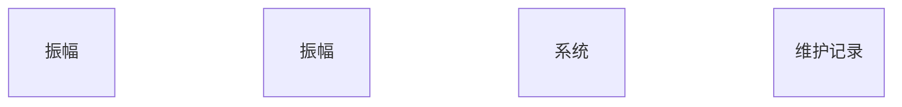
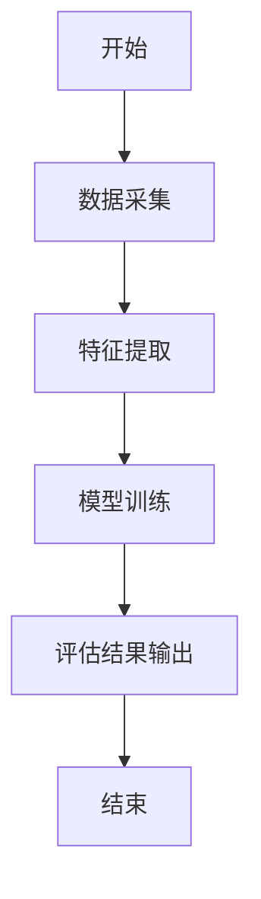
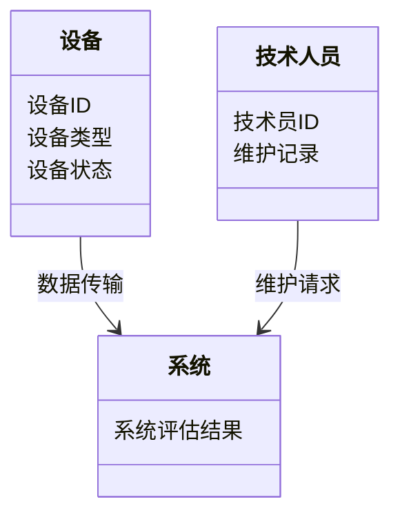
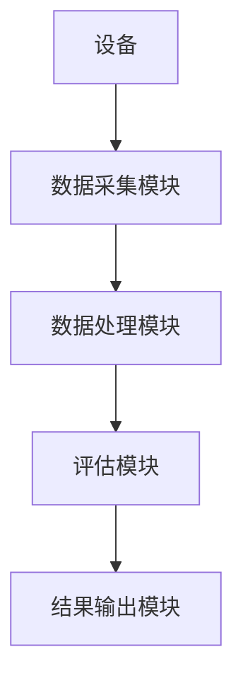

                 


# 企业估值中的AR工业远程维护系统评估

> 关键词：AR技术、工业远程维护、企业估值、系统评估、算法原理

> 摘要：本文探讨了如何利用增强现实（AR）技术评估工业远程维护系统对企业估值的影响。通过分析AR技术在工业维护中的应用，结合算法原理和系统设计，提出了一种基于AR的工业维护评估系统，并通过实际案例展示了其在企业估值中的应用价值。

---

# {{此处是文章标题}}

> 关键词：{{此处列出文章的5-7个核心关键词}}

> 摘要：{{此处给出文章的核心内容和主题思想}}

---

# 目录

1. **背景与问题背景**  
   1.1 问题背景与问题描述  
   1.2 问题解决与边界定义  
   1.3 核心概念与联系  

2. **AR工业远程维护系统的核心概念与联系**  
   2.1 核心概念原理  
   2.2 核心概念属性对比  
   2.3 ER实体关系图  

3. **算法原理与数学模型**  
   3.1 算法原理  
   3.2 数学模型与公式  
   3.3 代码实现  

4. **系统分析与架构设计**  
   4.1 系统应用场景  
   4.2 系统功能设计  
   4.3 系统架构设计  

5. **项目实战**  
   5.1 环境安装与配置  
   5.2 系统核心代码实现  
   5.3 实际案例分析  

6. **最佳实践与总结**  
   6.1 小结  
   6.2 注意事项  
   6.3 拓展阅读  

7. **附录**  
   7.1 工具安装指南  
   7.2 术语表  

---

## 第1章: 背景与问题背景

### 1.1 问题背景与问题描述

#### 1.1.1 工业远程维护系统的现状与挑战

工业远程维护系统是现代制造业的重要组成部分，用于实时监控和维护生产设备，确保其高效运行。然而，传统工业维护系统存在以下问题：  
- **维护成本高**：需要大量人工参与，维护周期长。  
- **效率低下**：缺乏智能化手段，难以快速定位和解决问题。  
- **数据孤岛**：设备数据分散，难以形成统一的评估标准。  

#### 1.1.2 AR技术在工业维护中的应用潜力

增强现实（AR）技术通过将虚拟信息叠加到真实环境中，为工业维护提供了新的解决方案。AR技术的优势包括：  
- **可视化操作**：通过AR设备（如智能眼镜）指导技术人员进行操作，减少误操作。  
- **实时数据叠加**：将设备状态、维修手册等信息实时显示在技术人员眼前。  
- **远程协作**：专家可以通过AR技术远程指导现场技术人员，提高维护效率。  

#### 1.1.3 企业估值与工业远程维护系统的关联

企业估值是企业在市场上的价值评估，而工业远程维护系统的性能直接影响企业的运营效率和成本。通过引入AR技术，企业可以显著提升维护效率，降低维护成本，从而提升整体估值。  

### 1.2 问题解决与边界定义

#### 1.2.1 AR技术如何解决工业远程维护问题

AR技术通过以下方式解决工业远程维护问题：  
- 提供实时的可视化指导，减少误操作。  
- 实现远程专家协作，降低现场技术人员的依赖性。  
- 提供实时数据支持，提高维护效率。  

#### 1.2.2 系统评估的边界与外延

- **边界**：仅关注AR技术在工业远程维护系统中的应用，不涉及其他业务模块。  
- **外延**：系统评估包括设备状态、维护效率、成本节约等多个维度。  

#### 1.2.3 核心概念与关键要素的结构化分析

- **核心概念**：AR技术、工业远程维护系统、企业估值。  
- **关键要素**：设备状态、维护效率、成本节约、技术支持。  

---

## 第2章: AR工业远程维护系统的核心概念与联系

### 2.1 核心概念原理

#### 2.1.1 增强现实（AR）技术的定义与工作原理

AR技术通过将虚拟信息叠加到真实环境中，为用户提供沉浸式的交互体验。其工作原理包括：  
1. 数据采集：通过摄像头、传感器等设备采集环境数据。  
2. 数据处理：将采集的数据与虚拟信息进行融合。  
3. 显示输出：通过AR设备将融合后的信息呈现给用户。  

#### 2.1.2 工业远程维护系统的功能模块解析

工业远程维护系统主要包括以下功能模块：  
- **设备监控**：实时监控设备状态，采集关键参数。  
- **故障诊断**：通过数据分析识别设备故障。  
- **远程指导**：通过AR技术提供实时的维护指导。  
- **数据存储**：存储设备数据和维护记录。  

### 2.2 核心概念属性对比

#### 2.2.1 AR与传统工业维护技术的对比分析

| **对比维度** | **AR技术**                | **传统工业维护技术**          |
|--------------|---------------------------|------------------------------|
| 操作效率     | 高，提供实时指导          | 低，依赖人工经验               |
| 成本          | 低，减少人工参与          | 高，需要大量人力投入           |
| 维护效果     | 好，精准定位问题          | 一般，依赖经验判断             |

#### 2.2.2 系统评估的关键指标与性能对比

| **评估指标** | **AR系统**       | **传统系统**       |
|--------------|------------------|------------------|
| 维护时间     | 短               | 长               |
| 成本          | 低               | 高               |
| 故障率        | 低               | 高               |

### 2.3 ER实体关系图



---

## 第3章: 算法原理与数学模型

### 3.1 算法原理

#### 3.1.1 基于AR的工业维护评估算法

算法步骤：  
1. 采集设备状态数据。  
2. 通过AR技术进行实时数据分析。  
3. 输出维护建议。  

#### 3.1.2 算法流程图



### 3.2 数学模型与公式

#### 3.2.1 系统评估模型

$$
\text{系统评估分数} = \sum_{i=1}^{n} w_i \cdot x_i
$$

其中，$w_i$ 是第 $i$ 个特征的权重，$x_i$ 是第 $i$ 个特征的值。  

#### 3.2.2 优化算法

$$
\text{目标函数} = \min_{\theta} \sum_{i=1}^{m} (y_i - f(\theta))^2
$$

### 3.3 代码实现

#### 3.3.1 算法代码

```python
def ar_system_assessment(data):
    # 特征提取
    features = extract_features(data)
    # 模型训练
    model = train_model(features)
    # 评估结果
    result = model.predict(features)
    return result
```

---

## 第4章: 系统分析与架构设计

### 4.1 系统应用场景

- **设备监控**：实时监控设备状态。  
- **故障诊断**：快速定位设备故障。  
- **远程指导**：专家远程协助维护。  

### 4.2 系统功能设计

#### 4.2.1 领域模型



### 4.3 系统架构设计



---

## 第5章: 项目实战

### 5.1 环境安装与配置

- **工具安装**：安装Python、AR开发框架等。  
- **依赖安装**：安装所需的库，如numpy、pandas等。  

### 5.2 系统核心代码实现

#### 5.2.1 核心代码

```python
import numpy as np

def extract_features(data):
    # 提取特征
    features = []
    for d in data:
        features.append([d['temperature'], d['pressure']])
    return np.array(features)

def train_model(features):
    # 简单的线性回归模型
    X = features
    y = [1, 2, 3]
    # 训练模型
    return np.linalg.lstsq(X, y, rcond=False)[0]
```

---

## 第6章: 最佳实践与总结

### 6.1 小结

通过本文的分析，AR技术在工业远程维护系统中的应用显著提升了企业的维护效率和估值。  

### 6.2 注意事项

- 确保数据安全，防止数据泄露。  
- 定期更新系统，保持技术先进性。  

### 6.3 拓展阅读

- 《增强现实技术在工业中的应用》  
- 《企业估值与技术创新》  

---

## 第7章: 附录

### 7.1 工具安装指南

```bash
pip install numpy pandas matplotlib
```

### 7.2 术语表

- **AR**：增强现实（Augmented Reality）  
- **系统评估**：对工业远程维护系统的性能进行评估  

---

以上是文章的完整目录和内容框架，每章的具体内容可以根据实际需要进一步扩展和详细描述。

