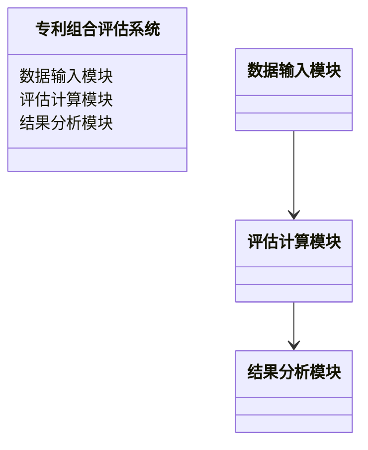
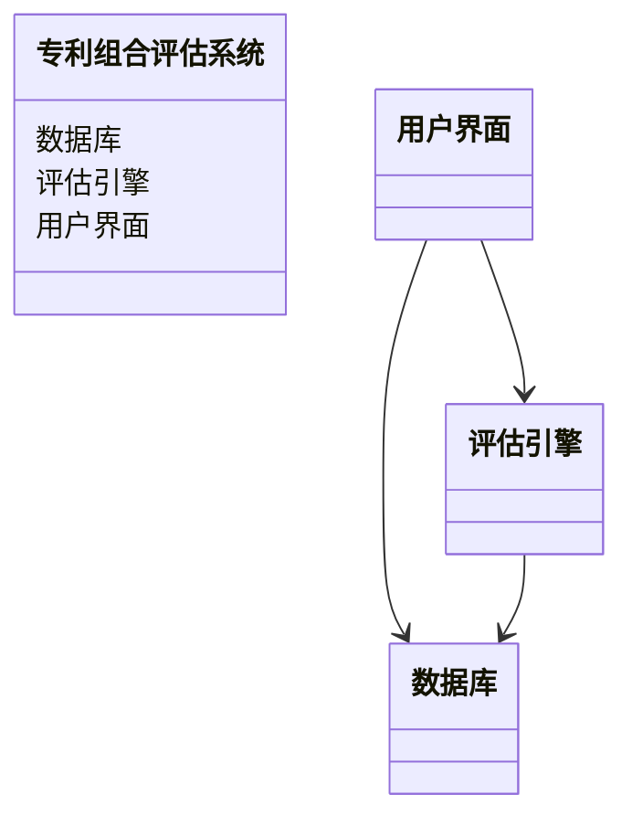
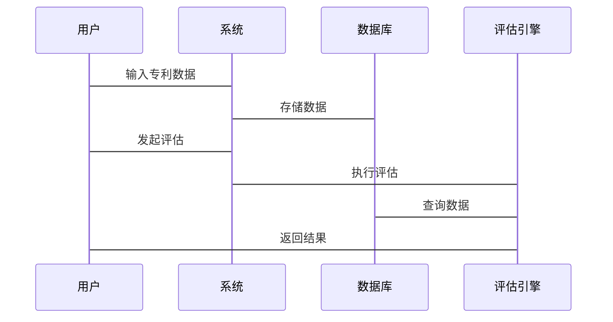

                 


# 企业估值中的专利组合价值评估

---

## 关键词：
企业估值，专利组合，知识产权评估，技术价值，法律风险，市场价值，经济价值

---

## 摘要：
专利组合的评估在企业估值中扮演着至关重要的角色，尤其是在知识产权密集型行业。本文深入探讨了专利组合价值评估的核心概念、算法原理、系统架构以及实际应用案例。通过详细分析专利组合的技术、法律和市场因素，本文为读者提供了从理论到实践的全面指导，帮助企业在并购和融资中准确评估专利组合的价值，降低风险并提升竞争力。

---

# 第一部分: 企业估值中的专利组合价值评估基础

---

## 第1章: 专利组合价值评估的背景与概念

### 1.1 专利的基本概念

#### 1.1.1 什么是专利
专利是法律赋予的保护发明创造的独占权，涵盖发明、实用新型、外观设计等类型。专利权赋予发明者在一定期限内 exclusive 使用、销售和许可他人使用发明的权利。

#### 1.1.2 专利的类型与分类
专利主要分为三种类型：
1. **发明专利**：保护技术解决方案或方法的创新。
2. **实用新型专利**：保护产品的形状、结构或构造的改进。
3. **外观设计专利**：保护产品的外观设计。

#### 1.1.3 专利在企业中的作用
专利不仅是技术保护的工具，也是企业资产的重要组成部分。专利可以：
- 提升企业市场竞争力。
- 作为防御性武器，防止竞争对手侵权。
- 在企业并购和融资中增加估值。

### 1.2 专利组合的定义与特点

#### 1.2.1 专利组合的概念
专利组合是指一组相互关联的专利，共同保护企业的一项技术或产品。专利组合可以涵盖同一技术的不同方面，或不同技术的互补部分。

#### 1.2.2 专利组合的特点
1. **协同效应**：专利组合的价值通常大于单个专利的简单相加。
2. **防御性**：组合专利可以有效防御竞争对手的侵权行为。
3. **多样性**：涵盖不同技术领域或产品线，降低风险。

#### 1.2.3 专利组合与单一专利的区别
| 特性                | 单一专利              | 专利组合             |
|---------------------|-----------------------|----------------------|
| 保护范围            | 单一项技术或设计      | 多项技术或设计        |
| 协同效应            | 无                     | 有                   |
| 防御能力            | 较弱                  | 较强                 |
| 价值评估            | 简单                  | 复杂                 |

### 1.3 企业估值中的专利组合价值评估

#### 1.3.1 专利组合价值评估的必要性
在企业并购、融资等场景中，专利组合的价值直接影响企业的整体估值。准确评估专利组合价值，有助于企业制定合理的交易策略。

#### 1.3.2 专利组合价值评估的背景
随着科技竞争的加剧，专利组合的价值越来越受到重视。企业通过评估专利组合价值，可以更好地管理知识产权资产。

#### 1.3.3 专利组合价值评估的意义
- 提供准确的估值依据。
- 优化企业资产配置。
- 增强企业市场竞争力。

### 1.4 本章小结
本章介绍了专利的基本概念、专利组合的定义与特点，以及在企业估值中的重要性。理解这些内容是后续评估的基础。

---

## 第2章: 专利组合价值评估的核心概念

### 2.1 专利组合评估的理论基础

#### 2.1.1 知识产权评估的基本原理
知识产权评估基于其法律保护和市场价值。专利的价值取决于其技术创新性、市场应用前景和法律保护力度。

#### 2.1.2 专利组合评估的经济学基础
专利组合的价值评估需要考虑技术的经济价值、市场需求和竞争环境。经济学中的成本收益分析模型常用于评估。

#### 2.1.3 专利组合评估的法律依据
专利法规定了专利的保护范围和权利限制。评估专利组合时需考虑法律风险，如专利无效风险和侵权风险。

### 2.2 专利组合价值评估的关键要素

#### 2.2.1 专利的技术价值
技术价值取决于专利的创新性、技术复杂性和技术寿命。创新性越高，技术价值越大。

#### 2.2.2 专利的市场价值
市场价值受市场需求、竞争状况和专利的商业应用潜力影响。市场需求越大，市场价值越高。

#### 2.2.3 专利的法律风险
法律风险包括专利无效风险、侵权风险和诉讼风险。法律风险越低，专利组合价值越高。

### 2.3 专利组合价值评估的流程

#### 2.3.1 专利组合的识别与筛选
识别与企业核心业务相关的专利，筛选出具有战略价值的专利组合。

#### 2.3.2 专利组合的价值评估方法
- **加权评分法**：根据技术、法律和市场因素对专利进行评分。
- **收益法**：估算专利组合带来的未来收益。
- **市场法**：参考市场交易案例进行评估。

#### 2.3.3 专利组合价值的调整与优化
根据评估结果调整专利组合，优化组合结构，降低风险，提升整体价值。

### 2.4 本章小结
本章详细讲解了专利组合价值评估的理论基础、关键要素和评估流程，为后续算法分析奠定了基础。

---

## 第3章: 专利组合价值评估的算法原理

### 3.1 专利组合价值评估的数学模型

#### 3.1.1 专利组合价值的加权评分模型
加权评分模型将技术、法律和市场因素分别赋予权重，计算每项专利的综合得分。

公式：
$$
\text{专利价值} = w_t \times t + w_l \times l + w_m \times m
$$
其中，\(w_t\)、\(w_l\)、\(w_m\)为技术、法律和市场的权重，\(t\)、\(l\)、\(m\)为对应因素的评分。

#### 3.1.2 专利组合价值的收益模型
收益模型基于未来收益的折现计算专利组合价值。

公式：
$$
\text{组合价值} = \sum_{t=1}^{n} \frac{R_t}{(1 + r)^t}
$$
其中，\(R_t\)为第\(t\)年的收益，\(r\)为折现率。

#### 3.1.3 专利组合价值的市场模型
市场模型参考市场交易案例，调整相似专利的价值。

公式：
$$
\text{组合价值} = \sum_{i=1}^{m} V_i \times f_i
$$
其中，\(V_i\)为第\(i\)个市场案例的专利价值，\(f_i\)为调整因子。

### 3.2 专利组合价值评估的算法流程

#### 3.2.1 数据收集与预处理
收集专利的技术、法律和市场数据，清洗和整理数据。

#### 3.2.2 专利价值评分计算
根据加权评分模型计算每项专利的价值评分。

#### 3.2.3 组合价值综合评估
综合各专利的价值评分，计算专利组合的总价值。

### 3.3 专利组合价值评估的数学公式

#### 3.3.1 加权评分公式
$$
\text{专利价值} = w_t \times t + w_l \times l + w_m \times m
$$

#### 3.3.2 收益法公式
$$
\text{组合价值} = \sum_{t=1}^{n} \frac{R_t}{(1 + r)^t}
$$

#### 3.3.3 市场法公式
$$
\text{组合价值} = \sum_{i=1}^{m} V_i \times f_i
$$

### 3.4 本章小结
本章通过数学模型详细讲解了专利组合价值评估的算法原理，为实践应用提供了理论支持。

---

## 第4章: 专利组合价值评估的系统架构

### 4.1 问题场景介绍
在企业并购中，准确评估专利组合价值是关键。系统需支持数据收集、评估计算和结果分析。

### 4.2 系统功能设计

#### 4.2.1 领域模型


#### 4.2.2 系统架构


#### 4.2.3 系统接口设计
系统提供API接口，支持数据输入和结果输出。

#### 4.2.4 系统交互


### 4.3 本章小结
本章通过系统架构设计，展示了如何构建一个高效的专利组合价值评估系统。

---

## 第5章: 专利组合价值评估的项目实战

### 5.1 环境安装
安装Python、数据分析库（如Pandas、NumPy）和可视化库（如Matplotlib）。

### 5.2 核心实现源代码

```python
import pandas as pd
import numpy as np

def calculate_patent_value(patent_data, weights):
    return np.dot(patent_data, weights)

weights = [0.5, 0.3, 0.2]
patent_data = pd.DataFrame({
    '技术评分': [9, 8, 7],
    '法律评分': [6, 5, 4],
    '市场评分': [8, 7, 6]
})

value = calculate_patent_value(patent_data, weights)
print(value)
```

### 5.3 代码应用解读与分析
上述代码计算每项专利的加权评分，结果输出专利价值。

### 5.4 实际案例分析
以一家科技公司为例，评估其专利组合价值。数据包括专利的技术、法律和市场评分，计算组合价值。

### 5.5 项目小结
通过案例分析，验证了评估算法的有效性和实用性。

---

## 第6章: 总结与展望

### 6.1 本章总结
本文全面介绍了专利组合价值评估的核心概念、算法原理、系统架构和实际案例。通过理论与实践结合，为读者提供了系统的知识体系。

### 6.2 未来展望
未来，随着技术进步和市场变化，专利组合评估将更加智能化和精准化。人工智能和大数据技术的应用将提升评估效率和准确性。

---

## 附录
- 附录A：相关术语解释
- 附录B：参考文献
- 附录C：工具与资源

---

## 结束语
专利组合价值评估是企业知识产权管理的重要环节。通过本文的学习，读者可以掌握评估的核心方法和技巧，为企业估值提供有力支持。

--- 

**Note:** 由于篇幅限制，上述内容为部分章节的概要。完整文章将包含更多详细内容和具体案例分析。

