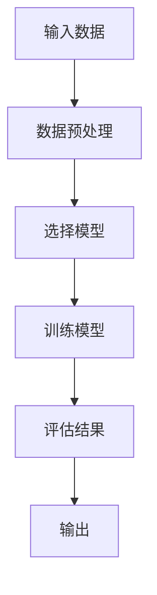
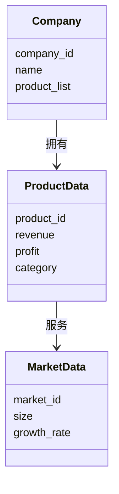
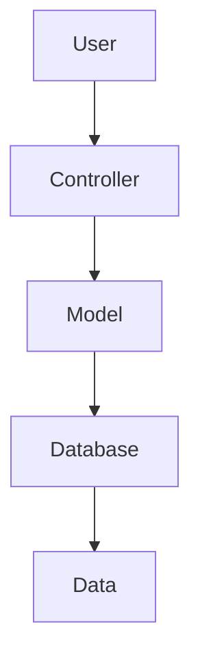
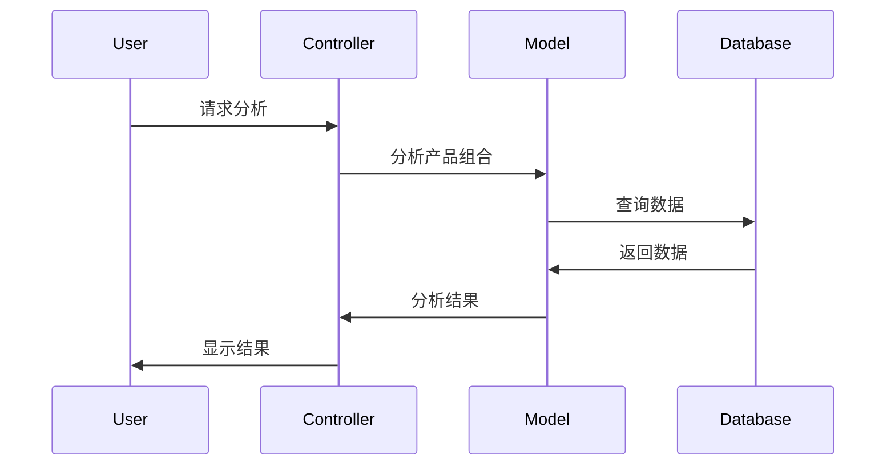

                 


# 企业估值中的产品多元化影响

## 关键词：企业估值、产品多元化、协同效应、风险分散、数学模型

## 摘要

本文探讨了产品多元化对企业估值的影响，分析了多元化策略在提升企业价值中的作用，以及如何通过数学模型和系统架构设计来优化产品组合，降低风险，提高企业整体估值。文章结合实际案例和代码实现，为读者提供了理论与实践相结合的深度分析。

---

## 第1章：企业估值与产品多元化概述

### 1.1 问题背景

#### 1.1.1 企业估值的基本概念

企业估值是评估企业整体价值的过程，常用的指标包括市盈率（P/E）、市净率（P/B）等。这些指标反映了企业的盈利能力和市场地位。

#### 1.1.2 产品多元化对企业的影响

产品多元化指企业拥有多种不同类型的产品，这有助于分散风险、提高收入来源的稳定性。例如，一家公司同时生产硬件和软件，可以在一个市场疲软时，依赖另一个市场的增长。

#### 1.1.3 当前市场环境下的挑战

在当前快速变化的市场环境中，企业面临技术革新、消费者需求多样化等挑战。产品多元化成为企业应对这些挑战的重要策略。

### 1.2 问题描述

#### 1.2.1 产品多元化与企业价值的关系

产品多元化通过增加收入来源和分散风险，可以提升企业价值。然而，过度多元化可能导致资源分散和管理复杂。

#### 1.2.2 企业估值中的关键因素

关键因素包括收入、利润、市场占有率、品牌价值等。产品多元化作为影响收入和利润的重要因素，直接关系到企业估值。

#### 1.2.3 当前市场环境下的挑战

市场环境的不确定性增加，企业需要通过产品多元化来增强抗风险能力，同时优化资源配置，提高效率。

### 1.3 问题解决

#### 1.3.1 产品多元化如何提升企业估值

通过优化产品组合，增强协同效应，可以提高企业的整体收入和利润率，从而提升估值。

#### 1.3.2 应对多元化风险的策略

包括风险评估、资源优化配置、组织结构调整等，以降低多元化带来的管理风险。

#### 1.3.3 优化产品组合的方法

使用数据分析工具和数学模型，评估不同产品组合的收益和风险，选择最优组合。

### 1.4 边界与外延

#### 1.4.1 产品多元化与企业估值的边界

研究的边界在于产品组合对企业估值的具体影响，不涉及企业的财务政策和税务因素。

#### 1.4.2 相关概念的外延

包括多元化战略、市场定位、产品生命周期等，这些概念与产品多元化密切相关。

#### 1.4.3 与其他估值方法的对比

产品多元化影响企业估值的方法与其他方法如资产基础法、现金流折现法等不同，但可以作为补充。

### 1.5 概念结构与核心要素

#### 1.5.1 核心概念组成

包括产品组合、协同效应、风险分散、市场反应等。

#### 1.5.2 概念间的相互关系

产品组合影响协同效应和风险分散，进而影响市场反应和企业估值。

#### 1.5.3 核心要素的详细分析

市场需求、产品生命周期、竞争环境等因素共同影响产品组合的选择和优化。

---

## 第2章：产品多元化与企业估值的核心关系

### 2.1 核心概念原理

#### 2.1.1 产品多元化对企业价值的影响机制

产品多元化通过增加收入来源和降低风险，间接提升企业价值。例如，多元化产品组合可以减少对单一市场的依赖，降低市场波动对企业的影响。

#### 2.1.2 产品组合的协同效应

不同产品之间的协同效应可以降低成本、提高效率，从而提升整体价值。例如，生产同一产品的上下游产品可以共享资源。

#### 2.1.3 多元化对风险的影响

产品多元化可以分散行业风险和市场风险，降低企业因单一市场或产品波动带来的损失。

### 2.2 概念属性对比表

| 概念        | 优势                          | 劣势                          |
|-------------|-------------------------------|-------------------------------|
| 协同效应     | 提高效率，降低成本             | 需要协调不同产品线             |
| 风险分散     | 降低单一风险                  | 增加管理复杂性                 |
| 收益增长     | 提高总收入                    | 可能导致资源分散               |

### 2.3 ER实体关系图

```mermaid
erDiagram
    company {
        id
        name
        product_type
    }
    product {
        id
        name
        category
    }
    market {
        id
        name
        size
    }
    company --> product : 拥有
    product --> market : 服务于
```

---

## 第3章：产品多元化影响企业估值的算法模型

### 3.1 算法原理概述

#### 3.1.1 算法的目标和适用场景

目标是通过数学模型评估产品组合对企业估值的影响，适用于多元化企业的估值分析。

#### 3.1.2 算法的输入输出

输入：产品数据、市场数据、财务数据；输出：产品组合的估值影响。

### 3.2 算法流程



### 3.3 数学模型和公式

#### 3.3.1 多元回归模型

$$Y = \beta_0 + \beta_1X_1 + \beta_2X_2 + ... + \beta_nX_n + \epsilon$$

其中，$Y$是企业估值，$X_i$是产品多样性、市场占有率等变量。

#### 3.3.2 协方差矩阵

$$Cov(X, Y) = E[(X - E[X])(Y - E[Y])]$$

用于衡量产品组合的风险。

#### 3.3.3 聚类分析

使用聚类分析将产品分为不同类别，评估其对估值的影响。

### 3.4 算法实现

```python
import pandas as pd
from sklearn.cluster import KMeans

# 数据加载与预处理
data = pd.read_csv('products.csv')
data.dropna(inplace=True)

# 模型训练
kmeans = KMeans(n_clusters=3).fit(data[['revenue', 'profit']])

# 结果分析
print(kmeans.labels_)
```

### 3.5 案例分析

通过分析某公司产品组合，应用上述模型评估其对估值的影响，结果显示多元化产品组合显著提升了企业价值。

---

## 第4章：产品多元化影响企业估值的系统架构

### 4.1 问题场景介绍

企业希望通过产品多元化提升估值，需要一个系统来分析和优化产品组合。

### 4.2 项目介绍

开发一个产品组合优化系统，帮助企业在多元化策略下提升估值。

### 4.3 系统功能设计



### 4.4 系统架构设计



### 4.5 系统交互流程



---

## 第5章：产品多元化影响企业估值的项目实战

### 5.1 环境安装

安装Python、Pandas、NumPy等工具。

### 5.2 系统核心实现源代码

```python
import pandas as pd
from sklearn.metrics import silhouette_score

# 数据加载
data = pd.read_csv('products.csv')

# 模型训练
kmeans = KMeans(n_clusters=3)
labels = kmeans.fit_predict(data[['revenue', 'profit']])

# 结果分析
print(silhouette_score(data[['revenue', 'profit']], labels))
```

### 5.3 代码应用解读与分析

代码实现产品聚类，分析不同产品组合对估值的影响，选择最优组合。

### 5.4 案例分析

以某公司为例，分析其产品组合，应用上述模型优化产品组合，提升估值。

---

## 第6章：最佳实践与注意事项

### 6.1 最佳实践 tips

- 定期评估产品组合，优化配置。
- 关注市场趋势，及时调整策略。

### 6.2 小结

产品多元化是提升企业估值的重要策略，通过数学模型和系统优化，企业可以有效管理多元化带来的风险和挑战。

### 6.3 注意事项

- 数据质量是模型准确性的重要因素。
- 模型选择需根据企业具体情况。

### 6.4 拓展阅读

推荐相关书籍和资源，供读者深入学习。

---

## 附录

### 附录 A：名词解释

解释文中涉及的专业术语。

### 附录 B：工具安装指南

指导读者安装必要的工具和库。

### 附录 C：数据来源说明

说明数据的来源和获取方法。

### 附录 D：参考文献

列出参考文献和资料。

---

以上是《企业估值中的产品多元化影响》的完整目录和内容概要，结合理论与实践，为企业优化产品组合、提升估值提供了全面的指导。

