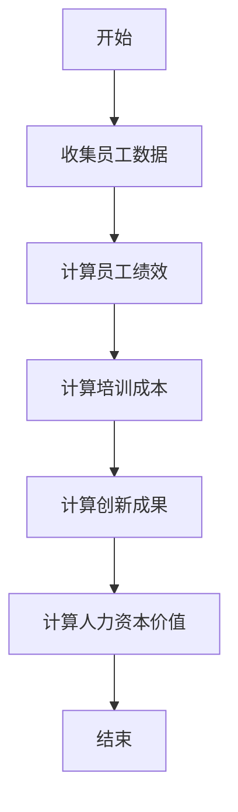
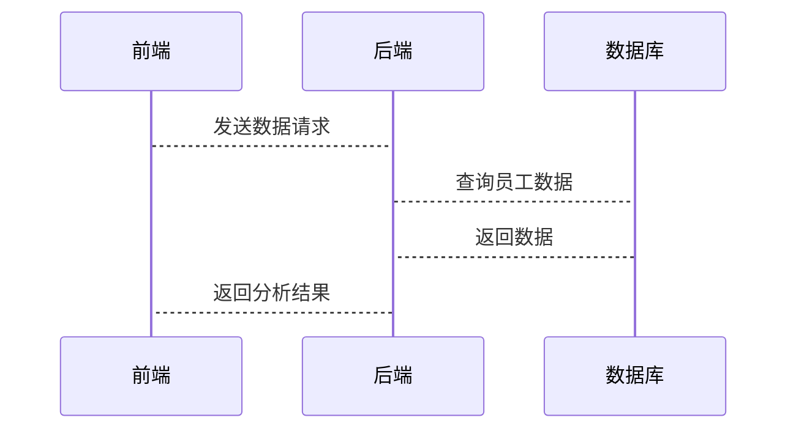

                 


# 企业估值中的人力资本价值法

## 关键词

企业估值，人力资本，价值法，人力资源管理，财务分析，创新方法

## 摘要

企业估值中的人力资本价值法是一种创新的方法，它将员工的能力、贡献和潜力转化为具体的经济价值，从而更全面地评估企业的真实价值。本文从背景介绍、核心概念、算法原理、系统架构到项目实战，详细阐述了如何将人力资本纳入企业估值体系，并通过实际案例展示其应用。

---

## 第一章：企业估值的传统方法与挑战

### 1.1 企业估值的传统方法

1.1.1 市盈率法

市盈率法通过将企业的股价除以每股收益来评估其价值。公式为：

$$市盈率 = \frac{股价}{每股收益}$$

1.1.2 市净率法

市净率法通过比较企业的市场价值与账面价值，公式为：

$$市净率 = \frac{市场价值}{账面价值}$$

1.1.3 现金流折现法

现金流折现法通过将未来现金流折现到当前价值来评估企业，公式为：

$$企业价值 = \sum_{t=1}^{n} \frac{CF_t}{(1 + r)^t}$$

1.1.4 企业价值倍数法

企业价值倍数法将企业的市场价值除以其息税折旧及摊销前利润（EBITDA），公式为：

$$企业价值倍数 = \frac{企业价值}{EBITDA}$$

### 1.2 传统方法的局限性

1.2.1 未考虑人力资本的价值

传统方法主要关注有形资产和财务指标，忽视了员工能力对企业价值的影响。

1.2.2 无法量化员工对企业价值的贡献

员工的创造力和执行力难以用具体数值衡量，导致企业估值的不准确性。

1.2.3 人力资源管理的复杂性

员工绩效、培训和留任概率等变量增加了评估的难度。

### 1.3 人力资本在企业估值中的重要性

1.3.1 人力资本的定义与内涵

人力资本是员工技能、经验和知识的集合，是企业创新和竞争力的源泉。

1.3.2 人力资本对企业价值的影响

通过提高效率和创新，人力资本可以直接增加企业收益和市场价值。

1.3.3 人力资本的动态变化与管理

企业需要通过培训和激励机制，持续优化人力资本的价值。

---

## 第二章：人力资本的价值构成与评估维度

### 2.1 人力资本的核心要素

2.1.1 员工技能与能力

包括技术能力、团队协作能力和创新能力。

2.1.2 员工贡献与绩效

通过绩效考核和KPI评估员工的贡献。

2.1.3 员工培训与发展

通过培训提升员工能力，增强企业竞争力。

### 2.2 人力资本的量化维度

2.2.1 员工的边际贡献

员工对收入的额外贡献，公式为：

$$边际贡献 = 收入 - 可变成本$$

2.2.2 员工的留任概率

员工留在企业的概率影响企业的稳定性。

2.2.3 员工的创新能力

创新能力强的员工能为企业带来更多的价值。

### 2.3 人力资本与企业价值的关系

2.3.1 人力资本对企业收益的影响

通过员工的贡献和创新，直接影响企业的收入和利润。

2.3.2 人力资本对资产价值的影响

高技能员工可以提高资产的使用效率，增加资产价值。

2.3.3 人力资本对市场价值的影响

优秀的人力资本管理能提升企业的品牌形象和市场价值。

### 2.4 人力资本价值法的ER实体关系图

```mermaid
er
actor: 员工
actor: 管理层
actor: 人力资源部门
entity: 人力资本
entity: 企业价值
entity: 评估结果
```

---

## 第三章：人力资本价值法的算法原理

### 3.1 人力资本价值法的数学模型

3.1.1 人力资本对收益的影响模型

$$收益 = a \times 人力资本 + b \times 有形资产 + c \times 市场因素$$

3.1.2 人力资本的量化公式

$$人力资本价值 = \sum_{i=1}^{n} (w_i \times x_i)$$

其中，\(w_i\) 是第i项的权重，\(x_i\) 是第i项的具体数值。

### 3.2 算法实现步骤

3.2.1 数据收集

收集员工绩效、培训成本和创新成果等数据。

3.2.2 数据分析

使用Python进行数据分析，计算人力资本的边际贡献。

3.2.3 评估结果

将人力资本价值纳入企业估值模型，计算总价值。

### 3.3 算法实现代码

```python
import pandas as pd

# 假设df为员工数据，包含绩效、培训成本和创新成果
def calculate_hc_value(df):
    weights = [0.4, 0.3, 0.3]  # 绩效、培训、创新的权重
    df['人力资本价值'] = df.apply(lambda x: weights[0]*x['绩效'] + weights[1]*x['培训成本'] + weights[2]*x['创新成果'], axis=1)
    return df

# 应用函数
hc_value_df = calculate_hc_value(df)
```

### 3.4 算法流程图



---

## 第四章：系统分析与架构设计

### 4.1 系统功能设计

4.1.1 数据收集模块

收集员工绩效、培训和创新数据。

4.1.2 数据分析模块

使用Python进行数据分析，计算人力资本价值。

4.1.3 评估结果模块

将人力资本价值纳入企业估值模型。

### 4.2 系统架构设计


### 4.3 系统交互流程



---

## 第五章：项目实战

### 5.1 案例分析

评估某科技公司的研发团队，收集员工绩效和创新成果数据。

### 5.2 数据分析

使用Python计算人力资本价值，分析其对整体估值的影响。

### 5.3 结果展示

将人力资本价值纳入企业估值模型，计算调整后的企业价值。

---

## 第六章：最佳实践与总结

### 6.1 成功经验总结

人力资本价值法能够更全面地评估企业价值，尤其是知识密集型行业。

### 6.2 需要注意的问题

数据收集的难度和模型的动态调整是实施中的挑战。

### 6.3 未来展望

随着AI和大数据的发展，人力资本价值法将更加精确和智能化。

---

## 结语

人力资本价值法为企业估值提供了新的视角，通过量化员工的能力和贡献，能够更全面地评估企业的真实价值。未来，随着技术的进步，这种方法将在企业管理和估值中发挥更大的作用。

---

**关键词：企业估值，人力资本，价值法，人力资源管理，财务分析，创新方法**

