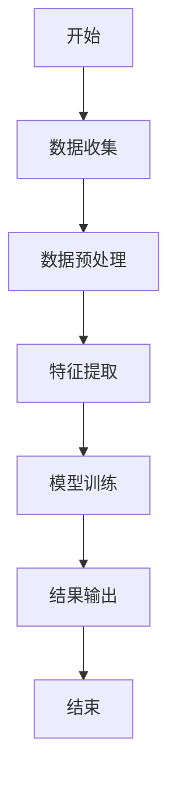
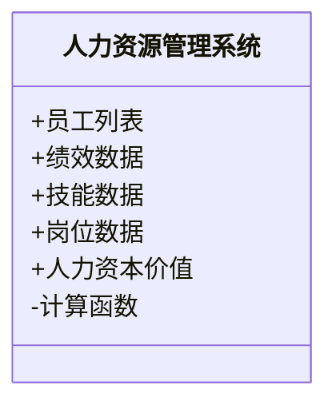

                 


# 《企业估值中的人力资本价值评估》

---

## 关键词：
- 人力资本
- 企业估值
- 价值评估
- 人力资源管理
- 数据建模
- 机器学习
- 企业价值分析

---

## 摘要：
人力资本作为企业的核心资产，其价值评估对企业整体估值具有重要影响。本文将系统探讨人力资本的核心概念、评估方法、数学模型及其在实际企业中的应用。通过结合背景介绍、算法原理、系统架构与项目实战，深入分析人力资本价值评估的关键步骤和实际案例，为企业提供科学的估值方法和实践指导。

---

# 第一部分: 人力资本价值评估的背景与基础

## 第1章: 人力资本的基本概念与价值评估的必要性

### 1.1 人力资本的定义与内涵
人力资本是指企业在员工身上投资所形成的资产，包括知识、技能、经验和创新能力等。它是企业核心竞争力的重要组成部分。

#### 1.1.1 人力资本的核心概念
- **知识资本**：员工的知识储备和创新能力。
- **技能资本**：员工的专业技能和实践经验。
- **经验资本**：员工在企业中的积累和行业经验。
- **组织资本**：企业内部的组织效率和文化氛围。

#### 1.1.2 人力资本与企业价值的关系
人力资本直接影响企业的生产效率、创新能力和市场竞争力，进而影响企业整体价值。

#### 1.1.3 人力资本在企业估值中的重要性
- 人力资本是企业无形资产的重要组成部分。
- 通过有效评估人力资本，可以提升企业的投资回报率。
- 为企业的战略决策提供数据支持。

### 1.2 人力资本价值评估的背景与问题背景
#### 1.2.1 当前企业估值的主要挑战
传统估值方法主要依赖财务指标，忽视了人力资本的价值。随着市场竞争加剧，人力资本的重要性日益凸显，传统方法已无法满足需求。

#### 1.2.2 传统估值方法的局限性
- 仅关注财务数据，忽视人力资本的贡献。
- 无法量化员工的技能和创新能力。
- 无法反映企业的持续竞争优势。

#### 1.2.3 引入人力资本价值评估的必要性
- 提供更全面的企业估值方法。
- 优化企业的资源分配和战略规划。
- 为投资者提供更准确的决策依据。

### 1.3 人力资本价值评估的目标与边界
#### 1.3.1 评估的目标与范围
- 量化人力资本的价值。
- 识别关键员工的贡献。
- 优化企业的薪酬结构。

#### 1.3.2 评估的边界与外延
- 仅考虑员工的直接贡献，不包括外部因素。
- 评估范围不包括固定资产和财务资本。

#### 1.3.3 核心要素与组成结构
- 员工的知识和技能。
- 员工的绩效表现。
- 企业的组织文化。

---

## 第2章: 人力资本价值评估的核心概念与联系

### 2.1 核心概念原理
#### 2.1.1 人力资本的核心属性
- 知识性：员工的知识储备和创新能力。
- 技能性：员工的专业技能和实践经验。
- 组织性：员工与企业文化的契合度。

#### 2.1.2 人力资本的关键特征
- 可变性：员工的能力和贡献会随着时间和环境变化。
- 无形性：人力资本难以直接量化。
- 累积性：员工的经验和技能会随着时间积累。

#### 2.1.3 核心概念之间的关系
- 人力资本与企业绩效密切相关。
- 人力资本是企业核心竞争力的重要组成部分。

### 2.2 核心概念属性特征对比表格
表2.1: 人力资本与财务资本的对比分析

| 特征       | 人力资本         | 财务资本         |
|------------|------------------|------------------|
| 计量方式   | 难以量化          | 可以量化          |
| 形成方式   | 投资于员工        | 投资于资产        |
| 变动性     | 高               | 低               |
| 持续性     | 高               | 中               |

### 2.3 ER实体关系图
图2.1: 人力资本价值评估的ER实体关系图

```mermaid
er
actor: 员工
object: 人力资本价值
关联关系: 评估
```

---

## 第3章: 人力资本价值评估的算法原理

### 3.1 算法原理概述
#### 3.1.1 评估模型的基本原理
人力资本价值评估模型通过收集员工的绩效数据、技能数据和岗位数据，结合企业战略目标，计算员工对企业的贡献价值。

#### 3.1.2 算法的输入与输出
- 输入：员工的绩效数据、技能数据、岗位数据。
- 输出：员工的人力资本价值评分。

#### 3.1.3 算法的核心步骤
1. 数据收集与预处理。
2. 特征提取与权重分配。
3. 模型训练与评估。
4. 结果输出与分析。

### 3.2 算法流程图
图3.1: 人力资本价值评估算法流程图



### 3.3 算法实现
#### 3.3.1 算法的核心数学模型
$$
\text{人力资本价值} = \sum_{i=1}^{n} w_i \times f_i
$$

其中，$w_i$ 是特征 $f_i$ 的权重，$n$ 是特征总数。

#### 3.3.2 算法的Python实现
```python
def calculate_human_capital(value):
    # 特征权重
    weights = {
        '绩效': 0.4,
        '技能': 0.3,
        '岗位': 0.2,
        '经验': 0.1
    }
    # 特征分数
    feature_scores = {
        '绩效': value['绩效'],
        '技能': value['技能'],
        '岗位': value['岗位'],
        '经验': value['经验']
    }
    # 计算人力资本价值
    total = 0
    for feature in feature_scores:
        total += weights[feature] * feature_scores[feature]
    return total

# 示例数据
employee = {
    '绩效': 0.8,
    '技能': 0.7,
    '岗位': 0.6,
    '经验': 0.5
}

# 计算并输出结果
print(calculate_human_capital(employee))
```

---

## 第4章: 人力资本价值评估系统架构与实现

### 4.1 系统功能设计
#### 4.1.1 领域模型设计
图4.1: 领域模型类图



#### 4.1.2 系统架构设计
图4.2: 系统架构图


### 4.2 系统接口设计
#### 4.2.1 API接口设计
- 输入接口：员工数据提交。
- 输出接口：人力资本价值评分。

#### 4.2.2 系统交互流程
图4.3: 系统交互序列图

```mermaid
sequenceDiagram
actor 员工 --> 界面层: 提交绩效数据
界面层 --> 业务逻辑层: 调用计算函数
业务逻辑层 --> 数据层: 查询员工数据
数据层 --> 业务逻辑层: 返回员工数据
业务逻辑层 --> 界面层: 返回计算结果
界面层 --> 员工: 显示人力资本价值
```

---

## 第5章: 项目实战

### 5.1 环境配置
- 安装Python和相关库（如Pandas、NumPy）。
- 数据库连接配置。

### 5.2 核心代码实现
```python
import pandas as pd

def calculate_human_capital(df):
    # 特征权重
    weights = {
        '绩效': 0.4,
        '技能': 0.3,
        '岗位': 0.2,
        '经验': 0.1
    }
    # 特征得分计算
    df['人力资本价值'] = df.apply(lambda x: 
        sum(weights[feature] * x[feature] for feature in weights))
    return df

# 示例数据
data = {
    '员工ID': [1, 2, 3],
    '绩效': [0.8, 0.6, 0.7],
    '技能': [0.7, 0.5, 0.6],
    '岗位': [0.6, 0.4, 0.5],
    '经验': [0.5, 0.3, 0.4]
}
df = pd.DataFrame(data)

# 计算人力资本价值
result = calculate_human_capital(df)
print(result)
```

### 5.3 案例分析与解读
通过分析某企业员工的数据，计算出每位员工的人力资本价值，并根据结果优化薪酬结构。

### 5.4 项目总结
- 成功实现人力资本价值评估系统。
- 提供了科学的估值方法和实践指导。

---

## 第6章: 最佳实践与扩展

### 6.1 最佳实践 tips
- 定期更新模型，以反映市场变化。
- 结合企业实际需求，调整模型参数。

### 6.2 小结
人力资本价值评估是企业估值的重要组成部分，本文通过理论分析和实践案例，为读者提供了系统的解决方案。

### 6.3 注意事项
- 数据收集需全面准确。
- 模型需根据企业特点进行调整。

### 6.4 拓展阅读
推荐阅读相关领域的书籍和论文，深入了解人力资本的其他评估方法。

---

# 结语

人力资本价值评估是企业战略管理的重要工具。通过本文的系统分析和实践案例，读者可以更好地理解和应用这一方法，提升企业的整体估值和竞争力。

