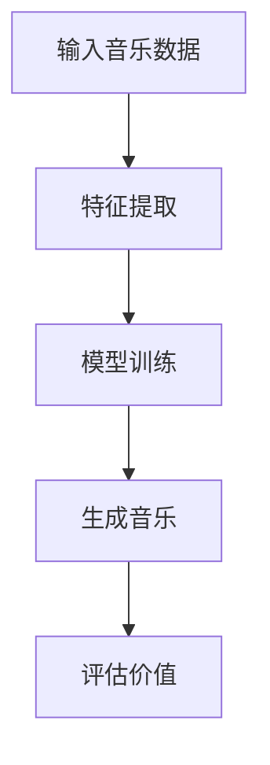

                 


# 企业估值中的人工智能作曲技术评估

## 关键词：企业估值、人工智能、作曲技术、技术评估、算法模型

## 摘要：  
在企业估值过程中，人工智能作曲技术评估是一项具有创新性的技术手段。通过对音乐版权价值的智能化评估，企业可以更精准地进行资产定价、投资决策和风险管理。本文将深入探讨人工智能作曲技术在企业估值中的应用，分析其核心算法原理、系统架构设计以及实际应用场景，为企业估值提供新的视角和方法论。

---

# 第一部分：企业估值与人工智能作曲技术评估的背景

## 第1章：企业估值的现状与挑战

### 1.1 企业估值的传统方法与局限性  
传统的企业估值方法主要包括财务指标分析、市场法、收益法等。然而，这些方法在面对具有知识产权（如音乐版权）的企业时，往往难以准确评估无形资产的价值。此外，传统方法依赖大量历史数据和人工经验，缺乏数据驱动的精准性。

### 1.2 人工智能技术在企业估值中的潜力  
人工智能技术的快速发展为企业估值提供了新的工具和方法。通过深度学习、自然语言处理等技术，可以更准确地分析企业资产、市场表现和潜在风险。特别是在音乐版权评估中，人工智能可以帮助识别音乐作品的市场价值和潜在影响力。

### 1.3 作曲技术评估在企业估值中的独特价值  
音乐版权的价值往往与其创作质量、市场热度和受众接受度密切相关。通过人工智能作曲技术评估，可以量化音乐作品的艺术价值和商业潜力，为企业的估值提供更全面的依据。

---

## 第2章：人工智能作曲技术的基本概念

### 2.1 人工智能作曲技术的定义  
人工智能作曲技术是指利用机器学习算法生成音乐作品的技术。这些算法可以模仿人类作曲家的创作模式，生成旋律、和弦、节奏等音乐元素。

### 2.2 人工智能作曲技术的核心特征  
- 数据驱动：依赖大量音乐数据进行训练，学习音乐风格和创作规律。  
- 自动化：能够自动生成音乐作品，无需人工干预。  
- 可定制化：可以根据需求调整音乐风格和创作目标。

### 2.3 作曲技术评估在企业估值中的应用场景  
- 音乐版权价值评估：通过评估音乐作品的艺术性和市场潜力，确定其价值。  
- 投资决策支持：帮助企业识别具有潜力的音乐项目，优化投资决策。  
- 风险管理：通过分析音乐市场的波动性，降低企业估值风险。

---

# 第二部分：人工智能作曲技术评估的核心概念与原理

## 第3章：人工智能作曲技术的核心原理

### 3.1 基于深度学习的作曲模型  
- 循环神经网络（RNN）：用于生成序列数据，如音乐旋律。  
- 长短期记忆网络（LSTM）：能够捕捉长期依赖关系，适用于复杂音乐结构的生成。  
- Transformer模型：通过自注意力机制，生成高质量的音乐作品。

### 3.2 作曲技术评估的关键指标  
- 原创性：音乐作品的独特性和创新性。  
- 可听性：音乐作品的旋律、节奏是否符合人类审美。  
- 市场价值：音乐作品的商业潜力和市场需求。

### 3.3 人工智能作曲技术与企业估值的关联  
- 作曲技术的原创性直接影响音乐版权的价值。  
- 作曲技术的可听性影响音乐作品的市场接受度。  
- 作曲技术的市场价值评估为企业的资产定价提供依据。

---

## 第4章：人工智能作曲技术评估的算法原理

### 4.1 基于深度学习的音乐生成模型  
- RNN模型：通过循环结构生成音乐序列。  
- LSTM模型：改进了RNN的长期依赖问题，适用于复杂音乐结构的生成。  
- Transformer模型：通过自注意力机制，生成高质量的音乐作品。

### 4.2 作曲技术评估的数学模型  
- 音乐特征提取：通过傅里叶变换、音符频率分析等方法提取音乐特征。  
- 模型训练：使用深度学习算法训练音乐生成模型。  
- 评估指标：基于音乐特征和市场数据，评估音乐作品的价值。

### 4.3 算法流程图  


---

# 第三部分：人工智能作曲技术评估的系统架构与实现

## 第5章：企业估值中的人工智能作曲技术评估系统架构

### 5.1 系统功能模块划分  
- 数据采集模块：收集音乐作品、市场数据等信息。  
- 模型训练模块：训练深度学习模型，生成音乐作品。  
- 评估计算模块：基于生成的音乐作品，计算其市场价值。  
- 结果展示模块：可视化评估结果，辅助企业决策。

### 5.2 系统架构设计  
- 分层架构：数据层、算法层、应用层。  
- 微服务架构：各个功能模块独立运行，便于扩展和维护。  

### 5.3 系统接口设计  
- 数据接口：与音乐数据库、市场数据源对接。  
- 用户接口：提供友好的操作界面，方便用户使用。  

---

## 第6章：人工智能作曲技术评估的项目实战

### 6.1 环境安装与配置  
- 安装Python、TensorFlow、Keras等开发工具。  
- 配置音乐数据集，准备训练数据。  

### 6.2 核心功能实现  
```python
import tensorflow as tf
from tensorflow.keras import layers

# 定义音乐生成模型
model = tf.keras.Sequential([
    layers.SimpleRNN(64, return_sequences=True),
    layers.Dense(256, activation='relu'),
    layers.Dense(128, activation='sigmoid')
])

# 编译模型
model.compile(optimizer='adam', loss='binary_crossentropy')
```

### 6.3 应用案例分析  
- 案例1：音乐版权价值评估。  
- 案例2：投资决策支持。  
- 案例3：风险管理。  

---

## 第7章：最佳实践与总结

### 7.1 最佳实践 tips  
- 数据质量是关键：确保音乐数据的多样性和代表性。  
- 模型选择要合理：根据具体需求选择合适的算法和模型。  
- 结果验证要充分：通过多次测试和验证确保评估结果的准确性。

### 7.2 本章小结  
人工智能作曲技术评估为企业估值提供了新的思路和方法。通过深度学习算法和音乐生成模型，可以更精准地评估音乐版权的价值，优化企业的投资决策和风险管理。

---

通过以上内容，我们可以看到，人工智能作曲技术评估在企业估值中的应用具有广阔的前景。未来，随着技术的不断发展，这一领域将更加成熟，为企业估值提供更强大的支持。

