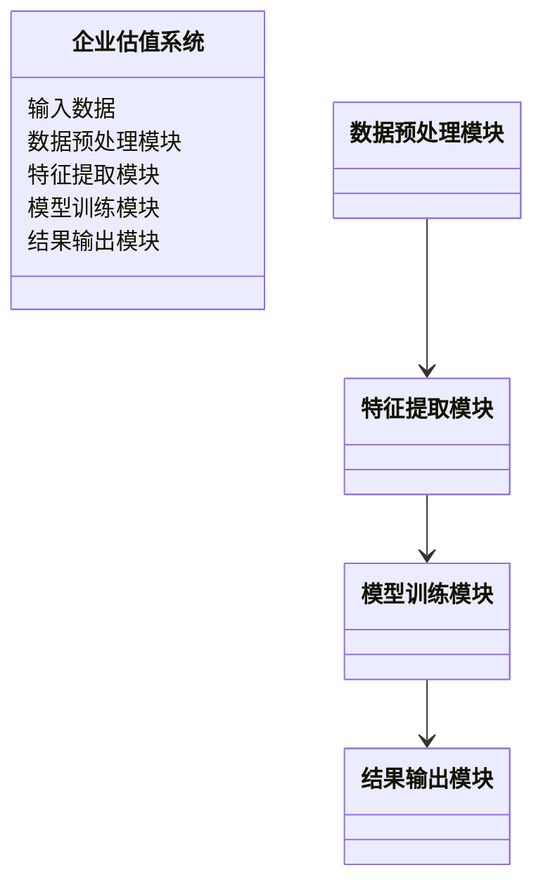
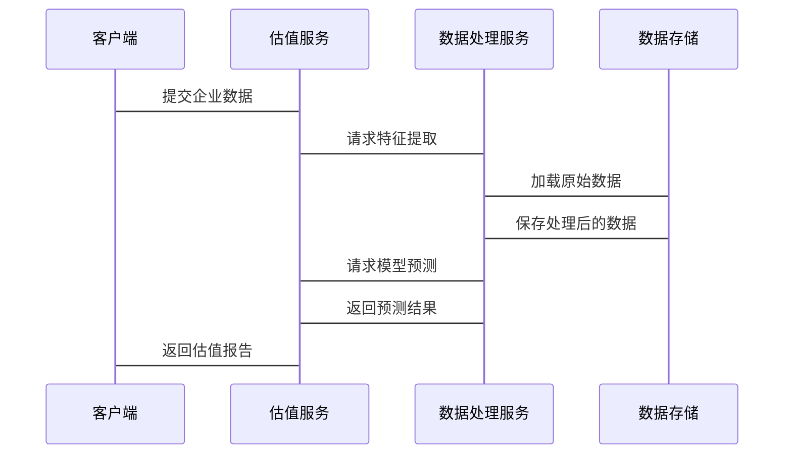

                 


# 企业估值中的人工智能应用价值评估

> 关键词：企业估值，人工智能，机器学习，数据驱动，金融分析

> 摘要：本文深入探讨了人工智能在企业估值中的应用价值，分析了传统估值方法的局限性，介绍了人工智能的核心概念与算法原理，结合实际案例展示了AI在提升估值准确性和效率方面的优势，并提出了系统的架构设计和最佳实践建议。

---

## 第1章：企业估值的基本概念

### 1.1 企业估值的定义与重要性

#### 1.1.1 企业估值的定义
企业估值是指对企业的整体价值进行评估的过程，通常包括财务表现、市场地位、资产状况、行业环境等多方面因素。准确的企业估值对企业融资、并购、投资决策具有重要意义。

#### 1.1.2 企业估值的重要性
- 为企业价值定价，支持资本运作。
- 帮助投资者做出明智决策。
- 优化企业管理和战略规划。

#### 1.1.3 企业估值的常见方法
- 市盈率法（P/E）
- 市净率法（P/B）
- 股权自由现金流模型（DCF）

### 1.2 人工智能在企业估值中的应用背景

#### 1.2.1 传统企业估值方法的局限性
- 数据依赖性高，难以处理复杂非结构化数据。
- 人工分析耗时且容易出错。
- 难以捕捉市场动态和新兴因素。

#### 1.2.2 数据驱动与人工智能的优势
- 处理海量数据，提取有价值的信息。
- 自动化分析，提高效率。
- 预测能力更强，考虑更多变量。

#### 1.2.3 人工智能在企业估值中的潜力
- 提供实时、动态的估值参考。
- 发现传统方法难以察觉的模式和趋势。
- 支持多维度数据融合，提升估值准确性。

---

## 第2章：人工智能与企业估值的核心概念

### 2.1 人工智能的基本原理

#### 2.1.1 机器学习的定义
机器学习是一种通过数据训练模型，使其能够从经验中学习并做出预测或决策的技术。

#### 2.1.2 监督学习与无监督学习的区别
- 监督学习：使用标记数据训练模型，预测新数据的标签。
- 无监督学习：从无标记数据中发现模式和结构。

#### 2.1.3 深度学习的简介
深度学习是机器学习的一种，使用多层神经网络处理复杂数据，如图像、文本和时间序列数据。

### 2.2 企业估值中的关键数据

#### 2.2.1 财务数据的重要性
- 收入、利润、资产、负债等财务指标是传统估值的核心。
- 需结合行业和市场环境进行调整。

#### 2.2.2 市场数据的影响力
- 市场趋势、行业竞争、政策变化影响企业估值。
- 利用市场数据进行实时调整和预测。

#### 2.2.3 公司治理与风险因素
- 公司治理结构、管理层质量影响企业长期价值。
- 风险因素如法律、环保、技术风险需综合评估。

### 2.3 人工智能在企业估值中的应用价值

#### 2.3.1 数据处理与特征工程
- 数据清洗：处理缺失值、异常值。
- 特征提取：从文本、图像等非结构化数据中提取特征。
- 特征选择：筛选重要特征，减少维度。

#### 2.3.2 模型训练与评估
- 选择合适的算法，如线性回归、随机森林、神经网络。
- 训练模型并进行交叉验证。
- 评估模型性能，调整参数优化结果。

---

## 第3章：人工智能算法原理与数学模型

### 3.1 线性回归模型

#### 3.1.1 线性回归的定义
线性回归是一种统计方法，用于建立自变量和因变量之间的线性关系。

#### 3.1.2 最小二乘法的数学公式
$$ \text{损失函数} = \sum_{i=1}^{n} (y_i - \hat{y}_i)^2 $$

#### 3.1.3 线性回归的应用案例
- 使用财务数据预测企业价值。

### 3.2 支持向量机（SVM）

#### 3.2.1 SVM的基本原理
SVM通过构建超平面将数据点分为不同类别，适用于分类和回归问题。

#### 3.2.2 SVM的优化目标
$$ \text{优化目标} = \max \left( \frac{1}{2} \|w\|^2 \right) $$

#### 3.2.3 SVM的应用案例
- 将企业分为高估、合理、低估三类进行分类。

### 3.3 神经网络

#### 3.3.1 神经网络的基本结构
- 输入层、隐藏层、输出层。

#### 3.3.2 神经网络的训练过程
- 前向传播：计算预测值。
- 反向传播：计算误差并更新权重。

#### 3.3.3 神经网络的应用案例
- 使用多层网络处理复杂数据，进行精准估值。

---

## 第4章：系统分析与架构设计方案

### 4.1 问题场景介绍

#### 4.1.1 项目目标
开发一个基于AI的企业估值系统，提高估值效率和准确性。

#### 4.1.2 项目范围
- 数据收集与处理。
- 模型训练与部署。
- 系统测试与优化。

### 4.2 系统功能设计

#### 4.2.1 领域模型（Mermaid类图）


#### 4.2.2 系统架构设计（Mermaid架构图）


#### 4.2.3 系统交互设计（Mermaid序列图）


---

## 第5章：项目实战

### 5.1 环境安装

```bash
pip install numpy pandas scikit-learn tensorflow
```

### 5.2 系统核心实现（Python代码）

#### 5.2.1 数据预处理
```python
import pandas as pd
import numpy as np

# 加载数据
data = pd.read_csv('企业数据.csv')

# 处理缺失值
data = data.dropna()

# 标准化处理
from sklearn.preprocessing import StandardScaler
scaler = StandardScaler()
data_scaled = scaler.fit_transform(data)
```

#### 5.2.2 模型训练
```python
from sklearn.linear_model import LinearRegression

# 训练模型
model = LinearRegression()
model.fit(data_scaled, target_values)

# 评估模型
from sklearn.metrics import mean_squared_error
y_pred = model.predict(data_scaled)
mse = mean_squared_error(target_values, y_pred)
print(f"均方误差: {mse}")
```

#### 5.2.3 实际案例分析
- 使用某科技公司的财务数据，通过模型预测其估值。
- 分析模型结果，调整参数优化预测准确性。

### 5.3 项目总结

#### 5.3.1 项目成果
- 开发了一个高效的企业估值系统。
- 提高了估值的准确性和效率。

#### 5.3.2 经验与教训
- 数据质量至关重要。
- 模型解释性需加强。
- 系统需持续优化和更新。

---

## 第6章：最佳实践与总结

### 6.1 最佳实践

#### 6.1.1 数据处理
- 确保数据质量，合理处理缺失值。
- 结合领域知识提取有效特征。

#### 6.1.2 模型选择
- 根据数据类型和任务选择合适的算法。
- 多算法对比，选择最优模型。

#### 6.1.3 模型部署
- 部署模型到生产环境，提供API服务。
- 监控模型性能，及时更新。

### 6.2 小结
人工智能在企业估值中具有巨大潜力，通过数据驱动和自动化分析，显著提升了估值的准确性和效率。然而，实际应用中需注意数据质量和模型解释性，确保系统的可靠性和可维护性。

### 6.3 注意事项
- 数据隐私和安全问题需严格把控。
- 模型需定期更新，适应市场变化。
- 保持对新技术的关注，优化系统性能。

### 6.4 拓展阅读
- 《机器学习实战》
- 《深度学习》
- 《Python机器学习》

---

通过以上内容，读者可以全面了解人工智能在企业估值中的应用价值，掌握相关技术的核心原理和实现方法，为实际应用提供有力支持。

