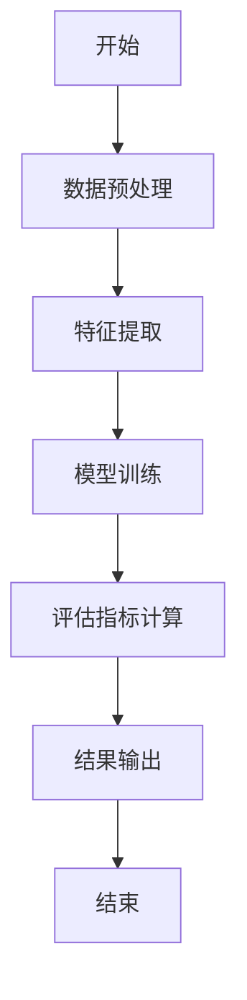

                 


# 《企业估值中的人工智能芯片设计评估》

---

## 关键词：
- 企业估值
- 人工智能芯片
- 芯片设计评估
- 算法原理
- 系统架构
- 项目实战

---

## 摘要：
本文深入探讨了在企业估值过程中，人工智能芯片设计评估的重要性及其具体方法。通过分析芯片设计的核心要素，结合算法原理和系统架构，本文提出了基于神经网络的评估模型，并通过实际案例展示了如何将理论应用于实践。文章最后总结了最佳实践和未来发展方向，为企业估值提供了新的视角和方法。

---

## 目录大纲

### 第一部分：背景介绍

#### 第1章：企业估值与人工智能芯片设计评估的背景

##### 1.1 问题背景与问题描述
- 1.1.1 传统企业估值方法的局限性
  - 财务指标的局限性
  - 市场环境的动态变化
- 1.1.2 人工智能芯片设计的核心作用
  - 芯片性能对企业估值的影响
  - 芯片设计的复杂性与创新性
- 1.1.3 问题解决的必要性与目标
  - 提升企业估值的准确性
  - 优化芯片设计与企业价值的关系

##### 1.2 问题背景与问题描述
- 1.2.1 企业估值的关键因素
  - 财务表现
  - 市场地位
  - 技术创新
- 1.2.2 人工智能芯片设计的复杂性
  - 技术参数的多样性
  - 成本与性能的平衡
- 1.2.3 问题解决的路径与方法
  - 数据驱动的方法
  - 智能算法的应用

##### 1.3 问题解决与边界外延
- 1.3.1 人工智能芯片设计评估的边界
  - 芯片性能评估的范围
  - 企业估值的适用场景
- 1.3.2 企业估值的外延与限制
  - 估值模型的适用性
  - 外部环境的不确定性
- 1.3.3 核心概念的结构与组成
  - 芯片设计评估的模块化
  - 企业估值的多维度分析

##### 1.4 本章小结
- 本章总结了企业估值与人工智能芯片设计评估的背景，明确了问题的必要性和解决路径。

---

### 第二部分：核心概念与原理

#### 第2章：人工智能芯片设计评估的核心概念

##### 2.1 核心概念的原理
- 2.1.1 人工智能芯片的基本原理
  - 神经网络的基本结构
  - 芯片的并行计算能力
- 2.1.2 芯片设计评估的关键指标
  - 性能指标（计算能力、功耗、面积）
  - 成本指标（制造成本、设计周期）
- 2.1.3 企业估值的核心要素
  - 芯片性能对企业的长期价值影响

##### 2.2 核心概念的特征对比
- 2.2.1 芯片性能与企业估值的关系
  - 高性能芯片对企业竞争力的影响
  - 低功耗芯片对企业成本的影响
- 2.2.2 不同芯片设计方法的对比
  - 基于规则的设计与基于仿真的设计
  - 硬件描述语言（HDL）的设计复杂性
- 2.2.3 企业规模与芯片复杂度的关联
  - 大型企业对高复杂度芯片的需求
  - 小型企业对低复杂度芯片的依赖

##### 2.3 ER实体关系图
```mermaid
er
    Entity: 芯片设计
    Entity: 企业估值
    Entity: 评估指标
    Relation: 芯片设计 -> 评估指标
    Relation: 企业估值 <-[通过评估指标影响] 芯片设计
```

##### 2.4 本章小结
- 本章详细讲解了人工智能芯片设计评估的核心概念，分析了芯片性能与企业估值之间的关系。

---

### 第三部分：算法原理与数学模型

#### 第3章：人工智能芯片设计评估的算法原理

##### 3.1 算法原理概述
- 3.1.1 基于神经网络的芯片设计评估
  - 卷积神经网络（CNN）的应用
  - 循环神经网络（RNN）的应用
- 3.1.2 传统算法在芯片设计中的应用
  - 支持向量机（SVM）
  - K-近邻算法（KNN）
- 3.1.3 深度学习算法的优势
  - 大规模数据处理能力
  - 高精度预测能力

##### 3.2 算法流程图


##### 3.3 数学模型与公式
- 3.3.1 基于神经网络的芯片性能评估模型
  - 模型输入：芯片设计参数（如面积、功耗、计算能力）
  - 模型输出：企业估值影响指数
  - 模型公式：
    $$ \text{Value} = f(\text{面积}, \text{功耗}, \text{计算能力}) $$
- 3.3.2 优化算法的数学表达
  - 基于梯度下降的优化：
    $$ \theta := \theta - \alpha \frac{\partial J}{\partial \theta} $$
  - 群智优化算法：
    $$ \theta_{i+1} = \theta_i + \text{适应度差异} \times \text{学习率} $$

##### 3.4 本章小结
- 本章通过数学模型和算法流程图，详细讲解了人工智能芯片设计评估的算法原理。

---

### 第四部分：系统分析与架构设计

#### 第4章：人工智能芯片设计评估的系统架构

##### 4.1 问题场景介绍
- 4.1.1 芯片设计评估的复杂性
  - 多维度参数的综合评估
  - 不同芯片类型的需求差异
- 4.1.2 企业估值的多样性
  - 不同行业对芯片性能的需求差异
  - 不同企业规模对芯片设计的要求

##### 4.2 系统功能设计
- 4.2.1 系统功能模块化
  - 数据采集模块
  - 模型训练模块
  - 评估指标计算模块
- 4.2.2 系统功能流程
  - 数据预处理
  - 模型训练
  - 结果输出

##### 4.3 系统架构设计


##### 4.4 系统接口设计
- 4.4.1 系统输入接口
  - 芯片设计参数接口
  - 企业基本面数据接口
- 4.4.2 系统输出接口
  - 评估结果接口
  - 反馈优化接口

##### 4.5 本章小结
- 本章通过系统架构设计，详细分析了人工智能芯片设计评估的实现过程。

---

### 第五部分：项目实战与案例分析

#### 第5章：人工智能芯片设计评估的项目实战

##### 5.1 环境安装与配置
- 5.1.1 开发环境的选择
  - Python编程环境
  - 深度学习框架（TensorFlow、PyTorch）
- 5.1.2 数据集的准备
  - 芯片设计参数数据集
  - 企业估值数据集

##### 5.2 核心代码实现
- 5.2.1 数据预处理代码
  ```python
  import pandas as pd
  data = pd.read_csv('chip_design.csv')
  data.dropna(inplace=True)
  ```
- 5.2.2 模型训练代码
  ```python
  import tensorflow as tf
  model = tf.keras.Sequential([
      tf.keras.layers.Dense(64, activation='relu'),
      tf.keras.layers.Dense(1, activation='sigmoid')
  ])
  model.compile(optimizer='adam', loss='binary_crossentropy')
  model.fit(x_train, y_train, epochs=10)
  ```
- 5.2.3 评估指标计算代码
  ```python
  import numpy as np
  y_pred = model.predict(x_test)
  accuracy = np.mean(y_pred == y_test)
  ```

##### 5.3 案例分析与解读
- 5.3.1 案例一：高性能计算芯片设计评估
  - 数据背景：某科技公司设计的高性能计算芯片
  - 评估结果：对企业估值的影响
- 5.3.2 案例二：低功耗芯片设计评估
  - 数据背景：某物联网公司设计的低功耗芯片
  - 评估结果：对企业估值的影响

##### 5.4 项目小结
- 本章通过实际案例，展示了人工智能芯片设计评估的实现过程和应用效果。

---

### 第六部分：总结与展望

#### 第6章：人工智能芯片设计评估的总结与展望

##### 6.1 最佳实践 tips
- 数据质量的重要性
- 模型选择的灵活性
- 持续优化的必要性

##### 6.2 小结
- 本章总结了人工智能芯片设计评估的核心内容和实际应用。

##### 6.3 注意事项
- 数据偏差的处理
- 模型泛化的考虑
- 企业实际需求的匹配

##### 6.4 拓展阅读
- 深度学习在企业估值中的应用
- 芯片设计的最新技术发展
- 人工智能在金融领域的其他应用

##### 6.5 本章小结
- 本章总结了人工智能芯片设计评估的实践经验和未来发展方向。

---

## 总结：
通过以上目录大纲，我们可以清晰地看到《企业估值中的人工智能芯片设计评估》一书的逻辑结构和主要内容。从背景介绍到核心概念，从算法原理到系统架构，再到项目实战和总结展望，每一章都紧密相连，层层递进，为企业估值提供了全面而深入的指导。

