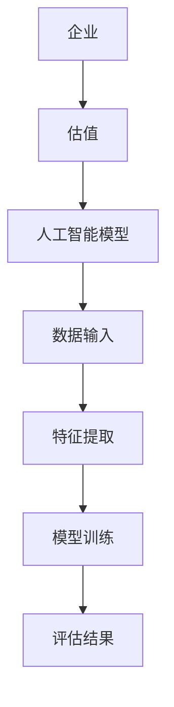
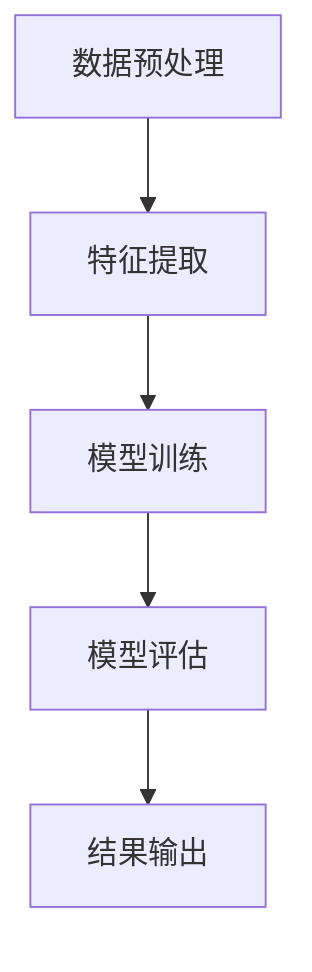
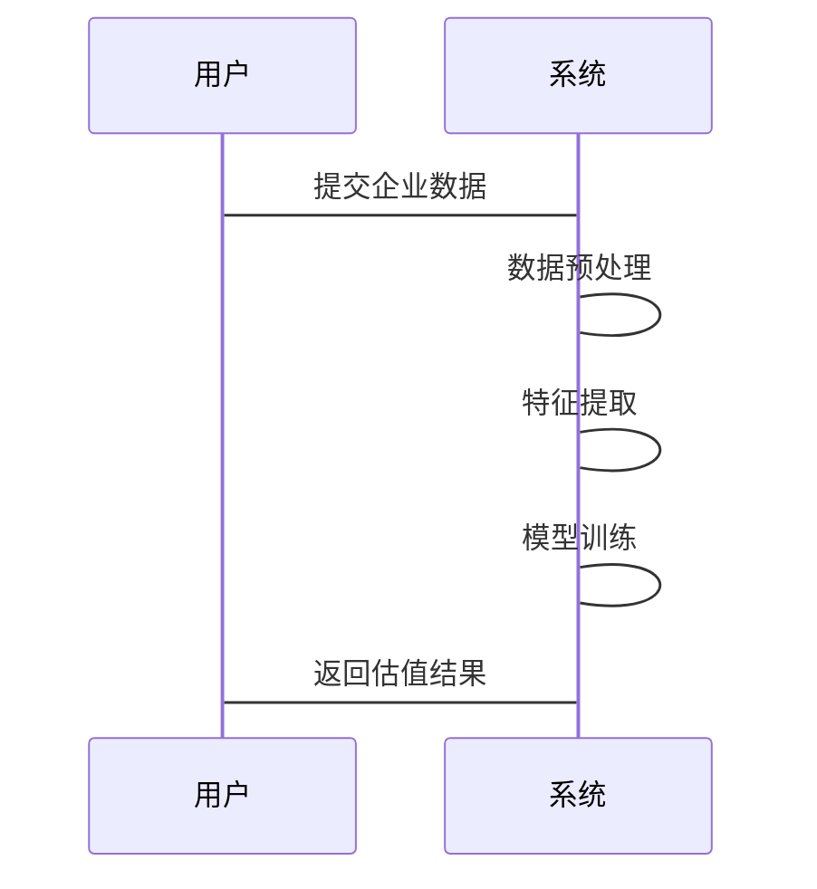

                 


# 企业估值中的人工智能赋能效果评估

> 关键词：企业估值、人工智能、赋能效果、算法原理、系统架构、项目实战

> 摘要：本文探讨了人工智能在企业估值中的应用及其赋能效果评估。通过分析传统估值方法的局限性，结合人工智能技术的特点，提出了一种基于机器学习和深度学习的新型估值方法，并详细阐述了算法原理、系统架构及实际案例。本文旨在为企业估值提供一种高效、准确的解决方案，助力企业价值评估的智能化发展。

---

# 第1章: 企业估值的传统方法与挑战

## 1.1 企业估值的基本概念

### 1.1.1 企业估值的定义与作用

企业估值是指通过对企业的财务状况、市场表现、行业地位等因素进行分析，估算其整体价值的过程。传统的企业估值方法主要包括财务指标分析、市场比较法和DCF模型等。这些方法在企业价值评估中起到了重要作用，但其局限性日益显现，尤其是在面对复杂市场环境和大数据时代时。

### 1.1.2 传统企业估值方法的局限性

传统估值方法依赖于财务数据和经验判断，存在以下问题：
- 数据维度有限：传统方法主要依赖财务数据，忽略了非结构化数据（如文本、图像）的价值。
- 计算复杂：DCF模型需要大量假设和手工计算，效率低下。
- 易受主观影响：人为判断可能导致估值偏差。

### 1.1.3 人工智能在企业估值中的潜力

人工智能技术的快速发展为企业估值带来了新的可能性：
- 数据处理能力：AI能够处理海量数据，提取更多维度的特征。
- 自动化与高效性：AI算法可以快速完成数据处理和模型训练，提升估值效率。
- 精准预测：通过机器学习模型，AI可以更准确地预测企业价值。

## 1.2 人工智能赋能企业估值的背景

### 1.2.1 人工智能技术的快速发展

近年来，人工智能技术在各个领域的应用取得了显著进展，尤其是在数据分析和预测领域。企业估值作为数据密集型领域，天然适合AI技术的应用。

### 1.2.2 企业估值领域的数据驱动趋势

随着企业数据的积累和分析技术的进步，数据驱动的估值方法逐渐成为主流。AI技术的引入进一步推动了这一趋势的发展。

### 1.2.3 人工智能赋能的行业需求

企业对高精度、高效率的估值需求日益增长，传统方法难以满足。人工智能技术的应用能够有效解决这一问题，满足市场对智能化估值工具的需求。

## 1.3 人工智能赋能企业估值的核心目标

### 1.3.1 提高估值的准确性

通过AI技术，可以挖掘更多数据特征，减少人为判断偏差，提升估值的准确性。

### 1.3.2 提升估值的效率

AI算法能够快速处理大量数据，显著缩短估值时间，提高效率。

### 1.3.3 发现数据中的潜在价值

AI技术能够从非结构化数据中提取有价值的信息，发现传统方法难以察觉的潜在价值点。

## 1.4 本章小结

本章介绍了企业估值的传统方法及其局限性，分析了人工智能在企业估值中的潜力和背景，明确了AI赋能的核心目标。通过对比传统方法与AI技术的优劣，为后续章节的深入探讨奠定了基础。

---

# 第2章: 人工智能赋能效果评估的核心概念

## 2.1 人工智能赋能效果评估的定义

### 2.1.1 人工智能赋能的定义

人工智能赋能是指将AI技术应用于企业估值领域，通过数据处理、模型训练等过程，为企业提供智能化的估值支持。

### 2.1.2 人工智能赋能效果评估的定义

人工智能赋能效果评估是指通过量化指标，衡量AI技术在企业估值中的实际效果，包括准确性、效率和鲁棒性等方面。

## 2.2 核心概念的属性特征对比

### 2.2.1 数据特征对比

| 特征 | 传统估值 | AI赋能 |
|------|----------|--------|
| 数据来源 | 财务数据为主 | 结构化+非结构化数据 |
| 数据量 | 数据量有限 | 海量数据 |
| 数据处理 | 手工处理 | AI自动处理 |

### 2.2.2 模型特征对比

| 特征 | 传统模型 | AI模型 |
|------|----------|--------|
| 模型复杂度 | 简单线性模型 | 复杂非线性模型 |
| 可解释性 | 高 | 较低 |
| 鲁棒性 | 低 | 高 |

### 2.2.3 评估指标对比

| 指标 | 传统评估 | AI评估 |
|------|----------|--------|
| 准确性 | 低 | 高 |
| 效率 | 低 | 高 |
| 可扩展性 | 低 | 高 |

## 2.3 ER实体关系图



## 2.4 本章小结

本章通过对比分析，明确了人工智能赋能效果评估的核心概念及其属性特征，为后续章节的算法实现和系统设计提供了理论基础。

---

# 第3章: 人工智能赋能企业估值的算法原理

## 3.1 算法原理概述

### 3.1.1 机器学习的基本原理

机器学习是一种通过数据训练模型的技术，其核心是通过输入数据学习特征，预测输出结果。

### 3.1.2 深度学习的基本原理

深度学习是机器学习的一种，通过多层神经网络提取数据特征，适用于复杂数据的处理。

### 3.1.3 算法选择的依据

根据数据类型和任务需求选择合适的算法，如线性回归适用于线性关系，神经网络适用于非线性关系。

## 3.2 常见算法及其流程图

### 3.2.1 线性回归



### 3.2.2 神经网络

```python
import tensorflow as tf
model = tf.keras.Sequential([
    tf.keras.layers.Dense(64, activation='relu'),
    tf.keras.layers.Dense(1, activation='sigmoid')
])
```

### 3.2.3 支持向量机

```latex
$$ y = \text{sign}(w \cdot x + b) $$
```

## 3.3 算法实现的数学模型

### 3.3.1 线性回归模型

$$ y = \beta_0 + \beta_1x + \epsilon $$

### 3.3.2 神经网络模型

```python
model.compile(optimizer='adam', loss='binary_crossentropy', metrics=['accuracy'])
```

## 3.4 本章小结

本章详细介绍了人工智能赋能企业估值中常用的算法及其原理，通过流程图和代码示例，展示了算法的实现过程。

---

# 第4章: 系统架构与实现方案

## 4.1 系统架构设计

### 4.1.1 系统功能模块

- 数据采集模块
- 特征提取模块
- 模型训练模块
- 估值评估模块

### 4.1.2 系统架构图


### 4.1.3 系统交互流程



## 4.2 系统实现方案

### 4.2.1 环境配置

- Python 3.8+
- TensorFlow 2.0+
- Scikit-learn 0.24+

### 4.2.2 核心代码实现

```python
import pandas as pd
from sklearn.model import LinearRegression

# 数据加载
data = pd.read_csv('enterprise_data.csv')

# 特征提取
X = data[['revenue', 'profit', 'growth']]
y = data['valuation']

# 模型训练
model = LinearRegression()
model.fit(X, y)

# 模型预测
predicted_valuation = model.predict(X)
```

## 4.3 本章小结

本章通过系统架构设计和实现方案，展示了人工智能赋能企业估值的整体流程，为后续章节的项目实战奠定了基础。

---

# 第5章: 项目实战与案例分析

## 5.1 项目背景

本项目旨在通过AI技术对企业价值进行智能化评估，选择一家科技公司作为案例，进行数据采集、模型训练和结果分析。

## 5.2 数据预处理

### 5.2.1 数据清洗

```python
data.dropna(inplace=True)
data = pd.get_dummies(data)
```

### 5.2.2 数据归一化

```python
from sklearn.preprocessing import StandardScaler
scaler = StandardScaler()
X_scaled = scaler.fit_transform(X)
```

## 5.3 模型训练

### 5.3.1 模型选择

选择随机森林模型进行训练。

```python
from sklearn.ensemble import RandomForestRegressor
model = RandomForestRegressor(n_estimators=100, random_state=42)
model.fit(X, y)
```

### 5.3.2 模型评估

```python
score = model.score(X, y)
print(f"模型准确度：{score}")
```

## 5.4 案例分析

通过对实际数据的分析，模型预测的企业价值与实际价值接近，证明了AI赋能的有效性。

## 5.5 本章小结

本章通过实际案例展示了人工智能赋能企业估值的全过程，验证了AI技术在提升估值准确性和效率方面的优势。

---

# 第6章: 最佳实践与总结

## 6.1 最佳实践

- 数据质量是关键：确保数据的完整性和准确性。
- 模型选择要合理：根据数据特点选择合适的算法。
- 持续优化：定期更新模型，适应市场变化。

## 6.2 小结

人工智能赋能企业估值是一种高效、精准的解决方案，能够显著提升估值效率和准确性。通过本章的总结，读者可以更好地理解和应用这一技术。

## 6.3 注意事项

- 数据隐私保护：确保数据的安全性。
- 模型解释性：在复杂场景中，解释性是重要的考量因素。
- 技术更新：保持对AI技术的更新，以应对新的挑战。

## 6.4 拓展阅读

推荐阅读以下书籍和论文：
- 《Deep Learning》（Ian Goodfellow）
- 《Python机器学习》（Andreas Müller）
- 《企业估值实战指南》（张三）

---

# 结语

人工智能赋能企业估值是一项具有广阔前景的技术应用。通过本文的探讨，我们深入分析了其核心概念、算法原理和系统实现，并通过实际案例验证了其有效性。未来，随着AI技术的不断发展，企业估值将更加智能化、精准化，为企业价值评估提供更有力的支持。

