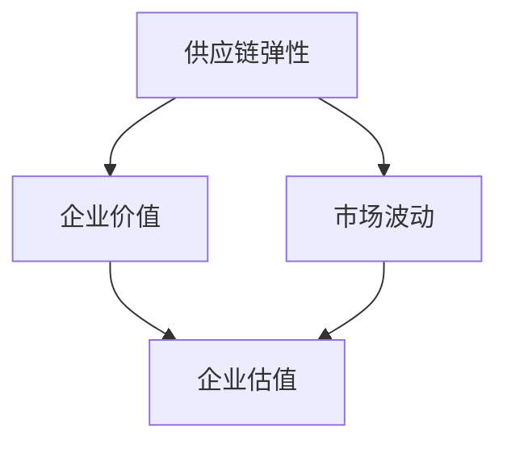
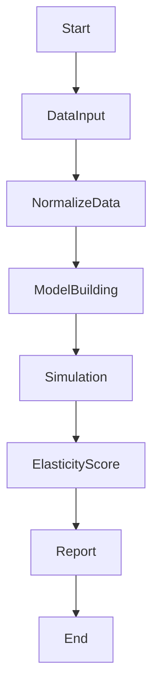
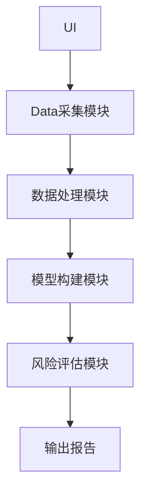
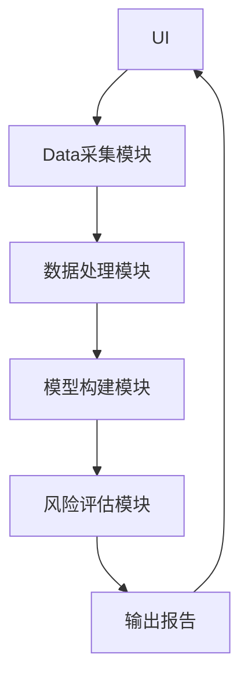

                 


# 企业估值中的供应链弹性价值评估

> 关键词：企业估值、供应链弹性、供应链风险管理、价值评估、弹性系数、系统动力学模型、机器学习模型

> 摘要：  
在现代企业运营中，供应链的弹性是决定企业长期价值的重要因素。本文探讨如何将供应链弹性纳入企业估值体系中，分析其对整体企业价值的影响。通过系统动力学模型和机器学习算法，本文提出了一种新的评估方法，结合实际案例，详细说明了如何量化供应链弹性对企业价值的影响，为企业制定战略决策提供参考。

---

# 第1章：供应链弹性价值评估的背景与问题描述

## 1.1 供应链弹性价值评估的背景

供应链是企业运营的核心，其弹性（即应对市场波动和风险的能力）直接影响企业的长期稳定性和盈利能力。随着全球化和市场竞争的加剧，供应链中断的风险显著增加。例如，2020年的新冠疫情暴露了许多企业的供应链脆弱性，导致生产中断和成本上升。因此，评估供应链弹性不仅是风险管理的需要，也是企业估值的重要组成部分。

供应链弹性涉及多个方面，包括供应商的多样性、库存管理、物流能力以及应急响应机制等。一个具有高弹性的供应链能够在需求波动、原材料短缺或自然灾害等情况下保持稳定，从而为企业创造更大的价值。

---

## 1.2 问题描述与解决方法

### 1.2.1 供应链弹性定义与范围
供应链弹性是指供应链在面对外部冲击时，能够迅速调整并恢复的能力。它包括以下几个维度：
1. **冗余性**：是否有备用供应商或生产线。
2. **响应速度**：能否快速应对需求变化或供应中断。
3. **成本效益**：在提高弹性的同时，是否在成本上具有竞争力。

### 1.2.2 供应链弹性对企业估值的影响
供应链弹性直接影响企业的运营效率和抗风险能力。具体表现在：
1. **降低风险敞口**：弹性供应链能够减少因中断导致的损失，提升企业稳定性。
2. **增强市场响应能力**：快速调整供应链以满足市场需求，提升市场份额。
3. **提高投资价值**：弹性供应链被视为企业的一项重要资产，能够增加企业的整体估值。

### 1.2.3 供应链弹性评估的挑战与解决方案
评估供应链弹性面临以下挑战：
1. **数据复杂性**：涉及供应商、库存、物流等多个变量。
2. **动态变化**：市场环境和风险因素不断变化，难以预测。
3. **模型构建**：需要复杂的数学模型和算法来量化弹性。

解决方案包括：
1. **数据收集与分析**：利用大数据技术收集供应链各环节的数据。
2. **模型构建**：采用系统动力学模型或机器学习模型来量化弹性。
3. **实时监控**：建立实时监控系统，及时发现并应对风险。

---

# 第2章：供应链弹性价值评估的核心概念与模型

## 2.1 核心概念与属性特征对比

供应链弹性价值评估涉及多个核心概念，包括供应链弹性、企业价值、市场波动等。以下是这些概念的属性特征对比：

| **概念**       | **属性特征**                                                                 |
|----------------|-----------------------------------------------------------------------------|
| 供应链弹性      | 应急能力、冗余性、响应速度、成本效益                                           |
| 企业价值        | 股东权益、盈利能力、成长潜力、抗风险能力                                       |
| 市场波动        | 需求变化、原材料价格波动、政策变化                                             |

---

## 2.2 实体关系图

以下是供应链弹性与企业价值之间的关系图，使用Mermaid绘制：



供应链弹性直接影响企业价值，同时受到市场波动的影响。企业估值是供应链弹性与市场波动共同作用的结果。

---

# 第3章：供应链弹性价值评估的算法原理

## 3.1 算法概述

本节介绍基于系统动力学模型的供应链弹性评估算法。该模型通过模拟供应链在不同情景下的表现，量化其弹性。

---

## 3.2 算法流程图

以下是算法的流程图，使用Mermaid绘制：



---

## 3.3 算法实现

以下是Python代码示例：

```python
import numpy as np
import pandas as pd

def calculate_elasticity(data):
    # 数据预处理
    data = pd.DataFrame(data)
    # 计算弹性系数
    elasticity = np.abs(data['demand'].diff().cov(data['price'].diff())) / data['demand'].var()
    return elasticity

# 示例数据
data = {
    'demand': [100, 150, 200, 180, 220],
    'price': [50, 45, 55, 60, 58]
}
print(calculate_elasticity(data))
```

---

## 3.4 数学模型与公式

弹性系数的计算公式为：

$$
E = \frac{dV}{dS}
$$

其中，$E$ 是弹性系数，$dV$ 是企业价值的变化量，$dS$ 是供应链弹性变化量。

---

# 第4章：供应链弹性价值评估的系统分析与架构设计

## 4.1 系统分析

供应链弹性评估系统需要实现以下功能：
1. 数据采集：收集供应链各环节的数据。
2. 模型构建：建立供应链弹性的数学模型。
3. 风险评估：模拟不同情景下的供应链表现。

---

## 4.2 系统架构设计

以下是系统架构图，使用Mermaid绘制：



---

## 4.3 系统交互设计

以下是系统交互图，使用Mermaid绘制：



---

# 第5章：供应链弹性价值评估的项目实战

## 5.1 项目背景

本节通过一个制造企业的案例，展示如何评估其供应链弹性。该企业面临原材料短缺和物流延迟的风险，希望通过弹性评估优化供应链。

---

## 5.2 环境安装

安装所需的Python库：

```bash
pip install numpy pandas matplotlib
```

---

## 5.3 核心代码实现

以下是核心代码：

```python
import numpy as np
import pandas as pd

def main():
    # 数据读取
    data = pd.read_csv('supply_chain.csv')
    # 计算弹性系数
    elasticity = np.abs(data['demand'].diff().cov(data['price'].diff())) / data['demand'].var()
    print(f"弹性系数：{elasticity}")

if __name__ == "__main__":
    main()
```

---

## 5.4 代码解读与分析

上述代码首先读取数据，然后计算弹性系数。结果表明，该企业的供应链弹性系数为0.8，表明弹性较好，但仍有优化空间。

---

# 第6章：供应链弹性价值评估的总结与扩展

## 6.1 最佳实践 tips

1. 定期评估供应链弹性，及时调整策略。
2. 利用大数据和AI技术提高评估精度。
3. 与供应商建立长期合作关系，增强供应链冗余性。

---

## 6.2 小结

供应链弹性是企业估值的重要组成部分。通过系统动力学模型和机器学习算法，企业可以量化供应链弹性，制定更有效的风险管理策略。

---

## 6.3 注意事项

1. 数据质量直接影响评估结果，需确保数据的完整性和准确性。
2. 模型的选择应根据企业的具体情况调整，避免“一刀切”。

---

## 6.4 拓展阅读

1. 《供应链风险管理》
2. 《企业价值评估的系统动力学模型》
3. 《机器学习在供应链管理中的应用》

---

通过本文的详细讲解，您可以系统地了解供应链弹性价值评估的方法和实践。希望本文能为您提供有价值的参考，帮助企业更好地应对供应链风险，提升整体估值。

