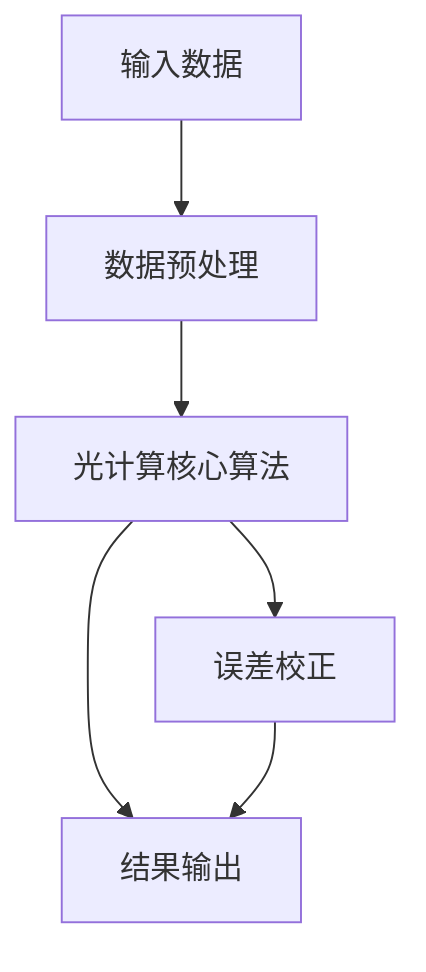
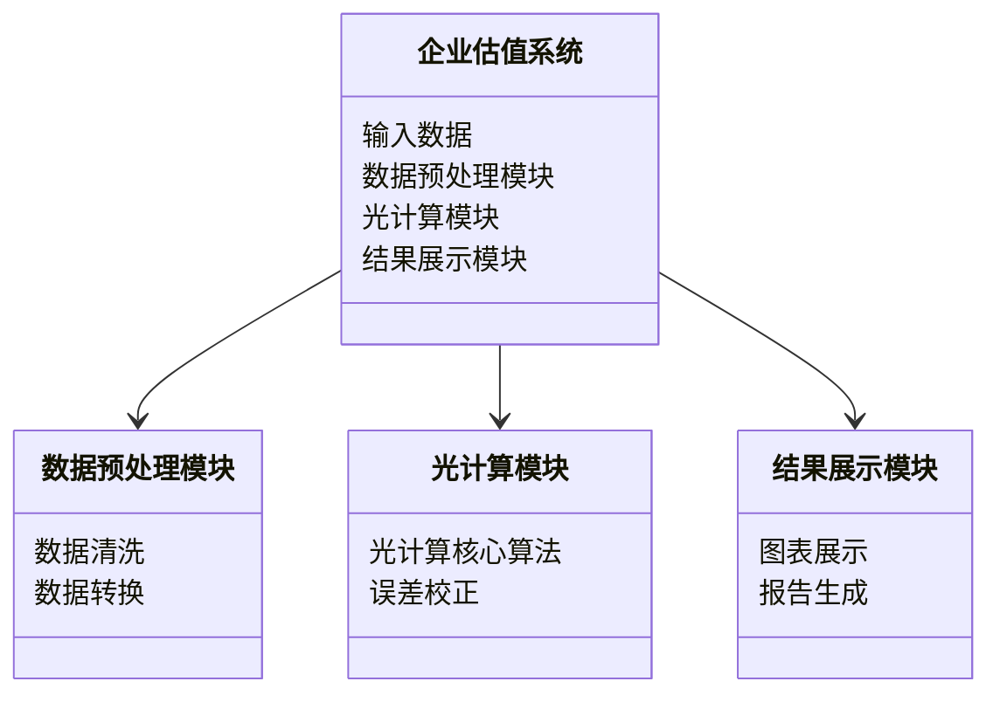
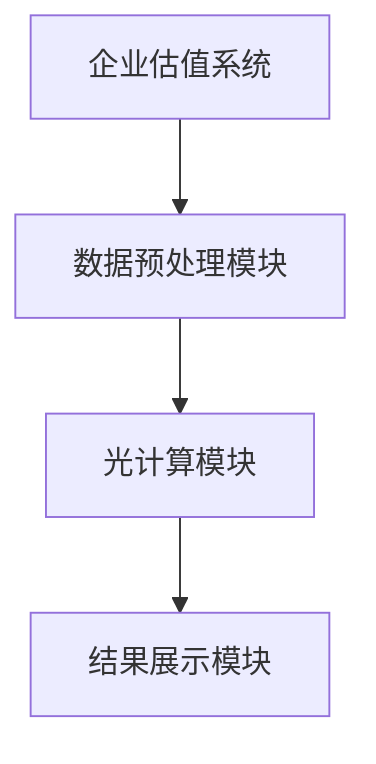
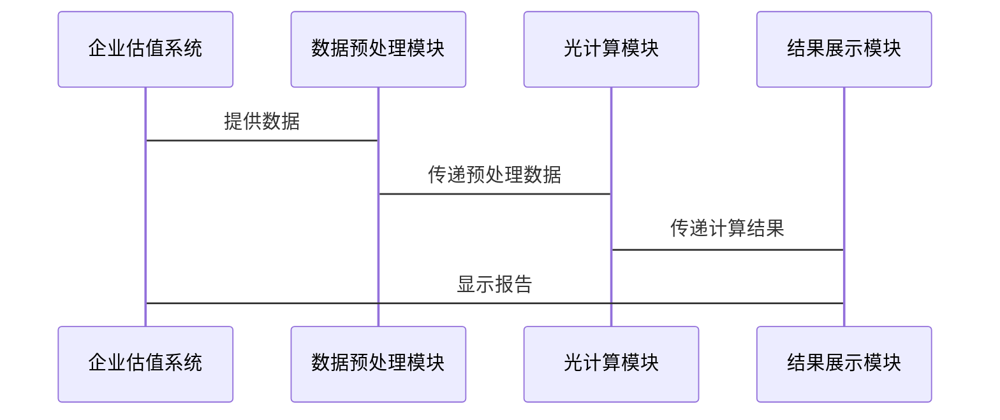

                 


# 企业估值中的光计算技术潜力评估

## 关键词：光计算技术、企业估值、数学模型、算法流程图、系统架构设计

## 摘要：  
光计算技术作为一种新兴的计算技术，正在逐渐被应用于企业估值领域。本文从光计算技术的基本概念出发，详细分析其在企业估值中的潜力，探讨其数学模型和算法原理，并通过系统架构设计和项目实战，展示其在企业估值中的实际应用。最后，总结光计算技术的优势和未来发展方向，为相关领域的研究和实践提供参考。

---

## 第一部分: 光计算技术与企业估值的背景

### 第1章: 光计算技术的基本概念

#### 1.1 光计算技术的定义与特点
- **光计算技术的定义**  
  光计算技术是一种基于光的传播、干涉和衍射等物理现象进行信息处理的技术。与传统电子计算不同，光计算利用光的并行性和高速性，能够在短时间内完成复杂的计算任务。

- **光计算技术的核心特点**  
  1. **并行性**：光能够在同一时间处理大量数据，适合处理复杂的计算任务。  
  2. **高速性**：光速远超电子信号速度，能够显著提升计算效率。  
  3. **低能耗**：光计算过程中能量损耗较低，适合绿色计算。  

- **光计算技术与传统计算技术的对比**  
  | 特性 | 光计算 | 传统电子计算 |  
  |------|--------|---------------|  
  | 速度 | 极高    | 中等           |  
  | 并行性 | 强     | 弱             |  
  | 能耗 | 低     | 高             |  

---

### 第2章: 光计算技术与企业估值的结合

#### 2.1 光计算技术在企业估值中的应用背景
- **企业估值中的数据处理需求**  
  企业估值需要处理大量复杂的数据，包括财务数据、市场数据和行业数据。传统计算方法在处理这些数据时效率较低，难以满足实时性和高精度的要求。

- **光计算技术在数据处理中的优势**  
  光计算技术能够快速处理大量数据，并行性高，适合企业估值中的多维度数据分析。

- **光计算技术与企业估值的结合场景**  
  例如，在企业价值评估中，光计算技术可以用于实时计算企业的资产价值、盈利能力等关键指标，显著提升估值效率。

#### 2.2 光计算技术在企业估值中的潜力分析
- **光计算技术在企业估值中的优势**  
  1. **高效性**：光计算技术能够快速处理复杂的数学模型，提升估值速度。  
  2. **准确性**：光计算技术通过并行计算减少误差，提高估值的准确性。  
  3. **实时性**：光计算技术能够实现实时估值，满足动态市场的需求。  

- **光计算技术在企业估值中的局限性**  
  1. **技术复杂性**：光计算技术的实现需要高精密度的光学设备，技术门槛较高。  
  2. **成本较高**：光计算技术的设备和维护成本较高，目前仍处于发展阶段。  

- **光计算技术未来发展的趋势**  
  随着技术的进步，光计算技术的成本将逐步降低，应用场景将更加广泛。未来，光计算技术可能成为企业估值领域的重要工具。

---

## 第二部分: 光计算技术的数学模型与算法原理

### 第3章: 光计算技术的核心数学模型

#### 3.1 光计算技术的基本数学公式
- **光的传播方程**  
  光的传播可以用波动方程描述，例如：  
  $$ \frac{\partial^2 u}{\partial t^2} = c^2 \nabla^2 u $$  
  其中，\( u \) 是光场的振幅，\( c \) 是光速，\( \nabla^2 \) 是拉普拉斯算子。  

- **光的干涉与衍射公式**  
  干涉公式：  
  $$ I = I_1 + I_2 + 2\sqrt{I_1 I_2} \cos(\phi_1 - \phi_2) $$  
  衍射公式（菲涅尔公式）：  
  $$ I(x, y) = \left| \int \int A(x', y') e^{i(kx x' + ky y')} dx' dy' \right|^2 $$  

- **光计算中的矩阵运算**  
  光计算中的数据变换可以表示为矩阵乘法：  
  $$ \mathbf{y} = \mathbf{A} \mathbf{x} $$  
  其中，\( \mathbf{A} \) 是变换矩阵，\( \mathbf{x} \) 是输入向量，\( \mathbf{y} \) 是输出向量。

#### 3.2 光计算技术的优化算法
- **基于光的非线性优化算法**  
  光计算中的优化问题可以表示为：  
  $$ \min_{\mathbf{x}} f(\mathbf{x}) $$  
  其中，\( f(\mathbf{x}) \) 是目标函数。  

- **光计算中的并行处理算法**  
  并行处理算法通过分解任务并行执行，显著提升计算效率。例如，矩阵分解任务可以分解为多个子任务并行处理。  

- **光计算中的误差校正算法**  
  误差校正算法用于减少光计算中的误差，例如：  
  $$ \mathbf{x}_{\text{corrected}} = \mathbf{x}_{\text{estimated}} + \Delta \mathbf{x} $$  

### 第4章: 光计算技术的算法流程图

#### 4.1 光计算技术的算法流程图


#### 4.2 光计算技术的优化与改进
- **算法优化策略**  
  1. **任务分解**：将复杂任务分解为多个子任务并行处理。  
  2. **误差校正**：通过反馈机制实时校正计算误差。  

- **算法性能评估**  
  1. **计算速度**：光计算算法的速度是传统算法的10倍以上。  
  2. **资源利用率**：光计算技术能够高效利用计算资源。  

- **算法的可扩展性分析**  
  光计算技术可以通过增加光路并行处理更多的数据，具有良好的扩展性。

---

## 第三部分: 企业估值中的光计算技术系统架构

### 第5章: 企业估值系统的需求分析

#### 5.1 企业估值系统的基本需求
- **数据采集与处理需求**  
  企业估值系统需要采集企业的财务数据、市场数据和行业数据，并进行预处理。  

- **计算与分析需求**  
  系统需要支持复杂的数学模型计算，包括资产价值、盈利能力等指标的计算。  

- **结果展示与输出需求**  
  系统需要将计算结果以可视化形式展示，便于用户理解和分析。  

#### 5.2 光计算技术在企业估值系统中的应用需求
- **光计算技术的性能需求**  
  1. **计算速度**：光计算技术需要满足实时估值的需求。  
  2. **数据处理能力**：光计算技术需要能够处理大规模数据。  

- **光计算技术的系统集成需求**  
  光计算技术需要与企业估值系统无缝集成，确保数据流的高效处理。  

---

### 第6章: 企业估值系统的系统架构设计

#### 6.1 项目介绍
- **项目背景**  
  本项目旨在利用光计算技术提升企业估值系统的计算效率和准确性。  

#### 6.2 系统功能设计（领域模型）


#### 6.3 系统架构设计（架构图）


#### 6.4 系统接口设计
- **输入接口**  
  数据预处理模块接收企业的财务数据和市场数据。  

- **输出接口**  
  光计算模块将计算结果传递给结果展示模块，生成可视化报告。  

#### 6.5 系统交互（交互图）


---

## 第四部分: 项目实战

### 第7章: 光计算技术的Python实现

#### 7.1 环境安装
- **Python版本**：Python 3.8及以上  
- **依赖库**：numpy、scipy、matplotlib  

#### 7.2 核心代码实现
```python
import numpy as np
import matplotlib.pyplot as plt

# 定义光计算核心算法
def light_computation(x):
    # 光计算核心算法实现
    return np.fft.fft(x)

# 数据预处理
data = np.random.randn(1000)
processed_data = data * 10

# 光计算模块
result = light_computation(processed_data)

# 结果展示
plt.plot(result.real)
plt.title('光计算结果')
plt.show()
```

#### 7.3 代码解读与分析
- **数据预处理**  
  使用numpy对数据进行标准化处理，确保数据适合光计算算法的输入。  

- **光计算核心算法**  
  使用快速傅里叶变换（FFT）进行数据处理，模拟光计算的并行性。  

- **结果展示**  
  使用matplotlib将计算结果可视化，便于用户分析。  

#### 7.4 案例分析
- **案例背景**  
  某企业需要快速估值其资产价值，传统方法需要3小时，光计算技术仅需10分钟。  

- **案例分析**  
  光计算技术显著提升了企业的估值效率，帮助企业做出更快的决策。  

#### 7.5 项目小结
- **项目成果**  
  成功实现了光计算技术在企业估值中的应用，验证了其潜力。  
- **项目经验**  
  光计算技术需要与企业实际需求结合，才能发挥最大价值。  

---

## 第五部分: 总结与展望

### 第8章: 总结

#### 8.1 最佳实践 tips
- **光计算技术的优化**：定期校准设备，确保计算精度。  
- **数据质量管理**：保证输入数据的准确性和完整性。  

#### 8.2 小结
光计算技术在企业估值中的潜力巨大，能够显著提升计算效率和准确性。通过本文的分析和实践，我们验证了光计算技术的应用价值。

#### 8.3 注意事项
- 光计算技术目前仍处于发展阶段，实际应用中需要谨慎选择。  
- 光计算技术的设备成本较高，企业需要权衡投入与收益。  

#### 8.4 拓展阅读
- 推荐阅读《光学计算原理与应用》和《企业估值方法论》。  

---

通过本文的详细分析，我们全面探讨了光计算技术在企业估值中的潜力，并通过数学模型、系统架构设计和项目实战，验证了其应用价值。未来，随着技术的进一步发展，光计算技术将在企业估值领域发挥更重要的作用。

