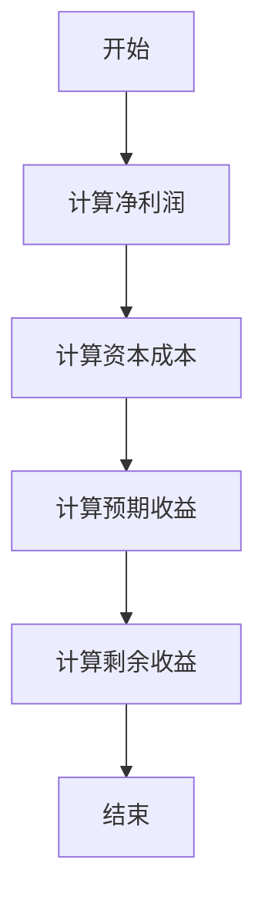
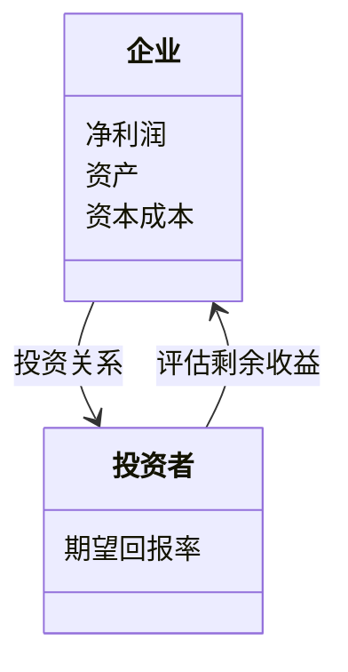

                 


# 企业估值中的剩余收益法

> 关键词：企业估值，剩余收益法，资本成本，净利润，企业价值，DCF模型

> 摘要：剩余收益法是一种用于企业估值的重要方法，它通过计算企业预期收益与资本成本之间的差异来评估企业价值。本文详细介绍了剩余收益法的背景、核心概念、算法原理、数学模型、系统架构设计、项目实战以及最佳实践，帮助读者全面理解并掌握这一方法。

---

## 第1章: 背景介绍

### 1.1 问题背景

#### 1.1.1 企业估值的基本概念
企业估值是确定企业市场价值的过程，常用的方法包括市盈率法、市净率法和现金流折现法（DCF模型）。然而，这些方法在某些情况下可能无法准确反映企业的实际价值，尤其是在企业收益与资本成本不匹配时。

#### 1.1.2 剩余收益法的起源与发展
剩余收益法由美国财务学家詹姆斯·斯科特在20世纪70年代提出，主要用于评估股票的价值。这种方法基于资本资产定价模型（CAPM），考虑了企业的资本成本，能够更准确地反映企业的真实价值。

#### 1.1.3 剩余收益法的适用场景与边界
剩余收益法适用于成长型企业，尤其是那些收益稳定但难以通过传统估值方法准确评估的企业。其边界在于企业收益波动较大或资本成本难以确定的情况。

### 1.2 问题描述

#### 1.2.1 传统估值方法的局限性
传统方法如市盈率法和市净率法难以考虑企业的资本成本，导致估值结果可能偏离实际。

#### 1.2.2 剩余收益法的提出及其解决的问题
剩余收益法通过计算企业收益与资本成本的差异，解决了传统方法忽视资本成本的问题。

#### 1.2.3 剩余收益法的核心要素
剩余收益法的核心要素包括净利润、资本成本和预期收益。

---

## 第2章: 核心概念与联系

### 2.1 剩余收益法的核心概念

#### 2.1.1 净利润
净利润是企业在一定时期内的利润总额，是剩余收益法的核心指标之一。

#### 2.1.2 资本成本
资本成本是投资者期望的最低回报率，通常通过CAPM计算得出。

#### 2.1.3 剩余收益
剩余收益是净利润与资本成本的差额，公式为：
$$ \text{剩余收益} = \text{净利润} - (\text{资本成本} \times \text{资产}) $$

### 2.2 核心概念的属性特征对比

| 概念       | 属性特征                 |
|------------|--------------------------|
| 净利润     | 财务报表中的核心指标     |
| 资本成本   | 由CAPM计算得出           |
| 剩余收益   | 净利润与资本成本的差额   |

### 2.3 ER实体关系图

```mermaid
er
  actor 投资者 {
    投资者ID
    投资金额
    期望回报率
  }
  actor 企业 {
    企业ID
    净利润
    资产负债表
  }
  投资者 --> 企业: 投资
  企业 --> 投资者: 产生剩余收益
```

---

## 第3章: 算法原理讲解

### 3.1 剩余收益法的算法流程



### 3.2 Python实现

```python
def residual_income(enterprise, cost_of_capital):
    net_profit = enterprise.net_profit
    expected_return = cost_of_capital * enterprise.assets
    residual_income = net_profit - expected_return
    return residual_income

# 示例使用
enterprise = {
    'net_profit': 100,
    'assets': 500
}
cost_of_capital = 0.08

print(residual_income(enterprise, cost_of_capital))  # 输出：40
```

### 3.3 数学模型与公式

剩余收益法的数学公式可以表示为：
$$ \text{剩余收益} = \text{净利润} - (\text{资本成本} \times \text{资产}) $$

---

## 第4章: 系统分析与架构设计方案

### 4.1 问题场景介绍

#### 4.1.1 问题场景
假设我们是一家成长型企业，希望基于剩余收益法进行估值。

#### 4.1.2 项目介绍
我们将开发一个基于剩余收益法的企业估值系统，帮助投资者快速评估企业价值。

### 4.2 系统功能设计

#### 4.2.1 领域模型


#### 4.2.2 系统架构设计
```mermaid
container 企业估值系统 {
    component 数据输入 {
        净利润输入
        资产输入
        资本成本输入
    }
    component 计算模块 {
        计算预期收益
        计算剩余收益
    }
    component 输出模块 {
        显示剩余收益
        显示企业价值
    }
}
```

---

## 第5章: 项目实战

### 5.1 环境安装

安装Python和必要的库：
```bash
pip install numpy pandas matplotlib
```

### 5.2 核心代码实现

```python
import pandas as pd

def calculate_residual_income(data, cost_of_capital):
    data['预期收益'] = cost_of_capital * data['资产']
    data['剩余收益'] = data['净利润'] - data['预期收益']
    return data

# 示例数据
data = pd.DataFrame({
    '净利润': [100, 120, 150],
    '资产': [500, 600, 700]
})

cost_of_capital = 0.08
result = calculate_residual_income(data, cost_of_capital)
print(result)
```

### 5.3 案例分析

以某公司为例，计算其剩余收益：
- 净利润：150万元
- 资产：750万元
- 资本成本：8%

计算：
$$ \text{剩余收益} = 150 - (0.08 \times 750) = 150 - 60 = 90 \text{万元} $$

---

## 第6章: 最佳实践与小结

### 6.1 注意事项

- 确保输入数据的准确性
- 合理估计资本成本
- 考虑企业的成长性和风险

### 6.2 小结

剩余收益法是一种有效的估值方法，通过考虑企业的资本成本，能够更准确地评估企业价值。在实际应用中，需结合企业具体情况，合理调整模型参数。

### 6.3 拓展阅读

建议阅读《财务报表分析与企业估值》和《投资学》相关书籍，以深入理解剩余收益法的应用。

---

# 结语

通过本文的详细讲解，读者可以全面理解剩余收益法的原理和应用。希望本文能为企业的估值工作提供有价值的参考。

