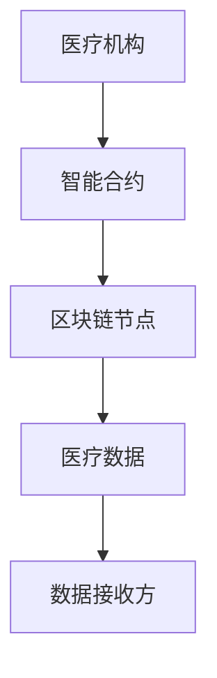

                 


# 《企业估值中的区块链医疗数据交换平台评估》

## 关键词：区块链，医疗数据交换，企业估值，数据隐私，智能合约

## 摘要：
本文系统地探讨了区块链技术在医疗数据交换平台中的应用及其对企业估值的影响。通过分析区块链如何提升数据安全性和交换效率，本文提出了基于区块链的医疗数据交换平台的架构设计和评估方法。结合实际案例，本文详细阐述了如何通过数据价值、技术实现、商业模式和市场竞争力等多维度进行企业估值，并展望了未来的发展趋势。

---

# 第一部分：区块链与医疗数据交换平台概述

## 第1章：区块链与医疗数据交换平台的背景与概念

### 1.1 区块链技术的基本概念
区块链是一种去中心化的分布式账本技术，通过密码学和共识机制确保数据的安全性和不可篡改性。其核心特点包括去中心化、透明性、不可篡改性和可追溯性。区块链的应用场景广泛，包括金融、供应链管理、医疗等。

### 1.2 医疗数据交换平台的定义与特点
医疗数据交换平台是指用于医疗机构之间共享患者数据的平台，其核心功能包括数据存储、传输和管理。医疗数据交换平台的现状面临数据隐私、安全性和 interoperability（互操作性）的挑战。

### 1.3 区块链与医疗数据交换的结合
区块链技术可以解决医疗数据交换中的信任问题和数据隐私问题。通过区块链，医疗数据可以在去中心化的网络中安全地共享，确保数据的准确性和不可篡改性。

## 第2章：区块链医疗数据交换平台的核心概念与联系

### 2.1 区块链医疗数据交换平台的核心要素
- 数据源：包括医院、诊所、实验室等医疗机构。
- 数据接收方：包括医生、保险公司、研究人员等。
- 区块链节点：负责验证和存储数据的节点。
- 智能合约：自动执行数据交换规则的自动化程序。

### 2.2 核心概念的属性对比
- 数据源与数据接收方：数据源负责提供数据，数据接收方负责处理和使用数据。
- 区块链节点与传统服务器：区块链节点去中心化，传统服务器中心化。
- 智能合约与传统数据交换协议：智能合约自动执行，传统协议依赖于中间方。

### 2.3 实体关系图（ER图）设计
```mermaid
erd
  entity 医疗机构 {
    [机构ID]
    [机构名称]
    [机构类型]
  }
  entity 医疗数据 {
    [数据ID]
    [患者ID]
    [数据类型]
    [数据值]
    [时间戳]
  }
  entity 区块链节点 {
    [节点ID]
    [节点地址]
    [存储数据]
  }
  entity 智能合约 {
    [合约ID]
    [合约内容]
    [执行结果]
  }
  医疗机构 -|{创建}|-> 医疗数据
  医疗数据 -|{存储}|-> 区块链节点
  医疗数据 -|{触发}|-> 智能合约
```

## 第3章：区块链医疗数据交换平台的算法原理与数学模型

### 3.1 区块链共识机制的算法原理
共识机制是区块链的核心算法，常见的共识机制包括PoW（工作量证明）、PoS（权益证明）、RAFT等。

- **PoW**：通过计算哈希值来验证区块的有效性。
- **PoS**：通过持有代币的数量来决定验证权力。
- **RAFT**：用于分布式系统中的一致性协议。

### 3.2 区块链共识机制的数学模型
$$
\text{概率} = \frac{\text{成功计算哈希值的次数}}{\text{总尝试次数}}
$$

### 3.3 区块链医疗数据交换的数学模型
$$
\text{数据价值} = \text{数据准确性} \times \text{数据可用性} \times \text{数据隐私性}
$$

---

# 第二部分：区块链医疗数据交换平台的核心概念与联系

## 第4章：区块链医疗数据交换平台的系统架构设计

### 4.1 系统功能设计
- 数据存储：分布式存储医疗数据。
- 数据传输：通过区块链进行数据的安全传输。
- 数据访问控制：基于权限控制数据访问。

### 4.2 系统架构设计


### 4.3 系统接口设计
- 数据源接口：医疗机构的数据上传接口。
- 数据接收方接口：数据处理方的数据获取接口。
- 区块链节点接口：区块链网络的节点管理接口。

---

# 第三部分：区块链医疗数据交换平台的算法原理与数学模型

## 第5章：区块链医疗数据交换平台的项目实战

### 5.1 环境安装
- 安装区块链框架（如Hyperledger Fabric）。
- 安装智能合约开发工具（如Node.js）。

### 5.2 核心代码实现
```javascript
// 智能合约代码
contract MyMedicalContract {
    function setData(bytes32 patientID, string data) {
        // 存储数据
    }

    function getData(bytes32 patientID) {
        // 获取数据
        return 数据;
    }
}
```

### 5.3 项目实战案例分析
- 案例：某医院的数据共享项目。
- 分析：通过区块链技术实现数据的安全共享，提升医疗效率。

---

# 第四部分：最佳实践与未来展望

## 第6章：区块链医疗数据交换平台的最佳实践

### 6.1 实践经验
- 数据隐私保护：通过零知识证明技术确保数据隐私。
- 系统性能优化：通过侧链或分片技术提升系统性能。

### 6.2 未来展望
- 医疗数据的跨机构共享将成为主流。
- 区块链技术将与人工智能结合，进一步提升医疗数据的分析能力。

---

通过以上结构，本文系统地探讨了区块链技术在医疗数据交换平台中的应用及其对企业估值的影响，为相关领域的研究和实践提供了参考。

