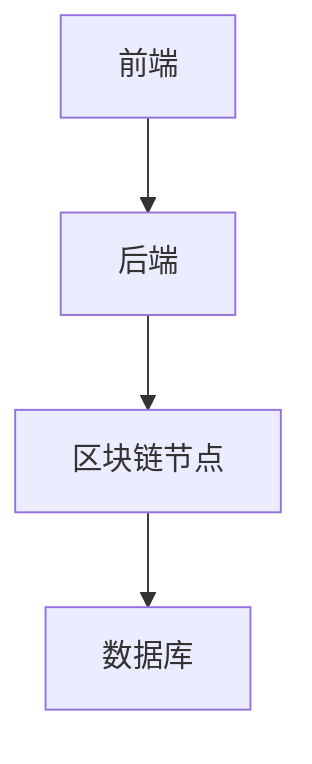

                 


```markdown
# 企业估值中的区块链去中心化金融平台评估

> 关键词：区块链、去中心化金融、企业估值、DeFi、评估模型

> 摘要：本文深入探讨了区块链去中心化金融（DeFi）平台在企业估值中的应用，分析了其核心概念、算法原理、系统架构以及实际项目中的应用场景。通过对比传统金融与DeFi的特征，构建了基于区块链技术的评估模型，并结合实际案例，展示了如何利用DeFi技术提升企业估值的透明度和准确性。

---

## 第1章 区块链去中心化金融平台的背景与概念

### 1.1 区块链技术的基本概念
#### 1.1.1 区块链的定义与特点
区块链是一种去中心化的分布式账本技术，具有以下特点：
- **去中心化**：数据不由单个机构控制，而是分布在多个节点上。
- **不可篡改**：通过加密算法确保数据一旦记录，无法被篡改。
- **透明性**：所有交易记录对所有参与者公开，确保透明性。
- **去信任化**：通过技术手段减少对中间机构的信任依赖。

#### 1.1.2 区块链的核心技术原理
区块链的核心技术包括：
1. **分布式账本**：所有交易记录在多个节点上，确保数据一致性。
2. **共识机制**：通过共识算法（如PoW、PoS）确保所有节点达成一致。
3. **智能合约**：自动执行的脚本，用于自动执行合同条款。

#### 1.1.3 区块链的分类与应用场景
区块链主要分为公链、私链和联盟链。其应用场景包括：
- 金融领域：跨境支付、证券交易。
- 物联网：设备间的自动交互。
- 供应链管理：追踪商品来源。

### 1.2 去中心化金融（DeFi）的概念与特点
#### 1.2.1 DeFi的定义与核心特征
DeFi是指基于区块链技术的去中心化金融服务，核心特征包括：
- **去中心化**：无需传统金融机构的中介。
- **透明性**：所有交易记录在区块链上，公开透明。
- **可编程性**：通过智能合约实现自动化的金融业务。

#### 1.2.2 DeFi与传统金融的区别
以下是DeFi与传统金融的对比：

| 特性 | DeFi | 传统金融 |
|------|------|----------|
| 中介 | 无   | 有       |
| 透明度 | 高 | 中等     |
| 成本 | 低 | 高       |
| 效率 | 高 | 中等     |

#### 1.2.3 DeFi的主要应用场景
DeFi的主要应用场景包括：
1. **去中心化交易所（DEX）**：基于区块链的加密货币交易所。
2. **借贷平台**：通过智能合约实现去中心化借贷。
3. **供应链金融**：通过区块链实现供应链融资。

### 1.3 区块链在企业估值中的作用
#### 1.3.1 区块链技术对企业估值的影响
区块链技术可以提高企业估值的透明度和准确性，降低估值成本。

#### 1.3.2 去中心化金融平台在企业估值中的应用
DeFi平台可以通过智能合约自动执行估值模型，提供实时的企业估值。

#### 1.3.3 区块链技术对企业透明度和信任度的提升
区块链技术可以确保企业数据的真实性和完整性，增强投资者的信任。

### 1.4 本章小结
本章介绍了区块链和DeFi的基本概念，分析了区块链在企业估值中的作用，并为后续章节奠定了基础。

---

## 第2章 区块链去中心化金融平台评估的核心概念与联系

### 2.1 区块链去中心化金融平台评估的背景
#### 2.1.1 传统企业估值的局限性
传统企业估值存在以下问题：
- 数据来源不透明
- 中间机构成本高
- 估值过程复杂

#### 2.1.2 区块链技术如何解决企业估值问题
区块链技术通过去中心化和透明性，解决了传统估值中的信任问题。

#### 2.1.3 去中心化金融平台在企业估值中的优势
DeFi平台的优势包括：
- 降低估值成本
- 提高估值效率
- 增强估值透明度

### 2.2 区块链去中心化金融平台评估的核心概念
#### 2.2.1 区块链去中心化金融平台的定义
DeFi平台是一个基于区块链的去中心化金融服务平台，支持多种金融业务。

#### 2.2.2 评估模型的构建与应用
评估模型是通过数学模型对企业和项目进行价值评估。

#### 2.2.3 评估指标的选择与权重分配
评估指标包括：
- 交易量
- 智能合约代码质量
- 平台活跃度

### 2.3 核心概念的原理与联系
#### 2.3.1 区块链去中心化金融平台的原理
DeFi平台通过智能合约自动执行金融业务，确保透明性和安全性。

#### 2.3.2 评估模型的数学公式与实现
评估模型的数学公式如下：

$$
\text{企业价值} = \sum (\text{评估指标} \times \text{权重})
$$

#### 2.3.3 评估指标与区块链技术的结合
通过区块链技术，确保评估指标的真实性和完整性。

### 2.4 本章小结
本章详细讲解了DeFi平台的核心概念，并分析了其与企业估值的联系。

---

## 第3章 区块链去中心化金融平台评估的算法原理

### 3.1 评估模型的数学模型与公式
评估模型的数学公式如下：

$$
\text{企业价值} = \alpha \times \text{收入} + \beta \times \text{利润} + \gamma \times \text{资产}
$$

其中，$\alpha, \beta, \gamma$ 是各指标的权重。

### 3.2 算法实现的步骤
1. 数据采集：收集企业的财务数据。
2. 数据预处理：清洗数据，去除异常值。
3. 模型训练：使用回归分析确定各指标的权重。
4. 模型预测：基于模型预测企业价值。

### 3.3 Python代码实现
```python
import pandas as pd
from sklearn.linear_model import LinearRegression

# 数据加载
data = pd.read_csv('企业数据.csv')

# 特征与目标变量分离
X = data[['收入', '利润', '资产']]
y = data['企业价值']

# 模型训练
model = LinearRegression()
model.fit(X, y)

# 预测企业价值
预测价值 = model.predict(X)
```

### 3.4 本章小结
本章详细讲解了评估模型的数学公式和实现步骤，并通过Python代码展示了如何实现模型。

---

## 第4章 区块链去中心化金融平台评估的系统分析与架构设计

### 4.1 项目介绍
本项目旨在构建一个基于区块链的DeFi平台，用于企业估值。

### 4.2 系统功能设计
系统功能包括：
- 数据采集模块
- 评估计算模块
- 结果展示模块

### 4.3 系统架构设计
系统架构如下：



### 4.4 本章小结
本章详细讲解了系统的功能设计和架构设计。

---

## 第5章 区块链去中心化金融平台评估的项目实战

### 5.1 环境安装
安装必要的工具和库：
```bash
pip install pandas numpy scikit-learn
```

### 5.2 核心代码实现
```python
import pandas as pd
from sklearn.linear_model import LinearRegression

# 数据加载
data = pd.read_csv('企业数据.csv')

# 特征与目标变量分离
X = data[['收入', '利润', '资产']]
y = data['企业价值']

# 模型训练
model = LinearRegression()
model.fit(X, y)

# 预测企业价值
预测价值 = model.predict(X)
```

### 5.3 本章小结
本章通过实际案例展示了如何利用DeFi技术进行企业估值，并提供了详细的代码实现。

---

## 第6章 最佳实践与注意事项

### 6.1 小贴士
- 数据来源要可靠
- 模型要可解释
- 代码要注释清晰

### 6.2 注意事项
- 数据隐私问题
- 智能合约的安全性
- 平台的合规性

### 6.3 拓展阅读
推荐阅读相关书籍和论文，深入了解DeFi和区块链技术。

### 6.4 本章小结
本章总结了项目中的注意事项和经验教训，并提供了拓展阅读的方向。

---

## 附录

### 附录A 术语表
- 区块链：分布式账本技术。
- DeFi：去中心化金融服务。

### 附录B 参考文献
- 文献1：《区块链技术入门与应用》
- 文献2：《去中心化金融：现状与未来》

---

## 结语

区块链去中心化金融平台在企业估值中的应用前景广阔，随着技术的不断发展，DeFi将为企业估值提供更加高效和透明的解决方案。

---

## 章节小结

通过以上章节的详细讲解，读者可以全面了解区块链去中心化金融平台在企业估值中的应用，并掌握相关的技术原理和实现方法。
</think>

```markdown
# 企业估值中的区块链去中心化金融平台评估

> 关键词：区块链、去中心化金融、企业估值、DeFi、评估模型

> 摘要：本文深入探讨了区块链去中心化金融（DeFi）平台在企业估值中的应用，分析了其核心概念、算法原理、系统架构以及实际项目中的应用场景。通过对比传统金融与DeFi的特征，构建了基于区块链技术的评估模型，并结合实际案例，展示了如何利用DeFi技术提升企业估值的透明度和准确性。

---

## 第1章 区块链去中心化金融平台的背景与概念

### 1.1 区块链技术的基本概念
#### 1.1.1 区块链的定义与特点
区块链是一种去中心化的分布式账本技术，具有以下特点：
- **去中心化**：数据不由单个机构控制，而是分布在多个节点上。
- **不可篡改**：通过加密算法确保数据一旦记录，无法被篡改。
- **透明性**：所有交易记录对所有参与者公开，确保透明性。
- **去信任化**：通过技术手段减少对中间机构的信任依赖。

#### 1.1.2 区块链的核心技术原理
区块链的核心技术包括：
1. **分布式账本**：所有交易记录在多个节点上，确保数据一致性。
2. **共识机制**：通过共识算法（如PoW、PoS）确保所有节点达成一致。
3. **智能合约**：自动执行的脚本，用于自动执行合同条款。

#### 1.1.3 区块链的分类与应用场景
区块链主要分为公链、私链和联盟链。其应用场景包括：
- 金融领域：跨境支付、证券交易。
- 物联网：设备间的自动交互。
- 供应链管理：追踪商品来源。

### 1.2 去中心化金融（DeFi）的概念与特点
#### 1.2.1 DeFi的定义与核心特征
DeFi是指基于区块链技术的去中心化金融服务，核心特征包括：
- **去中心化**：无需传统金融机构的中介。
- **透明性**：所有交易记录在区块链上，公开透明。
- **可编程性**：通过智能合约实现自动化的金融业务。

#### 1.2.2 DeFi与传统金融的区别
以下是DeFi与传统金融的对比：

| 特性 | DeFi | 传统金融 |
|------|------|----------|
| 中介 | 无   | 有       |
| 透明度 | 高 | 中等     |
| 成本 | 低 | 高       |
| 效率 | 高 | 中等     |

#### 1.2.3 DeFi的主要应用场景
DeFi的主要应用场景包括：
1. **去中心化交易所（DEX）**：基于区块链的加密货币交易所。
2. **借贷平台**：通过智能合约实现去中心化借贷。
3. **供应链金融**：通过区块链实现供应链融资。

### 1.3 区块链在企业估值中的作用
#### 1.3.1 区块链技术对企业估值的影响
区块链技术可以提高企业估值的透明度和准确性，降低估值成本。

#### 1.3.2 去中心化金融平台在企业估值中的应用
DeFi平台可以通过智能合约自动执行估值模型，提供实时的企业估值。

#### 1.3.3 区块链技术对企业透明度和信任度的提升
区块链技术可以确保企业数据的真实性和完整性，增强投资者的信任。

### 1.4 本章小结
本章介绍了区块链和DeFi的基本概念，分析了区块链在企业估值中的作用，并为后续章节奠定了基础。

---

## 第2章 区块链去中心化金融平台评估的核心概念与联系

### 2.1 区块链去中心化金融平台评估的背景
#### 2.1.1 传统企业估值的局限性
传统企业估值存在以下问题：
- 数据来源不透明
- 中间机构成本高
- 估值过程复杂

#### 2.1.2 区块链技术如何解决企业估值问题
区块链技术通过去中心化和透明性，解决了传统估值中的信任问题。

#### 2.1.3 去中心化金融平台在企业估值中的优势
DeFi平台的优势包括：
- 降低估值成本
- 提高估值效率
- 增强估值透明度

### 2.2 区块链去中心化金融平台评估的核心概念
#### 2.2.1 区块链去中心化金融平台的定义
DeFi平台是一个基于区块链的去中心化金融服务平台，支持多种金融业务。

#### 2.2.2 评估模型的构建与应用
评估模型是通过数学模型对企业和项目进行价值评估。

#### 2.2.3 评估指标的选择与权重分配
评估指标包括：
- 交易量
- 智能合约代码质量
- 平台活跃度

### 2.3 核心概念的原理与联系
#### 2.3.1 区块链去中心化金融平台的原理
DeFi平台通过智能合约自动执行金融业务，确保透明性和安全性。

#### 2.3.2 评估模型的数学公式与实现
评估模型的数学公式如下：

$$
\text{企业价值} = \sum (\text{评估指标} \times \text{权重})
$$

#### 2.3.3 评估指标与区块链技术的结合
通过区块链技术，确保评估指标的真实性和完整性。

### 2.4 本章小结
本章详细讲解了DeFi平台的核心概念，并分析了其与企业估值的联系。

---

## 第3章 区块链去中心化金融平台评估的算法原理

### 3.1 评估模型的数学模型与公式
评估模型的数学公式如下：

$$
\text{企业价值} = \alpha \times \text{收入} + \beta \times \text{利润} + \gamma \times \text{资产}
$$

其中，$\alpha, \beta, \gamma$ 是各指标的权重。

### 3.2 算法实现的步骤
1. 数据采集：收集企业的财务数据。
2. 数据预处理：清洗数据，去除异常值。
3. 模型训练：使用回归分析确定各指标的权重。
4. 模型预测：基于模型预测企业价值。

### 3.3 Python代码实现
```python
import pandas as pd
from sklearn.linear_model import LinearRegression

# 数据加载
data = pd.read_csv('企业数据.csv')

# 特征与目标变量分离
X = data[['收入', '利润', '资产']]
y = data['企业价值']

# 模型训练
model = LinearRegression()
model.fit(X, y)

# 预测企业价值
预测价值 = model.predict(X)
```

### 3.4 本章小结
本章详细讲解了评估模型的数学公式和实现步骤，并通过Python代码展示了如何实现模型。

---

## 第4章 区块链去中心化金融平台评估的系统分析与架构设计

### 4.1 项目介绍
本项目旨在构建一个基于区块链的DeFi平台，用于企业估值。

### 4.2 系统功能设计
系统功能包括：
- 数据采集模块
- 评估计算模块
- 结果展示模块

### 4.3 系统架构设计
系统架构如下：


### 4.4 本章小结
本章详细讲解了系统的功能设计和架构设计。

---

## 第5章 区块链去中心化金融平台评估的项目实战

### 5.1 环境安装
安装必要的工具和库：
```bash
pip install pandas numpy scikit-learn
```

### 5.2 核心代码实现
```python
import pandas as pd
from sklearn.linear_model import LinearRegression

# 数据加载
data = pd.read_csv('企业数据.csv')

# 特征与目标变量分离
X = data[['收入', '利润', '资产']]
y = data['企业价值']

# 模型训练
model = LinearRegression()
model.fit(X, y)

# 预测企业价值
预测价值 = model.predict(X)
```

### 5.3 本章小结
本章通过实际案例展示了如何利用DeFi技术进行企业估值，并提供了详细的代码实现。

---

## 第6章 最佳实践与注意事项

### 6.1 小贴士
- 数据来源要可靠
- 模型要可解释
- 代码要注释清晰

### 6.2 注意事项
- 数据隐私问题
- 智能合约的安全性
- 平台的合规性

### 6.3 拓展阅读
推荐阅读相关书籍和论文，深入了解DeFi和区块链技术。

### 6.4 本章小结
本章总结了项目中的注意事项和经验教训，并提供了拓展阅读的方向。

---

## 附录

### 附录A 术语表
- 区块链：分布式账本技术。
- DeFi：去中心化金融服务。

### 附录B 参考文献
- 文献1：《区块链技术入门与应用》
- 文献2：《去中心化金融：现状与未来》

---

## 结语

区块链去中心化金融平台在企业估值中的应用前景广阔，随着技术的不断发展，DeFi将为企业估值提供更加高效和透明的解决方案。

---

## 章节小结

通过以上章节的详细讲解，读者可以全面了解区块链去中心化金融平台在企业估值中的应用，并掌握相关的技术原理和实现方法。
```

