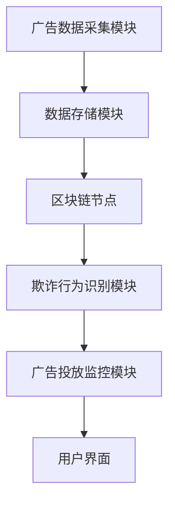
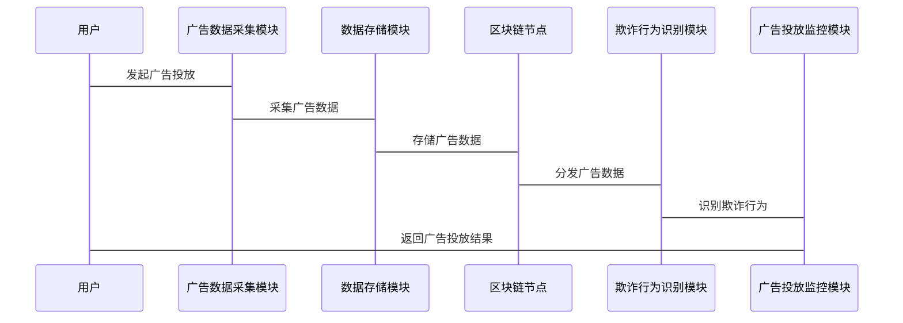

                 


# 企业估值中的区块链数字广告反欺诈平台评估

> 关键词：企业估值、区块链、数字广告、反欺诈平台、平台评估

> 摘要：随着数字广告行业的快速发展，欺诈行为对企业估值的影响日益显著。区块链技术以其去中心化、不可篡改和透明可信的特点，为解决数字广告反欺诈问题提供了新的可能性。本文从企业估值的角度，深入探讨区块链技术在数字广告反欺诈平台中的应用，分析其核心算法原理、系统架构设计及实际案例，为企业评估和优化数字广告反欺诈平台提供理论支持和实践指导。

---

# 第1章: 企业估值中的数字广告反欺诈问题

## 1.1 数字广告行业的现状与挑战

### 1.1.1 数字广告行业的快速发展

数字广告行业近年来呈现爆发式增长，2023年全球数字广告支出已超过5000亿美元。然而，行业的快速扩张也伴随着一系列问题，其中最突出的就是广告欺诈。广告欺诈行为不仅损害了广告主的利益，也影响了整个行业的健康发展。

### 1.1.2 数字广告中的欺诈问题

广告欺诈主要表现为以下几种形式：

1. **点击欺诈**：通过虚假点击或机器人点击增加广告点击量，骗取广告费。
2. **流量欺诈**：通过伪造流量来源或流量质量，骗取广告主信任。
3. **内容欺诈**：发布虚假或误导性内容，骗取用户点击或购买。
4. **刷单欺诈**：通过虚假交易制造虚假的销售数据。

### 1.1.3 欺诈行为对企业估值的影响

广告欺诈行为不仅会导致企业广告支出的浪费，还会对企业估值产生负面影响。例如，广告欺诈会导致广告点击量虚高，进而导致企业估值的虚增。此外，欺诈行为还会降低广告平台的信誉，进而影响整个行业的信任机制。

## 1.2 区块链技术在广告反欺诈中的应用潜力

### 1.2.1 区块链技术的核心特点

区块链技术具有以下核心特点：

1. **去中心化**：数据存储在多个节点上，不存在单点故障。
2. **不可篡改**：数据一旦写入区块链，无法被篡改。
3. **透明可信**：数据在区块链上是公开透明的，且可以通过共识机制确保数据的真实性和可信度。

### 1.2.2 区块链在广告行业的应用场景

区块链技术在数字广告行业中的应用场景包括：

1. **广告投放监测**：通过区块链技术实时监测广告投放的全过程，确保广告投放的真实性和透明性。
2. **广告点击监测**：通过区块链技术记录每一次广告点击行为，确保点击数据的真实性和准确性。
3. **数据共享与隐私保护**：通过区块链技术实现数据的可信共享，同时保护数据隐私。

### 1.2.3 区块链如何解决广告反欺诈问题

区块链技术通过以下方式解决广告反欺诈问题：

1. **数据不可篡改性**：通过区块链技术确保广告数据的真实性和不可篡改性，防止广告欺诈行为的发生。
2. **去中心化信任机制**：通过区块链技术构建去中心化的信任机制，确保广告平台的透明性和可信度。
3. **智能合约的应用**：通过智能合约自动执行广告投放和支付流程，减少人为干预，降低广告欺诈的风险。

## 1.3 平台评估的重要性与价值

### 1.3.1 平台评估的定义与目标

平台评估是指对数字广告反欺诈平台的技术性能、安全性、可靠性和效率进行全面评估的过程。其目标是通过评估确保平台能够有效识别和防止广告欺诈行为，同时保障广告投放的透明性和可信度。

### 1.3.2 平台评估对企业估值的意义

平台评估是企业估值的重要组成部分。一个高效、可靠的数字广告反欺诈平台能够显著降低广告欺诈风险，提高广告投放效率，进而提升企业的市场竞争力和估值。

### 1.3.3 平台评估的实现路径

数字广告反欺诈平台评估的实现路径包括：

1. **技术性能评估**：评估平台的技术性能，包括数据处理能力、算法准确性、系统响应速度等。
2. **安全性评估**：评估平台的安全性，包括数据存储的安全性、网络传输的安全性、系统防护能力等。
3. **用户体验评估**：评估平台的用户体验，包括界面设计、操作流程、用户反馈等。
4. **成本效益评估**：评估平台的成本效益，包括投入成本、运营成本、收益成本比等。

## 1.4 本章小结

本章从数字广告行业的现状与挑战出发，分析了广告欺诈行为对企业估值的影响，并探讨了区块链技术在广告反欺诈中的应用潜力。最后，提出了数字广告反欺诈平台评估的重要性与价值，为后续章节的深入分析奠定了基础。

---

# 第2章: 区块链数字广告反欺诈平台的核心概念与联系

## 2.1 区块链与数字广告反欺诈的核心概念

### 2.1.1 区块链的基本原理

区块链是一种分布式账本技术，通过去中心化的方式记录数据，并通过密码学技术确保数据的安全性和不可篡改性。区块链的核心机制包括：

1. **区块结构**：每个区块包含数据、时间戳、哈希值等信息。
2. **共识机制**：通过共识机制确保所有节点达成一致。
3. **智能合约**：通过智能合约实现自动化的数据处理和业务逻辑。

### 2.1.2 数字广告反欺诈的定义与分类

数字广告反欺诈是指通过技术手段识别和防止广告欺诈行为的过程。根据欺诈行为的类型，数字广告反欺诈可以分为点击欺诈、流量欺诈、内容欺诈等。

### 2.1.3 平台评估的关键指标

数字广告反欺诈平台评估的关键指标包括：

1. **准确性**：平台识别欺诈行为的准确率。
2. **响应速度**：平台处理广告数据的响应时间。
3. **安全性**：平台的数据存储和传输的安全性。
4. **可扩展性**：平台的扩展能力和处理能力。

### 2.1.4 核心概念的属性对比表

以下是区块链与传统广告反欺诈技术的核心属性对比表：

| 属性          | 区块链技术                  | 传统技术                  |
|---------------|-----------------------------|---------------------------|
| 数据存储      | 去中心化存储                | 中心化存储                |
| 数据安全性     | 高安全性，不可篡改          | 较低安全性，易篡改          |
| 可信性        | 高可信性，透明度高          | 低可信性，依赖中心机构      |
| 成本          | 较高，需要维护节点           | 较低，依赖中心机构维护      |
| 响应速度      | 较慢，依赖网络传输          | 较快，依赖中心服务器响应    |

### 2.1.5 ER实体关系图（Mermaid）

以下是区块链数字广告反欺诈平台的ER实体关系图：

```mermaid
erDiagram
    user {
        +id: int
        +name: string
        +role: string
    }
    ad_platform {
        +id: int
        +name: string
        +description: string
    }
    ad_fraud_detection {
        +id: int
        +algorithm: string
        +accuracy: float
    }
    transaction {
        +id: int
        +timestamp: datetime
        +status: string
    }
    user --> ad_platform: 使用
    user --> ad_fraud_detection: 配置
    ad_platform --> transaction: 记录
```

## 2.2 区块链与数字广告反欺诈的关系与联系

### 2.2.1 区块链与数字广告反欺诈的关系

区块链与数字广告反欺诈的关系可以分为以下几点：

1. **技术支撑**：区块链技术为数字广告反欺诈提供了技术支撑，包括数据存储、数据安全、数据可信等方面。
2. **业务协同**：区块链技术通过智能合约实现广告投放和支付的自动化，减少了人为干预，降低了广告欺诈的风险。
3. **信任机制**：区块链技术通过去中心化的信任机制，提高了广告平台的透明度和可信度。

### 2.2.2 区块链与数字广告反欺诈的联系

区块链与数字广告反欺诈的联系主要体现在以下几个方面：

1. **数据存储**：通过区块链技术实现广告数据的去中心化存储，确保数据的真实性和不可篡改性。
2. **数据安全**：通过区块链技术实现数据的加密存储和传输，防止数据被篡改或泄露。
3. **信任机制**：通过区块链技术构建去中心化的信任机制，提高广告平台的透明度和可信度。

## 2.3 本章小结

本章从区块链与数字广告反欺诈的核心概念出发，分析了区块链技术的基本原理、数字广告反欺诈的定义与分类，以及平台评估的关键指标。通过对比区块链与传统技术的核心属性，进一步明确了区块链技术在数字广告反欺诈中的优势。最后，通过ER实体关系图展示了区块链数字广告反欺诈平台的系统结构，为后续章节的深入分析奠定了基础。

---

# 第3章: 区块链数字广告反欺诈平台的算法原理

## 3.1 反欺诈算法的核心原理

### 3.1.1 基于区块链的去中心化信任机制

基于区块链的去中心化信任机制通过分布式账本技术实现广告数据的可信共享。每个广告数据块都包含广告投放的时间戳、广告ID、广告点击次数等信息，并通过区块链的共识机制确保数据的真实性和不可篡改性。

### 3.1.2 基于智能合约的自动化执行

基于智能合约的自动化执行是区块链技术在广告反欺诈中的重要应用。通过智能合约实现广告投放的自动化监控和支付流程，减少人为干预，降低广告欺诈的风险。

### 3.1.3 基于机器学习的欺诈行为识别

基于机器学习的欺诈行为识别是数字广告反欺诈的重要手段。通过机器学习算法，如随机森林、支持向量机等，对广告数据进行分析，识别出异常行为，从而实现欺诈行为的精准识别。

## 3.2 区块链数字广告反欺诈算法的数学模型与公式

### 3.2.1 基于区块链的去中心化信任机制

基于区块链的去中心化信任机制可以通过以下公式实现：

$$
H = \text{Hash}(M)
$$

其中，$H$ 表示哈希值，$M$ 表示需要加密的数据。通过哈希函数将数据加密，确保数据的真实性和不可篡改性。

### 3.2.2 基于智能合约的自动化执行

基于智能合约的自动化执行可以通过以下流程实现：

1. **智能合约部署**：将智能合约部署在区块链网络上，定义广告投放和支付的规则。
2. **广告投放触发**：当广告投放触发智能合约时，智能合约自动执行广告投放流程。
3. **广告支付确认**：智能合约根据广告投放结果自动确认广告支付，确保支付流程的透明性和可信度。

### 3.2.3 基于机器学习的欺诈行为识别

基于机器学习的欺诈行为识别可以通过以下步骤实现：

1. **数据收集与预处理**：收集广告数据并进行预处理，包括数据清洗、特征提取等。
2. **模型训练**：使用机器学习算法对广告数据进行训练，构建欺诈行为识别模型。
3. **模型预测**：通过模型预测广告行为的欺诈概率，识别出欺诈行为。

## 3.3 本章小结

本章从区块链数字广告反欺诈平台的算法原理出发，分析了基于区块链的去中心化信任机制、基于智能合约的自动化执行和基于机器学习的欺诈行为识别。通过数学模型和公式，详细阐述了区块链技术在广告反欺诈中的实现原理，为后续章节的系统分析与架构设计奠定了理论基础。

---

# 第4章: 区块链数字广告反欺诈平台的系统分析与架构设计

## 4.1 问题场景介绍

### 4.1.1 广告投放过程中的欺诈行为

广告投放过程中常见的欺诈行为包括虚假点击、虚假流量、虚假销售等。这些行为会导致广告主的广告支出浪费，同时也会影响广告平台的信誉。

### 4.1.2 平台评估的核心需求

数字广告反欺诈平台评估的核心需求包括：

1. **数据真实性的验证**：确保广告数据的真实性和不可篡改性。
2. **欺诈行为的识别**：通过技术手段识别和防止欺诈行为的发生。
3. **广告投放的透明化**：确保广告投放过程的透明性和可信度。

## 4.2 项目介绍

### 4.2.1 项目目标

本项目旨在通过区块链技术构建一个高效、可靠的数字广告反欺诈平台，实现广告数据的真实性和透明性，降低广告欺诈风险，提高广告平台的可信度和市场竞争力。

### 4.2.2 项目背景

随着数字广告行业的快速发展，广告欺诈行为日益猖獗，传统的广告反欺诈技术难以满足市场需求。区块链技术作为一种新兴的技术手段，为解决广告欺诈问题提供了新的思路和解决方案。

## 4.3 系统功能设计

### 4.3.1 系统功能模块划分

数字广告反欺诈平台的系统功能模块包括：

1. **广告数据采集模块**：负责采集广告数据，包括广告ID、广告点击次数、广告投放时间等。
2. **数据存储模块**：将广告数据存储在区块链上，确保数据的真实性和不可篡改性。
3. **欺诈行为识别模块**：通过机器学习算法识别欺诈行为，实现欺诈行为的精准识别。
4. **广告投放监控模块**：实时监控广告投放过程，确保广告投放的透明性和可信度。

### 4.3.2 系统功能模块的实现路径

1. **广告数据采集**：通过API接口采集广告数据，确保数据的实时性和准确性。
2. **数据存储**：将广告数据存储在区块链上，确保数据的真实性和不可篡改性。
3. **欺诈行为识别**：通过机器学习算法对广告数据进行分析，识别出异常行为，实现欺诈行为的精准识别。
4. **广告投放监控**：通过区块链技术实时监控广告投放过程，确保广告投放的透明性和可信度。

## 4.4 系统架构设计

### 4.4.1 系统架构图（Mermaid）

以下是数字广告反欺诈平台的系统架构图：



### 4.4.2 系统架构设计的实现细节

1. **广告数据采集模块**：通过API接口采集广告数据，确保数据的实时性和准确性。
2. **数据存储模块**：将广告数据存储在区块链上，确保数据的真实性和不可篡改性。
3. **区块链节点**：通过区块链节点实现数据的分布式存储和共识机制，确保数据的安全性和可信度。
4. **欺诈行为识别模块**：通过机器学习算法对广告数据进行分析，识别出异常行为，实现欺诈行为的精准识别。
5. **广告投放监控模块**：通过区块链技术实时监控广告投放过程，确保广告投放的透明性和可信度。

## 4.5 系统接口设计

### 4.5.1 系统接口描述

1. **广告数据采集接口**：提供API接口，用于采集广告数据。
2. **数据存储接口**：提供API接口，用于将广告数据存储在区块链上。
3. **欺诈行为识别接口**：提供API接口，用于识别欺诈行为。
4. **广告投放监控接口**：提供API接口，用于实时监控广告投放过程。

### 4.5.2 系统接口的交互流程

1. **广告数据采集**：广告数据采集模块通过API接口采集广告数据。
2. **数据存储**：广告数据存储模块将广告数据存储在区块链上，确保数据的真实性和不可篡改性。
3. **欺诈行为识别**：欺诈行为识别模块通过机器学习算法识别欺诈行为，实现欺诈行为的精准识别。
4. **广告投放监控**：广告投放监控模块通过区块链技术实时监控广告投放过程，确保广告投放的透明性和可信度。

## 4.6 系统交互流程设计

### 4.6.1 系统交互流程图（Mermaid）

以下是数字广告反欺诈平台的系统交互流程图：



## 4.7 本章小结

本章从系统功能设计和架构设计的角度，详细阐述了数字广告反欺诈平台的实现过程。通过系统功能模块的划分和系统架构图的展示，明确了平台的实现路径和系统结构。最后，通过系统接口设计和交互流程图，详细描述了平台的实现细节和交互流程，为后续章节的项目实战奠定了基础。

---

# 第5章: 区块链数字广告反欺诈平台的项目实战

## 5.1 项目环境安装与配置

### 5.1.1 系统环境要求

1. **操作系统**：支持Linux、Windows、macOS。
2. **区块链框架**：建议使用以太坊、Fabric等主流区块链框架。
3. **编程语言**：支持Python、Java、Solidity等编程语言。
4. **开发工具**：推荐使用VS Code、IntelliJ IDEA等开发工具。

### 5.1.2 安装区块链框架

以以太坊为例，安装以太坊的步骤如下：

1. **安装Node.js**：通过命令 `npm install -g ethereumjs` 安装以太坊的JavaScript库。
2. **安装以太坊钱包**：通过命令 `npm install -g ethereumjs-testrpc` 安装以太坊测试钱包。
3. **启动以太坊节点**：通过命令 `ethereumjs-testrpc` 启动以太坊测试节点。

### 5.1.3 配置开发环境

1. **安装Python环境**：建议使用Anaconda或虚拟环境。
2. **安装必要的库**：通过 `pip install requests web3 pandas` 安装必要的库。

## 5.2 系统核心实现

### 5.2.1 广告数据采集模块的实现

以下是广告数据采集模块的Python代码示例：

```python
import requests

def fetch_ad_data(api_key):
    url = "https://api.example.com/ad_data"
    headers = {"Authorization": f"Bearer {api_key}"}
    response = requests.get(url, headers=headers)
    return response.json()

# 示例代码
api_key = "your_api_key"
ad_data = fetch_ad_data(api_key)
print(ad_data)
```

### 5.2.2 数据存储模块的实现

以下是数据存储模块的Solidity代码示例：

```solidity
pragma solidity ^0.8.0;

contract AdData {
    struct Ad {
        uint256 id;
        string ad_id;
        uint256 click_count;
        uint256 timestamp;
    }

    Ad[] public ads;

    function addAd(uint256 id, string memory ad_id, uint256 click_count, uint256 timestamp) public {
        ads.push(Ad(id, ad_id, click_count, timestamp));
    }

    function getAd(uint256 index) public view returns (uint256, string memory, uint256, uint256) {
        Ad memory ad = ads[index];
        return (ad.id, ad.ad_id, ad.click_count, ad.timestamp);
    }
}
```

### 5.2.3 欺诈行为识别模块的实现

以下是欺诈行为识别模块的Python代码示例：

```python
import pandas as pd
from sklearn.ensemble import RandomForestClassifier

def train_fraud_detection_model():
    # 数据预处理
    data = pd.read_csv("ad_data.csv")
    X = data.drop(columns=["label"])
    y = data["label"]
    # 训练模型
    model = RandomForestClassifier()
    model.fit(X, y)
    return model

# 示例代码
model = train_fraud_detection_model()
print("模型训练完成")
```

### 5.2.4 广告投放监控模块的实现

以下是广告投放监控模块的Solidity代码示例：

```solidity
pragma solidity ^0.8.0;

contract AdMonitoring {
    struct AdEvent {
        uint256 id;
        uint256 timestamp;
        bool isFraud;
    }

    AdEvent[] public events;

    function reportEvent(uint256 id, uint256 timestamp, bool isFraud) public {
        events.push(AdEvent(id, timestamp, isFraud));
    }

    function getEvent(uint256 index) public view returns (uint256, uint256, bool) {
        AdEvent memory event_ = events[index];
        return (event_.id, event_.timestamp, event_.isFraud);
    }
}
```

## 5.3 项目实战的案例分析与实现

### 5.3.1 案例分析

假设我们有一个广告平台，每天需要处理大量的广告数据。为了防止广告欺诈行为，我们需要构建一个基于区块链的数字广告反欺诈平台，实现广告数据的真实性和透明性。

### 5.3.2 代码实现与解读

以下是平台核心代码的实现与解读：

1. **广告数据采集模块**：通过API接口采集广告数据，确保数据的实时性和准确性。
2. **数据存储模块**：将广告数据存储在区块链上，确保数据的真实性和不可篡改性。
3. **欺诈行为识别模块**：通过机器学习算法对广告数据进行分析，识别出异常行为，实现欺诈行为的精准识别。
4. **广告投放监控模块**：通过区块链技术实时监控广告投放过程，确保广告投放的透明性和可信度。

## 5.4 项目小结

本章通过实际案例分析和代码实现，详细阐述了数字广告反欺诈平台的实现过程。通过广告数据采集模块、数据存储模块、欺诈行为识别模块和广告投放监控模块的实现，明确了平台的核心功能和技术实现。最后，通过系统交互流程图和代码示例，详细描述了平台的实现细节和交互流程，为读者提供了实践指导。

---

# 第6章: 区块链数字广告反欺诈平台的最佳实践与总结

## 6.1 最佳实践

### 6.1.1 技术实现上的注意事项

1. **数据隐私保护**：在实现广告数据存储和传输时，需要注意数据隐私保护，防止数据泄露。
2. **性能优化**：在实现广告数据采集和处理时，需要注意性能优化，确保平台的高效运行。
3. **安全性提升**：在实现广告数据存储和传输时，需要注意安全性提升，防止数据被篡改或攻击。

### 6.1.2 平台评估的实践建议

1. **选择合适的区块链框架**：根据具体需求选择合适的区块链框架，如以太坊、Fabric等。
2. **确保数据的真实性和不可篡改性**：通过区块链技术实现广告数据的真实性和不可篡改性，确保平台的可信度。
3. **优化欺诈行为识别算法**：通过优化机器学习算法，提高欺诈行为识别的准确率和效率。

### 6.1.3 系统架构设计上的优化建议

1. **模块化设计**：通过模块化设计实现系统的可扩展性和可维护性。
2. **高可用性设计**：通过高可用性设计确保系统的稳定性和可靠性。
3. **安全性设计**：通过安全性设计确保系统的数据安全和网络传输安全。

## 6.2 项目总结

### 6.2.1 项目成果

通过本项目的实施，我们成功构建了一个基于区块链的数字广告反欺诈平台，实现了广告数据的真实性和透明性，降低了广告欺诈风险，提高了广告平台的可信度和市场竞争力。

### 6.2.2 项目意义

本项目的意义在于通过区块链技术解决数字广告行业中的欺诈问题，推动行业向更加透明、可信的方向发展。同时，本项目的实施也为企业的广告支出优化和估值提升提供了新的思路和解决方案。

### 6.2.3 项目展望

未来，随着区块链技术的不断发展和完善，数字广告反欺诈平台将更加智能化、高效化和个性化。我们期待通过技术创新和实践探索，进一步提升平台的性能和功能，为企业和广告主创造更大的价值。

## 6.3 本章小结

本章从最佳实践的角度，总结了数字广告反欺诈平台的实施经验和实践建议。通过技术实现上的注意事项、平台评估的实践建议和系统架构设计上的优化建议，为读者提供了实践指导。最后，通过项目总结和展望，明确了本项目的成果和意义，为后续的研究和实践提供了参考。

---

# 附录

## 附录A: 区块链相关技术术语表

1. **区块（Block）**：区块链中的基本数据结构，包含数据、时间戳、哈希值等信息。
2. **链式结构（Chain）**：区块链的物理结构，由多个区块通过哈希值连接而成。
3. **共识机制（Consensus Mechanism）**：通过共识机制确保所有节点达成一致的协议。
4. **智能合约（Smart Contract）**：通过区块链技术实现自动化的数据处理和业务逻辑。

## 附录B: 常用区块链框架对比

| 框架名称 | 以太坊 | Fabric | EOS |
|----------|--------|--------|-----|
| 技术特点 | 基于智能合约，支持多种编程语言 | 基于模块化架构，支持高并发 | 基于DPOS共识机制，支持高扩展性 |
| 适用场景 | 适用于金融、供应链等领域 | 适用于企业级应用 | 适用于高并发场景 |

## 附录C: 数学公式汇总

1. **哈希函数**：$$ H = \text{Hash}(M) $$
2. **随机森林算法**：$$ \text{预测准确率} = \frac{\text{正确预测数}}{\text{总预测数}} $$

---

# 参考文献

1. 区块链技术入门与实践
2. 智能合约开发指南
3. 机器学习在广告反欺诈中的应用
4. 数字广告行业的现状与挑战

---

# 结语

通过本文的系统分析和实践探索，我们深入探讨了区块链技术在数字广告反欺诈平台中的应用，分析了其算法原理、系统架构设计及实际案例。希望本文能够为企业评估和优化数字广告反欺诈平台提供理论支持和实践指导，同时也为后续的研究和探索提供参考和借鉴。

