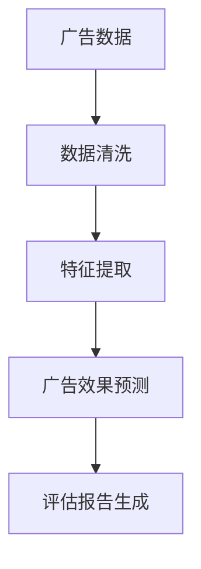
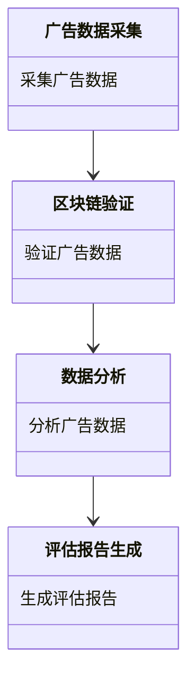
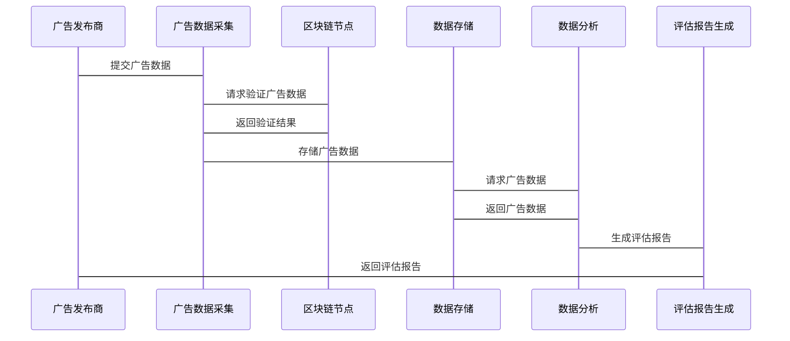

                 


# 区块链数字广告追踪平台评估：企业估值的创新实践

> 关键词：区块链，数字广告，广告追踪，平台评估，企业估值，数据驱动

> 摘要：随着数字广告行业的快速发展，广告数据的透明度和真实性成为企业估值中的关键问题。本文探讨了区块链技术在数字广告追踪中的应用，提出了基于区块链的广告追踪平台评估方法，并详细分析了该平台在企业估值中的创新实践。

---

## 第1章：区块链数字广告追踪平台的背景与问题

### 1.1 问题背景

#### 1.1.1 数字广告行业的现状与挑战
数字广告行业正以惊人的速度增长，但同时也面临着数据不透明、广告效果难以量化的挑战。广告商和发布商之间的信任缺失导致广告数据的真实性难以保证，这直接影响了企业的估值和投资决策。

#### 1.1.2 区块链技术在广告追踪中的应用潜力
区块链技术的去中心化、不可篡改和透明性特点，为广告数据的追踪和验证提供了新的解决方案。通过区块链技术，可以实现广告数据的实时记录和溯源，确保数据的真实性和完整性。

#### 1.1.3 平台评估的重要性与必要性
在数字广告行业中，广告数据的质量直接关系到企业的估值。通过平台评估，可以量化广告数据的价值，帮助企业做出更明智的投资和运营决策。

### 1.2 问题描述

#### 1.2.1 广告追踪中的数据不透明问题
广告数据的不透明导致广告效果难以量化，广告商和发布商之间的信任缺失，影响了企业的估值和投资决策。

#### 1.2.2 平台评估中的数据真实性与完整性问题
现有的广告数据评估方法依赖于人工审核，效率低且容易受到人为干预，难以保证数据的真实性和完整性。

#### 1.2.3 区块链技术如何解决这些问题
通过区块链技术，可以实现广告数据的实时记录和溯源，确保数据的真实性和完整性。区块链的去中心化特性可以消除广告数据中的信任问题，提高数据的透明度。

### 1.3 问题解决与边界

#### 1.3.1 区块链技术如何实现广告数据的透明与可信
通过区块链技术，广告数据的每一次记录都会被打包成一个区块，每个区块都包含广告数据的时间戳、广告内容、广告投放位置等信息，并通过共识机制确保数据的不可篡改性。

#### 1.3.2 平台评估的核心目标与范围界定
平台评估的核心目标是通过区块链技术，量化广告数据的价值，帮助企业做出更明智的投资和运营决策。平台评估的范围包括广告数据的采集、清洗、分析和评估。

#### 1.3.3 边界与外延：哪些问题不在本平台的解决范围内
平台评估不涉及广告数据的生成过程，也不涉及广告内容的创意设计。平台的核心任务是通过区块链技术，确保广告数据的透明性和可信度，并通过数据驱动的方法量化广告数据的价值。

### 1.4 核心概念与结构

#### 1.4.1 平台的核心组成要素：广告数据、区块链、评估模型
平台的核心组成要素包括广告数据、区块链技术和评估模型。广告数据是平台的输入，区块链技术确保数据的不可篡改性，评估模型通过数据驱动的方法量化广告数据的价值。

#### 1.4.2 概念结构与核心要素的相互关系
广告数据通过区块链技术被记录和验证，确保数据的真实性和完整性。评估模型通过分析区块链上的广告数据，量化广告数据的价值，帮助企业做出更明智的决策。

#### 1.4.3 平台的业务流程与数据流
平台的业务流程包括广告数据的采集、验证、分析和评估。数据流从广告发布商开始，经过区块链的记录和验证，最终由评估模型生成广告数据的价值评估报告。

---

## 第2章：区块链数字广告追踪平台的核心概念与联系

### 2.1 区块链技术原理

#### 2.1.1 区块链的基本概念与核心特性
区块链是一种分布式账本技术，具有去中心化、不可篡改、透明性和可追溯性等核心特性。这些特性使得区块链技术非常适合应用于广告数据的追踪和验证。

#### 2.1.2 区块链的共识机制与去中心化特点
区块链的共识机制（如PoW、PoS）确保了区块链网络的安全性和一致性。去中心化的特点使得广告数据的记录和验证不再依赖于单一的中心化机构，降低了数据篡改的可能性。

#### 2.1.3 区块链在广告追踪中的应用优势
区块链技术的应用优势包括数据的不可篡改性、透明性和可追溯性。这些优势使得广告数据的追踪和验证更加高效和可信。

### 2.2 数字广告追踪平台的原理

#### 2.2.1 广告数据的采集与存储
广告数据的采集包括广告内容、投放时间、投放位置、目标受众等信息。这些数据通过区块链技术被实时记录，并存储在区块链的区块中。

#### 2.2.2 广告数据的验证与溯源
通过区块链技术，广告数据的每一次记录都会被打包成一个区块，并通过共识机制确保数据的不可篡改性。广告数据的验证和溯源可以通过区块链的区块浏览器进行。

#### 2.2.3 平台的可信度与数据完整性保障
区块链技术的应用确保了广告数据的可信度和完整性。平台的可信度通过区块链的去中心化特性得到了提升，数据的完整性通过区块链的不可篡改性得到了保障。

### 2.3 平台评估的核心原理

#### 2.3.1 平台评估的指标体系
平台评估的指标体系包括广告数据的完整性和真实性、广告效果的可量化性、广告数据的可追溯性等。

#### 2.3.2 数据驱动的评估模型
数据驱动的评估模型通过分析区块链上的广告数据，量化广告数据的价值。评估模型的核心是基于广告数据的实时性和完整性，通过机器学习算法预测广告效果。

#### 2.3.3 区块链技术如何提升评估的可信度
区块链技术的应用提升了平台评估的可信度。广告数据的不可篡改性和透明性使得评估结果更加可信，数据的完整性和真实性也得到了保障。

### 2.4 核心概念的对比分析

#### 2.4.1 区块链与传统数据库的对比
| 特性       | 区块链             | 传统数据库       |
|------------|--------------------|------------------|
| 去中心化    | 是                 | 否               |
| 不可篡改性  | 是                 | 否               |
| 透明性      | 是                 | 否               |
| 可追溯性    | 是                 | 否               |

#### 2.4.2 广告数据验证的对比
| 方法         | 区块链验证         | 传统人工验证     |
|--------------|--------------------|------------------|
| 可信度       | 高                 | 低               |
| 效率         | 高                 | 低               |
| 成本         | 低                 | 高               |

---

## 第3章：区块链数字广告追踪平台的算法原理

### 3.1 算法原理概述

#### 3.1.1 数据驱动的广告评估模型
数据驱动的广告评估模型通过分析区块链上的广告数据，量化广告数据的价值。模型的核心是基于广告数据的实时性和完整性，通过机器学习算法预测广告效果。

#### 3.1.2 广告数据的清洗与特征提取
广告数据的清洗包括去除重复数据、处理缺失值、纠正异常值等。特征提取包括广告内容、投放时间、投放位置、目标受众等。

#### 3.1.3 基于机器学习的广告效果预测
广告效果的预测通过机器学习算法实现。常用的算法包括线性回归、随机森林、神经网络等。算法的核心是通过广告数据的特征，预测广告效果的转化率、点击率等指标。

### 3.2 算法实现

#### 3.2.1 算法流程图


#### 3.2.2 算法实现代码
```python
import pandas as pd
from sklearn.model import LinearRegression

# 数据清洗
df = pd.read_csv('ad_data.csv')
df = df.drop_duplicates()
df = df.dropna()
df['click_rate'] = df['click_rate'].fillna(0)

# 特征提取
features = ['ad_content', 'time', 'location', 'target_audience']
target = 'click_rate'

# 训练模型
model = LinearRegression()
model.fit(df[features], df[target])

# 预测广告效果
new_ad_data = {'ad_content': '...', 'time': '...', 'location': '...', 'target_audience': '...'}
new_ad_data_encoded = pd.DataFrame([new_ad_data])
predicted_click_rate = model.predict(new_ad_data_encoded[features])
```

#### 3.2.3 算法原理的数学模型
广告效果的预测可以通过线性回归模型实现，模型的数学表达式如下：
$$
y = \beta_0 + \beta_1x_1 + \beta_2x_2 + \beta_3x_3 + \epsilon
$$
其中，$y$ 是广告效果，$x_1, x_2, x_3$ 是广告数据的特征，$\beta_0, \beta_1, \beta_2, \beta_3$ 是模型的系数，$\epsilon$ 是误差项。

---

## 第4章：区块链数字广告追踪平台的系统分析与架构设计

### 4.1 系统分析

#### 4.1.1 问题场景介绍
系统需要解决广告数据的透明度和真实性问题，通过区块链技术实现广告数据的实时记录和验证。

#### 4.1.2 系统功能需求
系统功能需求包括广告数据的采集、验证、分析和评估。

### 4.2 系统设计

#### 4.2.1 系统功能设计


#### 4.2.2 系统架构设计


#### 4.2.3 系统接口设计
系统接口包括广告数据采集接口、区块链验证接口、数据分析接口和评估报告生成接口。

#### 4.2.4 系统交互流程


---

## 第5章：区块链数字广告追踪平台的项目实战

### 5.1 项目环境安装

#### 5.1.1 安装区块链环境
安装比特币核心（Bitcoin Core）或其他区块链平台，配置区块链节点。

#### 5.1.2 安装数据分析工具
安装Python、Pandas、Scikit-learn等数据分析工具。

#### 5.1.3 配置区块链接口
配置区块链接口，确保广告数据可以通过区块链接口进行验证和存储。

### 5.2 核心代码实现

#### 5.2.1 广告数据采集接口
```python
import requests

def submit_ad_data(ad_data):
    url = 'http://localhost:8080/api/ad'
    response = requests.post(url, json=ad_data)
    return response.json()
```

#### 5.2.2 区块链验证接口
```python
from blockchain import Blockchain

def validate_ad_data(ad_data_hash):
    blockchain = Blockchain()
    return blockchain.validate_transaction(ad_data_hash)
```

#### 5.2.3 数据分析与评估
```python
import pandas as pd
from sklearn.model import LinearRegression

def analyze_ad_data(ad_data):
    df = pd.DataFrame([ad_data])
    model = LinearRegression()
    model.fit(df[['ad_content', 'time', 'location']], df['click_rate'])
    return model.predict(df[['ad_content', 'time', 'location']])
```

### 5.3 项目小结

#### 5.3.1 项目实现的关键点
广告数据的采集、验证、分析和评估是项目实现的关键点。

#### 5.3.2 项目实现的难点
区块链技术的实现和数据分析模型的优化是项目实现的主要难点。

#### 5.3.3 项目的实际应用价值
通过区块链技术实现广告数据的透明和可信，通过数据驱动的方法量化广告数据的价值，为企业估值提供可靠的数据支持。

---

## 第6章：最佳实践与小结

### 6.1 最佳实践

#### 6.1.1 平台评估的注意事项
广告数据的完整性和真实性是平台评估的核心，需要特别注意数据的清洗和特征提取。

#### 6.1.2 系统设计中的常见问题
系统设计中需要注意区块链节点的性能和数据存储的效率，确保系统的可扩展性和可维护性。

### 6.2 小结

#### 6.2.1 核心观点回顾
区块链技术的应用提升了广告数据的透明度和可信度，数据驱动的方法量化了广告数据的价值，为企业估值提供了可靠的数据支持。

#### 6.2.2 未来展望
未来，区块链技术将在数字广告行业发挥更大的作用，广告数据的分析和评估将更加智能化和自动化。

### 6.3 注意事项

#### 6.3.1 项目实施中的风险
广告数据的隐私保护和数据安全是项目实施中的主要风险。

#### 6.3.2 技术实现中的挑战
区块链技术的复杂性和数据分析模型的优化是技术实现中的主要挑战。

### 6.4 拓展阅读

#### 6.4.1 区块链技术相关书籍
- 《区块链：重新定义价值的互联网》
- 《精通比特币》

#### 6.4.2 数据分析与机器学习相关书籍
- 《机器学习实战》
- 《Python机器学习》

---

## 附录：区块链数字广告追踪平台的技术细节

### 附录A：广告数据的结构化表示
广告数据的结构化表示包括广告内容、投放时间、投放位置、目标受众等。

### 附录B：区块链接口的详细说明
区块链接口的详细说明包括广告数据的哈希值、区块高度、交易ID等。

### 附录C：数据分析模型的优化建议
数据分析模型的优化建议包括特征选择、模型调参、数据增强等。

---

通过本文的详细分析和实践，我们展示了如何利用区块链技术和数据驱动的方法，构建一个高效的数字广告追踪平台，为企业的估值提供可靠的数据支持。

