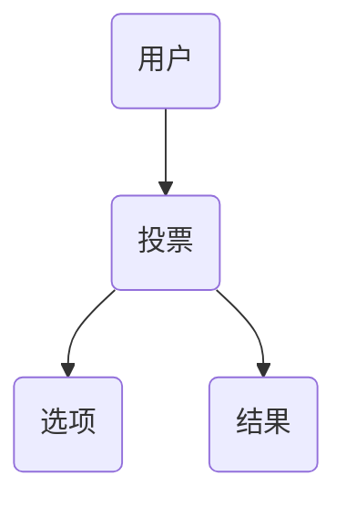
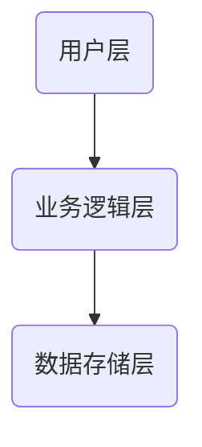
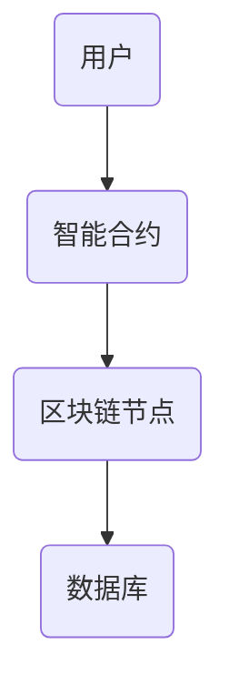

                 


# 企业估值中的区块链数字投票系统评估

## 关键词：区块链、数字投票系统、企业估值、智能合约、去中心化、投票算法

## 摘要：区块链技术的兴起为企业估值提供了一种全新的数字投票系统解决方案。通过区块链的去中心化特性，数字投票系统能够在企业估值过程中实现更高的透明性、安全性和效率。本文将从区块链技术基础、数字投票系统设计、评估方法论、系统实现、项目实战等方面，详细探讨如何利用区块链数字投票系统提升企业估值的准确性和可信度。

---

# 第一部分：区块链数字投票系统概述

## 第1章：区块链与数字投票系统概述

### 1.1 区块链技术基础

#### 1.1.1 区块链的基本概念

区块链是一种分布式账本技术，通过去中心化的方式记录数据，确保数据的安全性和不可篡改性。它通过链式结构存储数据，每个区块包含数据和指向前一个区块的指针。

- 区块链的特点：
  - 去中心化：没有单一的控制点。
  - 可追溯性：数据可以追溯到源头。
  - 安全性：通过密码学算法确保数据完整性。

#### 1.1.2 区块链的核心特点

- 分布式存储：数据分布在多个节点上，避免单点故障。
- 智能合约：自动执行预定义的规则，确保操作的透明性和可信性。
- 去信任化：通过技术手段减少对中心机构的信任依赖。

#### 1.1.3 区块链在企业估值中的应用潜力

区块链技术可以用于企业估值中的数据收集、分析和决策过程，确保数据的真实性和透明性。例如，通过区块链记录企业的财务数据、股东投票结果等，为估值提供可靠的基础。

---

### 1.2 数字投票系统的基本概念

#### 1.2.1 数字投票系统的定义

数字投票系统是一种利用数字技术进行投票的系统，能够实现投票的自动化、实时化和去中心化。

- 数字投票系统的特点：
  - 实时性：投票结果可以实时更新。
  - 去中心化：数据存储在多个节点上，避免单点故障。
  - 可扩展性：支持大规模投票。

#### 1.2.2 数字投票系统的属性特征对比表格

| 特性         | 传统投票系统 | 数字投票系统 |
|--------------|--------------|--------------|
| 安全性       | 依赖人工监督 | 区块链技术保障 |
| 透明性       | 有限         | 高透明性      |
| 成本         | 较高         | 较低          |
| 实时性       | 低           | 高            |
| 可扩展性     | 低           | 高            |

#### 1.2.3 数字投票系统的ER实体关系图



---

### 1.3 区块链与数字投票系统的结合

#### 1.3.1 区块链在数字投票中的作用

- 数据存储：通过区块链记录投票数据，确保数据的不可篡改性。
- 智能合约：自动执行投票规则，确保投票过程的公正性。
- 身份验证：通过区块链技术实现用户身份验证，防止重复投票。

#### 1.3.2 数字投票系统在企业估值中的应用场景

- 股东投票：企业重大决策中的股东投票。
- 估值数据收集：收集多方数据用于企业估值。
- 信任建立：通过区块链技术建立投票过程的信任。

#### 1.3.3 企业估值与数字投票系统的边界与外延

- 边界：仅限于企业估值相关的投票数据。
- 外延：可以扩展到企业治理、财务管理等多个方面。

---

## 本章小结

本章介绍了区块链技术和数字投票系统的基本概念，并探讨了它们在企业估值中的应用潜力。通过对比分析，我们明确了数字投票系统在企业估值中的重要性，并为后续章节的分析奠定了基础。

---

## 第二部分：区块链数字投票系统评估方法论

## 第2章：区块链数字投票系统评估的核心概念

### 2.1 评估指标与标准

#### 2.1.1 投票系统的安全性评估

- 数据加密：通过加密算法保护投票数据的安全性。
- 操作权限：通过权限控制确保只有授权用户可以进行投票操作。

#### 2.1.2 投票系统的透明性评估

- 数据可查性：用户可以随时查看投票数据。
- 结果可追溯性：投票结果可以追溯到原始数据。

#### 2.1.3 投票系统的成本效益分析

- 成本：区块链技术的应用可能会增加一定的成本。
- 效益：通过提高透明性和安全性，带来更高的整体效益。

---

### 2.2 评估方法论

#### 2.2.1 数据采集与处理

- 数据来源：收集企业的财务数据、市场数据等。
- 数据清洗：去除异常数据，确保数据的准确性。

#### 2.2.2 数据分析与建模

- 数据分析：通过统计分析和机器学习模型对数据进行分析。
- 模型建立：建立数学模型，用于预测企业估值。

#### 2.2.3 结果验证与优化

- 结果验证：通过实际数据验证模型的准确性。
- 模型优化：根据验证结果优化模型，提高预测精度。

---

### 2.3 数学模型与公式

#### 2.3.1 投票权重计算公式

$$ 权重 = \frac{投票数}{总投票数} $$

#### 2.3.2 结果评估公式

$$ 结果 = \sum (权重_i \times 选项_i) $$

---

## 本章小结

本章详细介绍了区块链数字投票系统评估的核心概念和方法论，包括评估指标、数据采集与处理、数据分析与建模等内容，为后续的系统实现和项目实战奠定了理论基础。

---

## 第三部分：区块链数字投票系统的技术实现

## 第3章：区块链数字投票系统的技术架构

### 3.1 系统架构设计

#### 3.1.1 分层架构设计



- 用户层：用户进行投票操作。
- 业务逻辑层：处理用户的投票请求，执行智能合约。
- 数据存储层：存储投票数据和结果。

#### 3.1.2 系统功能设计

- 用户注册与登录：通过区块链技术实现身份验证。
- 投票操作：用户进行投票，系统记录投票数据。
- 结果查询：用户可以查询投票结果。

#### 3.1.3 系统架构图



---

### 3.2 系统实现细节

#### 3.2.1 智能合约实现

- 智能合约的功能：验证用户身份、记录投票数据、计算投票结果。
- 智能合约的编写：使用Solidity语言编写智能合约，部署在区块链网络上。

#### 3.2.2 数据存储与管理

- 数据存储：投票数据存储在区块链上，确保数据的不可篡改性。
- 数据管理：通过区块链节点同步数据，保证数据的一致性。

---

## 本章小结

本章详细探讨了区块链数字投票系统的技术实现，包括系统架构设计、智能合约实现、数据存储与管理等内容，为后续的项目实战提供了技术基础。

---

## 第四部分：项目实战与案例分析

## 第4章：区块链数字投票系统项目实战

### 4.1 项目背景与目标

#### 4.1.1 项目背景

- 项目目标：开发一个基于区块链的数字投票系统，用于企业估值中的股东投票。
- 项目需求：实现投票的实时性、透明性和安全性。

### 4.2 系统核心实现

#### 4.2.1 环境安装

- 操作系统：Windows/Mac/Linux
- 区块链平台：以太坊（Ethereum）
- 智能合约开发工具：Solidity、Remix

#### 4.2.2 核心代码实现

- 智能合约代码示例：

```solidity
// SPDX-License-Identifier: MIT
pragma solidity ^0.8.0;

contract VotingSystem {
    struct Voter {
        bool isRegistered;
        uint256 votes;
    }

    mapping(address => Voter) public voters;

    function register(address voter) public {
        voters[voter].isRegistered = true;
        voters[voter].votes = 0;
    }

    function vote(address voter, bool support) public {
        require(voters[voter].isRegistered, "Not registered");
        require(voters[voter].votes == 0, "Already voted");
        if (support) {
            voters[voter].votes = 1;
        } else {
            voters[voter].votes = -1;
        }
    }

    function getVotes(address voter) public view returns (int256) {
        return voters[voter].votes;
    }
}
```

---

### 4.3 系统功能与应用

#### 4.3.1 系统功能展示

- 用户注册：用户通过智能合约进行注册，成为合法投票者。
- 投票操作：用户进行投票，系统记录投票数据。
- 结果查询：用户可以查询投票结果，用于企业估值。

#### 4.3.2 系统应用分析

- 提高企业估值的透明性：通过区块链技术确保投票数据的真实性和透明性。
- 提高企业估值的效率：通过自动化投票和结果计算，提高企业估值的效率。

---

## 本章小结

本章通过项目实战，详细展示了区块链数字投票系统的实现过程，包括环境安装、核心代码实现、系统功能与应用等内容，帮助读者更好地理解和应用区块链技术在企业估值中的应用。

---

## 第五部分：总结与展望

## 第5章：总结与展望

### 5.1 本章总结

- 区块链技术为企业估值提供了一种全新的数字投票系统解决方案。
- 数字投票系统通过区块链技术实现了投票的透明性、安全性和效率。

### 5.2 未来展望

- 技术改进：进一步优化智能合约，提高系统的性能和安全性。
- 应用扩展：将区块链数字投票系统应用于更多领域，如政府选举、股东大会等。
- 标准化建设：推动区块链数字投票系统的标准化，提高系统的兼容性和可扩展性。

---

## 附录

### 附录A：区块链数字投票系统相关术语表

- 区块链：一种分布式账本技术，通过去中心化的方式记录数据。
- 智能合约：自动执行预定义规则的计算机程序。

### 附录B：常用区块链开发工具

- Solidity：以太坊智能合约开发语言。
- Remix：智能合约在线开发工具。
- Ganache：以太坊本地开发环境。

---

## 结束语

区块链数字投票系统在企业估值中的应用前景广阔，通过技术创新和实践探索，我们可以进一步推动区块链技术在企业治理和估值领域的应用，为企业创造更大的价值。

---

## 参考文献

1. 区块链技术入门与实战
2. 智能合约开发指南
3. 企业估值方法论

