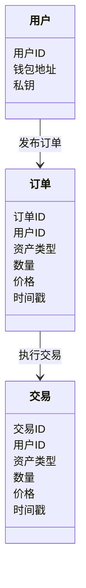
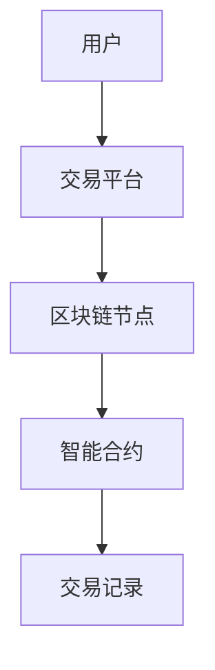
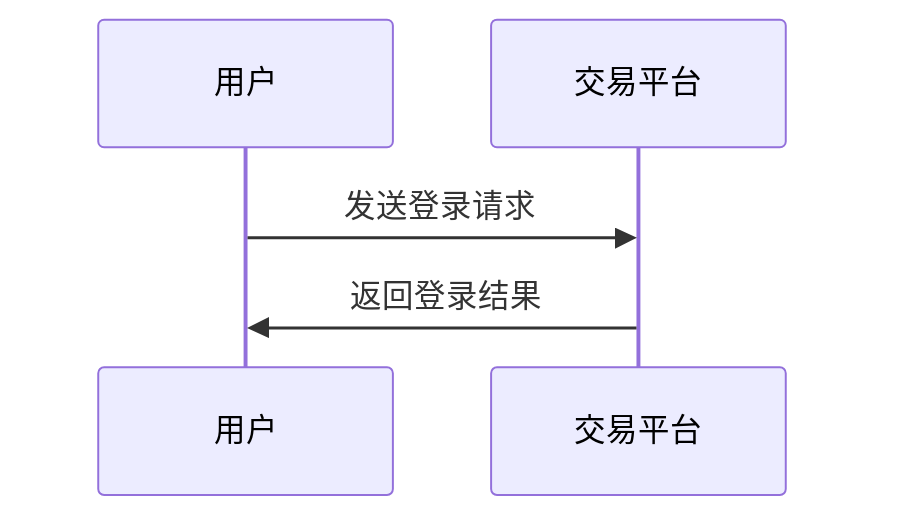
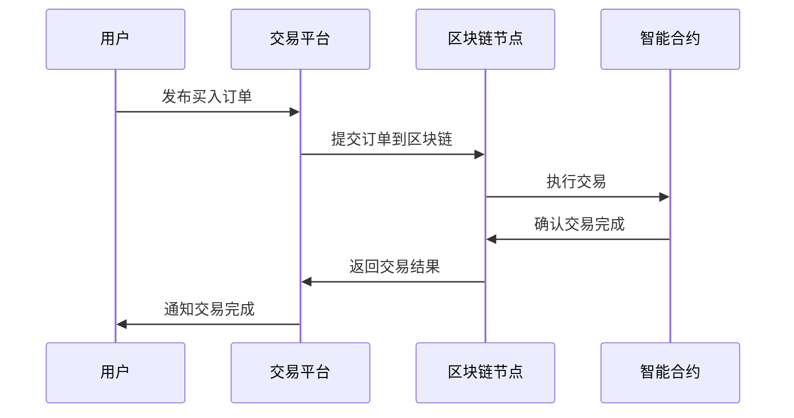

                 


# 企业估值中的区块链数字资产交易平台评估

## 关键词：企业估值、区块链、数字资产、交易平台、评估模型

## 摘要：  
本文深入探讨了区块链数字资产交易平台在企业估值中的应用与评估方法。通过对区块链技术的原理、数字资产的特点以及交易平台的系统设计的详细分析，结合实际案例和数学模型，提出了一个基于区块链的数字资产交易平台评估框架。文章从背景介绍、核心概念、算法原理、系统架构到项目实战，全面解析了如何利用区块链技术提升企业估值的效率和准确性。通过本文的分析，读者可以更好地理解区块链在企业估值中的潜力和应用。

---

## 第一部分: 企业估值与区块链数字资产交易平台概述

### 第1章: 区块链与数字资产的基本概念

#### 1.1 区块链技术概述
##### 1.1.1 区块链的基本定义与特点
区块链是一种去中心化的分布式账本技术，通过加密算法和共识机制确保数据的安全性和不可篡改性。其核心特点包括：
- **去中心化**：无须依赖中心机构，数据分布在网络的各个节点上。
- **不可篡改**：一旦数据被写入区块链，无法被修改或删除。
- **透明性**：所有交易记录公开透明，但用户身份可以匿名。
- **可追溯性**：每笔交易都可以追溯到原始参与者。

##### 1.1.2 区块链的核心技术原理
区块链的核心技术包括：
- **分布式账本**：数据分布在多个节点上，确保数据的冗余和安全性。
- **共识机制**：通过某种算法（如PoW、PoS、Raft等）达成一致，确保所有节点的数据同步。
- **智能合约**：基于区块链的自动化执行的代码，用于自动执行交易或协议。

##### 1.1.3 区块链的分类与应用场景
区块链主要分为公链、私链和联盟链。公链（如比特币、以太坊）面向公众，私链用于企业内部，联盟链用于特定机构之间的协作。区块链在金融、供应链、医疗等领域的应用日益广泛。

#### 1.2 数字资产的基本概念
##### 1.2.1 数字资产的定义与分类
数字资产是指以数字形式存在的资产，包括：
- ** cryptocurrencies（加密货币）**：如比特币、以太坊。
- **代币（Token）**：基于区块链的通证，用于表示某种权益或价值。
- **NFT（非同质化代币）**：具有唯一性的数字资产，常用于艺术、游戏等领域。

##### 1.2.2 数字资产的发行与流通机制
数字资产的发行通常通过区块链的智能合约完成。流通机制包括：
- **交易**：通过区块链网络进行点对点交易。
- **钱包**：用于存储和管理数字资产的工具，分为热钱包和冷钱包。

##### 1.2.3 数字资产与传统金融资产的对比
数字资产与传统金融资产的主要区别在于：
- **去中心化**：数字资产通常基于区块链，而传统资产依赖于中心化机构。
- **流动性**：数字资产的交易通常更灵活，24小时全球可交易。
- **透明性**：数字资产的交易记录公开透明，传统资产的交易可能涉及更多中间机构。

#### 1.3 区块链数字资产交易平台的定义
##### 1.3.1 交易平台的基本功能与特点
区块链数字资产交易平台是一个允许用户购买、出售和交换数字资产的平台，具备以下特点：
- **去中心化**：部分平台采用去中心化架构，增强信任。
- **高安全性**：通过区块链技术确保交易安全。
- **实时性**：交易数据实时更新，用户可以随时查看交易记录。

##### 1.3.2 交易平台的参与者与角色
交易平台的主要参与者包括：
- **用户**：购买或出售数字资产的个人或机构。
- **交易中介**：平台提供撮合交易的服务。
- **监管机构**：部分国家或机构对数字资产交易进行监管。

##### 1.3.3 交易平台的市场定位与价值
区块链数字资产交易平台在市场中的价值体现在：
- **降低交易成本**：通过区块链技术减少中间环节。
- **提高交易效率**：自动化交易流程，减少人为干预。
- **增强信任**：通过区块链的透明性和不可篡改性，增强用户信任。

---

### 第2章: 企业估值中的区块链数字资产交易平台评估背景

#### 2.1 企业估值的基本概念
##### 2.1.1 企业估值的定义与方法
企业估值是指对企业整体价值的评估，常用方法包括：
- **市场法**：基于市场可比交易数据进行估值。
- **收益法**：基于未来现金流折现进行估值。
- **资产法**：基于企业资产负债表进行估值。

##### 2.1.2 传统企业估值的局限性
传统企业估值方法存在以下问题：
- **数据不透明**：企业财务数据可能不完全公开或存在操控。
- **人为干预**：估值过程中可能受到主观因素的影响。
- **效率低下**：需要大量人工分析和数据处理。

##### 2.1.3 区块链技术对企业估值的影响
区块链技术通过提供实时、透明的交易数据，解决了传统估值中的部分问题。例如：
- **数据透明性**：区块链上的交易数据可以被审计，提高估值的准确性。
- **实时性**：区块链支持实时数据更新，提高估值的及时性。

#### 2.2 区块链数字资产交易平台在企业估值中的作用
##### 2.2.1 提高估值效率
区块链数字资产交易平台可以实时提供交易数据，减少人工数据收集和处理的时间。

##### 2.2.2 增强估值透明度
通过区块链技术，交易数据的来源和真实性可以被验证，提高估值的透明度。

##### 2.2.3 降低估值风险
区块链技术通过去中心化和不可篡改性，降低了数据被操控的风险。

#### 2.3 本章小结
区块链数字资产交易平台在企业估值中的作用主要体现在提高效率、增强透明度和降低风险。这些特点使得区块链技术成为企业估值领域的重要工具。

---

## 第二部分: 区块链数字资产交易平台的核心概念与联系

### 第3章: 区块链数字资产交易平台的核心概念

#### 3.1 区块链数字资产交易平台的实体关系分析
##### 3.1.1 用户与平台的关系
用户通过平台进行数字资产的买卖，平台提供交易撮合和结算服务。

##### 3.1.2 数字资产与交易平台的关系
数字资产存储在区块链上，交易平台作为中介连接数字资产和用户。

##### 3.1.3 交易记录与区块链的关系
每笔交易记录都会被写入区块链，确保交易的透明性和不可篡改性。

##### 3.1.4 平台与监管机构的关系
部分交易平台需要与监管机构对接，确保合规性。

#### 3.2 区块链数字资产交易平台的核心属性
##### 3.2.1 去中心化
去中心化架构减少了单点故障风险，提高了平台的抗攻击能力。

##### 3.2.2 高安全性
区块链的加密算法和共识机制确保了交易的安全性。

##### 3.2.3 实时性
区块链支持实时交易和数据更新，提高了交易的效率。

##### 3.2.4 可扩展性
通过侧链、分片等技术，区块链可以支持更大规模的交易。

#### 3.3 区块链数字资产交易平台的核心要素
##### 3.3.1 用户身份认证
通过钱包地址和私钥进行用户身份认证。

##### 3.3.2 交易撮合机制
平台根据订单匹配交易对手。

##### 3.3.3 交易结算
通过智能合约自动执行交易结算。

##### 3.3.4 交易数据存储
交易数据存储在区块链上，确保数据的不可篡改性。

#### 3.4 区块链数字资产交易平台的流程
##### 3.4.1 用户登录
用户通过钱包地址登录平台。

##### 3.4.2 发布订单
用户可以发布买入或卖出订单。

##### 3.4.3 交易撮合
平台根据订单匹配交易对手。

##### 3.4.4 交易结算
智能合约自动执行交易结算。

##### 3.4.5 交易记录
交易记录写入区块链，确保数据的透明性和不可篡改性。

---

## 第三部分: 区块链数字资产交易平台的系统分析与架构设计

### 第4章: 区块链数字资产交易平台的系统分析与架构设计

#### 4.1 问题场景介绍
本章将从实际问题出发，分析区块链数字资产交易平台的系统设计。

#### 4.2 项目介绍
本项目旨在设计一个基于区块链的数字资产交易平台，支持多种数字资产的交易和结算。

#### 4.3 系统功能设计
##### 4.3.1 用户管理
- 用户注册与登录
- 用户身份认证
- 用户钱包地址管理

##### 4.3.2 交易管理
- 订单发布与撤销
- 交易撮合
- 交易结算

##### 4.3.3 资产管理
- 数字资产的买入与卖出
- 资产持有情况查询
- 资产转移记录查询

##### 4.3.4 系统管理
- 平台参数配置
- 系统监控与维护
- 日志管理

#### 4.4 系统架构设计
##### 4.4.1 领域模型设计


##### 4.4.2 系统架构图


#### 4.5 系统接口设计
##### 4.5.1 用户接口
- 登录接口
- 注册接口
- 发布订单接口
- 查询资产接口

##### 4.5.2 交易接口
- 执行交易接口
- 查询交易记录接口
- 撤销订单接口

#### 4.6 系统交互设计
##### 4.6.1 用户登录流程


##### 4.6.2 交易流程


---

## 第四部分: 区块链数字资产交易平台的项目实战

### 第5章: 项目实战

#### 5.1 环境安装
##### 5.1.1 安装Python
```bash
# 安装Python
sudo apt-get install python3
```

##### 5.1.2 安装区块链框架
```bash
# 安装以太坊开发框架Web3.py
pip install web3
```

#### 5.2 系统核心实现
##### 5.2.1 用户管理模块
```python
from web3 import Web3

# 初始化区块链节点
w3 = Web3(Web3.HTTPProvider("http://localhost:8545"))

# 用户身份认证
def authenticate_user(private_key):
    try:
        account = w3.eth.account.from_key(private_key)
        return account.address
    except:
        return None
```

##### 5.2.2 交易撮合模块
```python
# 交易撮合逻辑
def match_order(order Buyer, order Seller):
    if Buyer['asset'] == Seller['asset'] and Buyer['price'] == Seller['price']:
        return True
    return False
```

##### 5.2.3 交易结算模块
```python
# 智能合约调用
def execute_transaction(recevier_address, amount, asset_type):
    contract = w3.eth.contract(address='智能合约地址', abi='智能合约ABI')
    transaction = contract.functions.transfer(recevier_address, amount).buildTransaction({
        'from': sender_address,
        'gas': 100000,
        'gasPrice': w3.toWei('1', 'gwei'),
        'value': w3.toWei(amount, 'ether')
    })
    signed_txn = w3.eth.account.signTransaction(transaction, private_key)
    tx_hash = w3.eth.sendRawTransaction(signed_txn.rawTransaction)
    return tx_hash
```

#### 5.3 实际案例分析
##### 5.3.1 案例背景
假设我们有一个数字资产交易平台，支持比特币和以太坊的交易。

##### 5.3.2 案例分析
用户A想购买比特币，发布买入订单，用户B想出售比特币，发布卖出订单。平台撮合订单，智能合约自动执行交易。

##### 5.3.3 案例实现
```python
# 用户A发布买入订单
order_Buyer = {
    'user_id': 'A',
    'asset': 'BTC',
    'type': 'buy',
    'price': 45000,
    'quantity': 1
}

# 用户B发布卖出订单
order_Seller = {
    'user_id': 'B',
    'asset': 'BTC',
    'type': 'sell',
    'price': 45000,
    'quantity': 1
}

# 交易撮合
if match_order(order_Buyer, order_Seller):
    execute_transaction(order_Buyer['user_id'], order_Buyer['quantity'], order_Buyer['asset'])
```

#### 5.4 项目小结
通过本项目，我们实现了一个基于区块链的数字资产交易平台，展示了区块链技术在企业估值中的应用潜力。

---

## 第五部分: 区块链数字资产交易平台的案例分析与总结

### 第6章: 案例分析与总结

#### 6.1 案例背景
本章以某数字资产交易平台为例，分析其在企业估值中的应用。

#### 6.2 案例分析
##### 6.2.1 交易数据的透明性
通过区块链技术，交易数据可以被实时查看和审计。

##### 6.2.2 估值效率的提升
通过自动化交易流程，提高了估值的效率。

##### 6.2.3 估值风险的降低
通过区块链的不可篡改性，降低了数据被操控的风险。

#### 6.3 总结
本文通过详细分析区块链数字资产交易平台在企业估值中的应用，展示了区块链技术在提升估值效率、增强透明度和降低风险方面的潜力。未来，随着区块链技术的不断发展，其在企业估值中的应用将更加广泛和深入。

---

## 第六部分: 最佳实践与总结

### 第7章: 最佳实践

#### 7.1 小结
本文从背景介绍、核心概念、算法原理、系统架构到项目实战，全面解析了区块链数字资产交易平台在企业估值中的应用。

#### 7.2 注意事项
- **数据隐私**：在实际应用中，需要注意用户隐私保护。
- **合规性**：需要遵守相关法律法规，确保平台的合规性。
- **安全性**：需要加强平台的安全防护，防止黑客攻击。

#### 7.3 拓展阅读
- **《区块链技术与应用》**：深入讲解区块链技术的基础知识。
- **《企业估值方法与案例分析》**：系统介绍企业估值的方法和实际案例。

---

## 附录: 数学公式与代码示例

### 附录A: 数学公式

#### A.1 估值模型的数学表达
$$
\text{企业价值} = \sum_{i=1}^{n} (r_i \times \text{收益}_i)
$$

其中，\( r_i \) 是第 \( i \) 项收益的权重。

#### A.2 交易撮合算法
$$
\text{匹配成功} = \text{买家价格} = \text{卖家价格} \quad \text{且} \quad \text{买家资产} = \text{卖家资产}
$$

### 附录B: 代码示例

#### B.1 用户身份认证
```python
def authenticate_user(private_key):
    try:
        account = w3.eth.account.from_key(private_key)
        return account.address
    except:
        return None
```

#### B.2 交易撮合
```python
def match_order(order Buyer, order Seller):
    if Buyer['asset'] == Seller['asset'] and Buyer['price'] == Seller['price']:
        return True
    return False
```

---

## 结语
本文通过详细分析区块链数字资产交易平台在企业估值中的应用，展示了区块链技术在提升估值效率、增强透明度和降低风险方面的潜力。未来，随着区块链技术的不断发展，其在企业估值中的应用将更加广泛和深入。

