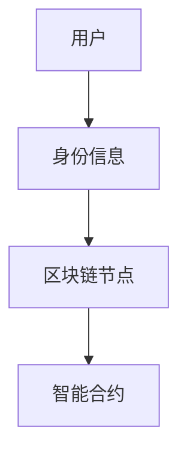
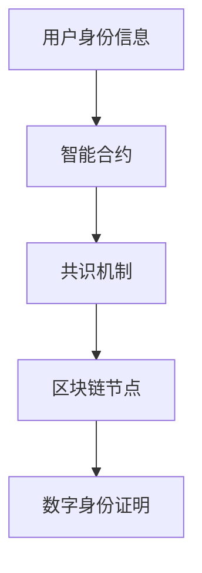
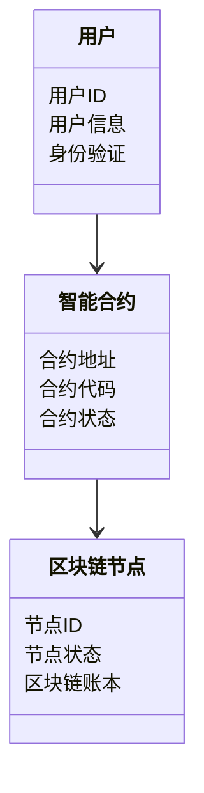
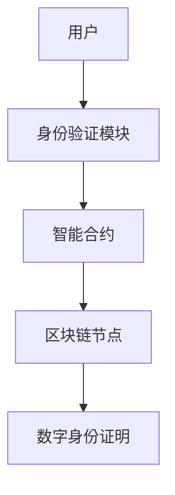
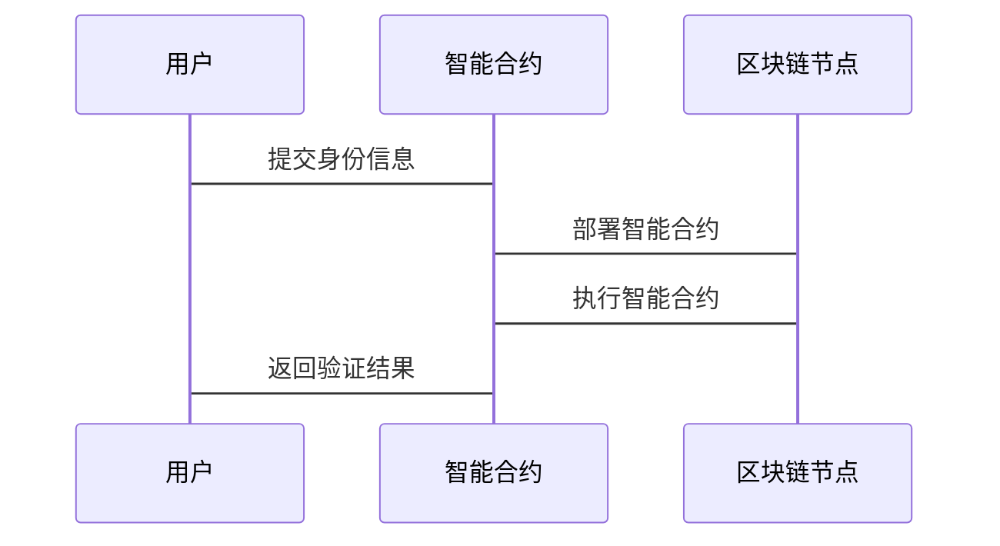

                 


# 企业估值中的区块链数字身份管理系统评估

> 关键词：区块链，数字身份管理，企业估值，去中心化身份识别（DID），智能合约，零知识证明，共识机制

> 摘要：区块链技术在企业估值中的应用，特别是在数字身份管理系统的构建与评估方面，是一个值得深入探讨的课题。本文通过分析区块链数字身份管理系统的核心概念、算法原理、系统架构设计、项目实战以及最佳实践，为读者提供全面的技术解读，帮助企业在估值过程中更高效、安全地管理数字身份。

---

# 第1章: 区块链与数字身份管理概述

## 1.1 区块链技术的背景与现状
### 1.1.1 区块链技术的起源与发展
- 区块链技术的起源：从比特币到以太坊
- 区块链的核心特点：去中心化、不可篡改、透明性
- 当前区块链技术的发展趋势：从金融领域到企业应用的扩展

### 1.1.2 区块链技术在企业估值中的应用潜力
- 区块链如何提升企业估值的透明度和可信度
- 区块链在企业数据管理中的优势
- 区块链技术对企业信用评估的影响

### 1.1.3 区块链数字身份管理系统的必要性
- 传统身份管理的痛点：数据孤岛、安全风险、效率低下
- 区块链技术如何解决这些问题
- 数字身份管理系统对企业估值的具体贡献

## 1.2 数字身份管理的定义与需求
### 1.2.1 数字身份管理的概念
- 数字身份的定义：用户在数字世界中的唯一标识
- 数字身份管理的目标：保护隐私、提升安全、便于验证

### 1.2.2 数字身份管理的市场需求
- 企业对数字身份管理的需求：数据安全、合规性、用户体验
- 用户对数字身份管理的需求：隐私保护、便捷性、可信度

### 1.2.3 数字身份管理在企业估值中的作用
- 提高企业数据的可信度
- 降低企业估值中的信息不对称
- 优化企业内部管理流程

## 1.3 区块链数字身份管理系统的必要性
### 1.3.1 传统身份管理的痛点
- 数据孤岛问题：不同系统之间难以互联互通
- 安全风险：数据泄露和身份盗用的威胁
- 效率低下：繁琐的身份验证流程

### 1.3.2 区块链技术在身份管理中的优势
- 去中心化：避免单点故障，提高安全性
- 不可篡改性：确保数据的真实性和完整性
- 可扩展性：支持大规模数据处理

### 1.3.3 数字身份管理系统对企业估值的意义
- 提高企业数据的透明度和可信度
- 降低企业估值中的信息不对称
- 优化企业内部管理流程

## 1.4 本章小结
- 本章介绍了区块链技术的背景与发展，探讨了数字身份管理的定义与需求，并分析了区块链数字身份管理系统的必要性。通过本章的学习，读者可以理解区块链技术在企业估值中的重要作用，以及数字身份管理系统对企业管理的积极影响。

---

# 第2章: 区块链数字身份管理系统的核心概念

## 2.1 数字身份的核心属性
### 2.1.1 唯一性
- 数字身份的唯一性是其核心属性之一
- 在区块链技术中，通过去中心化的方式确保每个身份的唯一性

### 2.1.2 完整性
- 数字身份的完整性是指其包含的所有信息都必须准确无误
- 区块链技术通过智能合约确保信息的完整性

### 2.1.3 不可篡改性
- 数字身份的不可篡改性是其安全性的重要保障
- 区块链技术通过分布式账本和共识机制确保数据不可篡改

## 2.2 区块链技术在身份管理中的应用
### 2.2.1 分布式账本
- 分布式账本的核心作用：存储和管理数据
- 区块链技术如何实现分布式账本的安全性和高效性

### 2.2.2 智能合约
- 智能合约的定义：自动执行的代码脚本
- 智能合约在数字身份管理中的应用：身份验证、权限管理

### 2.2.3 共识机制
- 共识机制的定义：区块链节点达成一致的算法
- 常见的共识机制：工作量证明（PoW）、权益证明（PoS）、实用拜占庭容错（PBFT）
- 共识机制对数字身份管理的影响

## 2.3 去中心化身份识别（DID）框架
### 2.3.1 DID的定义与特点
- DID的定义：一种基于区块链的去中心化身份识别标准
- DID的特点：去中心化、自主可控、可扩展性

### 2.3.2 DID与传统身份管理的对比
| 特性       | 传统身份管理 | DID（去中心化身份识别） |
|------------|--------------|-------------------------|
| 管理模式     | 中心化       | 去中心化               |
| 安全性       | 较低         | 高                     |
| 用户控制     | 依赖机构     | 用户自主控制           |
| 可扩展性     | 有限         | 高                     |

### 2.3.3 DID在企业估值中的应用
- DID如何提升企业估值的透明度
- DID在企业信用评估中的应用
- DID对企业发展战略的支持

## 2.4 核心概念属性对比表
| 属性       | 传统身份管理 | 区块链数字身份管理 |
|------------|--------------|--------------------|
| 唯一性       | 中心化管理   | 去中心化保证       |
| 安全性       | 易受攻击     | 高度安全           |
| 可扩展性     | 有限         | 高度可扩展         |

## 2.5 ER实体关系图


## 2.6 本章小结
- 本章详细介绍了数字身份的核心属性，探讨了区块链技术在身份管理中的应用，并分析了去中心化身份识别（DID）框架的特点和优势。通过本章的学习，读者可以理解区块链数字身份管理系统的核心概念，并为后续章节的学习打下坚实的基础。

---

# 第3章: 区块链数字身份管理系统的算法原理

## 3.1 零知识证明算法
### 3.1.1 零知识证明的定义
- 零知识证明：在不泄露任何额外信息的情况下证明某个声明的真实性
- 零知识证明的核心思想：通过交互式验证确保声明的真实性

### 3.1.2 zk-SNARK算法原理
- zk-SNARK的定义：零知识简洁的非交互式知识证明
- zk-SNARK的工作流程：证明者生成证明，验证者验证证明
- zk-SNARK在数字身份管理中的应用：身份验证、隐私保护

### 3.1.3 零知识证明在身份验证中的应用
- 零知识证明如何实现身份验证
- 零知识证明的优势：保护用户隐私，提高安全性

## 3.2 智能合约算法
### 3.2.1 智能合约的定义
- 智能合约：基于区块链的自动执行代码
- 智能合约的特点：不可篡改、自动执行、透明性

### 3.2.2 智能合约的执行流程
1. 合约部署：将智能合约部署到区块链网络
2. 合约调用：用户或系统调用智能合约
3. 合约执行：智能合约自动执行并返回结果
4. 合约验证：验证合约执行的正确性

### 3.2.3 智能合约在身份管理中的实现
- 智能合约在身份验证中的实现：验证用户身份信息
- 智能合约在权限管理中的实现：根据权限控制数据访问

## 3.3 共识算法
### 3.3.1 工作量证明（PoW）
- PoW的定义：通过计算找到特定哈希值来证明工作量
- PoW的优点：安全性高，抗女娲攻击
- PoW的缺点：计算消耗大，效率低

### 3.3.2 权益证明（PoS）
- PoS的定义：通过持有代币的数量来决定记账权
- PoS的优点：效率高，能耗低
- PoS的缺点：存在“富者愈富”的风险

### 3.3.3 共识算法在身份管理中的选择
- 不同共识算法对数字身份管理的影响
- 如何选择适合的共识算法：根据安全性、效率、成本等多方面因素综合考虑

## 3.4 区块链数字身份管理系统的算法流程图


## 3.5 本章小结
- 本章详细介绍了区块链数字身份管理系统中的核心算法，包括零知识证明、智能合约和共识机制。通过本章的学习，读者可以理解这些算法的原理和应用，并为后续章节的系统架构设计和项目实战奠定基础。

---

# 第4章: 区块链数字身份管理系统的系统架构设计

## 4.1 系统分析与设计
### 4.1.1 问题场景介绍
- 企业估值过程中存在的身份管理问题
- 区块链数字身份管理系统如何解决这些问题

### 4.1.2 系统功能设计
- 用户身份注册与验证
- 权限管理
- 数据查询与追溯

### 4.1.3 领域模型图


## 4.2 系统架构设计
### 4.2.1 系统架构图


### 4.2.2 系统接口设计
- 用户接口：用户通过界面提交身份信息
- 智能合约接口：智能合约与区块链节点之间的接口
- 区块链节点接口：节点之间的通信接口

### 4.2.3 系统交互序列图


## 4.3 本章小结
- 本章通过系统分析与设计，明确了区块链数字身份管理系统的功能和架构。通过领域模型图和系统架构图，读者可以清晰理解系统的组成部分和交互流程。系统接口设计和交互序列图则进一步细化了系统的实现细节。

---

# 第5章: 区块链数字身份管理系统的项目实战

## 5.1 环境安装与配置
### 5.1.1 安装区块链开发框架
- 选择合适的区块链框架：以太坊、Hyperledger Fabric、EOS等
- 安装必要的开发工具：Solidity、Geth、Node.js等

### 5.1.2 配置智能合约环境
- 安装智能合约开发环境：Solidity编译器、Web3.js库等
- 配置区块链网络：本地测试网络、公有链等

## 5.2 系统核心实现
### 5.2.1 智能合约实现
```solidity
// SPDX-License-Identifier: MIT
pragma solidity ^0.8.0;

contract IdentityManagement {
    mapping(address => bytes32) private userIdentities;

    function registerIdentity(address user, bytes32 identityHash) public {
        userIdentities[user] = identityHash;
    }

    function verifyIdentity(address user, bytes32 identityHash) public view returns (bool) {
        return userIdentities[user] == identityHash;
    }
}
```

### 5.2.2 区块链节点部署
- 部署区块链节点
- 配置节点参数：共识机制、网络类型等

### 5.2.3 身份验证流程实现
- 用户提交身份信息
- 智能合约验证身份信息
- 区块链节点记录验证结果

## 5.3 案例分析与实现
### 5.3.1 实际案例分析
- 某企业引入区块链数字身份管理系统后的效果
- 实际案例中的具体实现细节

### 5.3.2 代码实现与解读
- 核心代码实现：智能合约、区块链节点配置
- 代码解读：详细分析代码的功能和实现逻辑

## 5.4 项目小结
- 本章通过实际案例分析和代码实现，展示了区块链数字身份管理系统的具体实现过程。通过本章的学习，读者可以掌握系统的实际操作方法，并为后续章节的最佳实践奠定基础。

---

# 第6章: 区块链数字身份管理系统评估与优化

## 6.1 系统评估指标
### 6.1.1 系统安全性评估
- 系统安全性评估的指标：抗攻击性、数据完整性、隐私保护
- 如何通过区块链技术提升系统安全性

### 6.1.2 系统性能评估
- 系统性能评估的指标：响应时间、处理能力、可扩展性
- 如何优化系统性能：优化共识机制、提高网络效率

### 6.1.3 系统可用性评估
- 系统可用性评估的指标：容错能力、故障恢复能力
- 如何提高系统的可用性：多节点部署、备份机制

## 6.2 最佳实践
### 6.2.1 小结
- 总结本章的核心内容
- 强调系统评估与优化的重要性

### 6.2.2 注意事项
- 系统设计中的注意事项：安全性、性能、可用性
- 实际应用中的注意事项：数据隐私保护、系统维护成本

### 6.2.3 拓展阅读
- 推荐相关书籍和文献
- 提供进一步学习的资源

## 6.3 本章小结
- 本章通过系统的评估指标和最佳实践，总结了区块链数字身份管理系统的优化方法。通过本章的学习，读者可以掌握系统的评估与优化技巧，并为实际应用提供参考。

---

# 附录: 区块链数字身份管理系统术语表

| 术语       | 定义                                      |
|------------|------------------------------------------|
| 区块链      | 分布式账本技术，通过去中心化的方式记录数据 |
| 数字身份    | 用户在数字世界中的唯一标识              |
| 智能合约    | 基于区块链的自动执行代码                 |
| 去中心化身份识别（DID） | 基于区块链的去中心化身份识别标准     |
| 零知识证明   | 在不泄露额外信息的情况下证明声明的真实性 |

---

# 参考文献

1. 《区块链技术及应用》
2. 《智能合约开发指南》
3. 《去中心化身份识别（DID）白皮书》
4. 《共识机制详解》
5. 《数字身份管理系统的安全与优化》

---

通过以上目录结构，本文将系统地介绍区块链数字身份管理系统的各个方面，从理论基础到实际应用，帮助读者全面理解并掌握相关技术。

