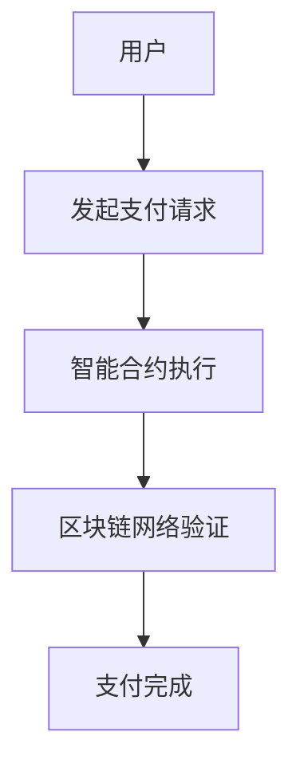
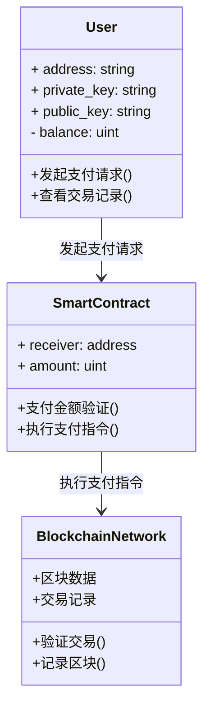
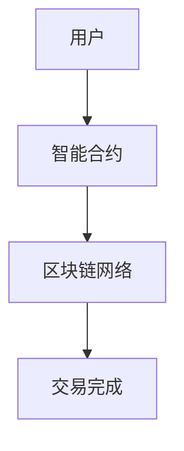
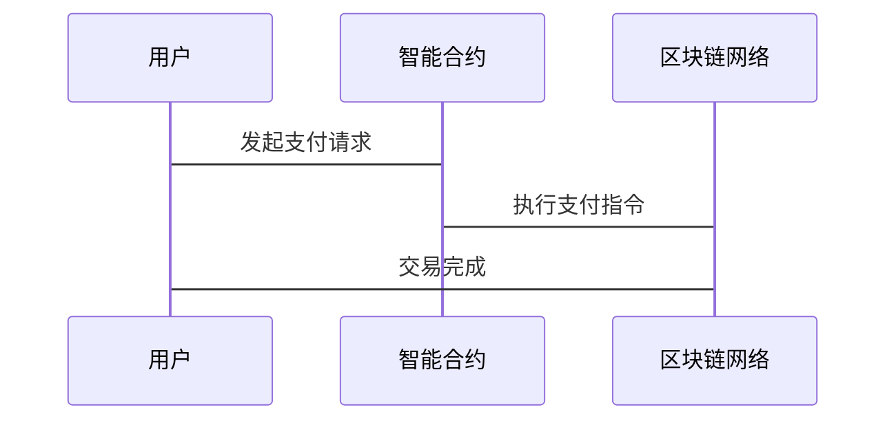

                 


# 《企业估值中的区块链跨境支付系统评估》

## 关键词：区块链，跨境支付，企业估值，系统评估，技术分析，支付系统

## 摘要：  
随着全球化的深入发展，企业估值中的跨境支付系统面临着效率低下、成本高昂和安全性不足的问题。区块链技术作为一种分布式账本技术，以其去中心化、不可篡改和高透明度的特点，为跨境支付系统提供了革命性的解决方案。本文将详细分析区块链技术在跨境支付中的应用，探讨其如何提升企业估值的准确性和效率，为企业提供更可靠、更高效的支付系统评估方法。

---

# 第1章: 区块链与跨境支付的背景介绍

## 1.1 企业估值与跨境支付的重要性

### 1.1.1 企业估值的基本概念  
企业估值是通过对企业的财务状况、市场表现、管理团队、竞争优势等因素进行综合评估，确定其市场价值的过程。在跨国企业中，跨境支付是企业日常运营的重要组成部分，直接影响企业的财务健康和估值结果。

### 1.1.2 跨境支付在企业估值中的作用  
跨境支付涉及跨国资金流动，其效率和成本直接影响企业的财务表现。传统的跨境支付系统存在流程复杂、费用高昂、时间较长等问题，这些都会影响企业估值的准确性。

### 1.1.3 区块链技术对跨境支付的影响  
区块链技术通过去中心化、智能合约和高透明度的特点，能够显著提高跨境支付的效率和安全性，从而优化企业估值的过程。

## 1.2 区块链技术的核心概念

### 1.2.1 区块链的基本定义  
区块链是一种分布式账本技术，通过加密算法和共识机制，确保数据的安全性和不可篡改性。它由区块、链式结构和节点组成，每个区块包含交易数据和时间戳。

### 1.2.2 区块链的核心特点  
- **去中心化**：无需依赖中心机构，数据由所有节点共同维护。  
- **不可篡改**：数据一旦写入区块链，无法被修改或删除。  
- **高透明度**：所有交易记录公开透明，可追溯。  
- **智能合约**：自动执行的代码脚本，能够自动履行合同条款。  

### 1.2.3 区块链与传统支付系统的对比  
| 特性               | 区块链支付          | 传统支付             |  
|--------------------|---------------------|----------------------|  
| 中心化            | 去中心化           | 中心化               |  
| 安全性             | 高                  | 中                   |  
| 交易速度           | 较快                | 较慢                |  
| 成本               | 低                  | 高                   |  

## 1.3 跨境支付系统的现状与挑战

### 1.3.1 跨境支付的传统模式  
传统的跨境支付流程复杂，涉及多家金融机构，交易确认时间长，费用高昂。此外，汇率波动和支付系统的技术缺陷也增加了支付风险。

### 1.3.2 跨境支付中的主要问题  
- **高成本**：传统跨境支付的手续费较高，尤其是中小企业。  
- **低效率**：跨行交易需要多个中间机构，导致交易时间长。  
- **安全性**：传统支付系统易受网络攻击，数据泄露风险高。  

### 1.3.3 区块链技术如何解决这些问题  
区块链技术通过去中心化和智能合约，减少了中间机构的参与，降低了交易成本和时间。同时，区块链的高透明度和不可篡改性提高了支付的安全性。

## 1.4 本章小结  
本章介绍了区块链技术的基本概念和其在跨境支付中的应用前景，强调了区块链技术如何解决传统跨境支付系统中的效率和安全性问题。

---

# 第2章: 区块链跨境支付系统的核心概念与联系

## 2.1 区块链跨境支付系统的原理

### 2.1.1 区块链的共识机制  
共识机制是区块链的核心组成部分，用于确保所有节点达成一致。常见的共识机制包括工作量证明（PoW）和权益证明（PoS）。

#### 2.1.1.1 工作量证明（PoW）  
- **原理**：节点通过计算哈希值来竞争记账权，第一个找到正确哈希值的节点获得记账权。  
- **优点**：安全性高，但需要大量计算资源。  

#### 2.1.1.2 权益证明（PoS）  
- **原理**：节点根据持有的代币数量来分配记账权，无需进行大量计算。  
- **优点**：资源消耗低，适合大规模应用。  

### 2.1.2 智能合约在跨境支付中的应用  
智能合约是一种自动执行的代码脚本，能够在区块链上自动履行合同条款。在跨境支付中，智能合约可以自动执行支付指令，确保交易的透明性和安全性。

### 2.1.3 区块链的安全性与不可篡改性  
区块链的安全性来源于其分布式结构和加密算法。每个交易记录都会被多个节点验证，确保数据不可篡改。

## 2.2 核心概念的对比分析

### 2.2.1 区块链与传统支付系统的对比表格  
| 特性               | 区块链支付          | 传统支付             |  
|--------------------|---------------------|----------------------|  
| 中心化            | 去中心化           | 中心化               |  
| 交易速度           | 快                  | 慢                   |  
| 成本               | 低                  | 高                   |  
| 安全性             | 高                  | 中                   |  

### 2.2.2 区块链跨境支付系统的ER实体关系图  
```mermaid
erd
    customer
    payment_transaction
    blockchain_node
    smart_contract
    currency
    transaction_status
```

## 2.3 系统架构的Mermaid流程图  


## 2.4 本章小结  
本章详细介绍了区块链跨境支付系统的原理和核心概念，分析了区块链技术如何解决传统支付系统中的问题，并通过表格和图示展示了系统的架构和流程。

---

# 第3章: 区块链跨境支付系统的算法原理

## 3.1 共识机制的算法原理

### 3.1.1 工作量证明机制（PoW）  
- **算法流程**：  
  1. 用户发起支付请求。  
  2. 节点开始计算哈希值。  
  3. 第一个找到正确哈希值的节点获得记账权。  
  4. 交易记录被写入区块链。  

- **数学公式**：  
  哈希值计算公式为：$H = hash(message)$，其中 $H$ 是哈希值，$message$ 是交易数据。

### 3.1.2 权益证明机制（PoS）  
- **算法流程**：  
  1. 用户发起支付请求。  
  2. 节点根据持有的代币数量分配记账权。  
  3. 智能合约验证交易数据。  
  4. 交易记录被写入区块链。  

- **数学公式**：  
  节点获得记账权的概率为：$P = \frac{A_i}{\sum A_j}$，其中 $A_i$ 是节点 $i$ 持有的代币数量，$\sum A_j$ 是所有节点代币数量的总和。

### 3.1.3 其他共识机制的对比  
| 机制   | PoW         | PoS         |  
|--------|-------------|-------------|  
| 特点   | 安全性高，资源消耗大 | 资源消耗低，依赖代币数量 |  
| 适用场景 | 大型区块链   | 中小规模区块链 |  

## 3.2 智能合约的算法实现

### 3.2.1 智能合约的基本结构  
智能合约通常包括以下几个部分：  
- 初始化函数：`constructor`  
- 状态变量：`uint amount;`  
- 外部函数：`function pay(uint amount)`  
- 接收者地址：`address payable receiver;`  

### 3.2.2 智能合约的执行流程  
1. 用户调用支付函数：`pay(amount)`。  
2. 智能合约验证交易数据。  
3. 智能合约自动执行支付指令。  
4. 交易记录被写入区块链。  

### 3.2.3 智能合约的数学模型  
智能合约的支付金额验证公式为：$amount > 0$，其中 $amount$ 是支付金额。

## 3.3 区块链支付的数学模型

### 3.3.1 区块链哈希函数的数学公式  
哈希函数计算公式为：$$H = hash(message)$$，其中 $H$ 是哈希值，$message$ 是交易数据。

### 3.3.2 区块链网络的图论模型  
支付网络可以用图论模型表示，节点表示用户，边表示支付交易。图的权重表示支付金额，节点的度数表示用户的交易频率。

### 3.3.3 支付交易的数学验证  
交易验证公式为：$$signature = sign(private_key, message)$$，其中 $signature$ 是签名，$private\_key$ 是用户私钥，$message$ 是交易数据。

## 3.4 本章小结  
本章详细讲解了区块链共识机制的算法原理和智能合约的实现方法，分析了区块链支付的数学模型，为后续的系统设计奠定了理论基础。

---

# 第4章: 区块链跨境支付系统的系统分析与架构设计

## 4.1 系统功能设计

### 4.1.1 用例分析  
- **用户发起支付请求**：用户通过钱包发起支付请求，智能合约自动执行交易。  
- **交易确认**：区块链网络通过共识机制确认交易。  
- **支付完成**：交易记录被写入区块链，用户收到确认信息。  

### 4.1.2 系统功能模块  
- **用户模块**：发起支付请求、查看交易记录。  
- **智能合约模块**：验证交易数据、执行支付指令。  
- **区块链网络模块**：验证交易、记录区块数据。  

### 4.1.3 领域模型Mermaid类图  


## 4.2 系统架构设计

### 4.2.1 系统架构Mermaid图  


### 4.2.2 系统接口设计  
- **API接口**：  
  - `POST /api/v1/pay`：发起支付请求。  
  - `GET /api/v1/transaction/{id}`：查询交易状态。  

- **数据接口**：  
  - `区块链地址`：存储交易数据。  
  - `智能合约地址`：执行支付指令。  

## 4.3 系统交互Mermaid序列图  


## 4.4 本章小结  
本章分析了区块链跨境支付系统的功能模块和系统架构，通过图示展示了系统的交互流程，为后续的系统实现提供了清晰的设计方案。

---

# 第5章: 区块链跨境支付系统的项目实战

## 5.1 环境安装

### 5.1.1 安装以太坊开发环境  
- 安装Golang或Solidity开发环境。  
- 安装以太坊节点：`goethereum`。  

### 5.1.2 安装必要的工具  
- 安装以太坊钱包：`MetaMask`。  
- 安装以太坊测试网：`Ropsten`。  

## 5.2 系统核心实现源代码

### 5.2.1 智能合约实现  
```solidity
// SPDX-License-Identifier: MIT
pragma solidity ^0.8.0;

contract PaymentSystem {
    address payable public receiver;
    uint public amount;

    constructor(address payable _receiver, uint _amount) {
        receiver = _receiver;
        amount = _amount;
    }

    function pay() public {
        require(amount > 0, "Amount must be greater than zero");
        receiver.transfer(amount);
        amount = 0;
    }
}
```

### 5.2.2 区块链节点验证  
```python
from web3 import Web3

# 连接到以太坊节点
w3 = Web3(Web3.HTTPProvider("http://localhost:8545"))

# 检查节点是否在线
if w3.is_connected():
    print("Connected to Ethereum network")
else:
    print("Not connected to Ethereum network")
```

## 5.3 代码应用解读与分析

### 5.3.1 智能合约代码解读  
- **构造函数**：初始化接收者地址和支付金额。  
- **pay函数**：验证金额是否大于零，执行支付指令。  

### 5.3.2 区块链节点代码解读  
- **连接节点**：使用Web3库连接到以太坊节点。  
- **检查连接状态**：验证节点是否在线。  

## 5.4 实际案例分析与详细讲解

### 5.4.1 案例分析  
假设一家跨国企业需要向海外供应商支付100万美元，使用区块链跨境支付系统进行支付。智能合约自动执行支付指令，区块链网络验证交易，支付完成后，双方都能在区块链上查到交易记录。

### 5.4.2 详细讲解  
1. 用户通过MetaMask钱包发起支付请求。  
2. 智能合约验证交易数据。  
3. 区块链网络通过共识机制确认交易。  
4. 支付金额到账，交易完成。  

## 5.5 本章小结  
本章通过实际案例分析和代码实现，展示了区块链跨境支付系统的应用场景和实现过程，为读者提供了理论与实践结合的参考。

---

# 第6章: 总结与展望

## 6.1 总结  
本文详细分析了区块链技术在跨境支付系统中的应用，探讨了其如何优化企业估值的过程。通过系统的架构设计和算法实现，展示了区块链技术在提升支付效率、降低成本和提高安全性方面的优势。

## 6.2 展望  
未来，随着区块链技术的不断发展，跨境支付系统将更加智能化和高效化。企业估值也将更加依赖于区块链技术的应用，以实现更准确、更可靠的评估结果。

## 6.3 最佳实践 tips  
- 在实施区块链跨境支付系统时，需选择合适的共识机制和智能合约设计。  
- 确保系统的安全性，防止网络攻击和数据泄露。  
- 定期更新系统，适应区块链技术的发展和市场需求的变化。  

## 6.4 本章小结  
本章总结了全文的主要内容，并对未来的发展进行了展望，为读者提供了进一步研究的方向和实践的建议。

---

# 参考文献  
1. Nakamoto, S. (2008). Bitcoin: A Peer-to-Peer Electronic Cash System.  
2. Wood, L. (2014). Ethereum: A Quantum-Step Change in Cryptography.  
3. 参考区块链技术相关书籍和论文，如《区块链：重新定义价值传递的下一代互联网技术》。

---

# END

