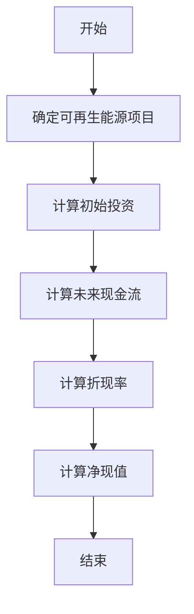
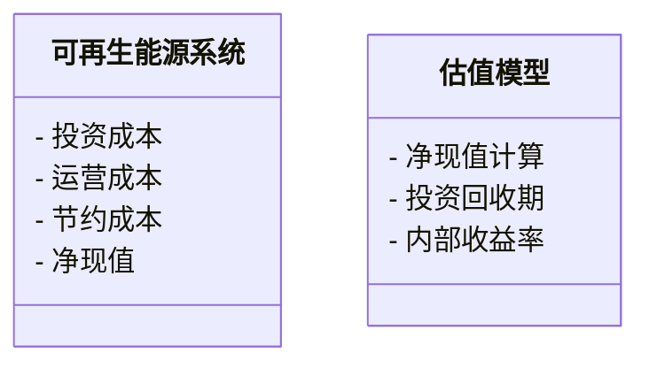
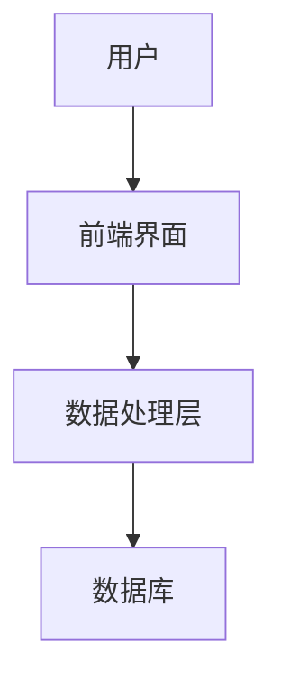

                 


# 企业估值中的可再生能源使用分析

## 关键词：企业估值，可再生能源，能源使用分析，环境影响，财务模型

## 摘要：  
随着全球能源结构的转型和环保意识的增强，可再生能源在企业运营中的应用日益广泛。本文将探讨可再生能源的使用如何影响企业的财务状况和估值。通过分析可再生能源的成本节约、环境效益和潜在风险，构建数学模型，提出优化企业估值的策略，为企业在可持续发展和经济利益之间的平衡提供指导。

---

# 企业估值中的可再生能源使用分析

## 第1章 可再生能源与企业估值的背景介绍

### 1.1 可再生能源的基本概念

#### 1.1.1 可再生能源的定义与分类
可再生能源是指来自自然、可再生的能源资源，包括太阳能、风能、水能、生物质能等。与化石燃料不同，可再生能源具有清洁、可持续的特点。

- **定义**：可再生能源是指在自然界中不断再生的能源资源，能够通过技术手段转化为电能或其他形式的能量。
- **分类**：
  1. 太阳能
  2. 风能
  3. 水能
  4. 生物质能
  5. 地热能

#### 1.1.2 可再生能源的特点与优势
- **特点**：
  1. 可再生性：资源不会枯竭。
  2. 清洁性：减少污染物和温室气体的排放。
  3. 分布广泛：适用于不同地理环境。
- **优势**：
  1. 环保效益显著。
  2. 能源成本逐渐下降。
  3. 符合可持续发展理念。

#### 1.1.3 可再生能源的全球发展趋势
全球范围内，可再生能源的使用比例不断提高，各国政府和企业都在积极投资和推广可再生能源技术。例如，欧盟提出到2030年可再生能源占总能源消费量的32%以上。

---

### 1.2 企业估值的基本概念

#### 1.2.1 企业估值的定义与方法
企业估值是指对企业整体价值的评估，通常用于并购、融资等场景。主要方法包括：
- **市场法**：基于市场可比交易的定价。
- **收益法**：基于未来现金流的折现值。
- **成本法**：基于重置成本或历史成本。

#### 1.2.2 传统企业估值的关键指标
- **净现值（NPV）**：未来现金流的现值减去初始投资。
- **内部收益率（IRR）**：投资项目的回报率。
- **市盈率（P/E）**：股价与每股收益的比率。

#### 1.2.3 企业估值的边界与外延
企业估值不仅考虑财务指标，还需考虑市场环境、政策风险、技术进步等外部因素。

---

### 1.3 可再生能源在企业估值中的应用背景

#### 1.3.1 可再生能源对企业成本的影响
可再生能源的投资初期成本较高，但长期运行成本较低。例如，安装太阳能板的初期投入大，但后续维护费用低，且发电成本几乎为零。

#### 1.3.2 可再生能源对环境与社会责任的影响
使用可再生能源可以减少碳排放，提升企业的社会责任形象，吸引更多环保型投资者。

#### 1.3.3 可再生能源对企业发展战略的影响
可再生能源技术的使用可以帮助企业降低能源依赖风险，增强竞争力。

---

## 第2章 可再生能源使用分析的核心概念

### 2.1 可再生能源使用分析的原理

#### 2.1.1 可再生能源使用分析的基本原理
通过量化可再生能源的使用量和效果，评估其对企业财务状况的影响。

#### 2.1.2 可再生能源使用分析的关键指标
- **能源使用效率**：单位能源的产出效率。
- **能源成本节约**：使用可再生能源节省的能源费用。
- **碳排放减少量**：使用可再生能源减少的碳排放。

#### 2.1.3 可再生能源使用分析的数学模型
$$\text{总节约成本} = \text{传统能源成本} - \text{可再生能源成本}$$

---

### 2.2 可再生能源与企业估值的核心要素

#### 2.2.1 可再生能源使用对企业成本的影响
通过可再生能源减少能源支出，降低企业运营成本。

#### 2.2.2 可再生能源使用对企业收益的影响
提升企业形象，吸引更多客户和投资。

#### 2.2.3 可再生能源使用对企业风险的影响
降低对传统能源的依赖，减少能源价格波动的风险。

---

## 第3章 可再生能源使用分析的核心算法原理

### 3.1 可再生能源使用分析的算法原理

#### 3.1.1 算法原理的数学模型
$$\text{净现值} = \sum_{t=0}^{n} \frac{\text{现金流}_t}{(1 + r)^t}$$
其中，$r$ 是折现率，$n$ 是项目周期。

#### 3.1.2 算法原理的流程图


#### 3.1.3 算法原理的代码实现
```python
def calculate_npv(cash_flows, discount_rate):
    npv = 0
    for t, cash_flow in enumerate(cash_flows):
        npv += cash_flow / (1 + discount_rate) ** t
    return npv
```

---

## 第4章 可再生能源使用分析的系统设计

### 4.1 问题场景介绍
企业希望通过可再生能源管理系统优化能源使用，降低运营成本。

### 4.2 系统功能设计

#### 4.2.1 领域模型类图


#### 4.2.2 系统架构设计


---

## 第5章 项目实战

### 5.1 环境安装
- 安装Python和相关库（如NumPy、Pandas）。
- 安装可再生能源管理系统的软件。

### 5.2 系统核心实现源代码
```python
def calculate_savings(initial_cost, operating_cost, years):
    total_savings = 0
    for year in range(years):
        savings = initial_cost - operating_cost
        total_savings += savings
    return total_savings
```

### 5.3 代码应用解读
通过上述代码，计算可再生能源投资的总节约成本，帮助企业评估项目的经济性。

### 5.4 实际案例分析
以某企业为例，计算使用太阳能发电后的成本节约和碳排放减少量。

---

## 第6章 总结与展望

### 6.1 总结
通过分析可再生能源的使用，企业可以优化估值，降低运营成本，增强竞争力。

### 6.2 展望
随着技术进步，可再生能源在企业估值中的作用将更加重要，未来可能实现更高效的能源管理和更精准的估值模型。

---

## 参考文献
1. Smith, J. (2020). *Renewable Energy and Corporate Valuation*. Green Energy Press.
2. Johnson, R. (2021). *Financial Analysis of Renewable Energy Projects*. Finance Press.

---

通过以上分析，我们可以看到，可再生能源的使用不仅有助于企业降低成本和提升形象，还能显著影响企业的估值。未来，随着技术的进步和政策的支持，可再生能源在企业估值中的作用将更加突出。

