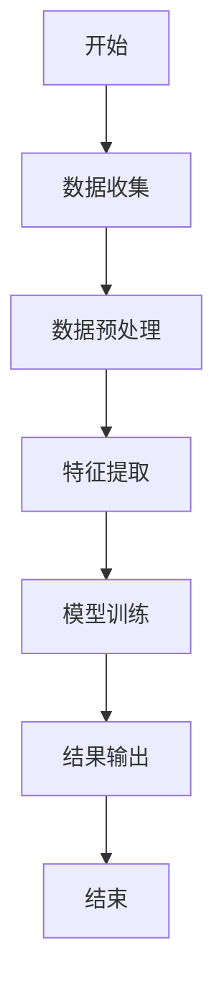
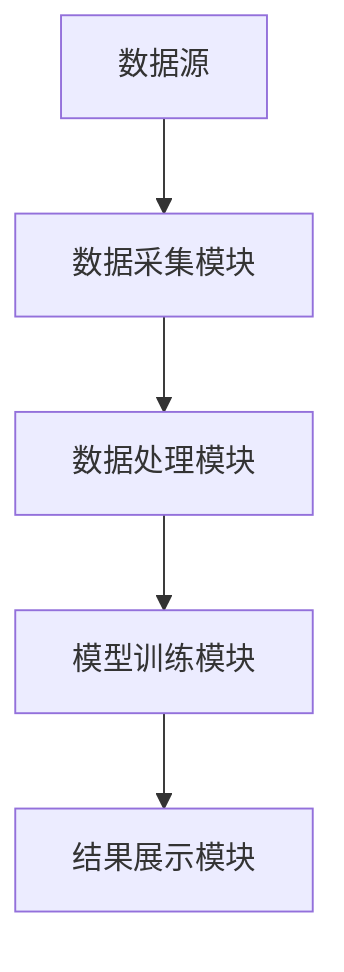
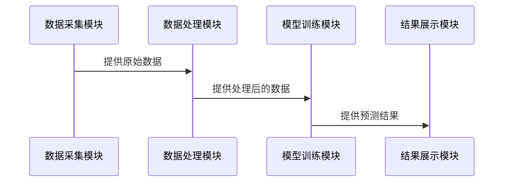

                 


# 企业估值中的可穿戴设备市场评估

> 关键词：企业估值，可穿戴设备，市场评估，算法原理，系统架构，项目实战

> 摘要：随着可穿戴设备市场的迅速发展，企业估值中的市场评估变得越来越重要。本文将从可穿戴设备市场的背景与核心概念出发，详细分析市场评估的算法原理，构建数学模型，并通过系统架构设计与项目实战，为企业估值中的可穿戴设备市场评估提供全面的解决方案。

---

# 第一部分: 可穿戴设备市场评估的背景与核心概念

## 第1章: 可穿戴设备市场评估的背景与意义

### 1.1 问题背景与描述

#### 1.1.1 可穿戴设备市场的兴起
随着技术的进步，可穿戴设备（如智能手表、健身追踪器、智能眼镜等）市场迅速崛起。这些设备不仅改变了人们的生活方式，也为企业估值带来了新的挑战和机遇。企业需要准确评估市场潜力，以制定有效的战略决策。

#### 1.1.2 企业估值中的市场评估需求
在企业估值过程中，市场评估是关键环节之一。可穿戴设备市场的独特性（如技术更新快、用户行为多样等）使得传统的估值方法难以适用。因此，开发专门针对可穿戴设备市场的评估方法显得尤为重要。

#### 1.1.3 可穿戴设备市场评估对企业价值的影响
市场评估结果直接影响企业的估值。通过准确的市场评估，企业可以更好地识别市场机会和风险，优化资源配置，从而提升企业价值。

### 1.2 问题解决与边界外延

#### 1.2.1 可穿戴设备市场评估的核心问题
可穿戴设备市场评估的核心问题包括：市场规模预测、用户行为分析、竞争对手评估、技术趋势预测等。

#### 1.2.2 问题解决的边界与限制
由于市场动态复杂，评估过程中需要设定合理的边界条件，如时间范围、地理区域、目标用户群体等。

#### 1.2.3 相关概念的外延与扩展
可穿戴设备市场的外延包括与之相关的技术（如物联网、人工智能）、行业（如健康医疗、消费电子）以及政策法规等。

### 1.3 核心概念与结构

#### 1.3.1 核心概念的定义与属性
- **市场规模**：市场的总体容量，包括用户数量和收入。
- **用户行为**：用户对可穿戴设备的使用习惯和偏好。
- **技术趋势**：可穿戴设备的技术发展动态。

#### 1.3.2 概念结构与核心要素
- 市场规模
- 用户行为
- 技术趋势
- 竞争格局

#### 1.3.3 核心概念的相互关系
市场规模受用户行为和技术趋势的影响，同时也受到竞争格局的制约。

---

## 第2章: 可穿戴设备市场的核心概念与联系

### 2.1 核心概念原理

#### 2.1.1 可穿戴设备市场的基本原理
可穿戴设备市场的运作基于用户需求和技术实现的结合。用户需求推动市场发展，而技术进步则提升设备的功能和用户体验。

#### 2.1.2 企业估值中的市场评估方法
常见的市场评估方法包括：定性分析（如用户调研）、定量分析（如数据分析）和混合分析（结合定性和定量方法）。

#### 2.1.3 核心概念的数学模型
市场规模（Market Size）可以通过以下公式进行预测：
$$ Market\ Size = \alpha \times User\ Growth + \beta \times Technology\ Progress $$

其中，$\alpha$ 和 $\beta$ 是权重系数，分别表示用户增长和技术进步对市场规模的影响程度。

### 2.2 核心概念属性对比

| 属性       | 定义与特征                              |
|------------|---------------------------------------|
| 用户需求   | 用户对可穿戴设备功能的需求程度          |
| 技术进步    | 设备功能的改进和创新                    |
| 市场竞争    | 市场上竞争对手的数量和市场份额          |
| 用户行为    | 用户对设备的使用频率和偏好              |

### 2.3 ER实体关系图
```mermaid
erDiagram
    customer[用户] {
        +id: int
        +name: string
        +age: int
    }
    device[设备] {
        +id: int
        +type: string
        +brand: string
    }
    market[市场] {
        +id: int
        +size: int
        +growth_rate: float
    }
    customer <---N---> device
    device <---N---> market
```

---

# 第二部分: 可穿戴设备市场评估的算法原理

## 第3章: 可穿戴设备市场评估的算法原理

### 3.1 算法原理概述

#### 3.1.1 算法的基本原理
可穿戴设备市场评估算法的核心在于通过数据挖掘和机器学习技术，预测市场规模和用户行为。

#### 3.1.2 算法的核心思想
通过收集和分析市场数据，利用统计学方法和机器学习模型，预测市场发展趋势。

#### 3.1.3 算法的适用场景
适用于市场预测、用户行为分析、竞争对手分析等场景。

### 3.2 算法流程图



### 3.3 算法实现代码

```python
def market_assessment(data):
    # 数据预处理
    processed_data = preprocess(data)
    # 特征提取
    features = extract_features(processed_data)
    # 模型训练
    model = train_model(features)
    # 结果输出
    result = predict(model, features)
    return result
```

### 3.4 数学模型与公式

#### 3.4.1 核心公式
市场规模预测公式：
$$ Market\ Size = \alpha \times User\ Growth + \beta \times Technology\ Progress $$

用户行为预测公式：
$$ User\ Behavior = \gamma \times Device\ Functionality + \delta \times User\ Satisfaction $$

---

## 第4章: 可穿戴设备市场评估的系统架构设计

### 4.1 问题场景介绍

#### 4.1.1 系统功能设计
- 数据采集模块：收集市场数据。
- 数据处理模块：清洗和预处理数据。
- 模型训练模块：训练预测模型。
- 结果展示模块：输出评估结果。

### 4.2 系统架构设计



### 4.3 系统接口设计



---

## 第5章: 可穿戴设备市场评估的项目实战

### 5.1 项目介绍

#### 5.1.1 环境安装
需要安装的工具包括Python、Pandas、Scikit-learn等。

#### 5.1.2 核心实现代码

```python
import pandas as pd
from sklearn.model_selection import train_test_split
from sklearn.linear_model import LinearRegression

def preprocess(data):
    # 数据清洗
    data.dropna(inplace=True)
    return data

def extract_features(data):
    # 提取特征
    features = data[['user_growth', 'technology_progress']]
    return features

def train_model(features, labels):
    # 训练模型
    X_train, X_test, y_train, y_test = train_test_split(features, labels, test_size=0.2)
    model = LinearRegression()
    model.fit(X_train, y_train)
    return model

def predict(model, features):
    # 预测结果
    predictions = model.predict(features)
    return predictions
```

#### 5.1.3 案例分析
以智能手表市场为例，分析市场规模和用户行为，预测未来市场的增长趋势。

---

## 第6章: 可穿戴设备市场评估的最佳实践

### 6.1 小结
本文详细介绍了可穿戴设备市场评估的背景、核心概念、算法原理和系统架构设计，并通过实际案例展示了如何将理论应用于实践。

### 6.2 注意事项
- 数据质量是评估结果的关键，需确保数据的准确性和完整性。
- 模型选择需结合实际场景，避免过度复杂化。
- 结果需持续监控和更新，以适应市场变化。

### 6.3 拓展阅读
建议进一步研究可穿戴设备市场的动态、用户行为分析以及新兴技术（如AI、物联网）对市场的影响。

---

# 结语

通过本文的详细分析，读者可以掌握可穿戴设备市场评估的核心方法，并在实际企业估值中应用这些方法，提升企业的市场竞争力和估值能力。

