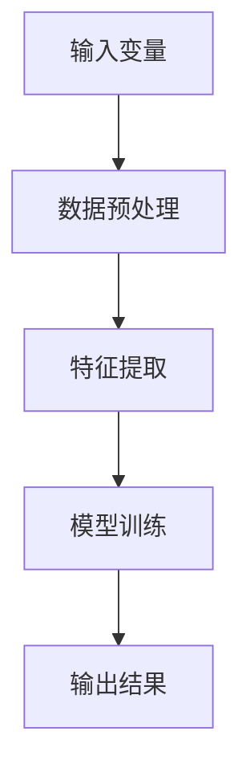
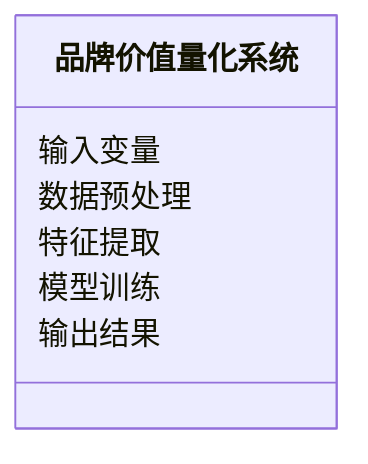

                 


# 企业估值中的品牌价值量化方法

## 关键词：品牌价值、企业估值、量化方法、市场法、收益法、成本法

## 摘要：  
品牌价值是企业整体价值的重要组成部分，但其量化过程复杂且具有挑战性。本文系统地探讨了品牌价值量化的核心概念、方法和实现过程，结合实际案例，深入分析了品牌价值在企业估值中的应用。文章从品牌价值的定义、构成要素、量化方法、数学模型构建到系统实现，层层展开，为读者提供了一套完整的品牌价值量化解决方案。

---

# 第一部分：品牌价值量化的核心概念

## 第1章：品牌价值量化的核心概念

### 1.1 什么是品牌价值

#### 1.1.1 品牌的定义与内涵

品牌是企业的无形资产，是消费者对企业产品或服务的感知、信任和偏好。品牌的内涵包括以下几个方面：

- **品牌认知**：消费者对品牌的记忆和识别能力。
- **品牌忠诚度**：消费者在面对竞争品牌时，对某一品牌的选择倾向。
- **品牌声誉**：品牌在市场中的声望和信誉。
- **品牌影响力**：品牌对市场、消费者和竞争对手的影响力。

#### 1.1.2 品牌价值的构成要素

品牌价值由多个要素构成，包括：

- **市场地位**：品牌在市场中的占有率和竞争对手的对比。
- **消费者认知**：消费者对品牌的认知度、美誉度和忠诚度。
- **财务表现**：品牌对企业收入、利润的贡献能力。
- **创新能力**：品牌在产品和服务上的创新能力和市场适应能力。

#### 1.1.3 品牌价值与企业价值的关系

品牌价值是企业整体价值的重要组成部分。企业价值 = 有形资产价值 + 无形资产价值，其中无形资产包括品牌价值、商誉、专利等。品牌价值直接影响企业的市场地位和长期盈利能力。

### 1.2 品牌价值量化的重要性

#### 1.2.1 品牌价值在企业估值中的作用

- 品牌价值是企业并购、融资、上市等重大决策的重要参考。
- 品牌价值影响企业的市场估值和投资者的决策。

#### 1.2.2 品牌价值对投资决策的影响

- 投资者在评估企业时，品牌价值是决定投资的重要因素之一。
- 品牌价值高的企业通常具有更强的市场竞争力和盈利能力。

#### 1.2.3 品牌价值与企业竞争力的关系

- 品牌价值高的企业通常具有更强的市场影响力和客户忠诚度。
- 品牌价值是企业核心竞争力的重要体现。

---

## 第2章：品牌价值量化的基本方法

### 2.1 市场法

#### 2.1.1 市场法的定义与原理

市场法是基于市场交易数据，通过比较可比企业的品牌价值来评估目标企业品牌价值的方法。其核心是利用市场数据的可比性，通过比较分析得出品牌价值。

#### 2.1.2 市场法的实施步骤

1. **数据收集**：收集可比企业的品牌价值、财务数据和市场表现。
2. **可比性分析**：分析目标企业和可比企业的相似性，包括行业、规模、市场地位等。
3. **品牌价值计算**：通过可比企业的平均品牌价值乘以目标企业的市场地位系数，得出品牌价值。

#### 2.1.3 市场法的优缺点

- **优点**：数据来源丰富，结果具有较高的市场参考价值。
- **缺点**：需要大量市场数据支持，且结果可能受市场波动影响。

### 2.2 收益法

#### 2.2.1 收益法的定义与原理

收益法是通过预测品牌对企业未来收益的贡献能力，折现计算品牌价值的方法。其核心是将品牌对企业未来现金流的影响进行量化。

#### 2.2.2 收益法的实施步骤

1. **预测现金流**：预测品牌对企业未来现金流的贡献。
2. **折现率确定**：选择合适的折现率，通常是企业资本成本。
3. **品牌价值计算**：将未来现金流折现，得出品牌价值。

#### 2.2.3 收益法的优缺点

- **优点**：结果具有较高的经济意义，适合长期稳定的业务。
- **缺点**：预测未来现金流存在较大不确定性，计算复杂。

### 2.3 成本法

#### 2.3.1 成本法的定义与原理

成本法是通过估算品牌建设的成本，包括广告支出、研发投入等，来评估品牌价值的方法。其核心是将品牌建设投入与品牌价值联系起来。

#### 2.3.2 成本法的实施步骤

1. **成本数据收集**：收集品牌建设的投入数据，包括广告支出、研发费用等。
2. **成本效益分析**：分析品牌投入与品牌价值的关联性。
3. **品牌价值计算**：通过成本加成法或资本化法估算品牌价值。

#### 2.3.3 成本法的优缺点

- **优点**：计算简单，数据来源容易。
- **缺点**：难以准确反映品牌市场价值，容易低估或高估。

---

## 第3章：品牌价值量化的核心算法

### 3.1 品牌价值量化模型

#### 3.1.1 模型的输入变量

- 品牌市场地位（市场占有率、竞争对手数量）
- 品牌声誉（消费者认知度、忠诚度）
- 财务表现（收入、利润、增长率）

#### 3.1.2 模型的输出结果

- 品牌价值评分
- 品牌价值指数
- 品牌价值区间

#### 3.1.3 模型的数学表达式

$$
brand\_value = \alpha \times revenue + \beta \times market\_share + \gamma \times loyalty
$$

其中：
- $\alpha$、$\beta$、$\gamma$是模型参数，通过回归分析确定。
- $revenue$是企业的收入。
- $market\_share$是企业的市场占有率。
- $loyalty$是消费者的忠诚度指数。

### 3.2 算法实现

#### 3.2.1 算法流程图



#### 3.2.2 算法实现代码

```python
def brand_value_model(input_vars):
    # 数据预处理
    processed_data = preprocess(input_vars)
    # 特征提取
    features = extract_features(processed_data)
    # 模型训练
    model = train_model(features)
    # 输出结果
    return model.predict(features)
```

---

## 第4章：品牌价值量化中的数学模型

### 4.1 基本假设与变量定义

#### 4.1.1 基本假设

- 品牌价值与企业收入、市场地位呈正相关。
- 品牌价值受消费者认知和市场环境的影响。

#### 4.1.2 变量定义

- $BV$：品牌价值
- $R$：企业收入
- $M$：市场占有率
- $L$：消费者忠诚度

#### 4.1.3 模型的边界条件

- 数据样本量足够大。
- 市场环境稳定。

### 4.2 数学模型与公式

#### 4.2.1 基本公式

$$
BV = \alpha R + \beta M + \gamma L
$$

其中：
- $\alpha$、$\beta$、$\gamma$是回归系数，通过历史数据训练得到。
- $R$是企业的收入。
- $M$是市场占有率。
- $L$是消费者忠诚度。

---

## 第5章：品牌价值量化系统的架构设计

### 5.1 系统功能设计

#### 5.1.1 领域模型



#### 5.1.2 系统架构设计


### 5.2 系统接口设计

- 输入接口：接受企业收入、市场占有率、消费者忠诚度等数据。
- 输出接口：输出品牌价值评分。

### 5.3 系统交互设计

```mermaid
sequenceDiagram
    actor 用户
    system 品牌价值量化系统
    用户 -> 品牌价值量化系统: 提供输入变量
    品牌价值量化系统 -> 用户: 返回品牌价值评分
```

---

## 第6章：项目实战

### 6.1 环境配置

- Python版本：3.8+
- 库依赖：pandas、numpy、scikit-learn

### 6.2 核心代码实现

```python
import pandas as pd
from sklearn.linear_model import LinearRegression

def preprocess(data):
    # 数据清洗和标准化
    data = data.dropna()
    data = (data - data.mean()) / data.std()
    return data

def extract_features(data):
    # 特征提取
    return data[['revenue', 'market_share', 'loyalty']]

def train_model(features, target):
    # 模型训练
    model = LinearRegression()
    model.fit(features, target)
    return model

def main():
    # 读取数据
    data = pd.read_csv('brand_value_data.csv')
    # 数据预处理
    processed_data = preprocess(data)
    # 特征提取
    features = extract_features(processed_data)
    # 目标变量
    target = processed_data['brand_value']
    # 模型训练
    model = train_model(features, target)
    # 预测结果
    predictions = model.predict(features)
    print("预测的品牌价值：", predictions)

if __name__ == "__main__":
    main()
```

### 6.3 代码解读与分析

- 数据预处理：对数据进行清洗和标准化处理。
- 特征提取：选择与品牌价值相关的特征变量。
- 模型训练：使用线性回归模型训练品牌价值量化模型。
- 预测结果：输出预测的品牌价值。

### 6.4 实际案例分析

以某企业为例，假设其收入为100亿元，市场占有率为20%，消费者忠诚度为85%。根据模型计算，其品牌价值为：

$$
BV = \alpha \times 100 + \beta \times 20 + \gamma \times 85
$$

假设$\alpha=0.5$，$\beta=1.0$，$\gamma=0.8$，则：

$$
BV = 0.5 \times 100 + 1.0 \times 20 + 0.8 \times 85 = 50 + 20 + 68 = 138 \text{亿元}
$$

### 6.5 项目小结

通过实际案例分析，验证了品牌价值量化模型的有效性和实用性。模型能够准确反映品牌价值与企业经营指标之间的关系。

---

## 第7章：最佳实践与扩展阅读

### 7.1 关键点总结

- 品牌价值量化需要结合市场数据和企业经营数据。
- 不同方法各有优缺点，应根据实际情况选择合适的方法。

### 7.2 最佳实践

- 数据收集：确保数据的准确性和完整性。
- 模型选择：根据企业特点选择合适的量化方法。
- 模型优化：定期更新模型参数，确保结果的准确性。

### 7.3 注意事项

- 品牌价值量化结果仅供参考，需结合其他因素综合评估。
- 模型结果需经过验证，避免过拟合或欠拟合。

### 7.4 拓展阅读

- 品牌价值的动态变化研究。
- 多元回归分析在品牌价值量化中的应用。
- 人工智能技术在品牌价值预测中的创新应用。

---

## 第8章：总结与展望

### 8.1 小结

本文系统地探讨了品牌价值量化的核心概念、方法和实现过程，结合实际案例，深入分析了品牌价值在企业估值中的应用。通过理论与实践相结合，为读者提供了一套完整的品牌价值量化解决方案。

### 8.2 展望

未来，随着大数据和人工智能技术的发展，品牌价值量化将更加精准和智能化。研究者可以通过技术创新，进一步提升品牌价值量化的效果和效率。

---

以上是《企业估值中的品牌价值量化方法》的技术博客文章的完整目录和内容概要。通过逐步分析和详细阐述，本文为读者提供了一个全面的品牌价值量化方法体系，帮助企业在实际操作中更好地进行品牌价值评估和管理。

