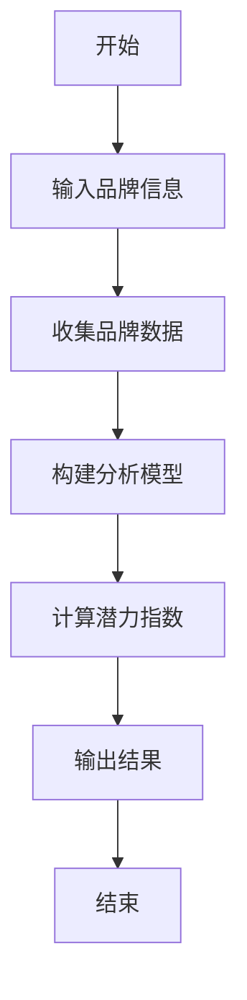
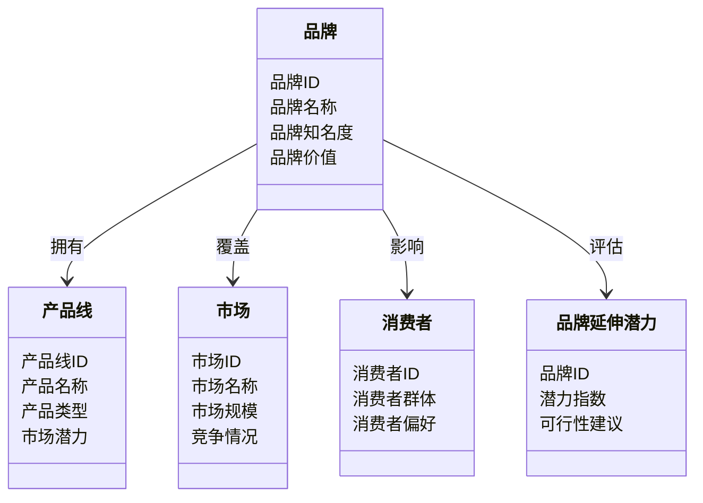
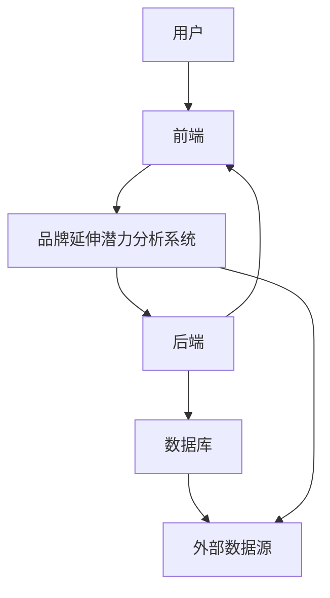

                 


# 企业估值中的品牌延伸潜力分析

> **关键词**：品牌延伸、企业估值、品牌价值、品牌策略、市场扩展

> **摘要**：本文从企业估值的角度，深入探讨品牌延伸的潜力及其对企业发展的影响。通过分析品牌延伸的背景、核心概念、评估算法、系统架构以及实际案例，本文为企业在品牌延伸策略的选择和实施提供了系统的分析框架和实用的指导。

---

## 第一部分：背景介绍

### 第1章：品牌延伸潜力分析的背景与问题

#### 1.1 问题背景

- **品牌延伸的定义**：品牌延伸是指企业在现有品牌的基础上，将其扩展到新的产品线、市场或消费者群体。这种策略旨在利用现有品牌的知名度和信任度，快速进入新市场或推出新产品。

- **品牌延伸的重要性**：品牌延伸能够帮助企业降低市场进入成本，提高新产品的市场接受度，同时增强品牌忠诚度。然而，品牌延伸也存在一定的风险，如品牌形象被稀释或市场定位不清晰。

- **当前研究的挑战**：尽管品牌延伸在实践中被广泛应用，但其对企业发展的影响机制尚不完全明确。如何量化品牌延伸的潜力，以及如何将其纳入企业估值体系，是当前研究中的重要问题。

#### 1.2 问题描述

- **品牌延伸的类型**：品牌延伸可以分为产品线延伸、市场延伸和形象延伸三种类型。每种类型的延伸方式对品牌价值的影响不同，需要分别分析。

- **品牌延伸与企业估值的关系**：品牌延伸不仅影响企业的收入和利润，还会影响企业的品牌价值。品牌价值是企业估值的重要组成部分，因此，品牌延伸潜力的分析对于企业估值具有重要意义。

- **品牌延伸潜力分析的核心问题**：如何评估品牌延伸的可行性、潜在收益和风险，并将其量化为可操作的指标，是品牌延伸潜力分析的核心问题。

#### 1.3 问题解决

- **品牌延伸潜力的评估目标**：通过分析品牌的核心竞争力、市场扩展潜力和消费者接受度，量化品牌延伸的潜力。

- **品牌延伸对估值的影响路径**：品牌延伸通过扩大市场份额、提升品牌知名度和增强客户忠诚度，从而提高企业的收入和利润，进而提升企业估值。

- **品牌延伸潜力的评估指标**：包括市场扩展潜力、品牌忠诚度、品牌形象一致性、市场竞争力和潜在风险等。

#### 1.4 边界与外延

- **品牌延伸的边界条件**：品牌延伸需要在品牌核心价值不变的前提下进行，否则可能导致品牌形象受损。

- **品牌延伸的外延范围**：品牌延伸的范围包括产品线扩展、市场扩展和品牌形象扩展。不同的扩展方式需要根据企业的资源和目标进行选择。

- **与其他估值方法的区分**：品牌延伸潜力分析与其他估值方法（如DCF模型、市场法等）的区别在于，它更关注品牌资产的动态变化对估值的影响。

---

## 第二部分：核心概念与联系

### 第2章：品牌延伸潜力分析的核心概念

#### 2.1 品牌延伸潜力的原理

- **品牌延伸的驱动因素**：包括市场需求、竞争压力、品牌资产和企业战略等因素。这些因素共同驱动着企业的品牌延伸行为。

- **品牌延伸对估值的影响机制**：品牌延伸通过提升品牌知名度、扩大市场份额和增强客户忠诚度，从而提高企业的收入和利润，进而提升企业估值。

- **品牌延伸潜力的评估模型**：本文提出了一种基于多因素分析的品牌延伸潜力评估模型，包括市场潜力、品牌强度、竞争环境和企业资源等四个维度。

#### 2.2 核心概念属性特征对比

| **概念**       | **定义**                                                                 | **影响因素**                                                                 |
|----------------|--------------------------------------------------------------------------|------------------------------------------------------------------------------|
| 品牌延伸       | 在现有品牌的基础上扩展到新的产品线、市场或消费者群体                                   | 品牌知名度、市场潜力、竞争环境、企业资源                                       |
| 品牌扩展       | 品牌在现有市场或产品线上的扩展                                                     | 市场覆盖度、产品线多样性、品牌一致性                                           |
| 品牌重塑       | 对品牌形象进行调整，以适应市场变化                                                 | 品牌定位、消费者认知、市场趋势                                                 |
| 品牌延伸失败   | 品牌延伸未达到预期效果                                                             | 品牌形象受损、市场定位不清晰、消费者认知混乱                                     |

#### 2.3 ER实体关系图

```mermaid
er
  %% 品牌延伸潜力分析的ER图
  entity(品牌)
  entity(产品线)
  entity(市场)
  entity(消费者)
  entity(竞争对手)
  entity(品牌延伸潜力)
  relation(拥有,品牌,产品线)
  relation(覆盖,品牌,市场)
  relation(影响,品牌,消费者)
  relation(竞争,品牌,竞争对手)
  relation(评估,品牌,品牌延伸潜力)
```

---

## 第三部分：算法原理讲解

### 第3章：品牌延伸潜力评估算法

#### 3.1 算法原理

- **算法目标**：通过多因素分析，量化品牌延伸的潜力，为企业的估值提供依据。

- **算法输入**：包括品牌知名度、市场潜力、竞争环境、企业资源等多维度数据。

- **算法输出**：品牌延伸潜力的量化指标，以及对品牌延伸可行性的建议。

- **算法流程**：
  1. 收集品牌相关数据，包括品牌知名度、市场潜力、竞争环境等。
  2. 构建多因素分析模型，量化各因素对品牌延伸潜力的影响。
  3. 计算品牌延伸潜力指数，评估品牌延伸的可行性。

#### 3.2 算法流程图



#### 3.3 算法实现

以下是基于多因素分析的品牌延伸潜力评估算法的Python代码示例：

```python
import pandas as pd
import numpy as np

def brand_extension_potential(brand_data):
    # 数据预处理
    brand_data = pd.DataFrame(brand_data)
    brand_data['品牌知名度'] = brand_data['品牌知名度'].astype(float)
    brand_data['市场潜力'] = brand_data['市场潜力'].astype(float)
    brand_data['竞争环境'] = brand_data['竞争环境'].astype(float)
    brand_data['企业资源'] = brand_data['企业资源'].astype(float)

    # 计算品牌延伸潜力指数
    weight = {'品牌知名度': 0.3, '市场潜力': 0.3, '竞争环境': 0.2, '企业资源': 0.2}
    potential_index = brand_data[weight.keys()].multiply(weight.values()).sum(axis=1)
    
    return potential_index

# 示例数据
brand_data = {
    '品牌': ['A', 'B', 'C'],
    '品牌知名度': [0.8, 0.6, 0.7],
    '市场潜力': [0.7, 0.5, 0.6],
    '竞争环境': [0.6, 0.8, 0.5],
    '企业资源': [0.5, 0.7, 0.6]
}

# 计算潜力指数
potential_index = brand_extension_potential(brand_data)
print(potential_index)
```

#### 3.4 数学模型与公式

品牌延伸潜力指数（PEI）的计算公式为：

$$ PEI = \sum_{i=1}^{n} w_i x_i $$

其中，\( w_i \) 是第 \( i \) 个因素的权重，\( x_i \) 是第 \( i \) 个因素的评分。

例如，品牌知名度的权重为0.3，评分范围为0到1，则品牌知名度对PEI的贡献为 \( 0.3 \times x_{\text{品牌知名度}} \)。

---

## 第四部分：系统分析与架构设计方案

### 第4章：系统功能与架构设计

#### 4.1 问题场景介绍

- **问题场景**：企业希望通过品牌延伸提升估值，需要一个系统化的工具来评估品牌延伸的潜力。

- **项目目标**：构建一个品牌延伸潜力分析系统，帮助企业量化品牌延伸的潜力，优化品牌战略。

#### 4.2 项目介绍

- **项目名称**：品牌延伸潜力分析系统
- **项目目标**：量化品牌延伸潜力，优化品牌战略，提升企业估值。

#### 4.3 系统功能设计（领域模型）



#### 4.4 系统架构设计



#### 4.5 系统接口设计

- **输入接口**：品牌信息、产品线数据、市场数据、消费者数据。
- **输出接口**：潜力指数、可行性建议。

#### 4.6 系统交互设计

```mermaid
sequenceDiagram
  用户 -> 前端: 提交品牌信息
  前端 -> 后端: 请求品牌延伸潜力分析
  后端 -> 数据库: 查询相关数据
  后端 -> 外部数据源: 获取市场数据
  后端 -> 前端: 返回潜力指数
  用户 <- 前端: 显示结果
```

---

## 第五部分：项目实战

### 第5章：项目实战

#### 5.1 环境安装

- **工具安装**：安装Python、Pandas、Numpy、Mermaid工具。
- **数据准备**：收集品牌相关数据，包括品牌知名度、市场潜力等。

#### 5.2 核心代码实现

```python
import pandas as pd
import numpy as np

def calculate_brand_extension_potential(brand_data):
    # 定义权重
    weights = {
        '品牌知名度': 0.3,
        '市场潜力': 0.3,
        '竞争环境': 0.2,
        '企业资源': 0.2
    }
    
    # 计算潜力指数
    potential_index = brand_data[list(weights.keys())].multiply(weights.values()).sum(axis=1)
    
    return potential_index

# 示例数据
brand_data = pd.DataFrame({
    '品牌': ['A', 'B', 'C'],
    '品牌知名度': [0.8, 0.6, 0.7],
    '市场潜力': [0.7, 0.5, 0.6],
    '竞争环境': [0.6, 0.8, 0.5],
    '企业资源': [0.5, 0.7, 0.6]
})

# 计算潜力指数
potential_index = calculate_brand_extension_potential(brand_data)
print("品牌延伸潜力指数：\n", potential_index)
```

#### 5.3 案例分析

- **案例背景**：假设某企业计划通过品牌延伸进入新的市场，需要评估品牌延伸的潜力。

- **数据输入**：品牌知名度为0.8，市场潜力为0.7，竞争环境为0.6，企业资源为0.5。

- **计算结果**：潜力指数为 \( 0.3 \times 0.8 + 0.3 \times 0.7 + 0.2 \times 0.6 + 0.2 \times 0.5 = 0.24 + 0.21 + 0.12 + 0.1 = 0.67 \)。

- **结论**：潜力指数为0.67，属于中等潜力，建议企业进一步优化市场策略。

---

## 第六部分：最佳实践与总结

### 第6章：最佳实践与总结

#### 6.1 最佳实践

- **数据质量**：确保输入数据的准确性和完整性，数据预处理是关键。
- **模型优化**：根据实际情况调整权重，优化评估模型。
- **动态调整**：定期更新市场数据和品牌信息，保持模型的有效性。

#### 6.2 小结

品牌延伸潜力分析是企业估值中的重要环节。通过系统的分析和评估，企业可以更好地制定品牌战略，提升品牌价值，从而实现更高的估值。

#### 6.3 注意事项

- **避免过度延伸**：品牌延伸需要在品牌核心价值不变的前提下进行，否则可能导致品牌形象受损。
- **关注市场反馈**：品牌延伸后需要持续关注市场反馈，及时调整策略。

#### 6.4 拓展阅读

- 建议阅读相关品牌管理书籍，如《 branding》、《市场学》等，以深入理解品牌管理的理论和实践。

---

通过本文的系统分析和实际案例，我们希望读者能够更好地理解品牌延伸的潜力，并将其应用到企业估值的实践中，为企业创造更大的价值。

