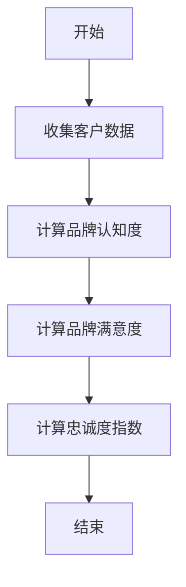
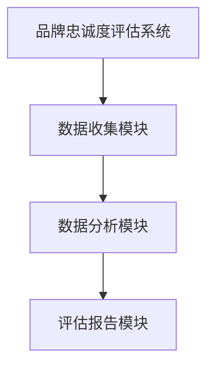
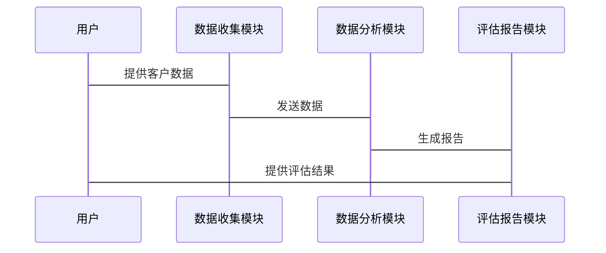

                 


# 企业估值中的品牌忠诚度评估

> 关键词：品牌忠诚度，企业估值，客户行为分析，品牌忠诚度指数，回归分析

> 摘要：品牌忠诚度是企业估值中的关键因素，直接影响企业的收入、成本和市场扩展能力。本文系统介绍了品牌忠诚度的定义、核心属性及其与企业估值的关系，详细讲解了品牌忠诚度评估的算法原理、数学模型和系统架构，并通过实际案例展示了如何在企业估值中应用品牌忠诚度评估方法。

---

# 第一部分: 企业估值中的品牌忠诚度评估基础

## 第1章: 品牌忠诚度与企业估值概述

### 1.1 品牌忠诚度的基本概念
- **1.1.1 品牌忠诚度的定义**：品牌忠诚度是指消费者对特定品牌的一贯支持和重复购买行为。高忠诚度的客户更可能持续购买该品牌的产品或服务。
- **1.1.2 品牌忠诚度的核心属性**：包括品牌认知度、品牌满意度、品牌忠诚度指数。
- **1.1.3 品牌忠诚度与企业估值的关系**：品牌忠诚度高的企业通常具有更高的收入预测、更低的营销成本和更强的市场扩展能力，从而提升企业价值。

### 1.2 企业估值的基本概念
- **1.2.1 企业估值的定义**：企业估值是通过分析企业财务状况、市场地位、盈利能力等因素，确定企业的市场价值。
- **1.2.2 企业估值的主要方法**：包括收益法、市场法和成本法。
- **1.2.3 品牌忠诚度在企业估值中的地位**：品牌忠诚度是影响企业收益能力和市场地位的重要因素，直接影响企业估值结果。

### 1.3 品牌忠诚度评估的背景与意义
- **1.3.1 当前市场环境下的品牌忠诚度问题**：数字化营销和社交媒体的普及使得品牌忠诚度的评估更加复杂和重要。
- **1.3.2 品牌忠诚度对企业估值的影响**：高忠诚度客户降低了企业的营销成本，提高了客户保留率和收入稳定性。
- **1.3.3 品牌忠诚度评估的必要性与挑战**：准确评估品牌忠诚度有助于企业制定更有效的市场策略，但需要克服数据收集和分析的挑战。

## 1.4 本章小结
本章介绍了品牌忠诚度和企业估值的基本概念，强调了品牌忠诚度在企业估值中的重要性，并为后续章节的深入分析奠定了基础。

---

## 第2章: 品牌忠诚度评估的核心概念与联系

### 2.1 品牌忠诚度评估的核心要素
- **2.1.1 品牌认知度**：客户对品牌的认知和记忆程度，影响客户的选择行为。
- **2.1.2 品牌满意度**：客户对品牌产品或服务的满意程度，影响客户的忠诚度。
- **2.1.3 品牌忠诚度指数**：通过量化指标衡量客户对品牌的忠诚程度，通常包括客户保留率、重复购买率和推荐率。

### 2.2 品牌忠诚度与企业估值的关系模型
- **2.2.1 品牌忠诚度对企业收入的影响**：高忠诚度客户增加了企业的收入来源，降低了收入波动风险。
- **2.2.2 品牌忠诚度对成本节约的影响**：高忠诚度客户减少了营销和销售成本，提高了运营效率。
- **2.2.3 品牌忠诚度对市场扩展的影响**：高忠诚度客户为企业提供了稳定的客户基础，有助于市场扩展和新产品的推广。

### 2.3 品牌忠诚度评估的ER实体关系图
```mermaid
erDiagram
    customer
    brand
    transaction
    customer-|{多次购买}| transaction
    brand-|{品牌认知}| customer
    brand-|{品牌满意度}| customer
```

### 2.4 本章小结
本章详细探讨了品牌忠诚度评估的核心要素，并通过ER图展示了品牌忠诚度与客户行为之间的关系，为后续的算法和模型分析奠定了基础。

---

## 第3章: 品牌忠诚度评估的算法原理与数学模型

### 3.1 品牌忠诚度评估的主要算法
- **3.1.1 基于客户行为分析的算法**：通过分析客户的购买历史和行为模式，预测客户的忠诚度。
- **3.1.2 基于客户满意度的算法**：通过收集和分析客户满意度数据，评估品牌忠诚度。
- **3.1.3 基于回归分析的算法**：通过回归模型预测品牌忠诚度，考虑多个变量的影响。

### 3.2 品牌忠诚度评估的数学模型
- **3.2.1 品牌忠诚度指数计算公式**：
$$ L = \alpha \cdot C + \beta \cdot S + \gamma \cdot R $$
其中，$L$ 是忠诚度指数，$C$ 是品牌认知度，$S$ 是品牌满意度，$R$ 是客户保留率，$\alpha$、$\beta$、$\gamma$ 是权重系数。

- **3.2.2 品牌忠诚度的回归模型**：
$$ \text{忠诚度} = \beta_0 + \beta_1 \cdot \text{满意度} + \beta_2 \cdot \text{认知度} + \epsilon $$
其中，$\epsilon$ 是误差项，$\beta_1$ 和 $\beta_2$ 是回归系数。

### 3.3 算法流程图


### 3.4 Python实现示例
```python
import pandas as pd
import numpy as np
from sklearn.linear_model import LinearRegression

# 数据加载
data = pd.read_csv('brand_data.csv')

# 特征与目标变量分离
X = data[['认知度', '满意度']]
y = data['忠诚度']

# 建立回归模型
model = LinearRegression()
model.fit(X, y)

# 输出系数
print(f'回归系数：{model.coef_}')
print(f'截距：{model.intercept_}')
```

### 3.5 本章小结
本章详细介绍了品牌忠诚度评估的主要算法和数学模型，并通过Python代码展示了回归分析的实现过程，为后续的系统架构设计和项目实战奠定了基础。

---

## 第4章: 品牌忠诚度评估的系统架构与实现

### 4.1 系统功能设计
- **4.1.1 数据收集模块**：收集客户行为数据、满意度数据和市场数据。
- **4.1.2 数据分析模块**：使用统计方法和机器学习算法评估品牌忠诚度。
- **4.1.3 评估报告模块**：生成品牌忠诚度评估报告，提供改进建议。

### 4.2 系统架构设计


### 4.3 系统接口设计
- 数据收集接口：用于接收客户行为数据和满意度数据。
- 分析接口：用于调用回归模型或聚类算法进行忠诚度评估。
- 报告生成接口：用于输出评估报告和建议。

### 4.4 系统交互流程


### 4.5 本章小结
本章设计了品牌忠诚度评估系统的架构，并详细描述了系统的功能模块和交互流程，为实际应用提供了参考。

---

## 第5章: 项目实战与案例分析

### 5.1 项目背景
- 某电商平台希望通过评估品牌忠诚度，优化客户保留策略，提升企业估值。

### 5.2 数据准备
- 收集过去一年的客户购买记录、满意度评分和市场数据。

### 5.3 数据处理
```python
data = pd.read_csv('brand_data.csv')
data = data.dropna()
data['忠诚度'] = data['忠诚度'].astype(int)
```

### 5.4 模型构建
```python
from sklearn.model_selection import train_test_split
from sklearn.metrics import r2_score

X_train, X_test, y_train, y_test = train_test_split(X, y, test_size=0.2)
model.fit(X_train, y_train)
print(f'模型准确率：{model.score(X_test, y_test)}')
print(f'R²值：{r2_score(y_test, model.predict(X_test))}')
```

### 5.5 案例分析
- 模型预测结果显示，高满意度和高认知度的客户忠诚度指数显著高于其他客户。
- 根据预测结果，企业可以制定针对性的客户保留策略，进一步提升品牌忠诚度。

### 5.6 本章小结
本章通过实际案例展示了品牌忠诚度评估方法的应用，并验证了模型的有效性，为企业估值提供了实证依据。

---

## 第6章: 总结与展望

### 6.1 本章总结
品牌忠诚度是企业估值中的关键因素，通过科学的评估方法可以准确衡量客户忠诚度，为企业制定市场策略和提升估值提供支持。

### 6.2 最佳实践 tips
- 数据收集要全面，确保模型的准确性。
- 定期更新模型，适应市场变化。
- 结合其他评估方法，全面衡量企业价值。

### 6.3 未来研究方向
- 探索更多影响品牌忠诚度的因素。
- 研究动态品牌忠诚度评估方法。
- 结合人工智能技术，提升评估效率和准确性。

### 6.4 注意事项
- 数据隐私保护的重要性。
- 模型选择和调优的注意事项。
- 结果解释和应用的具体场景。

---

## 附录: 参考文献与工具

- **参考文献**：
  1. 客户忠诚度评估的文献综述。
  2. 企业估值方法的研究进展。
- **工具推荐**：
  - Python：用于数据处理和模型构建。
  - Pandas、Scikit-learn：数据分析和机器学习库。
  - Mermaid：用于流程图和ER图绘制。

---

通过以上结构和内容，我们可以系统地理解和应用品牌忠诚度评估方法，为企业估值提供有力支持。

