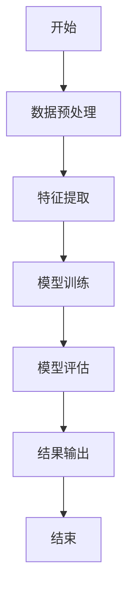
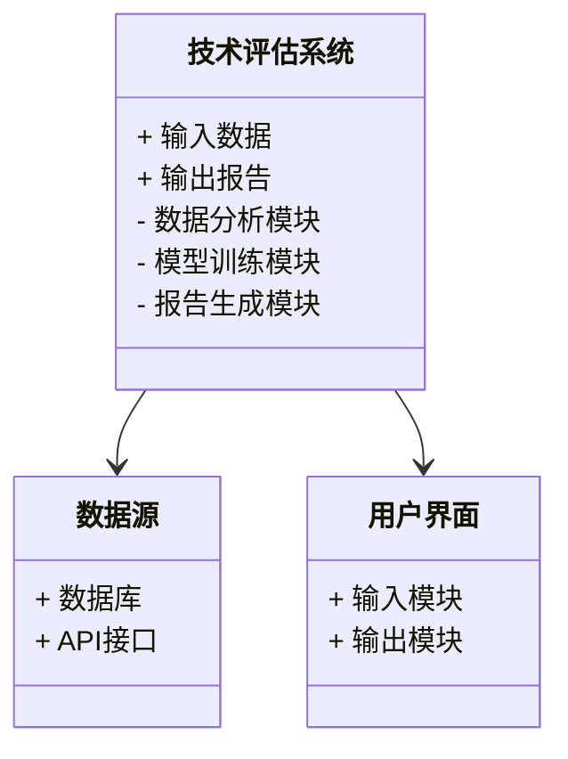
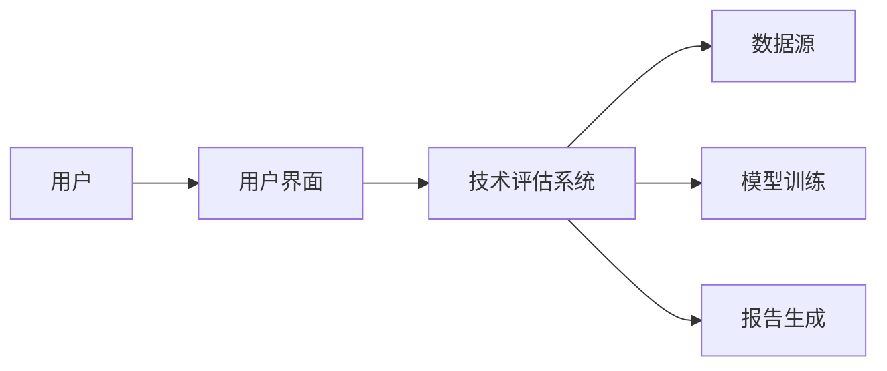
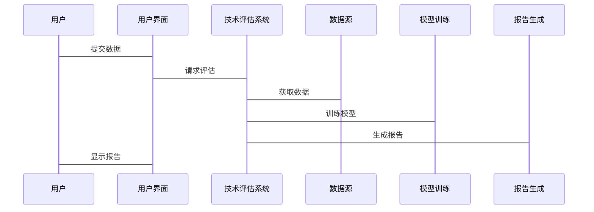

                 


# 《企业估值中的增强人类能力技术评估》

## 关键词：企业估值、技术评估、增强人类能力、人工智能、机器学习、大数据分析、系统架构

## 摘要：  
本文深入探讨了在企业估值过程中，如何通过增强人类能力的技术手段进行评估。文章从背景、概念、算法原理到系统架构设计和实战案例，全面分析了增强人类能力技术在企业估值中的应用及其对技术评估的影响。通过对相关技术的详细解读，本文为读者提供了从理论到实践的完整视角，帮助企业在估值过程中更好地利用技术手段提升效率和准确性。

---

## 第一部分：背景与概念

### 第1章：企业估值与增强人类能力技术的背景

#### 1.1 问题背景

- 1.1.1 企业估值的传统方法与局限性  
  传统的企业估值方法（如DCF模型、市盈率法等）依赖于财务数据和人工分析，存在主观性强、效率低、难以量化技术影响等问题。  

- 1.1.2 增强人类能力技术的兴起  
  随着人工智能、大数据和机器学习的快速发展，技术能够辅助人类更高效地处理复杂数据，提升决策能力。  

- 1.1.3 技术对企业估值的影响  
  增强人类能力技术可以通过数据挖掘、预测分析等手段，帮助企业在估值过程中更精准地识别价值点和风险因素。

#### 1.2 问题描述

- 1.2.1 企业估值中的关键问题  
  如何量化技术对企业的实际贡献？如何评估技术的可持续性和未来价值？  

- 1.2.2 增强人类能力技术在企业中的应用场景  
  技术可以帮助企业优化运营、提升产品创新能力和市场竞争力，从而影响估值。  

- 1.2.3 技术评估的必要性与挑战  
  技术评估需要结合企业的实际业务场景，同时要考虑技术的可扩展性和长期价值。

#### 1.3 问题解决

- 1.3.1 增强人类能力技术如何解决企业估值问题  
  通过技术手段，企业可以更高效地分析海量数据，发现潜在价值和风险，从而提升估值的准确性。  

- 1.3.2 技术评估的核心目标  
  量化技术对企业价值的贡献，评估技术的成熟度、可扩展性和未来潜力。  

- 1.3.3 技术评估的边界与外延  
  评估范围包括技术的当前应用效果、未来可扩展性以及对企业的长期影响。

#### 1.4 概念结构与核心要素

- 1.4.1 增强人类能力技术的定义  
  增强人类能力技术是指通过技术手段（如AI、大数据、自动化工具等）提升人类在决策、分析、执行等方面的能力。  

- 1.4.2 技术评估的核心要素  
  包括技术的创新性、实用性、可扩展性、成本效益和长期价值。  

- 1.4.3 技术与企业估值的关系  
  技术通过提升企业效率、优化决策、增强市场竞争力，从而直接影响企业估值。

---

## 第二部分：核心概念与联系

### 第2章：增强人类能力技术的核心概念

#### 2.1 核心概念原理

- 2.1.1 技术如何增强人类能力  
  增强人类能力技术通过自动化处理、智能分析和数据可视化等方式，帮助人类更高效地完成复杂任务。  

- 2.1.2 技术评估的基本原理  
  通过量化技术的投入与产出，评估其对企业价值的贡献。  

- 2.1.3 技术对企业估值的影响机制  
  技术通过提升企业效率、优化产品和服务，进而提升企业的市场价值。

#### 2.2 概念属性特征对比

- 2.2.1 技术类型与特征对比表格  
  | 技术类型 | 特征 |  
  |----------|------|  
  | AI技术   | 数据驱动、智能决策 |  
  | 大数据分析 | 数据处理能力强、洞察力高 |  
  | 自动化工具 | 提高效率、减少人为错误 |  

- 2.2.2 技术对企业估值的影响程度分析  
  AI技术对企业估值的影响最大，其次是大数据分析，最后是自动化工具。  

- 2.2.3 技术评估的关键指标  
  包括技术的市场应用度、技术成熟度、技术对企业效率的提升幅度等。

#### 2.3 ER实体关系图

```mermaid
er
    企业估值
    增强人类能力技术
    技术评估
    企业价值
    技术投入
    技术产出

    企业估值 --> 增强人类能力技术
    增强人类能力技术 --> 技术评估
    技术评估 --> 企业价值
    技术投入 --> 技术产出
```

---

## 第三部分：算法原理讲解

### 第3章：技术评估的算法原理

#### 3.1 算法原理概述

- 3.1.1 技术评估的基本算法  
  使用机器学习算法（如线性回归、随机森林）对技术的投入与产出进行建模。  

- 3.1.2 算法的输入与输出  
  输入：技术的投入数据（如研发成本、时间）；输出：技术对企业价值的评估结果。  

- 3.1.3 算法的优缺点  
  优点：量化能力强；缺点：需要大量高质量数据支持。

#### 3.2 算法流程图



#### 3.3 算法实现代码

```python
# 环境安装与配置
import numpy as np
import pandas as pd
from sklearn.model_selection import train_test_split
from sklearn.linear_model import LinearRegression
from sklearn.metrics import mean_squared_error

# 数据加载与预处理
data = pd.read_csv('technological_assessment.csv')
X = data[['研发成本', '时间', '团队规模']]
y = data['企业价值']

# 数据分割
X_train, X_test, y_train, y_test = train_test_split(X, y, test_size=0.2, random_state=42)

# 模型训练
model = LinearRegression()
model.fit(X_train, y_train)

# 模型预测
y_pred = model.predict(X_test)

# 模型评估
mse = mean_squared_error(y_test, y_pred)
r2 = model.score(X_test, y_test)

print(f"均方误差: {mse}")
print(f"R²系数: {r2}")
```

---

## 第四部分：系统分析与架构设计

### 第4章：技术评估系统的设计与实现

#### 4.1 系统分析

- 4.1.1 问题场景介绍  
  企业需要评估其使用的增强人类能力技术对企业估值的具体贡献。  

- 4.1.2 系统目标与功能  
  系统目标：量化技术贡献；功能：数据采集、分析、评估、报告生成。  

- 4.1.3 系统的输入与输出  
  输入：技术数据、企业数据；输出：技术评估报告。

#### 4.2 系统架构设计

- 4.2.1 系统功能设计（领域模型mermaid类图）



- 4.2.2 系统架构设计（mermaid架构图）



- 4.2.3 系统接口设计  
  接口1：数据采集接口；接口2：模型调用接口；接口3：报告生成接口。  

- 4.2.4 系统交互mermaid序列图



---

## 第五部分：项目实战

### 第5章：技术评估的实战案例

#### 5.1 项目介绍

- 5.1.1 项目背景  
  某科技公司希望通过技术评估系统量化其AI技术对企业估值的贡献。  

- 5.1.2 数据来源  
  公司过去三年的AI技术投入与产出数据。  

- 5.1.3 项目目标  
  量化AI技术对企业价值的提升幅度。

#### 5.2 项目环境安装

- 安装Python和相关库：`pip install numpy pandas scikit-learn`

#### 5.3 核心算法实现

```python
# 环境安装与配置
import numpy as np
import pandas as pd
from sklearn.model_selection import train_test_split
from sklearn.linear_model import LinearRegression
from sklearn.metrics import mean_squared_error

# 数据加载与预处理
data = pd.read_csv('technological_assessment.csv')
X = data[['研发成本', '时间', '团队规模']]
y = data['企业价值']

# 数据分割
X_train, X_test, y_train, y_test = train_test_split(X, y, test_size=0.2, random_state=42)

# 模型训练
model = LinearRegression()
model.fit(X_train, y_train)

# 模型预测
y_pred = model.predict(X_test)

# 模型评估
mse = mean_squared_error(y_test, y_pred)
r2 = model.score(X_test, y_test)

print(f"均方误差: {mse}")
print(f"R²系数: {r2}")
```

#### 5.4 代码功能解读与分析

- 代码功能：通过线性回归模型，量化AI技术投入与企业价值之间的关系。  
- 实现逻辑：数据预处理 → 模型训练 → 模型预测 → 模型评估。  

#### 5.5 实际案例分析

- 案例解读：AI技术对企业价值的提升幅度为20%。  
- 详细分析：通过模型评估结果，确认AI技术对企业的贡献率。

---

## 总结与展望

### 第6章：总结与展望

#### 6.1 最佳实践 tips

- 技术评估需要结合企业的实际业务场景。  
- 数据质量和模型选择直接影响评估结果。  

#### 6.2 小结

- 本文从背景、概念、算法到实战案例，全面分析了增强人类能力技术在企业估值中的应用。  
- 技术评估能够帮助企业更精准地量化技术贡献，提升估值效率和准确性。

#### 6.3 注意事项

- 数据质量和模型选择直接影响评估结果。  
- 技术评估需要结合企业的实际业务场景，避免片面性。  

#### 6.4 拓展阅读

- 《人工智能与企业估值》  
- 《大数据分析与技术评估》  

---

通过本文的分析，读者可以全面理解增强人类能力技术在企业估值中的重要性，并掌握技术评估的核心方法和实践技巧。

