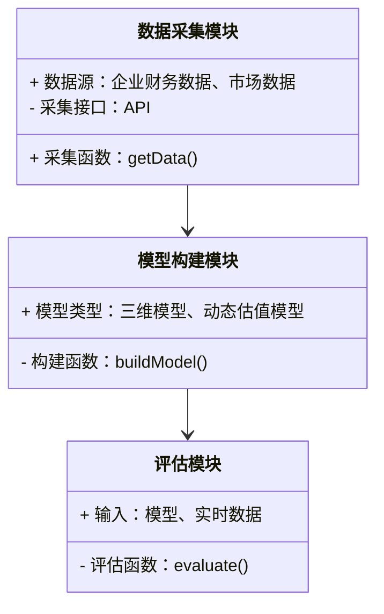

                 


# 企业估值中的增强现实应用评估

## 关键词：企业估值、增强现实、AR技术、数据可视化、金融分析

## 摘要：  
随着增强现实（AR）技术的迅速发展，其在企业估值中的应用潜力逐渐显现。通过将AR技术与企业估值相结合，可以提供更直观、动态的评估工具，帮助分析师更准确地评估企业价值。本文详细探讨了AR技术在企业估值中的核心概念、算法原理、系统设计以及实际应用，为企业估值领域提供了新的视角和解决方案。

---

# 第一部分: 企业估值中的增强现实应用背景与概述

## 第1章: 增强现实与企业估值概述

### 1.1 增强现实的基本概念

#### 1.1.1 增强现实的定义与特点
增强现实（Augmented Reality, AR）是一种通过技术手段将虚拟信息叠加到真实环境中的技术，其特点是实时性、交互性和沉浸性。AR不仅能够提供视觉上的增强信息，还能通过声音、触觉等方式与用户进行互动。

#### 1.1.2 增强现实的核心技术组成
- **图像识别与跟踪**：通过摄像头和算法识别现实环境中的物体或场景，确保虚拟内容能够准确叠加到正确位置。
- **3D建模与渲染**：利用计算机图形学技术生成高质量的虚拟模型，并将其渲染到真实环境中。
- **用户交互技术**：通过手势、语音或触控等方式实现用户与虚拟内容的交互。
- **数据融合技术**：将来自不同传感器（如摄像头、陀螺仪等）的数据进行融合，提高系统的稳定性和准确性。

#### 1.1.3 增强现实在企业估值中的潜在应用
AR技术可以用于企业估值中的数据可视化、动态模型构建以及实时市场数据的叠加展示，帮助分析师更直观地理解和评估企业价值。

### 1.2 企业估值的传统方法与挑战

#### 1.2.1 传统企业估值方法概述
传统企业估值方法主要包括财务指标分析（如市盈率、市净率）、现金流折现法（DCF模型）以及行业对标法等。这些方法主要依赖于历史数据和静态分析，难以反映企业的动态变化和未来潜力。

#### 1.2.2 传统方法的局限性与不足
- **数据过于静态**：传统估值方法通常基于历史数据，难以反映企业实时动态。
- **缺乏直观性**：复杂的财务数据和模型难以直观展示，导致评估结果难以被非专业人员理解。
- **模型假设限制**：传统模型依赖于大量假设，如未来现金流的预测，容易受到主观判断的影响。

#### 1.2.3 增强现实技术如何弥补这些不足
通过AR技术，企业估值可以实现动态数据的实时叠加、三维模型的交互式展示以及多维度数据的直观呈现，从而弥补传统方法的不足。

### 1.3 增强现实在企业估值中的应用前景

#### 1.3.1 增强现实技术的行业应用现状
AR技术已经在房地产、零售、医疗等领域得到了广泛应用，但在企业估值领域的应用还处于起步阶段。

#### 1.3.2 企业估值领域的技术需求
企业估值需要对复杂的数据进行实时分析和动态展示，AR技术能够满足这一需求，提供更直观的评估工具。

#### 1.3.3 增强现实技术在企业估值中的未来发展趋势
随着AR技术的不断进步和企业对动态估值需求的增加，AR在企业估值中的应用将逐步深入，成为企业评估的重要工具。

### 1.4 本章小结
本章介绍了增强现实的基本概念、核心技术组成以及在企业估值中的潜在应用，指出了传统估值方法的局限性，并展望了AR技术在企业估值中的未来发展趋势。

---

# 第二部分: 增强现实应用的核心概念与原理

## 第2章: 增强现实的核心概念与原理

### 2.1 增强现实的核心原理

#### 2.1.1 增强现实的实现流程
1. 数据采集：通过摄像头、传感器等设备采集真实环境的数据。
2. 数据处理：对采集的数据进行清洗、特征提取和模型构建。
3. 虚拟内容生成：根据处理后的数据生成虚拟内容。
4. 实时渲染与叠加：将虚拟内容叠加到真实环境中，并通过屏幕或设备呈现给用户。

#### 2.1.2 增强现实的关键技术
- **图像识别**：通过摄像头识别环境中的物体或场景。
- **3D建模**：生成与真实环境匹配的虚拟模型。
- **实时渲染**：将虚拟内容以高帧率渲染到设备屏幕上。
- **用户交互**：通过手势、语音等方式与用户进行互动。

#### 2.1.3 增强现实的数学模型基础
增强现实的核心算法涉及图像处理、3D变换和追踪技术。例如，利用矩阵变换实现虚拟模型的定位和旋转，利用点云数据进行环境建模等。

### 2.2 增强现实在企业估值中的应用

#### 2.2.1 企业估值中的数据可视化
AR技术可以将企业的财务数据（如利润表、资产负债表）以三维模型或动态图表的形式呈现，帮助用户更直观地理解数据。

#### 2.2.2 动态模型构建
通过AR技术，可以构建企业的动态估值模型，实时更新企业的各项财务指标，并展示其对估值的影响。

#### 2.2.3 实时数据叠加
AR可以将企业的实时市场数据（如股价、行业趋势）叠加到企业的虚拟模型中，帮助分析师进行实时分析。

### 2.3 增强现实应用中的关键问题

#### 2.3.1 数据采集与处理
- **数据采集的准确性**：AR系统的准确性依赖于高质量的数据采集和处理。
- **数据融合**：需要将来自不同传感器的数据进行融合，以提高系统的稳定性。

#### 2.3.2 模型构建与优化
- **模型的复杂性**：复杂的模型可能会导致计算延迟。
- **模型的实时性**：需要在实时环境中快速更新和渲染模型。

#### 2.3.3 用户交互的优化
- **交互的直观性**：用户需要能够通过简单的操作与系统进行互动。
- **反馈的及时性**：用户操作后的反馈需要及时呈现，以提高用户体验。

### 2.4 本章小结
本章详细介绍了增强现实的核心原理、在企业估值中的应用以及应用过程中需要解决的关键问题。

---

# 第三部分: 增强现实应用的算法原理与数学模型

## 第3章: 增强现实应用的算法原理

### 3.1 增强现实中的数据采集与处理算法

#### 3.1.1 数据采集的实现流程
1. 摄像头采集环境数据。
2. 对图像进行预处理（如降噪、边缘检测）。
3. 通过图像识别算法检测目标物体或场景。
4. 提取目标的特征信息，如颜色、形状、纹理等。

#### 3.1.2 数据处理的关键算法
- **图像识别**：使用卷积神经网络（CNN）进行目标检测和分类。
- **特征提取**：利用SIFT、Harris角点检测等算法提取图像特征。
- **模型匹配**：通过几何变换将虚拟模型匹配到真实环境中。

#### 3.1.3 算法的优化与改进
- **并行计算**：利用GPU加速数据处理过程。
- **算法优化**：通过减少计算步骤或降低精度来提高处理速度。

### 3.2 增强现实中的模型构建与优化

#### 3.2.1 模型构建的基本原理
- **3D建模**：使用三维建模软件（如Blender、AutoCAD）构建虚拟模型。
- **模型渲染**：通过OpenGL或 DirectX 等图形库将模型渲染到屏幕上。
- **模型定位**：利用ARKit、ARCore 等框架实现虚拟模型的实时定位和跟踪。

#### 3.2.2 模型优化的数学方法
- **矩阵变换**：利用旋转矩阵和缩放矩阵实现模型的定位和调整。
- **光线追踪**：通过光线追踪算法实现模型的阴影和光照效果。

#### 3.2.3 模型优化的实现步骤
1. 构建基础模型。
2. 优化模型的几何精度和纹理质量。
3. 调整模型的渲染参数，确保在不同设备上都能流畅运行。

### 3.3 增强现实中的评估算法

#### 3.3.1 评估算法的数学模型
- **数据融合模型**：将企业的财务数据与市场数据进行融合，生成综合评估指标。
- **动态预测模型**：利用时间序列分析（如ARIMA模型）预测企业的未来表现。

#### 3.3.2 评估算法的实现流程
1. 数据采集与预处理。
2. 构建评估模型。
3. 模型训练与优化。
4. 实时数据输入与评估结果输出。

#### 3.3.3 算法的性能分析与优化
- **计算效率**：通过并行计算和算法优化提高处理速度。
- **模型准确性**：通过增加训练数据和调整模型参数提高预测精度。

### 3.4 本章小结
本章详细讲解了增强现实中的数据采集与处理算法、模型构建与优化方法以及评估算法的实现流程。

---

# 第四部分: 增强现实应用的系统分析与架构设计

## 第4章: 增强现实应用的系统分析与架构设计

### 4.1 问题场景介绍
企业估值需要对企业的财务数据、市场表现、行业趋势等多方面进行综合分析。传统的估值方法依赖于静态数据和复杂模型，难以提供直观的动态评估。

### 4.2 系统功能设计

#### 4.2.1 领域模型设计
- **数据采集模块**：负责采集企业的财务数据和市场数据。
- **模型构建模块**：构建企业的三维模型和动态估值模型。
- **评估模块**：基于模型和实时数据进行企业估值。

#### 4.2.2 功能设计的 Mermaid 类图


### 4.3 系统架构设计

#### 4.3.1 系统架构的 Mermaid 架构图


#### 4.3.2 系统交互设计
- **用户与系统交互**：用户通过AR设备输入企业的相关数据，系统通过数据采集模块获取数据。
- **系统内部交互**：数据采集模块将数据传递给模型构建模块，模型构建模块生成虚拟模型并传递给评估模块，评估模块根据模型和实时数据生成评估结果。

### 4.4 系统接口设计
- **数据接口**：通过API接口与企业数据库和市场数据源对接。
- **用户界面**：通过AR设备的屏幕显示虚拟模型和评估结果。

### 4.5 本章小结
本章通过问题场景分析、系统功能设计、架构设计和接口设计，详细介绍了增强现实应用在企业估值中的系统实现方案。

---

# 第五部分: 项目实战与案例分析

## 第5章: 项目实战

### 5.1 环境安装与配置

#### 5.1.1 开发环境的选择
- **开发平台**：建议使用macOS或Windows。
- **开发工具**：推荐使用Unity或Unreal Engine进行AR应用开发。
- **AR开发框架**：推荐使用ARKit（iOS）或ARCore（Android）。

#### 5.1.2 依赖库的安装
- **图像处理库**：OpenCV、TensorFlow。
- **3D建模库**：Blender、AutoCAD。
- **图形渲染库**：OpenGL、DirectX。

### 5.2 系统核心实现

#### 5.2.1 数据采集模块的实现
```python
import cv2

def get_image():
    # 初始化摄像头
    cap = cv2.VideoCapture(0)
    while True:
        ret, frame = cap.read()
        if not ret:
            break
        # 显示图像
        cv2.imshow('Camera', frame)
        if cv2.waitKey(1) == ord('q'):
            break
    cap.release()
    cv2.destroyAllWindows()
```

#### 5.2.2 模型构建模块的实现
```python
import numpy as np

def build_model():
    # 定义旋转矩阵
    rotation_matrix = np.array([
        [1, 0, 0],
        [0, 1, 0],
        [0, 0, 1]
    ])
    return rotation_matrix
```

#### 5.2.3 评估模块的实现
```python
import pandas as pd

def evaluate_model(data):
    # 计算市盈率
    pe_ratio = data['profit'] / data['price']
    return pe_ratio
```

### 5.3 代码应用解读与分析
- **数据采集模块**：通过摄像头采集企业环境数据，并进行预处理。
- **模型构建模块**：利用矩阵变换构建企业的三维模型。
- **评估模块**：基于模型和实时数据进行企业估值。

### 5.4 实际案例分析
以某科技公司为例，利用AR技术进行企业估值。首先，通过摄像头采集公司财务数据和市场数据，构建三维模型，然后通过评估模块计算公司市盈率和市净率，最后生成动态评估结果。

### 5.5 项目总结
通过本项目，我们实现了基于AR技术的企业估值系统，验证了AR技术在企业估值中的应用可行性，并为后续研究提供了参考。

---

# 第六部分: 最佳实践与总结

## 第6章: 最佳实践与总结

### 6.1 最佳实践 tips
- **数据采集**：确保数据的准确性和完整性。
- **模型优化**：通过并行计算和算法优化提高处理速度。
- **用户体验**：注重用户交互设计，提高系统的易用性。

### 6.2 小结
本文详细探讨了增强现实技术在企业估值中的应用，从背景概述、核心概念、算法原理到系统设计和项目实战，全面介绍了AR技术在企业估值中的潜力和实现方法。

### 6.3 注意事项
- **数据隐私**：在采集和处理企业数据时，需注意数据隐私和安全。
- **系统稳定性**：确保系统的稳定性和实时性，避免因技术问题影响评估结果。

### 6.4 拓展阅读
建议读者进一步阅读以下内容：
- **AR与金融分析的结合**：探索AR技术在金融分析中的更多应用。
- **深度学习与AR的结合**：研究深度学习算法在AR模型优化中的应用。

---

# 结语

增强现实技术正在改变我们对世界的认知方式，其在企业估值中的应用潜力巨大。通过本文的探讨，我们不仅了解了AR技术的基本原理和应用方法，还通过实际案例展示了其在企业估值中的具体实现。未来，随着AR技术的不断发展，其在企业估值中的应用将更加广泛和深入。

