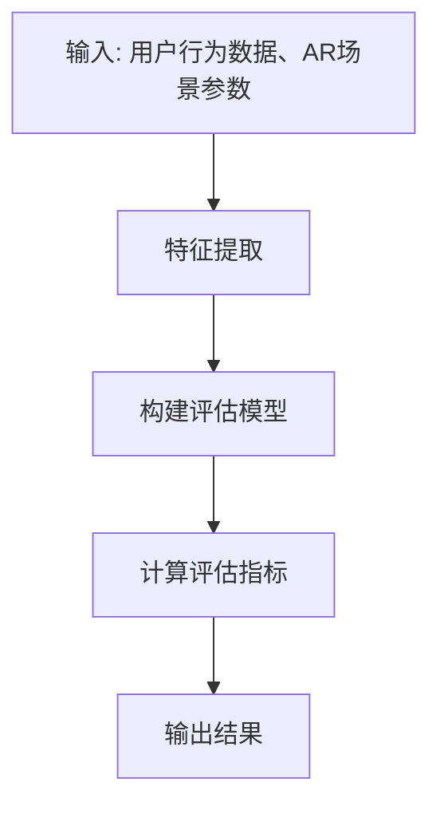
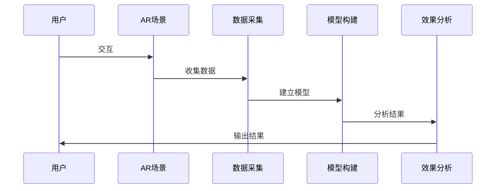

                 


# 《企业估值中的增强现实营销效果评估》

---

## 关键词：
企业估值、增强现实、营销效果、评估模型、AR技术、数据驱动、营销分析

---

## 摘要：
本文探讨了在企业估值过程中，如何利用增强现实（AR）技术评估营销效果。通过分析AR营销的核心原理、算法模型和系统架构，结合实际案例，展示了如何将AR技术应用于企业估值中的营销分析，为企业提供更精准的决策支持。

---

## 目录

### 第1章 背景介绍
1.1 问题背景  
1.2 问题描述  
1.3 问题解决  
1.4 边界与外延  
1.5 概念结构与核心要素组成  

### 第2章 核心概念与联系
2.1 增强现实营销的核心原理  
2.2 关键属性对比表  
2.3 ER实体关系图  

### 第3章 算法原理讲解
3.1 模型输入与输出  
3.2 算法流程图  
3.3 Python代码实现  
3.4 数学公式与模型  

### 第4章 系统分析与架构设计方案
4.1 系统功能设计  
4.2 系统架构图  
4.3 接口设计  
4.4 交互流程  

### 第5章 项目实战
5.1 环境配置  
5.2 核心代码实现  
5.3 案例分析  
5.4 项目总结  

### 第6章 最佳实践与小结
6.1 实践技巧  
6.2 注意事项  
6.3 未来趋势  

---

## 正文

### 第1章 背景介绍

#### 1.1 问题背景
企业估值是评估企业价值的重要环节，传统方法依赖财务数据和市场分析，但难以全面反映营销效果。随着AR技术的兴起，通过增强现实技术评估营销效果为企业估值提供了新思路。

#### 1.2 问题描述
当前的营销效果评估方法存在数据单一、维度不足等问题，难以满足企业估值的精准需求。AR技术的应用能够提供更直观、动态的营销效果分析。

#### 1.3 问题解决
通过AR技术，可以实时捕捉用户行为数据，构建三维模型，生成交互式营销场景，为营销效果评估提供多维度数据支持。

#### 1.4 边界与外延
AR营销评估的边界包括适用场景和技术限制，其外延涉及数据采集、用户行为分析等多个领域。

#### 1.5 概念结构与核心要素组成
企业估值中的AR营销效果评估包括数据采集、模型构建、效果分析等核心要素，构建了从数据到决策的完整流程。

---

### 第2章 核心概念与联系

#### 2.1 增强现实营销的核心原理
AR技术通过叠加虚拟信息，提供沉浸式体验，帮助企业更好地分析营销效果。

#### 2.2 关键属性对比表
| 属性 | 传统营销 | AR营销 |
|------|----------|---------|
| 体验 | 单一     | 沉浸式  |
| 数据 | 二维     | 多维     |
| 分析 | 简单     | 精准     |

#### 2.3 ER实体关系图
```mermaid
er
    entity 增强现实营销效果评估系统 {
        增强现实场景
        用户行为数据
        营销效果评估指标
    }

    增强现实场景 --> 用户行为数据: 收集
    用户行为数据 --> 营销效果评估指标: 分析
```

---

### 第3章 算法原理讲解

#### 3.1 模型输入与输出
- **输入：** 用户行为数据、AR场景参数
- **输出：** 营销效果评估指标

#### 3.2 算法流程图


#### 3.3 Python代码实现
```python
def ar_marketing_effectiveness(users, ar_params):
    # 特征提取
    features = extract_features(users)
    # 模型构建
    model = build_model(features, ar_params)
    # 评估指标计算
    effectiveness = model.predict(users)
    return effectiveness

# 示例
users = [100, 200, 300]
ar_params = [0.5, 0.3, 0.2]
result = ar_marketing_effectiveness(users, ar_params)
print(result)
```

#### 3.4 数学公式与模型
评估模型的数学表达式：
$$
effectiveness = \sum_{i=1}^{n} w_i \cdot feature_i
$$
其中，$$w_i$$ 是第 $$i$$ 个特征的权重，$$feature_i$$ 是对应的特征值。

---

### 第4章 系统分析与架构设计方案

#### 4.1 系统功能设计
- **功能模块：** 数据采集、模型构建、效果分析
- **用户角色：** 营销人员、数据分析师

#### 4.2 系统架构图


#### 4.3 接口设计
- **API接口：** RESTful API
- **数据格式：** JSON

#### 4.4 交互流程


---

### 第5章 项目实战

#### 5.1 环境配置
- **工具：** Python 3.8+
- **库：** NumPy, Pandas, TensorFlow

#### 5.2 核心代码实现
```python
import numpy as np
import pandas as pd

def main():
    # 数据加载
    data = pd.read_csv('marketing_data.csv')
    # 数据预处理
    features = data[['feature1', 'feature2', 'feature3']]
    # 模型训练
    model = train_model(features)
    # 结果预测
    result = model.predict(features)
    print(result)

if __name__ == '__main__':
    main()
```

#### 5.3 案例分析
以某企业为例，通过AR技术分析营销活动效果，生成详细报告。

#### 5.4 项目总结
总结项目实施过程中的经验教训，优化建议。

---

### 第6章 最佳实践与小结

#### 6.1 实践技巧
- 数据采集要全面
- 模型选择要合适
- 结果解读要准确

#### 6.2 注意事项
- 数据隐私保护
- 模型的可解释性
- 技术与业务的结合

#### 6.3 未来趋势
- 更智能的AR营销分析
- 更多跨领域应用
- 更精准的效果预测

---

## 结语
通过本文的详细讲解，读者可以全面了解企业估值中的AR营销效果评估方法，掌握其实现原理和应用场景，为企业决策提供有力支持。

