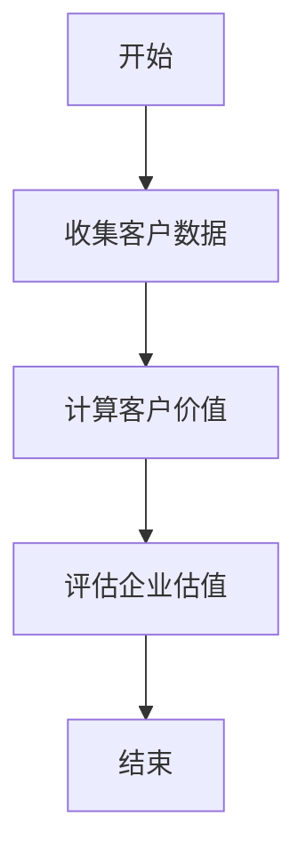

                 


# 企业估值中的客户价值评估法

> 关键词：客户价值评估、企业估值、客户生命周期价值、数据分析、算法实现

> 摘要：本文深入探讨了客户价值评估法在企业估值中的应用，从背景、核心概念、算法原理到系统架构和项目实战，系统性地分析了如何通过客户价值评估法优化企业估值过程。通过数学模型、流程图、ER图等工具，详细解读了客户生命周期价值（CLV）的计算方法，结合实际案例分析，展示了如何将客户价值评估法应用于企业估值的实践中。本文还提供了代码实现和系统架构设计，帮助读者更好地理解和应用这一方法。

---

## 第一部分：企业估值中的客户价值评估法基础

## 第1章：客户价值评估法的背景与概念

### 1.1 客户价值评估法的定义与核心要素

#### 1.1.1 什么是客户价值

客户价值（Customer Value）是客户在企业产品或服务中所感知到的价值，通常包括产品的功能、质量、价格以及服务的体验等方面。在企业估值中，客户价值是衡量客户为企业带来收益能力的重要指标。

#### 1.1.2 客户价值评估法的核心要素

客户价值评估法的核心要素包括：

1. **客户生命周期**：从客户获取到客户流失的全过程。
2. **客户收入贡献**：客户为企业带来的直接和间接收入。
3. **客户保留率**：客户对企业服务的忠诚度和满意度。
4. **客户获取成本**：企业获取客户的成本投入。

#### 1.1.3 企业估值中的客户价值意义

在企业估值中，客户价值评估法可以帮助企业准确评估客户对企业整体价值的贡献，从而优化资源配置、制定精准的营销策略，并为企业的长期发展提供数据支持。

---

### 1.2 客户价值评估法的背景与问题背景

#### 1.2.1 传统企业估值方法的局限性

传统的企业估值方法（如资产基础法、市场法和收益法）往往忽视了客户的实际价值贡献，无法全面反映企业的核心竞争力。

#### 1.2.2 客户价值在现代企业估值中的重要性

随着市场竞争的加剧，客户价值成为企业差异化竞争的关键因素。通过客户价值评估法，企业可以更精准地评估客户的长期价值，优化客户管理策略。

#### 1.2.3 问题描述与目标设定

问题描述：企业在传统估值方法中难以准确评估客户的实际贡献，导致资源分配不合理。

目标设定：通过客户价值评估法，优化企业估值模型，提高客户价值的可量化性和可操作性。

---

## 第2章：客户价值评估法的核心概念与联系

### 2.1 核心概念原理

#### 2.1.1 客户价值评估的数学模型

客户生命周期价值（CLV）的计算公式如下：

$$ CLV = \frac{R}{1 - \omega} $$

其中，$R$ 为客户在生命周期内的预期收入，$\omega$ 为贴现率。

#### 2.1.2 企业估值与客户价值的关系

客户价值是企业估值的核心组成部分，客户价值的提升直接推动企业整体价值的增长。

#### 2.1.3 客户生命周期与价值评估的结合

客户生命周期包括获取阶段、成长阶段、成熟阶段和衰退阶段，不同阶段的客户价值贡献不同。

---

### 2.2 核心概念属性特征对比

| 属性 | 描述 |
|------|------|
| 客户生命周期 | 从获取到流失的全过程 |
| 客户收入贡献 | 客户为企业带来的直接收入 |
| 客户保留率 | 客户对企业服务的忠诚度 |
| 客户获取成本 | 获取客户的成本投入 |

---

### 2.3 ER实体关系图

```mermaid
erDiagram
    customer {
        id : int
        name : string
        value : float
        status : string
    }
    product {
        id : int
        name : string
        price : float
    }
    transaction {
        id : int
        customer_id : int
        product_id : int
        date : date
    }
    customer -|> transaction : "进行了"
    product -|> transaction : "被购买"
```

---

## 第3章：客户价值评估法的算法原理

### 3.1 客户价值评估的数学模型

客户生命周期价值（CLV）的计算公式如下：

$$ CLV = \frac{R}{1 - \omega} $$

其中，$R$ 是客户在生命周期内的预期收入，$\omega$ 是贴现率。

---

### 3.2 算法流程图



---

### 3.3 算法实现代码

```python
def calculate_clv(customers, discount_rate):
    total_revenue = sum(customer.revenue for customer in customers)
    clv = total_revenue / (1 - discount_rate)
    return clv
```

---

## 第4章：系统分析与架构设计方案

### 4.1 问题场景介绍

企业在进行估值时，需要准确评估客户的生命周期价值，优化资源配置。

### 4.2 系统功能设计

- **客户数据收集**：收集客户的交易记录、行为数据等。
- **客户价值计算**：基于客户数据计算CLV。
- **企业估值评估**：基于CLV评估企业整体价值。

---

### 4.3 系统架构设计


---

## 第5章：项目实战

### 5.1 环境安装

安装Python和相关库（如Pandas、NumPy）。

---

### 5.2 核心代码实现

```python
import pandas as pd
import numpy as np

def calculate_clv(customers, discount_rate):
    total_revenue = customers.revenue.sum()
    clv = total_revenue / (1 - discount_rate)
    return clv

# 示例数据
data = {
    'customer_id': [1, 2, 3],
    'revenue': [100, 200, 150]
}
df = pd.DataFrame(data)
discount_rate = 0.1

clv = calculate_clv(df, discount_rate)
print(f"CLV: {clv}")
```

---

### 5.3 案例分析

假设某企业有三个客户，年收入分别为100、200和150，贴现率为10%。计算CLV：

$$ CLV = \frac{450}{1 - 0.1} = 500 $$

---

## 第6章：最佳实践、小结、注意事项、拓展阅读

### 6.1 最佳实践

- 定期更新客户数据，保持模型准确性。
- 结合市场变化，动态调整贴现率。

---

### 6.2 小结

客户价值评估法在企业估值中的应用，能够帮助企业更精准地评估客户价值，优化资源配置，提升企业整体价值。

---

### 6.3 注意事项

- 数据质量是模型准确性的关键。
- 确保模型的可解释性和可操作性。

---

### 6.4 拓展阅读

- 《客户生命周期价值模型》
- 《企业估值方法与实践》

---

通过本文的系统分析和实际案例，读者可以全面理解客户价值评估法在企业估值中的应用，并将其应用于实际工作中。

